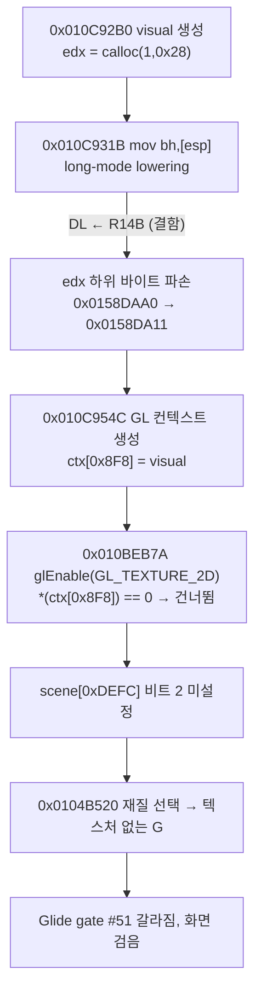

# Task 713 설계 — `mov r8h,[esp+d]` long-mode lowering의 DL 저장 방향

## 문제

Linux x64에서 게스트가 텍스처 업로드 블록을 건너뛰어 화면이 검다. 추적한 경로는
다음과 같다(주소는 Linux 실행 기준).

각 단계는 두 host에서 같은 지점을 probe로 읽어 확인했다(작업 로그 참고). 결정적인
값은 둘이다.

| | Win32 (정규화) | Linux |
|---|---|---|
| 재질 선택 4번째 호출의 `scene[0xDEFC]` | `0x02` | `0x00` |
| `ctx[0x8F8]`(visual 포인터) | `0x0158DAA0` | `0x0158DA11` |

## 확인된 원인

`aot_long_mode_compatibility.cpp`의 `kStackPointerHighByteDestinationToR15`
lowering(Task 676)은 `mov AH/CH/DH/BH,[esp+d]`를 네 명령으로 낮춘다. REX가 있으면
상위 바이트 레지스터를 인코딩할 수 없으므로 DL을 임시로 쓴다.

| 의도 | 방출 바이트 | 실제 해독 |
|---|---|---|
| DL을 R14B에 저장 | `44 88 F2` | **`mov dl, r14b`** |
| `[r15+d]`를 DL로 | `41 8A ..` | `mov dl, [r15+d]` |
| 상위 바이트로 복사 | `8A E2\|r<<3` | `mov r8h, dl` |
| DL 복원 | `44 88 F2` | `mov dl, r14b` |

`88 /r`은 `MOV r/m8, r8`이다. ModRM `F2`는 reg=R14B(REX.R), rm=DL이므로
목적지가 DL이다. 첫 명령이 DL을 저장하지 않고 **R14B로 덮어쓴다.** 마지막 명령은
그 값을 다시 DL에 넣으므로 결과적으로 **EDX 하위 바이트가 R14B로 바뀐다.**

올바른 저장은 `41 88 D6`(`mov r14b, dl`: REX.B, reg=DL, rm=R14B)이다.

Task 676의 probe는 이 방출 바이트를 기대값으로 비교했다. 바이트가 구현과 같은지를
볼 뿐 명령이 무엇을 하는지는 보지 않으므로 방향이 뒤집힌 것을 잡지 못했다.

## 설계

* 첫 명령을 `41 88 D6`으로 고친다. 나머지 세 명령은 해독해 확인했고 옳다.
* R14D는 emitter의 scratch이고(Task 558/559), 한 게스트 명령의 lowering 안에서만
  쓴다. 이 네 명령 안에서 DL을 보관하는 데 쓰는 것은 계약에 맞다.
* probe
  * 기대 바이트를 고친다.
  * **의미 검사**를 더한다. 방출된 네 명령을 Zydis로 해독해 첫 명령의 목적지가
    R14B이고 원본이 DL인지, 마지막 명령의 목적지가 DL이고 원본이 R14B인지,
    셋째 명령이 REX 없이 상위 바이트 레지스터에 쓰는지 확인한다. 바이트 비교는
    구현을 옮겨 적을 뿐이므로, 이 결함을 잡았어야 하는 것은 이 검사다.

## 검증 전략

* core probe 두 host 전체. 새 의미 검사가 수정 전 바이트에서 실패하는지 확인한다.
* Linux x64 30초 `pumpit2a`: `ctx[0x8F8]`가 정렬된 값인지, Glide gate #51이
  `_GRTEXTEXTUREMEMREQUIRED@8`인지, 삼각형 텍스처·픽셀.
* Win32: 이 lowering은 long mode 전용이므로 Win32 방출은 바뀌지 않는다. 빌드와
  probe로 확인한다.

---

## English

### Problem

On Linux x64 the guest skips its texture-upload block and the screen is black.
The path, traced by probing the same points on both hosts, runs from the visual
creator at `0x010C92B0` (`edx = calloc(1,0x28)`), through its `mov bh,[esp]` at
`0x010C931B`, whose long-mode lowering corrupts EDX's low byte
(`0x0158DAA0` → `0x0158DA11`); the GL context creator at `0x010C954C` stores that
pointer as `ctx[0x8F8]`; `glEnable(GL_TEXTURE_2D)` at `0x010BEB7A` finds
`*(ctx[0x8F8]) == 0` and skips setting texture bit 2 in `scene[0xDEFC]`; and the
material selector at `0x0104B520` therefore chooses the untextured state, so Glide
gate #51 diverges. The two decisive values are `scene[0xDEFC]` on the selector's
fourth call (`0x02` on Win32, `0x00` on Linux) and `ctx[0x8F8]`
(`0x0158DAA0` normalized on Win32, `0x0158DA11` on Linux).

### Confirmed cause

The `kStackPointerHighByteDestinationToR15` lowering (Task 676) turns
`mov AH/CH/DH/BH,[esp+d]` into four instructions, using DL as a temporary because
a REX prefix cannot encode a high-byte register. Its first instruction is meant to
save DL into R14B, but it is emitted as `44 88 F2`. `88 /r` is `MOV r/m8, r8`,
and ModRM `F2` has reg = R14B (REX.R) and rm = DL, so the destination is DL: the
instruction **overwrites DL with R14B** instead of saving it. The last instruction
puts R14B back into DL, so the net effect is that **EDX's low byte becomes R14B**.
The correct save is `41 88 D6` (`mov r14b, dl`: REX.B, reg = DL, rm = R14B).

Task 676's probe compared the emitted bytes against an expected array. It checked
that the bytes matched the implementation, not what the instructions do, so it
could not catch a reversed direction.

### Design

* Change the first instruction to `41 88 D6`. The other three were decoded and are
  correct.
* R14D is the emitter's scratch (Tasks 558/559), used only within one guest
  instruction's lowering, so holding DL in it across these four instructions fits
  the contract.
* Probe: fix the expected bytes, and add a **semantic check** that decodes the four
  emitted instructions with Zydis and confirms that the first writes R14B from DL,
  the last writes DL from R14B, and the third writes a legacy high-byte register
  with no REX. A byte comparison only restates the implementation; this is the
  check that should have caught the defect.

### Verification strategy

* Every core-probe group on both hosts, with the new semantic check shown failing
  on the pre-fix bytes.
* A 30-second Linux x64 `pumpit2a` run: `ctx[0x8F8]` aligned, Glide gate #51 equal
  to `_GRTEXTEXTUREMEMREQUIRED@8`, and the triangles' texture state and pixels.
* Win32: this lowering is long-mode only, so Win32 emission does not change;
  confirmed by build and probe.
