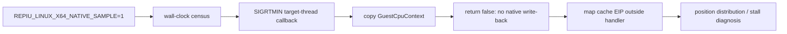

# Task 721 설계 — Linux x64 정지 구간 guest 위치 census

## 목적

Task 720은 Linux x64 Glide gate 직접 디스패치로 수백만 `ud2` trap을 제거했지만, attract
주기 로딩 지점의 swap 정지(약 8초)는 남았습니다. 정지 중에는 `sti`/timer 경로가 계속
예외를 발생시키므로 예외가 1초 조용할 때만 동작하는 기존 native-phase sampler로는 guest
위치를 얻지 못합니다.

이미 존재하는 wall-clock `GuestPositionCensus`는 이 질문에 맞지만, Linux x64에서는
`CaptureNativePhaseSample`이 architecture fence 때문에 항상 unsupported를 보고했습니다.
Task 705의 target-thread interrupt는 native register를 수정하지 않는 읽기 전용 callback을
안전하게 지원하므로, 이를 선택적으로 census capture에 사용합니다.

## 설계

`REPIU_LINUX_X64_NATIVE_SAMPLE=1`일 때만 Linux x64에서 native-phase capture를
활성화합니다. 기본 실행은 signal을 추가로 보내지 않습니다. 기존
`REPIU_GUEST_POSITION_CENSUS=1`과 함께 설정한 관찰 실행만 wall-clock census가 guest EIP를
기록합니다.

callback은 `GuestCpuContext`에서 32-bit guest EIP와 일반 레지스터를 로컬 sample에 복사하고
`false`를 반환합니다. Task 705 계약에 따라 Linux signal handler는 native `ucontext_t`에
아무것도 write-back하지 않으므로 host register를 훼손하지 않습니다. cache EIP의 guest 주소
역매핑은 callback 밖에서 수행합니다.

Win32/i386에서만 쓰던 shallow host-stack scan은 Linux x64 signal handler에서 수행하지
않습니다. 해당 scan은 `process_vm_readv`와 module-range 탐색을 포함하며 signal-handler
관찰의 필수 정보가 아닙니다. Linux sample의 host call-site는 0으로 남기고, census는
guest/cache 위치 분포만 판단합니다.

## 검증

1. Linux x64와 Win32 x86 core probe를 빌드·실행합니다.
2. Linux x64에서 opt-in 없이 30초 실행하여 기본 경로가 새 sampling signal을 보내지 않는지
   확인합니다.
3. Linux x64에서 두 변수 모두 켠 제한 실행으로 capture 성공, guest/cache 위치 census,
   fault-free 종료 여부를 확인합니다.
4. 정지 구간 위치 분포를 Task 720의 `sti` 대기 가설과 대조하여 다음 frontier를 기록합니다.

## English

### Purpose

Task 720 removed millions of Linux x64 Glide `ud2` traps, but the roughly eight
seconds of swap stalls at attract-cycle loading points remained. Those stalls still
raise `sti`/timer exceptions, so the existing native-phase sampler, gated on one
second of exception silence, cannot observe their guest position.

The existing wall-clock `GuestPositionCensus` fits the question, but Linux x64
reported every `CaptureNativePhaseSample` as unsupported. Task 705's target-thread
interrupt safely supports a read-only callback, so this task uses it selectively for
census capture.

### Design

Linux x64 native-phase capture is enabled only with
`REPIU_LINUX_X64_NATIVE_SAMPLE=1`; normal runs send no additional signal. An
observation run also enables `REPIU_GUEST_POSITION_CENSUS=1` to record guest EIPs on
the wall-clock cadence.

The callback copies the 32-bit guest EIP and general registers into a local sample
and returns `false`. Under the Task 705 contract the signal handler therefore does
not write anything back to native `ucontext_t`, preserving host registers. Cache-EIP
reverse mapping remains outside the callback.

The shallow host-stack scan used on Win32/i386 is excluded from the Linux x64 signal
handler. It invokes `process_vm_readv` and module-range work that are not necessary
to answer the sampling question. Linux host call-site remains zero; the census uses
only guest/cache position distributions.

### Verification

Build and run Linux x64 and Win32 x86 core probes; check a Linux default 30-second
run sends no sampling signal; run a bounded Linux observation with both opt-ins and
verify successful capture, census positions, and fault-free exit; then compare the
stall distribution with Task 720's `sti` wait hypothesis.
