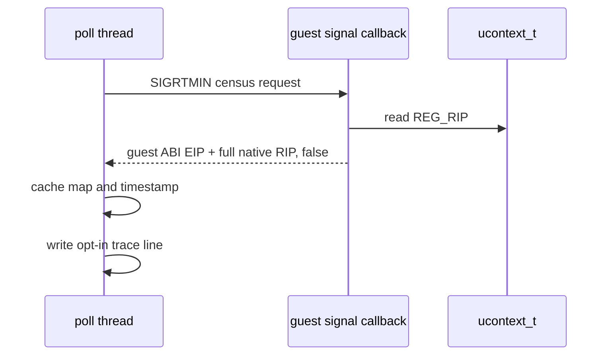

# Task 722 설계 — Linux x64 full RIP 정지 trace

## 배경

Task 721의 Linux x64 wall-clock census는 signal capture 자체에는 성공했지만, host 코드에서
중단된 RIP가 `GuestCpuContext::Eip`에 하위 32-bit로만 복사됐습니다. guest/cache 주소에는
맞는 ABI이지만, host 대기 지점은 ASLR 뒤의 64-bit 주소라 module/symbol 귀속이 불가능합니다.
또한 기존 census는 집계만 남겨 정지 구간과 표본을 시간으로 맞출 수 없습니다.

## 설계

Linux platform adapter에 read-only `ReadHostInstructionPointer`를 추가합니다. 이 함수는
signal의 `ucontext_t`에서 `REG_RIP`를 `uintptr_t`로 읽고, 기존 32-bit guest context ABI를
바꾸지 않습니다. native sampler는 context-callback variant를 사용해 guest EIP와 별도로 full
RIP를 기록합니다.

`REPIU_LINUX_X64_NATIVE_SAMPLE_TRACE=1`일 때, enabled guest-position census의 각 성공
capture 뒤 poll thread가 다음 한 줄을 씁니다.

```text
[repiu-x64-sample] elapsed_ms=N native_rip=0x... guest_eip=0x... mapped=0|1
```

I/O와 formatting은 signal handler 밖에서만 합니다. guest-position census의 기존 aggregate
형식과 Win32 동작은 유지합니다. full RIP가 0인 unsupported/failed sample은 trace하지
않습니다.



## 검증

1. Linux x64 core probe와 Win32 x86 full build/core probe를 확인합니다.
2. full-RIP trace 없이 Task 721 opt-in census가 기존 형식과 동작을 유지하는지 확인합니다.
3. trace opt-in `pumpit2a` 실행에서 16자리 native RIP와 monotonic elapsed time, capture
   failure 0을 확인합니다.
4. 로딩 정지의 시간 창에 속하는 RIP를 `/proc/<pid>/maps` 또는 loader module 범위에 대조해
   다음 대기 원인을 좁힙니다.

## English

### Background

Task 721 captured Linux x64 wall-clock census samples successfully, but a host-code
RIP was copied into `GuestCpuContext::Eip` only as its low 32 bits. That ABI is right
for guest/cache addresses, but it cannot attribute an ASLR 64-bit host wait to a
module or symbol. The aggregate census also loses sample timing.

### Design

Add read-only `ReadHostInstructionPointer` to the Linux platform adapter. It reads
`REG_RIP` from the signal `ucontext_t` as `uintptr_t` without changing the 32-bit guest
context ABI. The native sampler uses the context-callback variant to retain full RIP
beside guest EIP.

With `REPIU_LINUX_X64_NATIVE_SAMPLE_TRACE=1`, the poll thread writes one timestamped
line after each successful enabled census capture. Formatting and I/O remain outside
the signal handler; aggregate census output and Win32 behavior remain unchanged.

### Verification

Run Linux x64 core probe and Win32 x86 full build/core probe; verify prior opt-in
census behavior without the trace; run trace opt-in `pumpit2a`, verify full native RIP,
monotonic elapsed time, and zero capture failures; correlate the RIPs in the loading
stall window with `/proc/<pid>/maps` or loader-module ranges.
