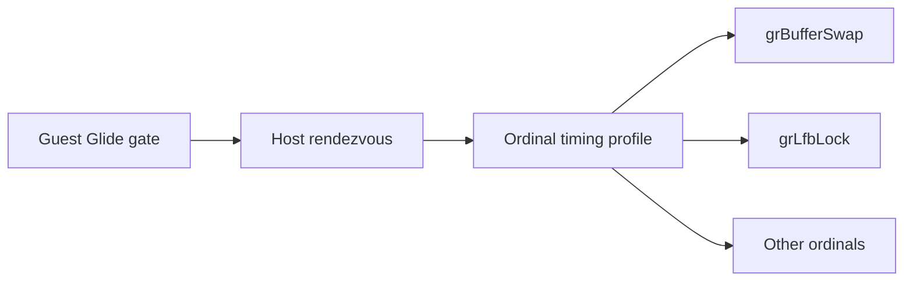

# Task 723 설계 — Linux x64 Glide host-work ordinal 분해

## 배경

Task 722의 full-RIP 표본은 로딩 정지가 단일 guest busy loop가 아니라 renderer와 LFB 영역을
포함한다는 사실만 보여 주었습니다. 기존 Glide gate profile은 대기와 host 작업을 구분하지만,
어느 Glide 호출이 host 작업을 차지하는지는 확인하지 않았습니다.

## 설계

소스 변경 없이 기존 `REPIU_EXECUTION_TIME_PROFILE=1`과
`REPIU_GLIDE_ORDINAL_TIME_PROFILE=1`을 함께 사용합니다. 완결된 timeout 실행의 exit summary만
근거로 삼고, `backend_total`, `work`, `wake`를 ordinal별로 비교합니다. 미완결 실행 또는
출력이 없는 실행은 수치 근거에서 제외합니다.

## 검증

1. Linux x64 `pumpit2a`를 30초 timeout으로 실행합니다.
2. ordinal summary가 enabled이고 완료 gate가 0보다 큰지 확인합니다.
3. work와 backend total의 큰 항목을 비교하고, 미완결 profile은 결과에서 제외합니다.

## English

### Background

Task 722 full-RIP samples showed only that the loading stalls include renderer and LFB
areas rather than one guest busy loop. Existing Glide gate timing splits waiting from
host work, but did not identify which Glide calls consume host work.

### Design

Make no source changes. Enable both existing `REPIU_EXECUTION_TIME_PROFILE=1` and
`REPIU_GLIDE_ORDINAL_TIME_PROFILE=1`. Use only the exit summary from a completed timeout
run, comparing `backend_total`, `work`, and `wake` by ordinal. Exclude incomplete or
output-less runs from numeric evidence.

### Verification

Run Linux x64 `pumpit2a` with a 30-second timeout; confirm enabled ordinal summary and
nonzero completed gates; compare the largest work/backend-total rows and exclude any
incomplete profile.
