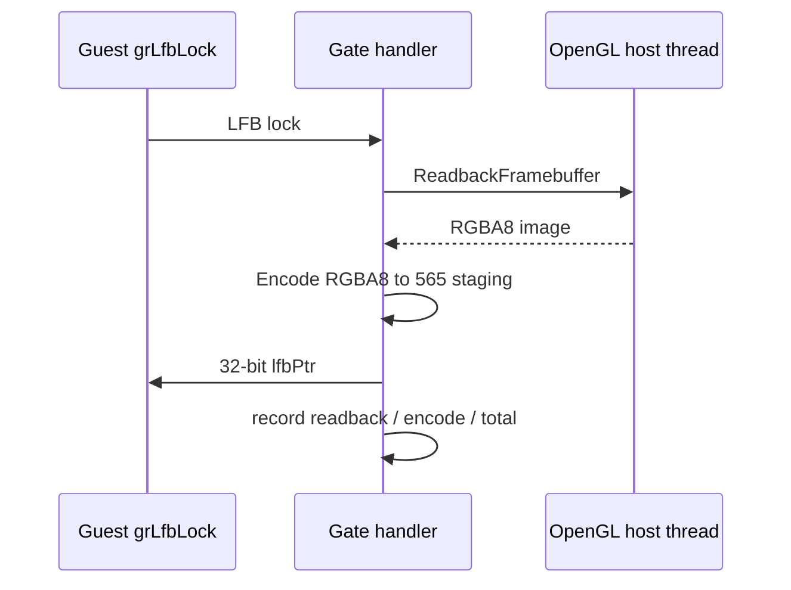

# Task 724 설계 — Linux x64 LFB lock 단계별 timing

## 배경

Task 723의 30초 Linux x64 관찰에서 `grLfbLock`은 host work의 24.3%를 차지했습니다.
현재 lock은 staging surface를 현재 framebuffer에서 보존하기 위해 매번
`ReadbackFramebuffer`와 `EncodeRgba8ToGlideLfb565`를 순서대로 수행합니다. 두 단계 중
어느 것이 비용의 대부분인지 확인되지 않았으므로, 의미 보존 최적화 전에 단계별 근거가 필요합니다.

## 설계

공용 telemetry subsystem `GlideLfbTimingProfile`을 추가합니다. 기본 OFF이며
`REPIU_GLIDE_LFB_TIME_PROFILE=1|on|true`에서만 timing을 기록합니다. `grLfbLock`의 staging
seed 경로에서 다음 네 구간을 단조 cycle counter로 기록합니다.

1. readback 호출 전후
2. RGBA8→565 encode 호출 전후
3. 둘을 포함한 seed total
4. 실패한 readback/encode 수

프로file은 lock의 의미, guest memory, OpenGL 호출 순서, 성공/실패 반환값을 바꾸지 않습니다.
counter는 gate handler thread가 쓰고 종료 뒤 snapshot만 읽습니다. aggregate summary는 기존
minimal-execution final report에 넣고, ordinal profile과 독립적으로 활성화됩니다. 결정적
policy/aggregation probe는 기존 Windows 전용 `repiu_aot_probe --glide-lfb-timing`에 넣고,
core probe는 공용 build integration을 계속 확인합니다.

## 검증

1. Linux x64와 Win32 x86 core probe를 빌드·실행하고, Win32 x86 `repiu_aot_probe --glide-lfb-timing`으로
   policy와 aggregation을 실행합니다.
2. profile OFF 기본 실행에서 summary가 disabled이고 기존 LFB 동작이 유지되는지 확인합니다.
3. Linux x64 `pumpit2a` bounded run에서 profile enabled, lock count, readback/encode/total
   counters 및 failure count를 확인합니다.
4. profile 활성화 결과는 관찰용으로만 해석하고, 별도 재현 없이 최적화를 적용하지 않습니다.

## English

### Background

In Task 723's 30-second Linux x64 observation, `grLfbLock` consumed 24.3% of host
work. Each lock currently preserves the staging surface from the framebuffer by running
`ReadbackFramebuffer` followed by `EncodeRgba8ToGlideLfb565`. Evidence is needed on
which phase dominates before any semantics-preserving optimization.

### Design

Add a shared `GlideLfbTimingProfile` telemetry subsystem. It is off by default and
records only with `REPIU_GLIDE_LFB_TIME_PROFILE=1|on|true`. In the `grLfbLock` staging
seed path it records readback, RGBA8-to-565 encoding, their combined seed total, and
readback/encode failures with a monotonic cycle counter.

The profile does not change lock semantics, guest memory, OpenGL call order, or return
values. The gate-handler thread writes the counters and shutdown snapshots them. The
aggregate summary is part of the existing minimal-execution final report and activates
independently of ordinal timing. The deterministic policy/aggregation probe belongs to
the existing Windows-only `repiu_aot_probe --glide-lfb-timing`; core probes continue to
cover common build integration.

### Verification

Build and run Linux x64 and Win32 x86 core probes, then run Windows x86
`repiu_aot_probe --glide-lfb-timing` for deterministic policy and aggregation; confirm a default profile-off run
reports disabled and retains LFB behavior; in a bounded Linux x64 `pumpit2a` run confirm
enabled profile, lock count, phase totals, and failures; treat results as observation
only until separately reproduced.
