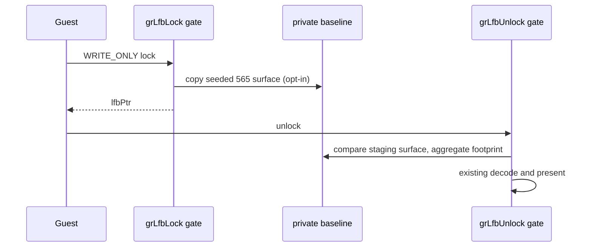

# Task 725 설계 — Linux x64 LFB write footprint census

## 목적

Task 724는 `grLfbLock` staging seed 비용의 62.1%가 framebuffer readback임을 확인했습니다.
그러나 `grLfbLock` ABI에는 사각형 인자가 없고, guest는 반환된 `lfbPtr` 전체를 직접 쓸 수 있습니다.
따라서 write lock에서 실제로 변경되는 footprint를 확인하기 전에는 full readback을 제거하거나
축소할 수 없습니다.

이번 작업은 opt-in `REPIU_GLIDE_LFB_WRITE_CENSUS=1|on|true` 관찰 기능으로, 성공한 write
lock 직전의 565 staging bytes를 private baseline에 복사하고 unlock 직전에 비교합니다. 변경된
pixel의 bounding box, 변경 pixel 수, 전체 surface를 덮는지 여부만 집계합니다. guest가 같은 값을
다시 써도 byte difference로는 관찰되지 않는다는 한계를 명시하며, 이 결과만으로 readback 생략을
허용하지 않습니다.

## 경계와 불변식

baseline은 guest에 노출되지 않는 host-owned storage입니다. profile이 off이면 baseline 할당·복사·
비교를 모두 하지 않습니다. on이어도 `lfbPtr`, staging surface, `grLfbUnlock`의 decode/present
순서와 반환값은 바꾸지 않습니다. lock 실패와 read-only lock은 baseline을 만들지 않습니다.

`GlideLfbWriteFootprintProfile`은 guest thread만 쓰고 shutdown 뒤 snapshot만 읽습니다. 결론은
다음 단계의 안전성 근거가 아니라, partial-write 보존 조건을 추가로 분석할 우선순위를 정하는
관찰값입니다.

## 검증

1. 공용 aggregation helper의 synthetic probe가 disabled, unchanged, partial, full, malformed
   baseline 경로를 확인합니다.
2. Linux x64와 Win32 x86 Debug build 및 core probe를 실행합니다.
3. Linux x64 `pumpit2a` bounded run에서 census를 켜고 write lock 수, changed pixel 수,
   partial/full footprint 수를 기록합니다.
4. Task 724 timing profile과 독립적으로 켜고 꺼지는지 확인합니다.

---

# English

## Purpose

Task 724 established that framebuffer readback accounts for 62.1% of the `grLfbLock`
staging-seed cost. The `grLfbLock` ABI has no rectangle argument, however, and the guest
can directly write the full returned `lfbPtr`. Full readback must therefore not be
removed or reduced until the actual write-lock footprint is observed.

This task adds opt-in observation through `REPIU_GLIDE_LFB_WRITE_CENSUS=1|on|true`.
Immediately before a successful write lock returns, it copies the seeded 565 staging bytes
into a private baseline and compares them at unlock. It aggregates changed-pixel count,
bounding box, and whether a footprint covers the whole surface. Rewriting an identical
pixel is intentionally invisible to this byte-difference census, so its result alone never
authorizes omitting readback.

## Boundaries and invariants

The baseline is private host-owned storage. When disabled, it is neither allocated, copied,
nor compared. When enabled, it changes neither `lfbPtr`, the staging surface, existing
`grLfbUnlock` decode/present ordering, nor return values. Failed and read-only locks create
no baseline. The guest thread is the sole writer and shutdown only snapshots it.

## Verification

Run a synthetic aggregation probe covering disabled, unchanged, partial, full, and malformed
baseline paths; build and run Linux x64 and Win32 x86 Debug core probes; use a bounded Linux
x64 `pumpit2a` run with the census enabled to record write-lock count, changed pixels, and
partial/full footprints; confirm it switches independently of Task 724 timing.
