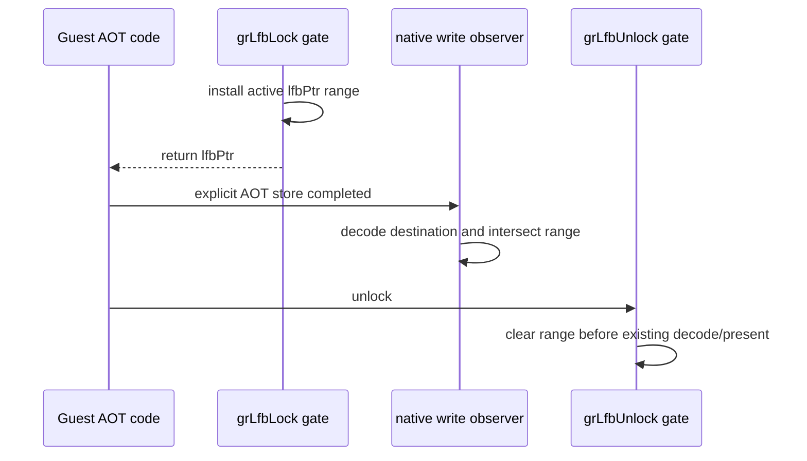

# Task 726 설계: Linux x64 LFB native store census

## 한국어

### 목적

Task 725의 byte-difference census는 `lfbPtr`에 기록한 뒤에도 값이 같았던 pixel을
관찰하지 못합니다. 따라서 write lock 동안 실제로 실행된 guest store가 LFB staging
surface와 겹쳤는지 별도로 계수해야 합니다.

### 설계

새 opt-in `REPIU_LINUX_X64_LFB_STORE_CENSUS=1|on|true`는 기존 Linux x64 native
memory-write observer를 재사용합니다. 이 설정이 켜지면 emitter는 기존
`REPIU_LINUX_X64_MEMORY_WRITE_TRACE`와 동일하게 명시적 memory-write AOT 명령 뒤에
observer를 삽입합니다. observer는 원래 LEGACY_32 명령을 decode하여 얻은 destination과
width를 활성 LFB range에 교차하고, 교차한 store의 개수·겹친 byte 수·최대 단일 store
범위를 누적합니다.

`grLfbLock`이 성공하여 `GrLfbInfo_t::lfbPtr`을 guest에 쓴 뒤 write lock의 32-bit
base와 byte count를 profile에 설치합니다. `grLfbUnlock`은 기존 decode/present 전에
그 range를 끝냅니다. profile은 guest thread만 쓰고, 종료 뒤 snapshot만 읽습니다.
새 setting만 켠 경우 emitter는 observer 앞에 active-range flag를 읽는 짧은 gate를
넣습니다. lock 밖에서는 C++ observer 호출과 register/FPU save를 건너뛰므로, 시작과
종료 경로의 모든 store를 계측하지 않습니다. 기본 OFF에서는 observer code가 cache에
삽입되지 않고, range 상태도 만들지 않습니다.

### 증거의 경계

이 census는 전체 guest write footprint가 아니라 **observer가 삽입된 명시적 AOT
memory-write**의 하한입니다. implicit string store, segment override, AOT 밖 native
경로, decode 실패, 그리고 instruction 실행 후 register snapshot으로 주소를 재구성할 수
없는 형식은 포함하지 않습니다. 따라서 결과가 0이어도 guest가 LFB에 쓰지 않았다는
결론을 내리지 않으며, Task 725의 byte-difference 결과와 함께만 해석합니다.

### 검증

1. Windows x86 `repiu_aot_probe --glide-lfb-native-store-census`로 setting,
   range intersection, lock lifecycle, malformed range를 검증합니다.
2. Linux x64와 Win32 x86 Debug build 및 core probe를 실행합니다.
3. Linux x64 `pumpit2a` bounded run에서 census를 켜고 observer, decoded, LFB-overlap
   counters와 timeout/fault 상태를 기록합니다.
4. 기존 legacy single-address write trace와 동시에 켜도 그 출력 및 watch semantics가
   변하지 않는지 확인합니다.

---

## English

### Purpose

Task 725's byte-difference census cannot observe a guest store that rewrites a pixel
with the same value. A separate count is therefore needed for executed guest stores
whose destinations overlap the LFB staging surface during a write lock.

### Design

The opt-in `REPIU_LINUX_X64_LFB_STORE_CENSUS=1|on|true` reuses the existing Linux x64
native memory-write observer. When enabled, the emitter inserts the observer after
explicit memory-writing AOT instructions just as it does for
`REPIU_LINUX_X64_MEMORY_WRITE_TRACE`. The observer decodes the original LEGACY_32
instruction, intersects its destination and width with the active LFB range, and
aggregates overlapping store count, bytes, and the largest single overlap.

After a successful `grLfbLock` writes `GrLfbInfo_t::lfbPtr` to the guest, it installs
the write lock's 32-bit base and byte count. `grLfbUnlock` ends that range before its
existing decode/present sequence. When only the new setting is enabled, a short
active-range gate precedes the observer so stores outside the lock skip the C++ call
and its register/FPU preservation. The guest thread is the sole writer and shutdown
only reads a snapshot. With the setting off, no observer code is emitted and no range
state is installed.

### Evidence boundary

This is a lower bound for **explicit AOT memory writes with an inserted observer**,
not a complete guest-write footprint. Implicit string stores, segment overrides,
native paths outside AOT, decode failures, and forms whose address cannot be
reconstructed from the post-instruction register snapshot are excluded. A zero count
does not prove the guest did not write LFB memory; results must be interpreted with
Task 725's byte-difference census.

### Verification

Use the Windows x86 synthetic probe to test setting parsing, range intersection, lock
lifecycle, and malformed ranges; build and run Linux x64 and Win32 x86 Debug core
probes; use a bounded Linux x64 `pumpit2a` run to capture observer, decoded, and LFB
overlap counters plus timeout/fault state; and confirm the legacy single-address trace
keeps its existing output and watch semantics when both settings are enabled.
