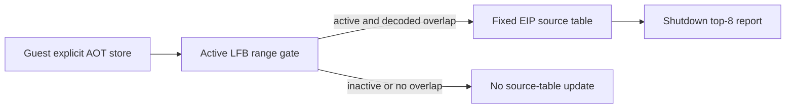

# Task 727 설계: Linux x64 LFB native-store source census

## 한국어

### 목적

Task 726은 LFB staging range와 겹친 명시적 AOT store의 총량을 확인했지만, 어느 guest instruction이 그 store를 실행했는지는 구분하지 못했습니다. 다음 readback 판단은 총량이 아니라 원본 guest write loop와 call-site에 근거해야 하므로, 기존 범위 제한 observer에서 overlap store를 guest EIP별로 집계합니다.

### 설계

별도 opt-in `REPIU_LINUX_X64_LFB_STORE_SOURCE_CENSUS=1|on|true`일 때 Linux x64 telemetry가 고정 크기 64-entry source table을 사용합니다. 이 table은 `ThreadContext` 밖의 단일 guest-thread telemetry 상태에 두어 기존 execution context layout을 바꾸지 않습니다. 한 entry는 guest EIP, 표본 store count, 표본 byte count, 해당 EIP의 최대 표본 겹침 byte를 보관합니다. observer는 decode 성공한 LFB overlap의 정확한 총합을 계속 기록하지만, source setting이 켜진 경우에만 EIP table을 결정적으로 매 4,096번째 overlap에서 갱신합니다. 동일 EIP 표본은 누적하고, table이 가득 차면 새 EIP 표본은 overflow counters로 합산해 할당·정렬·예외를 observer hot path에 넣지 않습니다.

종료 report는 count 내림차순, 같은 count는 EIP 오름차순으로 상위 8개를 출력합니다. 이 정렬은 snapshot/report 단계에서만 수행하며, guest thread가 write 중일 때 읽지 않습니다. 기존 active-range gate, 총합 counter, guest memory 및 ABI는 그대로 둡니다.

### 증거 경계

EIP table은 observer가 decode·재구성한 명시적 AOT store 중 매 4,096번째 overlap 표본만 나타냅니다. string/implicit store, segment override, decode 실패, HLE/boundary write는 빠집니다. 따라서 상위 EIP는 전체 LFB writer의 완전한 목록이나 정확한 비율이 아니라 저비용 관찰 표본의 순위입니다. 이 작업은 특정 EIP가 어떤 원본 함수·draw ownership을 뜻한다고 추정하지 않으며, 후속 binary analysis의 입력만 만듭니다.

### 검증

1. Windows x86 synthetic probe로 EIP aggregation, overflow, ranking tie-break를 확인합니다.
2. Linux x64와 Win32 x86 Debug를 build하고 각 probe를 실행합니다.
3. Linux x64 `pumpit2a` bounded run에서 total overlap와 top-EIP 합계, overflow를 기록합니다.
4. 결과를 `docs/analysis/linux-port-frontier.md`에 confirmed/unresolved로 구분합니다.

---

## English

### Purpose

Task 726 established the aggregate number of explicit AOT stores overlapping the LFB staging range, but not which guest instructions executed them. A future readback decision must rest on original guest write loops and call sites rather than an aggregate, so this task attributes overlapping stores to guest EIPs within the existing range-limited observer.

### Design

With separate opt-in `REPIU_LINUX_X64_LFB_STORE_SOURCE_CENSUS=1|on|true`, Linux x64 telemetry uses a fixed 64-entry source table. The source setting independently enables the prerequisite native observer and LFB active-range gate; the aggregate setting need not also be set. It resides in single-guest-thread telemetry state outside `ThreadContext`, so it does not move the existing execution-context layout. Each entry keeps a guest EIP, sampled-store count, sampled-byte count, and that EIP's maximum sampled overlap. The observer continues to record exact aggregate decoded LFB overlap, but updates the EIP table deterministically only on every 4,096th overlap when the source setting is enabled. Equal EIP samples accumulate; once full, new EIP samples are accumulated in overflow counters, avoiding allocation, sorting, or exceptions on the observer hot path.

Shutdown reporting ranks the top eight by descending count and then ascending EIP. Ranking happens only from a shutdown snapshot, never while the guest thread writes. The active-range gate, aggregate counters, guest memory, and ABI remain unchanged.

### Evidence boundary

The table represents only every 4,096th explicit AOT store overlap that the observer decodes and reconstructs. String/implicit stores, segment overrides, decode failures, and HLE/boundary writes remain outside it. A top EIP is therefore a low-cost ranking sample, not a complete LFB writer list or exact proportion. This task does not infer a source function or draw ownership from an EIP; it creates input for subsequent binary analysis.

### Verification

Use the Windows x86 synthetic probe for EIP aggregation, overflow, and ranking tie breaks; build and run Linux x64 and Win32 x86 Debug probes; run bounded Linux x64 `pumpit2a` to record total overlap, top-EIP coverage, and overflow; and update the Linux frontier analysis with separate confirmed and unresolved results.
