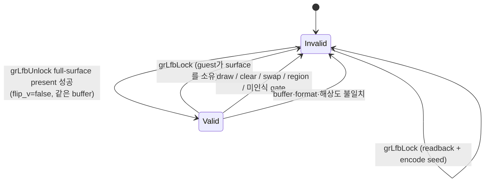

# Task 728 설계: LFB staging shadow 재사용

## 한국어

### 목적

Task 723은 Linux x64 host work의 24.3%가 `grLfbLock`이라고 확인했고, Task 724는 그 비용의
62.1%가 `ReadbackFramebuffer`, 37.9%가 `EncodeRgba8ToGlideLfb565`라고 확인했습니다. 두 비용은
모두 **write lock마다 무조건 실행되는 seed**에서 나옵니다.

Task 725·726·727은 "어떤 lock이 이전 framebuffer pixel을 필요로 하지 않는가"를 census로
증명하려 했습니다. 이 설계는 질문을 뒤집습니다. **lock이 이전 pixel을 필요로 하지 않는 조건을
찾는 대신, 그 pixel을 이미 정확히 들고 있는 조건을 찾습니다.** 후자는 추정이 아니라 host가
스스로 아는 사실이므로 증거 없이 pixel을 잃을 위험이 없습니다.

### 근거가 되는 기존 사실

* `grLfbUnlock`은 write lock의 staging surface **전체**를 `PresentLfbSurface`로 framebuffer에
  올립니다(`src/engine/boundary/linexe_glide_boundary.cpp`의 unlock 경로). 부분 present가 아닙니다.
* 따라서 성공한 unlock 직후에는 framebuffer가 staging surface에서 유래한 이미지입니다.
* Task 476은 이미 같은 staging surface에 대해 같은 개념을 구현했습니다.
  `glide_lfb_region_shadow_valid`는 region gate 연속 호출에서 readback을 한 번으로 줄입니다.
  이 설계는 그 개념을 lock/unlock 경로로 확장합니다.

### 확인된 새 사실 — readback은 무손실이 아니다

`ReadbackFramebuffer`는 1:1 복사가 아닙니다(`src/engine/glide_opengl_backend.cpp`). window
drawable 전체를 읽은 뒤 nearest-neighbor로 논리 640×480으로 축소합니다. `PresentLfbSurface`도
`GL_NEAREST` 텍스처로 drawable 크기에 맞춰 확대합니다. drawable이 논리 해상도의 정수배가
아니면 present → readback 왕복은 **원래 pixel을 복원하지 못합니다**. 예를 들어 drawable 폭이
1000이고 논리 폭이 640이면 논리 x=5는 왕복 뒤 x=4의 값이 됩니다.

그러므로 shadow 재사용은 정확도를 낮추는 최적화가 아니라 **왕복 resample을 제거하는 정확도
개선**입니다. 이 사실은 `docs/analysis/linux-port-frontier.md`에 함께 기록합니다.

### 설계

staging surface가 특정 buffer의 framebuffer 이미지를 그대로 담고 있다는 사실을 `valid`
상태로 추적합니다. 이 상태는 unlock의 성공한 full-surface present에서만 성립하고, framebuffer
pixel을 바꿀 수 있는 모든 gate에서 소멸합니다.

재사용 판정은 lock의 seed 직전에 이루어집니다. `valid`이고 buffer, color format, width,
height가 모두 일치하면 readback과 encode를 건너뛰고 기존 staging 내용을 그대로 guest에
넘깁니다. 그 직후 상태는 `Invalid`가 됩니다. guest가 surface를 소유하기 때문입니다.

#### 무효화 술어

무효화는 **기본값이 무효화**인 allowlist로 구현합니다. `GlideOrdinalPreservesLfbStagingShadow`는
framebuffer pixel을 바꾸지 않는다고 확인된 순수 state setter ordinal에만 `true`를 돌려주고,
그 밖의 모든 ordinal(나중에 추가되는 ordinal 포함)에는 `false`를 돌려줍니다. 새 gate가 추가될 때
아무도 이 표를 갱신하지 않으면 shadow는 무효화되어 기존 동작으로 돌아가며, 이것이 안전한
방향입니다.

무효화하는 ordinal에는 draw 계열(`kGrDrawLine`, `kGrDrawPoint`, `kGrDrawTriangle`,
`kGrDrawPlanarPolygon`, `kGrDrawPlanarPolygonVertexList`, `kGrDrawPolygon`),
`kGrBufferClear`, `kGrBufferSwap`, region gate 둘, `kGrRenderBuffer`, `kGrGlideSetState`,
`kGrSstWinOpen`, `kGrSstWinClose`, `kGrGlideInit`, 그리고 LFB 인코딩 의미를 바꾸는
`kGrLfbWriteColorFormat`과 `kGrLfbWriteColorSwizzle`이 포함됩니다. `kGrLfbLock`과
`kGrLfbUnlock`은 자기 경로에서 상태를 직접 다루므로 표에서는 보존으로 두고 각 경로가 처리합니다.

#### 관찰과 적용의 분리

프로젝트의 기존 관행대로 두 단계로 나눕니다.

* `REPIU_GLIDE_LFB_STAGING_SHADOW_CENSUS=1|on|true` — 동작을 바꾸지 않고 재사용 가능했던
  lock 수, 무효화 사유별 횟수, 건너뛸 수 있었던 seed 수만 계수합니다.
* `REPIU_GLIDE_LFB_STAGING_REUSE=1|on|true` — 실제로 seed를 건너뜁니다. census를 함의합니다.

둘 다 꺼진 기본 실행에서는 상태 갱신과 계수를 모두 건너뛰므로 기존 경로와 동일합니다.

### 검증 전략

* 결정적 probe `repiu_aot_probe --glide-lfb-staging-shadow`: 환경 변수 해석, reuse가 census를
  함의하는지, 무효화 술어의 ordinal 분류, buffer·format·해상도 불일치 거부, 계수 정확성.
* Win32 x86 전체 빌드와 core probe.
* Linux x64 빌드와 `pumpit2a` 관찰은 VM 접근이 회복된 뒤 수행합니다. census 모드로 먼저 재사용
  가능 비율을 측정하고, 그 수치를 본 뒤에만 apply 모드를 평가합니다.

### 범위 밖

기본값 변경은 이 작업에 포함하지 않습니다. `grBufferSwap`이 차지한 62.9%는 별도 작업입니다.

---

## English

### Purpose

Task 723 confirmed that `grLfbLock` accounts for 24.3% of Linux x64 host work, and Task 724
confirmed that 62.1% of that cost is `ReadbackFramebuffer` and 37.9% is
`EncodeRgba8ToGlideLfb565`. Both come from the **seed that every write lock performs
unconditionally**.

Tasks 725, 726 and 727 tried to prove by census which locks do not need preceding framebuffer
pixels. This design inverts the question. **Instead of finding when a lock does not need the
previous pixels, it finds when the host already holds those pixels exactly.** The latter is a
fact the host knows rather than an inference, so it cannot lose pixels for lack of evidence.

### Existing facts this rests on

* `grLfbUnlock` presents the **entire** staging surface to the framebuffer through
  `PresentLfbSurface` (the unlock path in `src/engine/boundary/linexe_glide_boundary.cpp`). It is
  not a partial present.
* Immediately after a successful unlock, the framebuffer therefore holds an image derived from
  the staging surface.
* Task 476 already implemented this same concept for the same staging surface:
  `glide_lfb_region_shadow_valid` reduces a burst of region gates to one readback. This design
  extends that concept to the lock/unlock path.

### New confirmed fact — readback is not lossless

`ReadbackFramebuffer` is not a 1:1 copy (`src/engine/glide_opengl_backend.cpp`). It reads the
whole window drawable and nearest-neighbor downsamples to the logical 640x480, while
`PresentLfbSurface` upscales through a `GL_NEAREST` texture to drawable size. When the drawable
is not an integer multiple of the logical resolution, the present-then-readback round trip
**does not restore the original pixel**. For a 1000-pixel-wide drawable and a 640-pixel logical
width, logical x=5 comes back as the value of x=4.

Shadow reuse is therefore not an optimization that trades away accuracy; it is an **accuracy
improvement that removes a resampling round trip**. This fact is recorded in
`docs/analysis/linux-port-frontier.md` as part of this task.

### Design

Track, as a `valid` state, the fact that the staging surface holds the framebuffer image of a
particular buffer. The state is established only by a successful full-surface present at unlock,
and is destroyed by every gate that may change framebuffer pixels.

Reuse is decided immediately before the seed of a lock. When `valid` holds and buffer, color
format, width and height all match, readback and encoding are skipped and the existing staging
content is handed to the guest as is. The state becomes `Invalid` right afterwards, because the
guest then owns the surface.

#### The invalidation predicate

Invalidation is an allowlist whose **default is to invalidate**.
`GlideOrdinalPreservesLfbStagingShadow` returns `true` only for pure state-setter ordinals
confirmed not to change framebuffer pixels, and `false` for every other ordinal, including ones
added later. If a new gate is added and nobody updates this table, the shadow is invalidated and
behavior falls back to the existing path, which is the safe direction.

Invalidating ordinals include the draw family (`kGrDrawLine`, `kGrDrawPoint`, `kGrDrawTriangle`,
`kGrDrawPlanarPolygon`, `kGrDrawPlanarPolygonVertexList`, `kGrDrawPolygon`), `kGrBufferClear`,
`kGrBufferSwap`, both region gates, `kGrRenderBuffer`, `kGrGlideSetState`, `kGrSstWinOpen`,
`kGrSstWinClose`, `kGrGlideInit`, and the two that change LFB encoding meaning,
`kGrLfbWriteColorFormat` and `kGrLfbWriteColorSwizzle`. `kGrLfbLock` and `kGrLfbUnlock` are left
as preserving in the table because their own paths manage the state directly.

#### Separating observation from application

Two stages, following existing project practice.

* `REPIU_GLIDE_LFB_STAGING_SHADOW_CENSUS=1|on|true` changes no behavior and counts only how many
  locks were reusable, how often each invalidation reason fired, and how many seeds could have
  been skipped.
* `REPIU_GLIDE_LFB_STAGING_REUSE=1|on|true` actually skips the seed, and implies the census.

With both unset, the default run skips both the state updates and the counting, so it matches
the existing path.

### Verification strategy

* Deterministic probe `repiu_aot_probe --glide-lfb-staging-shadow`: environment resolution,
  reuse implying census, ordinal classification by the invalidation predicate, rejection on
  buffer/format/resolution mismatch, and counter accuracy.
* Full Win32 x86 build and core probe.
* The Linux x64 build and a `pumpit2a` observation follow once VM access is restored. Measure
  the reusable fraction in census mode first, and evaluate apply mode only after seeing it.

### Out of scope

Changing any default is not part of this task. The 62.9% held by `grBufferSwap` is separate work.
