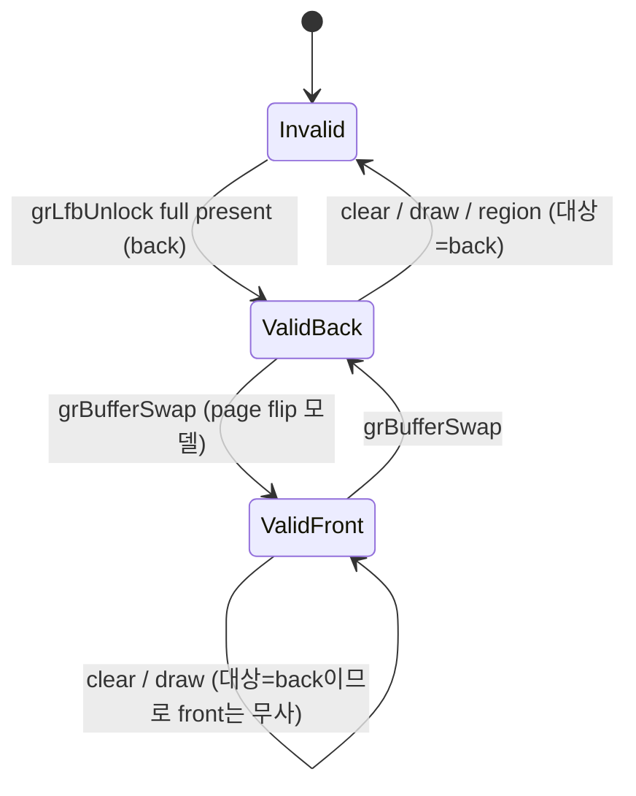

# Task 729 설계: LFB lock 구간 구성 census와 buffer별 shadow 쌍

## 한국어

### 배경

Task 728은 staging shadow 재사용을 구현했고 측정으로 반증됐습니다. write lock 304건 중 재사용
가능 0건이었고, 무효화 304건이 전부 `grBufferSwap`이었습니다. 후속 후보로 남긴 것이
**buffer별 shadow 쌍**입니다. 원본 3dfx에서 buffer swap은 page flip이므로 swap 뒤 back buffer는
두 swap 전 프레임을 담고, shadow를 buffer마다 두고 swap에서 교환하면 lock N이 lock N-2를
재사용할 수 있다는 구상입니다.

### 먼저 재야 하는 이유

Task 728은 재사용이 0이 될 가능성을 알고도 먼저 구현했고, 그 결과 켤 수 없는 기능을 하나
남겼습니다. 같은 실수를 반복하지 않기 위해 이 작업은 **측정을 먼저** 합니다.

30초 `pumpit2a` ordinal 계측이 결정을 좌우하는 수치를 이미 줬습니다.

| gate | 30초 호출 수 |
|---|---:|
| `grBufferSwap` | 2,290 |
| `grBufferClear` | 1,989 |
| `grDrawTriangle` | 30,804 |
| `grLfbLock` / `grLfbUnlock` | 304 / 304 |
| `grRenderBuffer` | **1** |

여기서 두 가지가 읽힙니다.

1. **`grRenderBuffer`가 1회뿐이므로 render target은 실행 내내 back buffer로 고정입니다.** 따라서
   draw와 clear의 대상 buffer를 추적할 필요가 없고, 무효화 대상은 언제나 back shadow입니다.
2. **2,290 − 1,989 = 301은 lock 304와 거의 일치합니다.** LFB lock이 있는 프레임이 곧 clear를
   하지 않는 프레임이라는 뜻일 수 있습니다.

그러나 이 집계만으로는 shadow 쌍의 성패를 결정할 수 없습니다. 결정적인 것은 **두 lock 사이에
back buffer를 건드리는 gate가 있는지**입니다. lock을 가진 프레임들이 연속해 있으면 쌍이
동작하고, 그 사이에 clear·draw 프레임이 끼어 있으면 쌍도 매번 무효화되어 Task 728과 같은
결론이 납니다. swap 2,290 대 lock 304이므로 lock 하나당 평균 7.5 프레임이 있고, 그 프레임들이
어디에 놓이는지가 전부입니다.

### 1단계 — lock 구간 구성 census (동작 변경 없음)

`REPIU_GLIDE_LFB_LOCK_INTERVAL_CENSUS=1|on|true`를 추가합니다. 직전 write unlock부터 다음 write
lock까지를 하나의 **구간**으로 보고, 그 구간에 나타난 gate를 종류별로 셉니다. lock 시점에
그 구간을 다음 네 가지로 분류해 누적합니다.

* `clean` — swap만 있었음 (shadow 쌍이 동작할 수 있는 구간)
* `cleared` — `grBufferClear`가 있었음
* `drawn` — draw 계열이 있었음
* `region` — region write가 있었음

구간의 swap 수 분포도 함께 기록합니다. swap 1회면 back·front가 한 번 교환된 것이고, 홀수/짝수에
따라 lock이 보는 buffer가 달라지므로 쌍 설계에 직접 필요합니다. 최소·최대·합계와, swap 수가
1인 구간과 2 이상인 구간의 수를 남깁니다.

이 census는 아무 동작도 바꾸지 않습니다. Task 728의 shadow 상태와 독립이며, 계수만 합니다.

### 2단계 — buffer별 shadow 쌍 (1단계 결과가 허락할 때만)

1단계가 `clean` 구간을 의미 있는 비율로 보고하면 다음을 구현합니다.

* host가 소유하는 565 복사본을 buffer마다 하나씩 둡니다(640×480×2 = 600 KB × 2).
* 성공한 write unlock(`flip_v=false`)에서 staging → `shadow[lock_buffer]` 복사 후 valid.
* `grBufferSwap`에서 `shadow[back]`과 `shadow[front]`를 교환합니다. 이것이 page flip 모델입니다.
* clear·draw·region은 **현재 render target의 shadow만** 무효화합니다. 위에서 확인했듯 render
  target은 back 고정이므로 실질적으로 back shadow만 깨지고, front shadow는 살아남습니다.
* lock의 seed에서 `shadow[buffer]`가 valid하고 format·해상도가 맞으면 readback과 encode 대신
  memcpy 합니다.

Task 728의 단일 shadow와 달리 shadow가 staging surface 자체가 아니라 **별도 복사본**이므로,
lock이 guest에게 surface를 넘겨도 shadow는 살아남습니다. Task 728에 있던 `kLockHandoff`
무효화가 필요 없어집니다.

### 정확성에 대한 정직한 기록

이 설계는 "swap 뒤 back buffer = 직전 front buffer"라는 **하드웨어 모델**에 기댑니다. OpenGL은
swap 뒤 back buffer 내용을 정의하지 않으므로, 이는 GL이 보장하는 값이 아닙니다. 다만 현재
코드는 그 정의되지 않은 buffer를 읽고 있으므로, 이 설계는 정의되지 않은 값을 원본 하드웨어가
내놓았을 정의된 값으로 바꾸는 것입니다. 그렇더라도 **화면에 닿는 변경**이므로 기본 OFF로 두고
화면을 눈으로 확인한 뒤에만 평가합니다.

### 검증 전략

* 결정적 probe: 구간 분류, swap 수 분포, 쌍의 swap 교환, 대상 buffer별 무효화.
* Win32 x86 전체 빌드와 core probe.
* WSL Ubuntu-24.04 Linux x64 빌드, core probe, 30초 bounded `pumpit2a` 관찰.

### 범위 밖

기본값 변경, `grBufferSwap` 자체의 비용 분해, `ReadbackFramebuffer`의 resample 동작 수정.

---

## English

### Background

Task 728 implemented staging shadow reuse and measurement refuted it: zero of 304 write locks
were reusable, and all 304 invalidations were `grBufferSwap`. The follow-on candidate it left is
a **per-buffer shadow pair**. On original 3dfx hardware a buffer swap is a page flip, so the
post-swap back buffer holds the frame from two swaps earlier; keeping one shadow per buffer and
exchanging them at the swap would let lock N reuse lock N-2.

### Why this measures first

Task 728 knew reuse might come out at zero and implemented first anyway, leaving behind a
feature that cannot be turned on. To avoid repeating that, this task **measures first**.

A 30-second `pumpit2a` ordinal profile already supplied the numbers that decide it.

| Gate | Calls in 30 s |
|---|---:|
| `grBufferSwap` | 2,290 |
| `grBufferClear` | 1,989 |
| `grDrawTriangle` | 30,804 |
| `grLfbLock` / `grLfbUnlock` | 304 / 304 |
| `grRenderBuffer` | **1** |

Two things follow.

1. **`grRenderBuffer` is called once, so the render target is the back buffer for the whole
   run.** Draw and clear targets therefore need no tracking; the shadow they invalidate is
   always the back one.
2. **2,290 − 1,989 = 301 nearly matches the 304 locks**, which may mean the frames carrying an
   LFB lock are exactly the frames that do not clear.

These aggregates still cannot decide the pair design. What decides it is **whether any gate
touches the back buffer between two locks**. If lock-bearing frames are contiguous the pair
works; if clear and draw frames sit between them, the pair is invalidated every time and the
result matches Task 728. With 2,290 swaps against 304 locks there are about 7.5 frames per lock,
and everything depends on where those frames fall.

### Stage 1 — lock interval composition census (no behavior change)

Add `REPIU_GLIDE_LFB_LOCK_INTERVAL_CENSUS=1|on|true`. Treat the span from the previous write
unlock to the next write lock as one **interval** and count the gates appearing in it. At the
lock, classify the interval and accumulate:

* `clean` — swaps only, the case where a shadow pair could work
* `cleared` — a `grBufferClear` appeared
* `drawn` — a draw appeared
* `region` — a region write appeared

Record the distribution of swaps per interval as well. One swap means back and front exchanged
once, and parity decides which buffer the lock sees, so the pair design needs it directly. Keep
the minimum, maximum and total, and how many intervals had exactly one swap versus two or more.

The census changes no behavior. It is independent of Task 728's shadow state and only counts.

### Stage 2 — per-buffer shadow pair (only if stage 1 allows)

If stage 1 reports a meaningful share of `clean` intervals, implement the following.

* One host-owned 565 copy per buffer (640x480x2 = 600 KB each).
* On a successful write unlock (`flip_v=false`), copy staging into `shadow[lock_buffer]` and
  mark it valid.
* At `grBufferSwap`, exchange `shadow[back]` and `shadow[front]`. That is the page-flip model.
* Clear, draw and region invalidate **only the current render target's shadow**. Since the
  target is fixed to back, in practice only the back shadow breaks and the front one survives.
* At a lock's seed, if `shadow[buffer]` is valid and format and resolution match, memcpy instead
  of readback and encode.

Unlike Task 728's single shadow, the shadow here is a **separate copy** rather than the staging
surface itself, so it survives the lock handing that surface to the guest. Task 728's
`kLockHandoff` invalidation is no longer needed.

### An honest note on accuracy

This design rests on the **hardware model** that the post-swap back buffer is the previous front
buffer. OpenGL does not define back buffer contents after a swap, so this is not a value GL
guarantees. The current code does read that undefined buffer, so the design replaces an
undefined value with the defined one original hardware would have produced. It still **changes
what reaches the screen**, so it stays off by default and is evaluated only after looking at the
screen.

### Verification strategy

* Deterministic probe: interval classification, swap distribution, the pair's swap exchange, and
  per-target invalidation.
* Full Win32 x86 build and core probe.
* WSL Ubuntu-24.04 Linux x64 build, core probe, and a 30-second bounded `pumpit2a` observation.

### Out of scope

Changing any default, decomposing `grBufferSwap`'s own cost, and changing the resampling
behavior of `ReadbackFramebuffer`.
