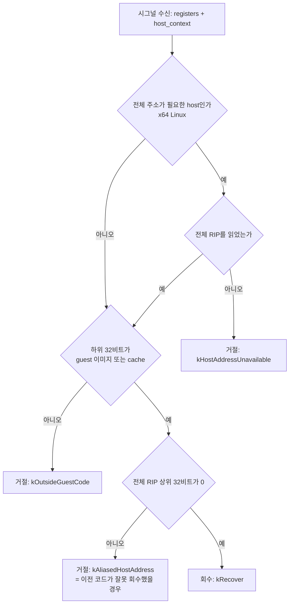

# Task 730 설계: x64 종료 회수 판정에 전체 RIP 사용

## 한국어

### 배경

Task 729 후속 관찰에서 Linux x64 teardown segfault가 기능과 무관한 기존 결함으로 귀속됐습니다.
같은 설정에서 OFF 1/6, ON 1/6이 같은 모양(예산 만료 순간, `[repiu-shutdown]` 마커 없음,
rip=rsp+0x18)으로 죽었고, Task 728 이전 로그 4건도 같은 구간에서 죽었습니다. 이 fault는 Linux
관찰 실행의 final report를 반복해서 날려 왔습니다(Task 727의 오진 포함).

### 결함 후보

예산 만료 뒤 host는 guest thread에 최대 40회 시그널을 보내 회수를 시도합니다.
`RecoverGuestThreadForShutdownCommon`은 `registers->Eip`가 guest 이미지나 AOT cache 범위일 때만
회수하는데, x64에서 이 값은 **64비트 RIP의 하위 32비트**입니다. guest thread가 호스트 라이브러리
(`0x7f..`) 안에 있고 그 하위 32비트가 우연히 guest 범위(`0x01000000`부터 약 140MB, 또는
`0x20000000`의 cache)에 들면, 호스트 프레임이 cache 탈출 trampoline(`RepiuLinuxX64GuestExit`)으로
회수됩니다. trampoline은 cache 프레임 배치를 가정하고 되돌아가므로 쓰레기 주소로 점프합니다.

guest 이미지와 AOT cache는 설계상 4 GiB 아래에 놓입니다(Task 708, `ReserveLowAddressMemory`).
따라서 **상위 32비트가 0이 아닌 RIP는 guest 코드일 수 없습니다.**

### 설계

판정을 순수 함수 `DecideShutdownRecovery`로 추출합니다
(`include/repiu/engine/shutdown_recovery_policy.h`).

* x64 Linux에서만 전체 주소를 요구합니다. Win32 x86과 Linux i386은 native 포인터가 32비트이므로
  기존 판정과 같습니다.
* `kAliasedHostAddress`는 **이전 코드라면 잘못 회수했을 경우**입니다. 횟수를 세어
  `[repiu-shutdown]` 줄에 `aliased=`로, 마지막으로 본 전체 주소를 `host_ip=`로 출력합니다. 시그널
  핸들러 안에서는 정수 갱신만 하고, 출력은 요청 스레드가 합니다.

### 검증 전략

* 결정적 probe `repiu_aot_probe --shutdown-recovery-policy`: 네 판정과 경계값(4 GiB 바로 아래·위,
  주소 0).
* Win32 x86 전체 빌드와 core probe, WSL Linux x64 빌드와 core probe.
* WSL에서 Task 729와 같은 설정으로 10회 실행: 크래시 수와 `aliased=` 값을 기록합니다.
  `aliased>0`인 실행이 나오면 이전 코드가 그 실행에서 잘못 회수했을 것이라는 직접 증거입니다.
  `aliased`가 계속 0인데 크래시가 남으면 이 가설은 반증된 것입니다.

### 범위 밖

fault handler의 `RecoverToHost` 등 다른 x64 경로가 같은 32비트 판정을 쓰는지는 이 작업에서
조사만 하고 고치지 않습니다.

---

## English

### Background

The Task 729 follow-up attributed the Linux x64 teardown segfault to a pre-existing defect unrelated
to the feature. Under the same settings, 1 of 6 OFF and 1 of 6 ON runs died the same way (at budget
expiry, no `[repiu-shutdown]` markers, rip at rsp+0x18), and four logs from before Task 728 died in
the same window. This fault has repeatedly destroyed the final report of Linux observation runs,
including Task 727's misdiagnosis.

### Candidate defect

After budget expiry the host signals the guest thread up to 40 times to recover it.
`RecoverGuestThreadForShutdownCommon` recovers only when `registers->Eip` is in the guest image or
AOT cache, and on x64 that value is **the low 32 bits of a 64-bit RIP**. If the guest thread is inside
a host library (`0x7f..`) whose low 32 bits happen to land in the guest range (about 140 MB from
`0x01000000`, or the cache at `0x20000000`), a host frame is recovered through the cache-exit
trampoline (`RepiuLinuxX64GuestExit`), which unwinds assuming a cache frame and jumps to garbage.

The guest image and the AOT cache are placed below 4 GiB by design (Task 708,
`ReserveLowAddressMemory`), so **a RIP with nonzero upper 32 bits cannot be guest code.**

### Design

Extract the decision into a pure function, `DecideShutdownRecovery`
(`include/repiu/engine/shutdown_recovery_policy.h`). It requires a full address only on x64 Linux;
Win32 x86 and Linux i386 have 32-bit native pointers and keep the existing decision. It refuses when
the full address is unavailable, when the low half is outside guest code, and when the low half is
inside guest code but the full address is above 4 GiB -- `kAliasedHostAddress`, **the case the old
code would have recovered wrongly**. That case is counted and printed on the `[repiu-shutdown]` line
as `aliased=`, with the last full address seen as `host_ip=`. The signal handler only updates
integers; the requesting thread prints.

### Verification strategy

* Deterministic probe `repiu_aot_probe --shutdown-recovery-policy`: the four decisions and the
  boundaries (just below and above 4 GiB, address zero).
* Full Win32 x86 build and core probe; WSL Linux x64 build and core probe.
* Ten WSL runs under Task 729's settings, recording crashes and `aliased=`. A run with `aliased>0`
  is direct evidence the old code would have recovered wrongly in it; a crash persisting with
  `aliased` always zero refutes the hypothesis.

### Out of scope

Whether other x64 paths, such as the fault handler's `RecoverToHost`, use the same 32-bit decision
is surveyed here but not changed.
