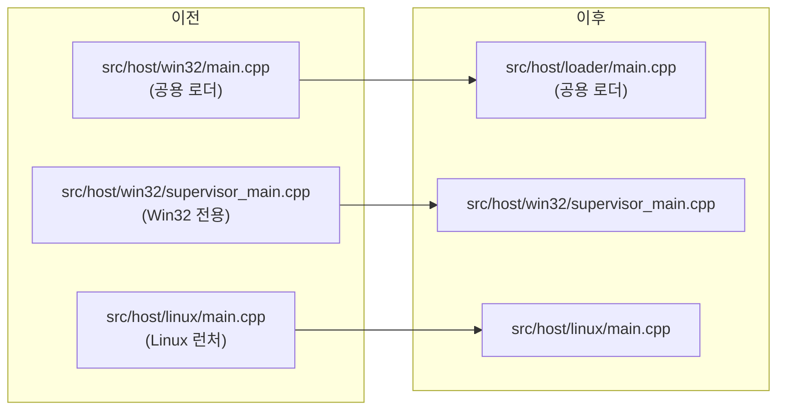

# Task 731 설계: 공용 로더 entry point를 `src/host/loader/`로 이동

## 한국어

### 문제

Linux의 `repiu`는 `src/host/win32/main.cpp`로 빌드됩니다(Task 503d-17). 경로상 Win32 전용처럼
보이지만 이 파일은 이미 플랫폼 공용 로더입니다.

* Windows 헤더 include가 없습니다.
* entry point는 `WinMain`이 아니라 `int main(int argc, char** argv)`입니다.
* 5,846줄 중 플랫폼 분기는 1곳(`REPIU_WIN32_HOST_IMAGE_BASE` 로그 한 줄)뿐입니다.
* Win32 전용 부분(런처 루프, 자식 프로세스)은 이미 platform 계층에 있습니다.

Task 520은 같은 불일치를 엔진에 대해 `src/engine`으로 옮겨 해결했고, CMakeLists.txt 주석은 로더만
"5,577줄을 옮기는 건 별도 작업"으로 남겨 두었습니다. AGENTS.md는 **플랫폼 종속 코드**만
`src/platform/<os>/`에 두라고 하므로, 공용 코드가 `win32` 아래 있는 것은 규칙과 어긋납니다.

### 설계

* `git mv src/host/win32/main.cpp src/host/loader/main.cpp`. 이력을 보존합니다.
* `src/host/`는 실행 파일 entry point를 담는 디렉터리이므로 공용 로더도 그 아래에 두되, 플랫폼
  이름 대신 **역할 이름**(`loader`)을 씁니다. `src/host/win32/`에는 Win32 전용
  `supervisor_main.cpp`만, `src/host/linux/`에는 Linux 런처만 남습니다.
* 새 위치는 `src/host/win32/`와 깊이가 같으므로 `../../engine/...` 상대 include는 그대로 유효합니다.
* 파일 내용은 **바꾸지 않습니다.**

### 로그 접두어는 바꾸지 않는다

파일에는 `"Win32 ..."`로 시작하는 로그 문자열이 646개 있습니다. 이를 소비하는 곳은 `test_all.ps1`을
포함한 스크립트 20개 이상, 가이드 7개, `tests/history/`의 회귀 기록입니다. 접두어를 바꾸면 이들이
한꺼번에 깨지고 과거 기록과의 비교도 끊깁니다. 그러므로 접두어 정리는 이 작업과 분리해, 호환을
유지할지 전면 교체할지를 따로 결정합니다.

### 검증

* Win32 x86 전체 빌드와 core probe.
* WSL Linux x64 빌드, core probe, 짧은 `pumpit2a` 실행으로 이동한 entry point가 동작하는지 확인.
* 파일 내용이 이동 전과 바이트 단위로 같은지 `git`의 rename 판정(100% similarity)으로 확인.

---

## English

### Problem

Linux `repiu` builds from `src/host/win32/main.cpp` (Task 503d-17). The path suggests Win32-only
code, but the file is already a platform-neutral loader: no Windows header is included, the entry
point is `int main(int argc, char** argv)` rather than `WinMain`, and one of its 5,846 lines is a
platform branch (a single `REPIU_WIN32_HOST_IMAGE_BASE` log line). The Win32-only parts, the
launcher loop and the child process, already live in the platform layer.

Task 520 fixed the same mismatch for the engine by moving it to `src/engine`, and the CMakeLists.txt
comment left the loader as "a task of its own" because it meant moving 5,577 lines. AGENTS.md puts
only **platform-specific code** under `src/platform/<os>/`, so shared code under `win32` runs against
the rule.

### Design

* `git mv src/host/win32/main.cpp src/host/loader/main.cpp`, preserving history.
* `src/host/` holds executable entry points, so the shared loader stays under it, named by **role**
  (`loader`) rather than platform. `src/host/win32/` keeps only the Win32-only
  `supervisor_main.cpp`, and `src/host/linux/` only the Linux launcher.
* The new location is as deep as `src/host/win32/`, so the `../../engine/...` relative includes
  remain valid.
* The file's contents **do not change.**

### The log prefix is not changed

The file has 646 log strings beginning with `"Win32 ..."`. They are consumed by more than 20 scripts
including `test_all.ps1`, seven guides, and the regression records in `tests/history/`. Changing the
prefix would break all of them at once and sever comparison with past records, so prefix cleanup is
split from this task and decided separately: keep compatibility, or replace throughout.

### Verification

* Full Win32 x86 build and core probe.
* WSL Linux x64 build, core probe, and a short `pumpit2a` run confirming the moved entry point works.
* Confirm the contents are byte-identical through git's rename detection (100% similarity).
