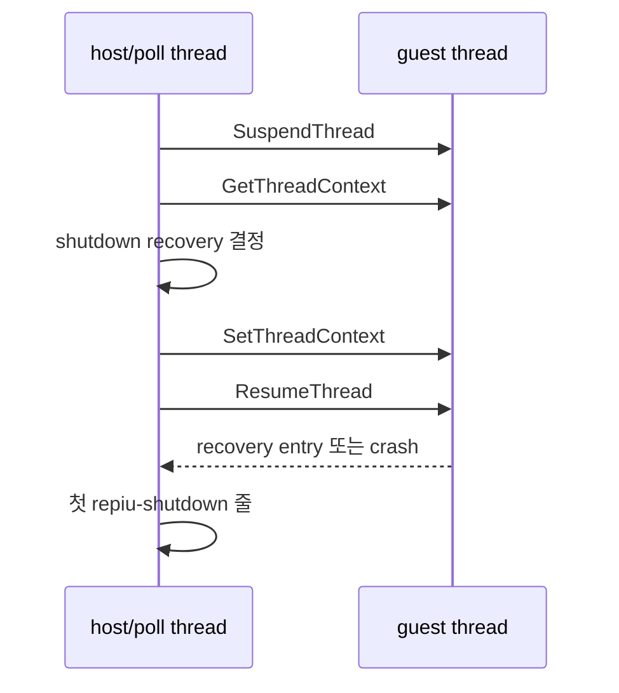

# Task 733: Win32 legacy shutdown crash 귀속 설계

## 한국어

### 배경

최신 `work/20260919-718-default-safe-point-injection` 브랜치의 Win32 x86 Debug
loader로 `pumpit1`, legacy backend, 1,000 ms 실행 제한을 반복하면 8회 중 4회가
`0xC0000005`로 종료됐다. 정상 실행은 timeout 뒤 최종 리포트까지 남기지만 crash 실행은
마지막 `[repiu-live]` 표본 뒤, 첫 `[repiu-shutdown]` 줄보다 먼저 끝난다.

따라서 현재 경계는 일반 teardown이 아니라 다음 구간이다.

### 설계

`REPIU_SHUTDOWN_RECOVERY_TRACE=1`일 때만 Win32 recovery callback이 guest를 재개하기
전에 다음 POD 상태를 host error stream에 기록한다.

* 시도 번호와 recovery 결정
* guest EIP/ESP/EFLAGS
* `active_call_state` 주소와 그 안의 host ESP
* `ThreadContext::host_esp`
* recovery entry로 문맥을 바꾼 뒤의 EIP/ESP

또한 trace가 켜진 동안 임시 최우선 VEH를 설치한다. callback이 recovery redirect를
결정한 뒤에만 observer를 arm하고, 그 직후 발생하는 첫 비동기 예외의 code, fault 주소,
EIP/ESP와 access target을 기록한 뒤 기존 handler 체인으로 넘긴다. 이 관찰자는 예외를
처리하거나 복구 결정을 바꾸지 않는다.

Win32의 callback은 guest를 정지한 요청 스레드에서 실행되므로 이 진단은 재개 전 증거를
남길 수 있다. Linux에서는 callback이 signal handler 안에서 실행되므로 formatting을
추가하지 않는다. 진단은 실행 결정이나 guest 상태를 바꾸지 않는다.

### 검증

1. Win32 x86 Debug `repiu`를 빌드한다.
2. trace를 켜고 같은 pumpit1 조건을 crash가 나올 때까지 반복한다.
3. 마지막 pre-resume 상태로 잘못된 recovery 조건 또는 stack state를 특정한다.
4. 원인을 고친 뒤 반복 실행과 `scripts/test_all.ps1`의 현재 계약 복구를 수행한다.

## English

### Background

With the current branch's Win32 x86 Debug loader, repeated `pumpit1` legacy runs with a
1,000 ms budget exited with `0xC0000005` in four of eight attempts. Successful runs print the
final report after timeout. Crashing runs stop after the last `[repiu-live]` sample and before the
first `[repiu-shutdown]` line.

The current boundary is therefore the shutdown recovery handoff, not ordinary teardown.

### Design

Only when `REPIU_SHUTDOWN_RECOVERY_TRACE=1`, the Win32 recovery callback records the attempt,
decision, guest EIP/ESP/EFLAGS, active call-state address and host ESP, stored host ESP, and the
post-rewrite recovery EIP/ESP before the guest resumes. The Windows callback runs on the requesting
thread while the guest is suspended, so this preserves the last evidence before a possible crash.
Linux formatting is unchanged because its callback runs in a signal handler. The diagnostic does
not alter the recovery decision or guest state. While tracing, a temporary first-chance VEH is also
armed only after the redirect decision. It records the first following exception's code, fault
address, EIP/ESP, and access target, then continues through the existing handler chain.

### Verification

Build the Win32 x86 Debug loader, repeat the same traced run until a crash is observed, attribute
the invalid recovery condition or stack state, then verify the fix repeatedly and repair the
current `scripts/test_all.ps1` contract.

---

## 4단계 결과 — 귀속 (2026-09-23)

### 관찰

`REPIU_SHUTDOWN_RECOVERY_TRACE=1`, `REPIU_EXECUTION_BACKEND=legacy`, `REPIU_EXECUTION_TIMEOUT_MS=1000`으로
pumpit1을 반복했습니다. 예외 trace는 첫 1개에서 redirect 뒤 **4개**까지 기록하도록 넓혔습니다. 크래시
4회(묶음 b의 run06·run10, 묶음 c의 run06·run09)와 생존 실행을 비교했습니다.

| 실행 | 회수 판정 시 EIP | redirect 뒤 첫 예외 | 그 뒤 | 결과 |
|---|---|---|---|---|
| c-run06 | guest `0x040F59AD` | single-step, context EIP=**회수 진입점** `0x10017DDC`, ESP=host `0x0CC6FE3C` | index 3: **guard page violation (0x80000001)**, ESP=`0x0CC6E000`, 쓰기 대상 `0x0CC6DFFC` | 0xC0000005 |
| c-run09 | guest `0x050F4B0D` | 같음 (context EIP=`0x10017DDC`, ESP=host) | index 3: 같은 guard page violation | 0xC0000005 |
| c-run05 | guest `0x040F5970` | single-step, context EIP=**원래 guest EIP 근처** `0x040F5972`, ESP=guest | index 2~4: guest 주소에서 연속 single-step | 생존, 그러나 redirect 소실 |
| c-run08 | guest `0x050F5962` | 같음 (guest 주소에서 연속 single-step) | — | 생존, 그러나 redirect 소실 |

### 결론 (확인됨)

legacy backend는 guest를 한 명령씩 single-step으로 실행하므로, guest thread는 많은 시간을 single-step
예외 전달 경로 안에서 보냅니다. **회수 콜백이 guest thread를 멈춘 순간 커널이 이미 single-step 예외를
전달하는 중이었으면**, `SetThreadContext`로 바꾼 EIP/ESP가 그 예외를 취소하지 못합니다. 재개 뒤 예외가
그대로 전달되고, 두 결말이 나옵니다.

1. **예외가 redirect된 context로 전달됨 → 크래시.** 엔진 VEH가 host 스택(`active_call_state->host_esp`)
   위에서 돕니다. 그 스택은 guard page까지 약 7.7KB뿐이라 예외 디스패치가 guard page를 넘고, 이어지는
   접근이 0xC0000005로 끝납니다.
2. **예외가 원래 guest context로 전달됨 → redirect 소실.** 엔진 VEH가 guest single-step을 계속합니다.
   종료 로그는 `recovered=1`이라고 적지만 실제로는 회수되지 않았습니다. 크래시는 아니지만 거짓
   보고이며 같은 결함입니다.

TF는 원인이 아닙니다. `RecoverToHost`는 이미 EFLAGS의 TF를 지우고, 크래시한 실행의 관찰 EFLAGS에는
TF가 꺼진 경우(`0x216`)도 있습니다. 예외는 **이미 커널이 전달 중이던 것**입니다.

### 수정 방향 (구현 전, 사용자 확인 대상)

Win32 종료 회수 구간에만, guest thread에서 발생하는 예외를 엔진 VEH보다 **먼저** 보는 작은 VEH를 둡니다.
회수가 적용된 뒤 도착한 예외 중 context EIP가 (a) guest/cache 주소이거나 (b) 회수 진입점 그 자체인 것만
골라, `RecoverToHost`를 다시 적용하고 `EXCEPTION_CONTINUE_EXECUTION`으로 돌려보냅니다.

* (a)는 소실된 redirect를 되살립니다. guest 스택 위에서 실행되므로 스택 제약이 없습니다.
* (b)는 엔진 VEH의 큰 frame을 host 스택에 올리지 않고 바로 회수 진입점으로 재개합니다.
* 그 밖의 예외(회수 진입점이 실행을 시작한 뒤의 것 포함)는 그대로 통과시킵니다.
* handler는 guest thread가 멈출 때까지 유지하고 그 뒤에 제거합니다.
* Linux는 콜백이 guest thread 자신의 signal handler에서 돌아 이 경쟁이 없으므로 대상이 아닙니다.

### 부수 관찰

같은 반복에서 **실행의 약 45%(19회 중 9회)가 guest 시작 전에** `Failed to reserve an available relocated
image base`로 끝났습니다. 후보 base `0x01000000`~`0x09000000`이 모두 점유되어 있었습니다.
`test_all.ps1`은 supervisor 없이 `repiu.exe`를 직접 실행하므로 이 실패에도 노출됩니다. Task 500이
자식 프로세스 재실행을 만든 이유(GPU 드라이버의 주소 공간 선점)와 같은 계열로 추정되며, 별도로
다뤄야 합니다.

## English — stage 4 result: attribution (2026-09-23)

pumpit1 was repeated with `REPIU_SHUTDOWN_RECOVERY_TRACE=1`, `REPIU_EXECUTION_BACKEND=legacy` and
`REPIU_EXECUTION_TIMEOUT_MS=1000`, with the exception trace widened from the first exception after the
redirect to the first **four**. Four crashes (batch b run06 and run10, batch c run06 and run09) were
compared with surviving runs.

**Confirmed.** The legacy backend single-steps the guest one instruction at a time, so the guest thread
spends much of its time inside single-step exception delivery. **If the recovery callback suspends the
guest thread while the kernel is already delivering a single-step exception**, the EIP/ESP rewritten
through `SetThreadContext` does not cancel it. After resume the exception is delivered anyway, with one
of two outcomes:

1. **Delivered with the redirected context: crash.** The engine VEH runs on the host stack
   (`active_call_state->host_esp`), which has only about 7.7 KB above its guard page. Exception dispatch
   crosses the guard page (a 0x80000001 at ESP `0x0CC6E000`, write target `0x0CC6DFFC` in c-run06 and
   c-run09), and the following access ends the process with 0xC0000005.
2. **Delivered with the original guest context: the redirect is lost.** The engine VEH keeps
   single-stepping the guest (consecutive guest-address single-steps in c-run05 and c-run08). The
   shutdown log says `recovered=1`, but the thread was not recovered. Not a crash, but a false report
   from the same defect.

TF is not the cause: `RecoverToHost` already clears it, and crashing runs include an observed EFLAGS
with TF clear (`0x216`). The exception is one **the kernel was already delivering**.

**Fix direction (not yet implemented; for user confirmation).** For the Win32 shutdown recovery window
only, install a small VEH that sees guest-thread exceptions **before** the engine VEH. Of the exceptions
arriving after a redirect was applied, take only those whose context EIP is (a) a guest/cache address or
(b) exactly the recovery entry, reapply `RecoverToHost`, and return `EXCEPTION_CONTINUE_EXECUTION`. Case
(a) restores a lost redirect and runs on the guest stack; case (b) resumes at the recovery entry without
putting the engine VEH's large frame on the host stack. Everything else, including exceptions after the
recovery entry has begun, passes through. The handler stays until the guest thread has stopped. Linux
runs the callback in the guest thread's own signal handler, has no such race, and is out of scope.

**Side observation.** In the same repetitions about **45% of runs (9 of 19) ended before the guest
started**, with `Failed to reserve an available relocated image base`: every candidate base from
`0x01000000` to `0x09000000` was occupied. `test_all.ps1` runs `repiu.exe` directly, without the
supervisor, so it is exposed to this as well. It is inferred to be the same family as Task 500's reason
for the child-process relaunch (a GPU driver claiming address space) and needs separate handling.

---

## 5단계 설계 확정 — redirect guard (2026-09-23, 사용자 승인)

### 판정 (순수 함수)

`include/repiu/engine/shutdown_recovery_policy.h`에 `DecideShutdownRedirectGuard`를 추가합니다.

| 조건 | 결과 |
|---|---|
| redirect가 아직 적용되지 않음, 또는 guest thread가 아닌 예외 | 통과 |
| context EIP가 회수 진입점이고 예외가 single-step | `kReapplyAtEntry` — 전달 중이던 예외가 redirect된 context로 도착한 경우 |
| context EIP가 회수 진입점이지만 다른 예외 | 통과 — 회수 진입점 자체의 실제 fault를 가리지 않기 위해 |
| context EIP가 guest/cache 주소 | `kReapplyFromGuest` — redirect가 사라진 경우 |
| 그 밖 | 통과 |

### 적용 (Win32 전용)

* 종료 회수 시도 전에 guest thread id와 `ThreadContext`를 기록하고, 엔진 VEH보다 먼저 호출되는
  VEH(`AddVectoredExceptionHandler(1, ...)`, 엔진 VEH 뒤에 등록)를 설치합니다. 진단 trace VEH는 그 뒤에
  등록해 먼저 관찰합니다.
* 회수 콜백이 `RecoverToHost`를 적용한 직후 `redirect_applied`를 켭니다.
* guard는 판정 결과가 reapply면 `RecoverToHost`를 다시 적용하고 `EXCEPTION_CONTINUE_EXECUTION`을
  돌려줍니다. 두 경우의 횟수를 셉니다.
* guard는 `CloseHostThread`로 guest thread가 멈춘 뒤 제거하고, 그때 횟수를
  `[repiu-shutdown] redirect-guard reapplied_entry=N reapplied_guest=M`으로 출력합니다. 종료 줄은 guest가
  예외를 받기 전에 찍힐 수 있으므로 thread가 멈춘 뒤에 찍습니다.
* 회수를 거절한 경로(immediate-exit)에서는 `redirect_applied`가 켜지지 않아 guard가 아무것도 하지
  않습니다.

### 검증

* core probe의 `shutdown_recovery_policy` 그룹에 판정표 전체를 추가합니다.
* Win32 pumpit1 legacy 반복: 크래시 0, `reapplied_entry`·`reapplied_guest`가 0이 아닌 실행이 나오면
  guard가 실제로 개입한 증거입니다.

## English — stage 5 design, the redirect guard (2026-09-23, approved by the user)

`DecideShutdownRedirectGuard` in `shutdown_recovery_policy.h` passes when no redirect has been applied
or the exception is not on the guest thread; returns `kReapplyAtEntry` for a single step whose context
EIP is the recovery entry (an in-flight exception delivered with the redirected context); passes any
other exception at the recovery entry, so a real fault there is not masked; returns
`kReapplyFromGuest` when the context EIP is a guest or cache address (the redirect was lost); and
passes everything else.

On Win32 only, the shutdown block records the guest thread id and `ThreadContext`, and installs a VEH
registered after the engine's so it is called first (the diagnostic trace VEH is registered after it
and observes first). The recovery callback sets `redirect_applied` right after `RecoverToHost`. On a
reapply decision the guard reapplies `RecoverToHost`, returns `EXCEPTION_CONTINUE_EXECUTION`, and
counts the case. It is removed after `CloseHostThread` has stopped the guest thread, and the counts are
printed then as `[repiu-shutdown] redirect-guard reapplied_entry=N reapplied_guest=M`, because the
shutdown line itself can be printed before the guest receives the exception. On the refusing
(immediate-exit) path `redirect_applied` is never set and the guard does nothing.

Verification: the full decision table in the core probe's `shutdown_recovery_policy` group, and
repeated Win32 pumpit1 legacy runs expecting zero crashes, with nonzero reapply counts as evidence the
guard actually intervened.
