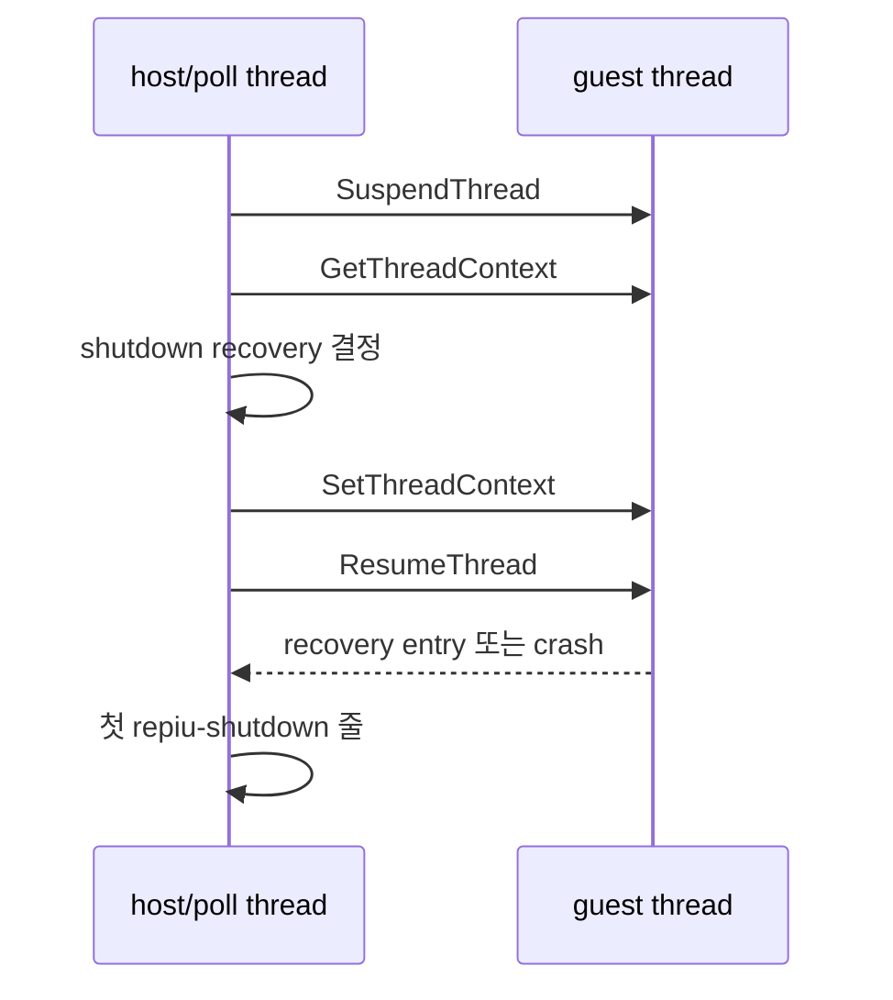

# Task 733: Win32 legacy shutdown crash 귀속 설계

## 한국어

### 배경

최신 `work/20260919-718-default-safe-point-injection` 브랜치의 Win32 x86 Debug
loader로 `pumpit1`, legacy backend, 1,000 ms 실행 제한을 반복하면 8회 중 4회가
`0xC0000005`로 종료됐다. 정상 실행은 timeout 뒤 최종 리포트까지 남기지만 crash 실행은
마지막 `[repiu-live]` 표본 뒤, 첫 `[repiu-shutdown]` 줄보다 먼저 끝난다.

따라서 현재 경계는 일반 teardown이 아니라 다음 구간이다.

### 설계

`REPIU_SHUTDOWN_RECOVERY_TRACE=1`일 때만 Win32 recovery callback이 guest를 재개하기
전에 다음 POD 상태를 host error stream에 기록한다.

* 시도 번호와 recovery 결정
* guest EIP/ESP/EFLAGS
* `active_call_state` 주소와 그 안의 host ESP
* `ThreadContext::host_esp`
* recovery entry로 문맥을 바꾼 뒤의 EIP/ESP

또한 trace가 켜진 동안 임시 최우선 VEH를 설치한다. callback이 recovery redirect를
결정한 뒤에만 observer를 arm하고, 그 직후 발생하는 첫 비동기 예외의 code, fault 주소,
EIP/ESP와 access target을 기록한 뒤 기존 handler 체인으로 넘긴다. 이 관찰자는 예외를
처리하거나 복구 결정을 바꾸지 않는다.

Win32의 callback은 guest를 정지한 요청 스레드에서 실행되므로 이 진단은 재개 전 증거를
남길 수 있다. Linux에서는 callback이 signal handler 안에서 실행되므로 formatting을
추가하지 않는다. 진단은 실행 결정이나 guest 상태를 바꾸지 않는다.

### 검증

1. Win32 x86 Debug `repiu`를 빌드한다.
2. trace를 켜고 같은 pumpit1 조건을 crash가 나올 때까지 반복한다.
3. 마지막 pre-resume 상태로 잘못된 recovery 조건 또는 stack state를 특정한다.
4. 원인을 고친 뒤 반복 실행과 `scripts/test_all.ps1`의 현재 계약 복구를 수행한다.

## English

### Background

With the current branch's Win32 x86 Debug loader, repeated `pumpit1` legacy runs with a
1,000 ms budget exited with `0xC0000005` in four of eight attempts. Successful runs print the
final report after timeout. Crashing runs stop after the last `[repiu-live]` sample and before the
first `[repiu-shutdown]` line.

The current boundary is therefore the shutdown recovery handoff, not ordinary teardown.

### Design

Only when `REPIU_SHUTDOWN_RECOVERY_TRACE=1`, the Win32 recovery callback records the attempt,
decision, guest EIP/ESP/EFLAGS, active call-state address and host ESP, stored host ESP, and the
post-rewrite recovery EIP/ESP before the guest resumes. The Windows callback runs on the requesting
thread while the guest is suspended, so this preserves the last evidence before a possible crash.
Linux formatting is unchanged because its callback runs in a signal handler. The diagnostic does
not alter the recovery decision or guest state. While tracing, a temporary first-chance VEH is also
armed only after the redirect decision. It records the first following exception's code, fault
address, EIP/ESP, and access target, then continues through the existing handler chain.

### Verification

Build the Win32 x86 Debug loader, repeat the same traced run until a crash is observed, attribute
the invalid recovery condition or stack state, then verify the fix repeatedly and repair the
current `scripts/test_all.ps1` contract.
