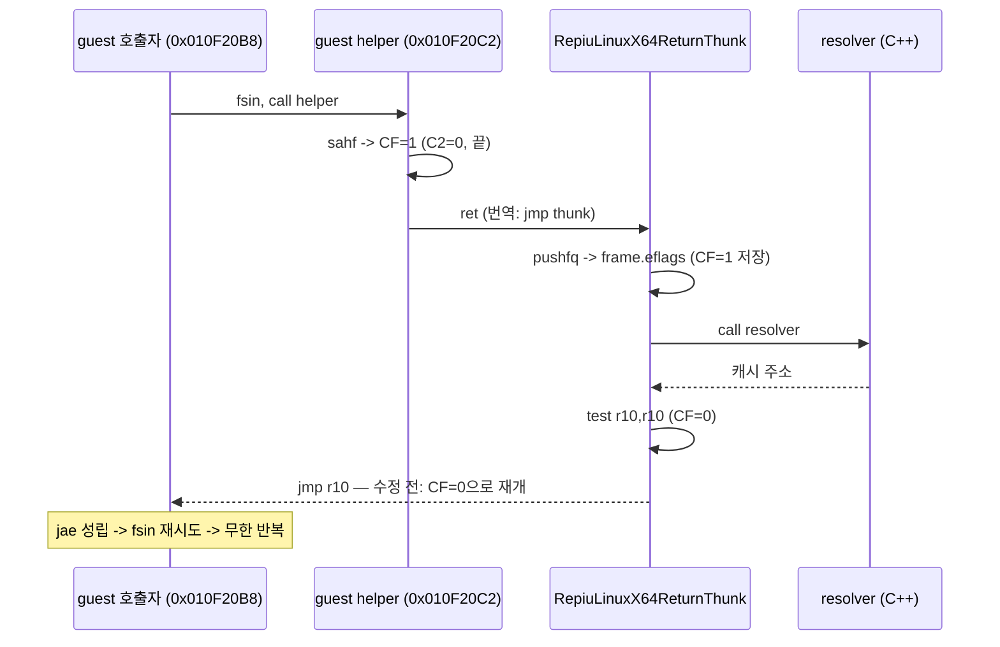

# Task 734: Linux x64 return thunk의 guest EFLAGS 복원 설계

## 한국어

### 배경

WSL Linux x64에서 `pumpit2a`를 실행하면 곡 선택 화면에서 게임이 멈췄다. 화면은 더 이상
바뀌지 않고, 패드를 눌러도 효과음이 나지 않으며, MSCDEX 요청은 17번째(`stop`)를 끝으로
끊긴다. 네 번의 사용자 실행과 세 번의 자동 재현에서 모두 같았다.

종료 회수(shutdown recovery)가 guest thread를 멈춘 위치는 네 번 모두 같은 번역 블록
(`0x20253C46`, `0x20253CAD`, `0x20253CB1`)이었다. `REPIU_AOT_CACHE_MAP_TRACE`로 그 주소를
guest 주소로 되돌리면 `0x010F20BA`이고, 이것은 Watcom C 런타임의 `sin` 재시도 루프다.

```
010F20B8  fsin
010F20BA  call 010F20C2      ; 범위 검사 helper
010F20BF  jae  010F20B8      ; CF=0이면 fsin 재시도
010F20C1  ret
010F20C2  ... fstsw / sahf    ; CF=1로 강제, PF=C2
010F20D1  jnp  010F20EA      ; C2=0(인자 범위 안) -> CF=1 그대로 반환
          ... fprem 루프로 2π 환원 ...
010F20E9  clc                 ; 환원했으니 CF=0 -> 호출자가 fsin 재시도
010F20EA  pop eax / pop ebp / ret
```

helper는 결과를 **CF로 반환**한다. `ret`은 EFLAGS를 바꾸지 않으므로 호출자의 `jae`는
helper가 남긴 CF를 본다.

### 원인

Linux x64 long-mode 번역은 모든 guest `ret`과 간접 call/jump를
`RepiuLinuxX64ReturnThunk`로 보낸다. thunk는 resolver(C 함수)를 부르기 전에 guest
EFLAGS를 frame의 `eflags`(offset 36)에 저장한다. 그런데 돌아갈 때는 GPR만 복원하고
EFLAGS는 복원하지 않은 채 다음 명령으로 끝났다.

```
test r10, r10     ; 마지막으로 flags를 쓰는 host 명령: CF=0, OF=0
jz   unresolved
jmp  r10          ; guest 재개
```

`test`는 항상 CF를 0으로 만든다. 그래서 이 thunk를 지나는 `ret`은 **언제나 CF=0으로
돌아온다.** `sin` helper가 CF=1("끝")을 반환해도 호출자는 CF=0을 보고 `fsin`을 영원히
다시 실행한다. ZF, SF, PF, OF도 같은 이유로 잃는다(ZF는 `r10`이 0이 아니므로 항상 0).



32-bit 경로(Win32, Linux i386)의 dispatch bridge는 `pushf`/`pusha` … `popa`/`popf`로
감싸므로 이 결함이 없다. Glide gate thunk도 `pushfq`/`popfq`로 복원한다. emitter가 만드는
return slot(`mov r14d,[r15]` / `lea` / `movabs r12` / `mov r10d` / `jmp r12`)도 flags를 바꾸지
않는다. flags를 잃는 곳은 return thunk 하나다.

### 설계

thunk의 마지막 host flags 작성자(`test r10, r10`)와 guest로의 `jmp r10` 사이에서 frame의
`eflags`를 복원한다.

```
test r10, r10
jz   unresolved
mov  r11d, dword ptr [r11 + 36]   ; frame.eflags (32-bit load: 상위 절반 0)
push r11
popfq
jmp  r10
```

* **frame 값에서 복원한다.** 진입 시 `pushfq`한 값을 그대로 쓰는 대신 frame을 읽는 이유는
  resolver가 frame을 편집할 수 있기 때문이다(guest ESP를 옮길 수 있다고 이미 문서화되어
  있다). `RepiuLinuxX64LegacyResumeThunk`도 같은 필드(`[r11 + 36]`)를 쓴다.
* **`r11`은 guest register가 아니다.** thunk 머리 주석이 caller-saved이고 guest에 매핑되지
  않았다고 밝힌 scratch다.
* **32-bit load**로 RFLAGS의 예약된 상위 32비트를 0으로 둔다.
* 해석되지 않은 경우(`r10 == 0`)의 `int3` 경계는 그대로 둔다.

### 검증 전략

1. `linux_x64_guest_register` core probe에 `guest_return_preserves_flags`를 추가한다. callee가
   `xor ecx,ecx` / `stc` 직후 `ret`하고, 호출자가 복귀 직후 `setc al` / `setz ah`로 읽는다.
   기대값 `0x0101`, 수정 전 thunk로는 `0x0000`이어야 한다(red/green 모두 확인).
2. WSL에서 합성 입력(XTest)으로 곡 선택까지 자동 재현하고, 수정 전후의 MSCDEX 요청 수,
   DOS open, `progress`, 프레임 표시 여부를 비교한다.
3. Linux x64 core probe 전체를 실행한다.

## English

### Background

On WSL Linux x64, `pumpit2a` froze at the song-select screen: the picture stopped changing, pad
presses produced no sound effects, and MSCDEX requests ended at the seventeenth (`stop`). Four user
runs and three automated reproductions behaved the same.

Shutdown recovery found the guest thread in the same translated block every time (`0x20253C46`,
`0x20253CAD`, `0x20253CB1`). `REPIU_AOT_CACHE_MAP_TRACE` maps that address back to guest
`0x010F20BA`, the retry loop of the Watcom C runtime's `sin` (listing above). The helper **returns its
answer in CF**, and since `ret` leaves EFLAGS alone, the caller's `jae` sees the CF the helper left.

### Cause

Linux x64 long-mode translation sends every guest `ret` and indirect call/jump to
`RepiuLinuxX64ReturnThunk`. The thunk saves guest EFLAGS into the frame's `eflags` (offset 36) before
calling the resolver (a C function), but on the way back it restored only the GPRs and ended with
`test r10, r10; jz unresolved; jmp r10`. `test` always clears CF, so a `ret` through this thunk
**always came back with CF=0**. When the `sin` helper returned CF=1 ("done"), the caller saw CF=0 and
re-executed `fsin` forever. ZF, SF, PF and OF were lost the same way (ZF always 0, since `r10` is
nonzero). The sequence diagram above shows the path.

The 32-bit dispatch bridges (Win32, Linux i386) wrap their calls in `pushf`/`pusha` …
`popa`/`popf` and do not have this defect; the Glide gate thunk restores flags with
`pushfq`/`popfq`; and the emitted return slot (`mov r14d,[r15]` / `lea` / `movabs r12` /
`mov r10d` / `jmp r12`) writes no flags. The return thunk is the one place that loses them.

### Design

Restore the frame's `eflags` between the thunk's last host flag writer (`test r10, r10`) and the
`jmp r10` into the guest (listing above).

* **Restore from the frame.** The frame is read rather than the value pushed on entry because the
  resolver may edit the frame (it is already documented as allowed to move guest ESP).
  `RepiuLinuxX64LegacyResumeThunk` uses the same field (`[r11 + 36]`).
* **`r11` is not a guest register**: the thunk's header comment names it as caller-saved scratch
  outside the guest mapping.
* **A 32-bit load** keeps the reserved upper 32 bits of RFLAGS zero.
* The `int3` boundary for an unresolved answer (`r10 == 0`) is unchanged.

### Verification strategy

1. Add `guest_return_preserves_flags` to the `linux_x64_guest_register` core probe: the callee runs
   `xor ecx,ecx` / `stc` immediately before `ret`, and the caller reads `setc al` / `setz ah`
   immediately after the return. Expect `0x0101`; the old thunk must give `0x0000` (both red and green
   are checked).
2. Reproduce song select automatically on WSL with synthetic input (XTest) and compare MSCDEX
   request count, DOS opens, `progress` and presented frames before and after the fix.
3. Run the whole Linux x64 core probe.
