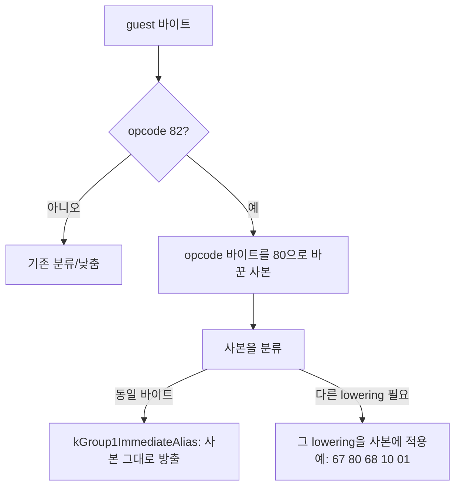

# Task 735: long mode에서 `82 /r ib`를 `80 /r ib`로 바꾸는 설계

## 한국어

### 배경

사용자 로그(`repiu_log.txt`, Linux x64)에서 pumpitea는 게임을 시작하지 못했다.

```
Failed to build requested AOT execution image: AOT translation plan is ready /
emitted code cache failed decode verification
```

번역 계획은 만들어졌지만, x64로 방출한 코드 캐시가 Task 553의 decode 검증(항목마다 방출
바이트를 long mode로 디코드해 길이와 명령 수가 방출기의 의도와 같은지 보는 검사)에서
거절되었다. 검증은 실패 **개수**만 셌기 때문에 어느 guest 명령이 문제인지 알 수 없었다.

### 원인

실패 항목을 기록하게 하자 하나였다.

```
guest=0x011074D8 guest_bytes=82681001 emitted=6782681001
decoded_bytes=0 expected_instructions=1
```

`82 68 10 01`은 32-bit mode에서 `sub byte ptr [eax+0x10], 1`이다. opcode `82`는 group-1
byte 연산 `80 /r ib`의 오래된 별칭이며 **long mode에서는 #UD**다. long-mode 분류기의
`IsInvalidInLongMode` 목록에 `82`가 없어서, 메모리 형식은 주소 크기 lowering(`67` 접두어)만
받아 `67 82 68 10 01`로 방출되었다. 레지스터 형식(`82 C0 01` 등)이었다면 "동일 바이트"로
판정되어 그대로 복사되었을 것이다.

### 설계

`80`과 `82`는 같은 연산, 같은 flags다. 그래서 long-mode 경로가 **`80` 표기로 판단하고
낮춘다.**



* `ClassifyLongModeBytes`: `82`이면 `80` 사본을 분류한다. 결과가 `kIdenticalBytes`이면
  `kNeedsReencode` / `kInvalidInLongMode` / 새 lowering `kGroup1ImmediateAlias`로 바꾼다.
  호출자는 `kIdenticalBytes`를 원본 그대로 복사하므로, 이 경우에 동일 판정을 돌려주면 안 된다.
  사본에 다른 lowering이 필요하면(주소 크기, ESP base 등) 그 판정을 돌려준다.
* `LowerLongModeBytes`: `82`이면 `kGroup1ImmediateAlias`일 때 사본을 그대로 쓰고, 아니면
  사본에 대해 자신을 다시 호출한다.
* opcode 위치는 Zydis의 `raw.prefix_count`로 찾는다. 접두어(`F0`, 세그먼트 등)는 유지된다.
* 32-bit host 경로는 바뀌지 않는다. 이 코드는 long-mode 방출에서만 쓰인다.

진단도 남긴다. 이미지에 `decode_failure_samples`(최대 8개: guest 주소, cache 오프셋, 방출
길이, 디코드된 바이트·명령 수, 기대 명령 수)를 두고, 로더가 빌드 실패 시 guest 바이트와 방출
바이트와 함께 출력한다. 거절된 이미지는 실행되지 않으므로 여기가 유일한 진단 지점이다.

### 검증 전략

1. `long_mode_compatibility` core probe에 `long_mode_group1_immediate_alias`를 추가한다:
   `82 C0 01` → `80 C0 01`(1 명령, long mode에서 `add al,1`), `82 68 10 01` →
   `67 80 68 10 01`(`sub byte [eax+0x10],1`, 주소 폭 32).
2. WSL에서 pumpitea가 이미지를 만들고 실행되는지 본다.
3. pumpit2a의 이미지 크기와 짧은 실행이 그대로인지, Win32 빌드가 되는지 본다.

## English

### Background

In the user's log (`repiu_log.txt`, Linux x64) pumpitea never started:
`Failed to build requested AOT execution image: AOT translation plan is ready / emitted code cache
failed decode verification`. The plan was built, but the emitted x64 cache failed Task 553's decode
check, which decodes each entry's emitted bytes in long mode and compares length and instruction count
with what the emitter intended. The check counted failures only, so nothing said which guest
instruction was at fault.

### Cause

Recording the failing entries showed exactly one: guest `0x011074D8`, bytes `82 68 10 01`, emitted as
`67 82 68 10 01`, decoding to nothing. In 32-bit mode that is `sub byte ptr [eax+0x10], 1`. Opcode `82`
is the old alias of the group-1 byte operations `80 /r ib`, and **it raises #UD in long mode**. The
long-mode classifier's `IsInvalidInLongMode` list did not have `82`, so the memory form received only
the address-size lowering (the `67` prefix). A register form such as `82 C0 01` would have been judged
identical and copied verbatim.

### Design

`80` and `82` are the same operation with the same flags, so the long-mode path **judges and lowers the
`80` spelling** (flowchart above).

* `ClassifyLongModeBytes`: for `82`, classify a copy with the opcode byte set to `80`. If that is
  `kIdenticalBytes`, answer `kNeedsReencode` / `kInvalidInLongMode` / the new lowering
  `kGroup1ImmediateAlias` instead, because callers copy `kIdenticalBytes` verbatim. If the copy needs
  another lowering (address size, ESP base, …), return that verdict.
* `LowerLongModeBytes`: for `82`, emit the copy under `kGroup1ImmediateAlias`, otherwise lower the copy
  by calling itself on it.
* The opcode position comes from Zydis' `raw.prefix_count`, so prefixes (`F0`, segment overrides)
  are kept.
* The 32-bit host path is unchanged; this code runs only for long-mode emission.

A diagnostic stays as well: the image carries `decode_failure_samples` (up to eight: guest address,
cache offset, emitted length, decoded bytes and instructions, expected instructions), and the loader
prints them with the guest and emitted bytes when the build fails. A rejected image never runs, so this
is the only place the failure can be diagnosed.

### Verification strategy

1. Add `long_mode_group1_immediate_alias` to the `long_mode_compatibility` core probe: `82 C0 01` →
   `80 C0 01` (one instruction, `add al,1` in long mode) and `82 68 10 01` → `67 80 68 10 01`
   (`sub byte [eax+0x10],1`, 32-bit address width).
2. Check on WSL that pumpitea builds its image and runs.
3. Check that pumpit2a's image size and a short run are unchanged and that the Win32 build succeeds.
