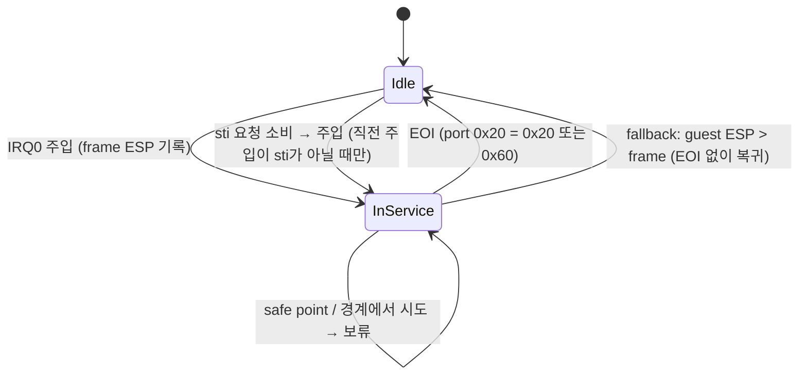

# Task 736: 타이머 IRQ0 in-service와 `sti` 시점 전달 설계

## 한국어

### 배경

Task 735로 이미지가 만들어진 뒤, 사용자의 pumpitea 실행(Linux x64)이 약 23초 만에 segfault로
끝났다. 로그의 단서 두 가지:

* `[repiu-pit] channel=0 divisor=23 frequency=51881.739130Hz` — 게임이 PIT를 51.9 kHz로
  설정한다. 정상 실행에서는 잠시 뒤 240 Hz로 바꾸는데(generation 3), 실패한 실행은 그 전에
  죽었다.
* `[repiu-fault-stack]`에 같은 60바이트 frame(`0x0102AB07 0x24 0x200206 …`)이 반복된다.
  타이머 ISR이 자기 자신 안에 계속 주입되어 guest stack이 넘친 것이다.

pumpitea의 ISR(`0x0102AAE4`)은 `pusha`와 세그먼트 push 뒤 **`cli`**(`0x0102AAF3`)를 하고
다섯 슬롯을 도는 루프를 거쳐 EOI(`out 0x20`, `0x0102AB7D`), `sti`, `iret`으로 끝난다. 반복된
frame의 EIP `0x0102AB07`은 그 루프의 back-edge, 즉 `cli` 뒤다.

### 원인

`InjectPendingInterrupts`는 `win32_context->EFlags`의 IF로 주입 가능 여부를 판단한다. 그러나
guest는 user mode에서 실행되므로 IF를 실제로 끌 수 없다. guest `cli`는 저장된 context를 고치는
방식으로 흉내 내지만, 커널은 복귀할 때 IF를 다시 켠다. 그래서 ISR 안의 safe point(루프
back-edge)에서 밀린 tick이 주입된다. 51.9 kHz에서는 tick이 항상 밀려 있으므로 중첩이 끝나지
않는다. 중첩이 stack을 넘기기 전에 게임이 240 Hz로 바꾸면 살아남으므로 간헐적이다.

실제 기계에서 이 중첩을 막는 것은 IF만이 아니라 **PIC의 in-service 비트**다. IRQ0이 전달되면
in-service가 서고, 핸들러가 EOI를 쓸 때까지 PIC는 다음 IRQ0을 올리지 않는다.

### 설계

1. **In-service 비트** (`PicTimerInService`, `src/engine/io/pic_timer_in_service.cpp`): 주입이
   세우고 EOI가 지운다. 서 있는 동안 주입 시도는 보류(deferred)로 센다. EOI를 쓰지 않는
   핸들러를 위한 fallback으로, guest ESP가 주입한 frame보다 위로 올라가면 복귀한 것으로 보고
   지운다.
2. **`sti` 시점 전달**: EOI 뒤 밀린 IRQ0은 실제 CPU에서 핸들러 끝의 `sti` 직후 처리된다. 이것이
   없으면 긴 host 호출(Glide) 동안 밀린 tick을 따라잡을 수단이 줄어, pumpit2a가 tick의 약
   25%를 잃었다(초당 약 227 → 170). 에뮬레이트된 `sti`는 요청만 세우고, dispatcher의 다음
   주입 시도(AOT/trace 상태를 guest 명령 경계로 맞춘 뒤)가 요청을 소비한다. 일반 fault 경로의
   privileged-trap HLE 뒤에도 DOS HLE 경로처럼 주입 시도를 둔다.
3. **`sti` 연쇄 금지**: 에뮬레이트된 핸들러는 실제보다 훨씬 느려, 51.9 kHz에서 매 `sti`마다
   전달하면 핸들러가 끝없이 이어진다. 직전 주입이 `sti` 시점이었으면 다음 `sti` 전달은
   막고, 일반 safe point(중단된 코드가 실행되어야 도달)를 기다린다. 중첩 깊이가 2로 묶인다.
   frame 생존을 ESP로 추적하는 방법은 쓰지 않는다. `iret` 뒤 중단된 코드가 frame보다 깊이
   내려갈 수 있어, 첫 시도에서 거의 모든 주입을 막았다.
4. **주입 frame에서 TF 제거**: dispatcher는 HLE 처리 전에 자기 trace용 TF를 context에 세운다.
   그 EFLAGS를 frame에 그대로 넣으면 핸들러의 `iret`(Win32에서는 native)이 TF를 되살려 일반
   guest 코드에서 single-step 예외가 새어 나갔다. frame의 EFLAGS에서 TF를 지운다.
5. `REPIU_PIC_TIMER_IN_SERVICE=0`이면 1~3을 끄고 이전 동작으로 돌아간다(A/B용).

### 검증 전략

* core probe `pic_timer_in_service`: 보류, EOI(0x20·0x60, 다른 OCW2 무시), `sti` 전달,
  `sti` 연쇄 금지, 다음 safe point 허용, EOI 없는 핸들러의 stack fallback.
* pumpitea(Linux x64) 반복 실행: 폴트 0, 240 Hz 전환 도달.
* pumpit2a 회귀: 두 host에서 tick 전달률이 이전과 같은 수준인지, 새 예외가 없는지.

## English

### Background

After Task 735 made the image build, the user's pumpitea run (Linux x64) ended in a segfault after
about 23 s. Two clues: `[repiu-pit] channel=0 divisor=23 frequency=51881.739130Hz` — the game
programs the PIT to 51.9 kHz, and in healthy runs switches to 240 Hz a little later (generation 3),
which the failed run never reached; and `[repiu-fault-stack]` repeats one 60-byte frame
(`0x0102AB07 0x24 0x200206 …`), the timer ISR injected into itself until the guest stack overflowed.

pumpitea's ISR (`0x0102AAE4`) pushes registers, runs **`cli`** (`0x0102AAF3`), loops over five slots,
then writes EOI (`out 0x20`, `0x0102AB7D`), `sti`, `iret`. The repeated frames' EIP `0x0102AB07` is that
loop's back edge, after the `cli`.

### Cause

`InjectPendingInterrupts` decided from IF in `win32_context->EFlags`. The guest runs in user mode,
where IF cannot really be cleared: a guest `cli` is emulated by editing the saved context and the kernel
sets IF again on return. So an owed tick was injected at a safe point (a loop back edge) inside the ISR.
At 51.9 kHz a tick is always owed, so the nesting never ended; the run survives only if the game
switches to 240 Hz before the stack overflows, hence intermittent.

On the real machine this nesting is prevented not only by IF but by the **PIC's in-service bit**: once
IRQ0 is delivered, the PIC raises no further IRQ0 until the handler writes an EOI.

### Design

1. **In-service bit** (`PicTimerInService`, `src/engine/io/pic_timer_in_service.cpp`): set by an
   injection, cleared by an EOI; attempts meanwhile are counted as deferred. As the fallback for a
   handler that never writes an EOI, it is cleared once guest ESP rises above the injected frame.
2. **Delivery at `sti`**: after the EOI a pending IRQ0 is taken on the real CPU right after the
   handler's closing `sti`. Without it there are fewer ways to catch up ticks owed during long host
   calls (Glide), and pumpit2a lost about a quarter of its ticks (about 227 → 170 per second). The
   emulated `sti` only sets a request; the dispatcher's next injection attempt, made after it has
   reconciled AOT and trace state to a guest instruction boundary, consumes it. The general fault
   path's privileged-trap HLE also gets an injection attempt, like the DOS HLE path.
3. **No `sti` chaining**: an emulated handler is much slower than a real one, so delivering at every
   `sti` under 51.9 kHz would chain handlers forever. If the previous injection was made at `sti`, the
   next `sti` delivery is held and waits for an ordinary safe point, which the interrupted code only
   reaches by running. Nesting stays at depth 2. Frame liveness is not tracked from ESP: after `iret`
   the interrupted code may run deeper than the frame, and the first attempt at that blocked almost
   every injection.
4. **No TF in the injected frame**: the dispatcher sets its own trace TF in the context before HLE
   handling. Pushed into the frame, it was restored by the handler's `iret` (native on Win32), and a
   single-step exception escaped from ordinary guest code. TF is cleared from the frame's EFLAGS.
5. `REPIU_PIC_TIMER_IN_SERVICE=0` turns 1-3 off and restores the earlier behaviour, for A/B.

### Verification strategy

* core probe `pic_timer_in_service`: holding, EOI (0x20 and 0x60, other OCW2 ignored), delivery at
  `sti`, no `sti` chaining, the next safe point allowed, and the stack fallback for a handler with no
  EOI.
* Repeated pumpitea runs (Linux x64): no faults, the 240 Hz switch reached.
* pumpit2a regression on both hosts: tick delivery at the previous level and no new exceptions.
