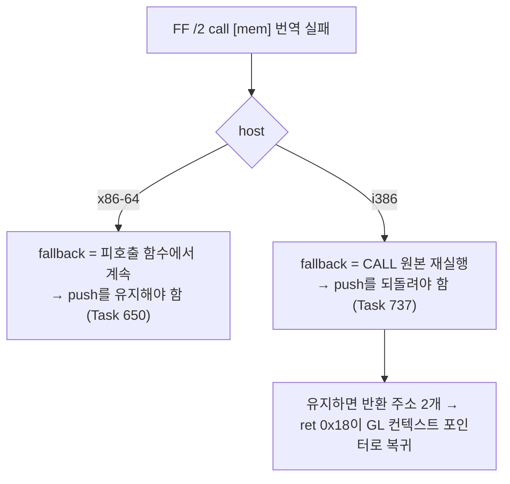

# Task 737: Win32 pumpitea 시작 크래시 — 간접 CALL fallback의 이중 push와 16-bit 코드 복사

## 한국어

### 배경

Win32에서 pumpitea는 약 8초에 `0xC0000005`로 죽었다(Task 736 작업 로그의 "따로 남긴 것").
예외 주소 `0x049E26C8`은 데이터 페이지(`rw-`)이며 EIP가 거기 있었다. 즉 guest가 데이터를 코드로
실행하려 했다. AOT 기능 스위치 13개를 하나씩 꺼도 같은 주소에서 죽었고, legacy backend에서도
다른 주소(`0x040FD010`)에서 죽었다.

### 원인 1 — i386 간접 CALL fallback이 반환 주소를 두 번 push한다

크래시 직전의 마지막 간접 전송은 `0x0407A664 call [esi+0x9c8]` → `0x04049988`(GL 드라이버의
텍스처 함수)이었다. 그 대상의 dynamic 번역이 실패하자 `HandleAotIndirectTransfer`는 Task 650의
규칙대로 **반환 주소 push와 ESP 감소를 유지한 채** 실패를 반환했고, host-dispatch miss tail의
CALL fallback(`LEA ESP,[ESP+4]`)도 그 push를 남겼다. 그런데 i386 host의 legacy fallback은 그
지점의 guest `CALL`을 **원본 그대로 다시 실행**한다. CALL이 반환 주소를 한 번 더 push해서
스택에 같은 값이 두 번 쌓였고, 피호출 함수의 `ret 8`이 돌아간 뒤 호출자의 `ret 0x18`이 그
아래 슬롯(`0x049E26C8`, GL 컨텍스트 포인터)을 반환 주소로 썼다.

Task 650은 Linux x64를 위해 만들어졌다. x64 host의 legacy fallback은 guest의 32-bit CALL을
실행할 수 없어 **피호출 함수에서 이어서** 실행하므로 push를 미리 해 두어야 한다. 두 host의
fallback 의미가 다른데 같은 규칙을 썼던 것이 결함이다.

### 원인 2 — i386 cache가 16-bit 코드 객체의 바이트를 그대로 복사한다

크래시를 없애자 pumpitea는 40초 동안 프레임을 하나도 그리지 못했다. 번역 실패 메시지에 단계와
첫 실패 항목을 넣어 보니, 실패한 dynamic 이미지는 모두 guest `0x04110001`(object 3, 16-bit
스택 전환 stub)에서 decode 검증에 걸렸다. i386 emitter의 `kCopy`는 16-bit 코드 객체의 바이트도
그대로 복사하는데(`00 24`는 16-bit에서 `add [si],ah`, 32-bit 세그먼트에서는 잘린 SIB 형식),
long-mode emitter는 같은 기록을 이미 INT3 경계로 거절한다. 이 stub이 CFG에 들어가는 대상은
전부 번역에 실패했고, 실패한 주소는 retire되지 않아 전송마다 재시도되어 guest thread가 시간의
87%를 translation worker 대기에 썼다.

### 원인 3 — ISR의 200회 `in` 지연 루프가 Win32 CPU를 다 쓴다

두 결함을 고치자 pumpitea는 35초쯤부터 다시 멈췄다. dispatch가 초당 4.6만 회였고 EIP가
`0x04028E42`(입력 스캔의 `in ax,dx`)를 맴돌았다. Win32에서 IN 한 번은 예외 왕복 약 20 µs이므로
200 × 240 Hz = 초당 0.96초, 즉 ISR이 CPU 전체를 쓴다. Task 414의 지연 루프 batcher는 이 루프를
`shape` 불일치로 거절했다. pumpit3의 루프는 `cmp; jl back`인데 pumpitea는 조건을 뒤집은
`cmp; jge exit; jmp back`이기 때문이다.

### 설계

1. `HandleAotIndirectTransfer`: 대상 해석에 실패하면 i386 host(`!__x86_64__`)에서만 CALL의
   push를 되돌린다 — ESP를 진입 값으로 복원하고 기록한 call frame을 빼낸다. 스택에 이미 쓴
   워드는 재실행되는 CALL이 덮어쓴다. x86-64 경로는 그대로다.
2. i386 host-dispatch miss tail: CALL fallback도 JMP처럼 `LEA ESP,[ESP+8]`로 두 슬롯을 모두
   버린다. 이 tail은 i386 emitter 전용이며(long mode는 자체 slot), i386에서는 재디스패치가 반환
   주소를 다시 push한다. Task 650의 probe 기대값을 이 계약으로 바꾼다.
3. i386 `kCopy`: `guest_code_default_operand_size == k16`인 기록은 복사하지 않고 HLE 경계
   INT3으로 방출한다. long-mode emitter의 거절과 같은 결과다.
4. dynamic 번역 실패 메시지에 단계(plan/image), 첫 decode 실패 항목(guest 주소, 바이트·명령
   수), 방출 바이트를 넣는다. 거절된 이미지는 실행되지 않으므로 여기가 유일한 진단 지점이다.
5. 지연 루프 batcher: `IN` 뒤 `cmp` 다음이 **앞으로 가는** `jge`/`jg`(짧은 형식과 `0F 8D`/`0F 8F`)
   이고 그 뒤가 짧은 무조건 `jmp`이면, 조건을 `jl`/`jle`로 뒤집고 `jmp`의 변위로 본문 시작을
   구해 기존 규칙에 넘긴다. 나머지 검증(본문 모양, EAX 0화 증명, 카운터 레지스터, 남은 반복)은
   그대로다.

### 검증 전략

* core probe: `indirect_fallback_call_stack_restored`(Task 650 probe의 새 이름) — CALL·JMP
  fallback 모두 `+8`.
* Win32 pumpitea 90초: 크래시 없음, 프레임 지속, 타이틀 도달. pumpit2a 회귀 2회.
* Linux x64 pumpitea·pumpit2a 회귀, core probe.

## English

### Background

On Win32, pumpitea died with `0xC0000005` about 8 s in (left over from Task 736). The exception
address `0x049E26C8` is a data page (`rw-`) and EIP was there: the guest was executing data. Turning
off thirteen AOT switches one by one changed nothing, and the legacy backend also died, at
`0x040FD010`.

### Cause 1 — the i386 indirect CALL fallback pushed the return address twice

The last indirect transfer before the crash was `0x0407A664 call [esi+0x9c8]` → `0x04049988`, a
texture function of the GL driver. Its dynamic translation failed, and per Task 650
`HandleAotIndirectTransfer` **kept the return-address push and the ESP decrement** while
reporting failure; the host-dispatch miss tail's CALL fallback (`LEA ESP,[ESP+4]`) kept that push
too. But an i386 host's legacy fallback **re-executes the guest `CALL` natively**, which pushes the
return address again. With two copies on the stack, the callee's `ret 8` returned normally and the
caller's `ret 0x18` then used the slot beneath (`0x049E26C8`, the GL context pointer) as its return
address.

Task 650 was written for Linux x64, whose legacy fallback cannot run a 32-bit CALL and therefore
**continues in the callee**, so the push has to be made in advance. The two hosts' fallbacks mean
different things and shared one rule; that was the defect (flowchart above).

### Cause 2 — the i386 cache copied a 16-bit code object's bytes verbatim

With the crash gone, pumpitea presented no frame for 40 s. Giving the translation-failure message
its stage and first failing entry showed every failed dynamic image rejected by the decode check at
guest `0x04110001`, object 3's 16-bit stack-switch stub. The i386 emitter's `kCopy` copies a 16-bit
code object's bytes as they are (`00 24` is `add [si],ah` in 16-bit code and a truncated SIB form in
a 32-bit segment), while the long-mode emitter already refuses such records with an INT3 boundary.
Every target whose CFG reached the stub failed to translate, the failed addresses were not retired
and so were retried on every transfer, and the guest thread spent 87% of its time waiting for the
translation worker.

### Cause 3 — the ISR's 200-iteration `in` delay loop consumed all of Win32's CPU

With both fixed, pumpitea stalled again from about 35 s: 46 thousand dispatches per second with EIP
circling `0x04028E42`, the input scan's `in ax,dx`. One IN on Win32 is an exception round trip of about
20 µs, so 200 × 240 Hz is 0.96 s per second — the ISR takes the whole CPU. Task 414's delay-loop
batcher refused this loop as a shape mismatch: pumpit3's loop is `cmp; jl back`, pumpitea's is the
inverted `cmp; jge exit; jmp back`.

### Design

1. `HandleAotIndirectTransfer`: when target resolution fails, and only on an i386 host
   (`!__x86_64__`), undo the CALL's commit — restore ESP to its entry value and pop the recorded call
   frame. The word already written below ESP is overwritten by the re-executed CALL. The x86-64 path
   is unchanged.
2. The i386 host-dispatch miss tail: the CALL fallback drops both slots with `LEA ESP,[ESP+8]`,
   like the JMP. This tail belongs to the i386 emitter alone (long mode has its own slot), and on
   i386 the re-dispatch pushes the return address again. Task 650's probe expectation is changed to
   this contract.
3. i386 `kCopy`: a record with `guest_code_default_operand_size == k16` is emitted as an HLE
   boundary INT3 rather than copied, the same outcome as the long-mode emitter's refusal.
4. The dynamic translation failure message carries the stage (plan/image), the first decode
   failure sample (guest address, byte and instruction counts) and the emitted bytes. A rejected
   image never runs, so this is the only place to diagnose it.
5. The delay-loop batcher: when the `cmp` after the `IN` is followed by a **forward** `jge`/`jg`
   (short form or `0F 8D`/`0F 8F`) and then a short unconditional `jmp`, invert the condition to
   `jl`/`jle`, take the body start from the `jmp`'s displacement, and hand over to the existing
   rules. The remaining checks (body shape, the EAX-zeroing proof, counter register, remaining
   iterations) are unchanged.

### Verification strategy

* core probe: `indirect_fallback_call_stack_restored` (the Task 650 probe's new name) — both CALL
  and JMP fallbacks `+8`.
* Win32 pumpitea for 90 s: no crash, frames continuing, the title reached. pumpit2a regression twice.
* Linux x64 pumpitea and pumpit2a regressions, core probe.
