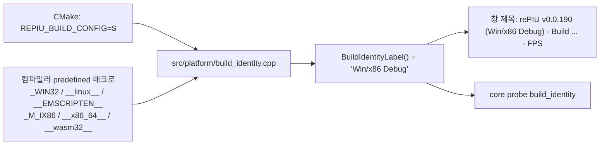

# Task 738: 창 제목에 플랫폼·아키텍처·빌드 구성 표시

## 한국어

### 배경

SDL 창 제목은 `rePIU v0.0.190 - Build Sep 26 2026 - Glide 2 OpenGL [dynamic] - FPS : 60.0`
형태다. 같은 버전의 binary가 Win32 x86 Debug, WSL x64 Debug, Release로 여럿 있어서, 스크린샷이나
보고만으로는 어느 binary인지 알 수 없다. 사용자는 버전 뒤에 플랫폼·아키텍처·빌드 구성을
`rePIU (Win/x64 Debug)`, `(Linux/x86 Release)`처럼 붙이자고 요청했다.

### 설계

* `include/repiu/platform/build_identity.h` + `src/platform/build_identity.cpp`: 플랫폼 이름
  (`Win`/`Linux`/`Web`/`Unknown`), 아키텍처(`x86`/`x64`/`arm64`/`wasm32`, 매크로가 없으면
  포인터 폭으로 `ptr32`/`ptr64`), 빌드 구성, 그리고 `<platform>/<arch> <config>` 라벨. 매크로
  판정은 이 한 파일에만 있다.
* 빌드 구성은 CMake가 `REPIU_BUILD_CONFIG="$<CONFIG>"`로 넣는다. Visual Studio 같은 multi-config
  generator에서도 실제 구성이 들어간다. 단일 구성 generator에서 `CMAKE_BUILD_TYPE`이 없으면 빈
  문자열이 되므로 그때는 `NDEBUG`로 `Debug`/`Release`를 정한다.
* 창 제목은 버전 바로 뒤에 `(<label>)`을 넣고 나머지(빌드 날짜, backend, FPS)는 그대로 둔다.
  `rePIU v0.0.190 (Win/x86 Debug) - Build Sep 26 2026 - Glide 2 OpenGL [dynamic] - FPS : 60.0`.
  요청 예시에는 버전이 없었지만 "여기에 추가하자"였으므로 버전은 유지한다.
* core probe `build_identity`: 라벨이 probe 자신의 컴파일러 매크로·포인터 폭·`NDEBUG`와 일치하는지
  확인한다.

### 검증 전략

Win32 x86 Debug와 WSL Linux x64 Debug에서 core probe의 `build_identity` 줄이 각각 `Win/x86 Debug`,
`Linux/x64 Debug`인지, 실행 시 창 제목에 같은 라벨이 나오는지 본다.

## English

### Background

The SDL window title reads `rePIU v0.0.190 - Build Sep 26 2026 - Glide 2 OpenGL [dynamic] - FPS :
60.0`. Several binaries of the same version exist -- Win32 x86 Debug, WSL x64 Debug, Release -- and a
screenshot or a report cannot say which one it came from. The user asked for the platform,
architecture and build configuration after the version, as in `rePIU (Win/x64 Debug)` or
`(Linux/x86 Release)`.

### Design

* `include/repiu/platform/build_identity.h` + `src/platform/build_identity.cpp`: the platform name
  (`Win`/`Linux`/`Web`/`Unknown`), the architecture (`x86`/`x64`/`arm64`/`wasm32`, or
  `ptr32`/`ptr64` from the pointer width when no macro says more), the build configuration, and the
  `<platform>/<arch> <config>` label. The macro tests live in this one file.
* CMake passes the configuration as `REPIU_BUILD_CONFIG="$<CONFIG>"`, so a multi-config generator
  such as Visual Studio gets the real one. A single-config generator with no `CMAKE_BUILD_TYPE` yields
  an empty string, and then `NDEBUG` decides `Debug`/`Release`.
* The title puts `(<label>)` right after the version and keeps the rest (build date, backend, FPS):
  `rePIU v0.0.190 (Win/x86 Debug) - Build Sep 26 2026 - Glide 2 OpenGL [dynamic] - FPS : 60.0`. The
  request's examples omitted the version, but the request was to *add* to the version, so it stays.
* Core probe `build_identity` checks the label against the probe's own compiler macros, pointer
  width and `NDEBUG`.

### Verification strategy

On Win32 x86 Debug and WSL Linux x64 Debug, the core probe's `build_identity` line reads `Win/x86
Debug` and `Linux/x64 Debug` respectively, and a run's window title carries the same label.
