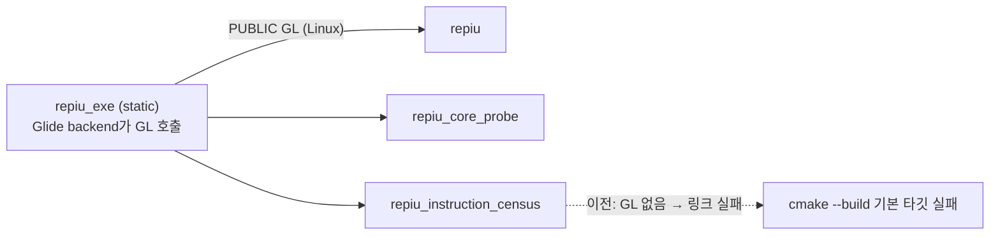

# Task 739: Linux 빌드 스크립트를 수동 빌드에 쓸 수 있게 정비

## 한국어

### 배경

사용자가 `scripts/build_linux_x64.sh`와 `scripts/build_linux_i386.sh`를 수동 빌드에 쓰려고 한다.
Task 738에서 Linux x64 Release를 만들며 스크립트를 쓰지 않고 `cmake`를 직접 불렀는데, 그 과정에서
스크립트 그대로는 걸리는 점이 보였다.

1. **`--target` 없이 돌리면 끝에서 실패한다.** 기본 타깃에 `repiu_instruction_census`가 들어 있는데,
   Linux에서 이 타깃은 `glGetError` 등 GL 심볼이 미해결로 링크에 실패한다. `repiu_exe`(static)의 Glide
   backend가 GL을 직접 부르는데, `repiu_exe`가 그 의존을 소비자에게 전하지 않아 `repiu`와 x64
   `repiu_core_probe`만 `GL`을 따로 적어 두었기 때문이다. 전체 컴파일이 끝난 뒤 마지막 링크에서
   실패하므로 시간을 다 쓰고 나서야 드러난다.
2. **`--headless`의 캐시 잔존.** 스크립트는 `--headless`일 때만 `-DSDL_UNIX_CONSOLE_BUILD=ON`을
   넘기고, 아닐 때는 아무것도 넘기지 않는다. CMake는 이전 값을 캐시에 남기므로 한 번 `--headless`로
   구성한 트리는 이후 평범하게 돌려도 계속 그 값이다. 다만 이 스위치가 하는 일은 usage 문구와 다르다.
   SDL3 소스(`cmake/macros.cmake`)를 보면 **X11/Wayland 개발 패키지가 없을 때 configure의 FATAL_ERROR를
   막는 것뿐**이고, 패키지가 있으면 데스크톱 드라이버를 그대로 빌드한다. 실제로 `build/linux_x64_debug`는
   캐시에 `ON`이 남아 있지만 X11·Wayland가 켜져 있고 창도 뜬다. "데스크톱 지원을 뺀다"는 usage 설명은
   틀렸다.
3. **i386 스크립트에 `--build-dir`이 없다.** x64 스크립트는 Debug·Release 트리를 나란히 두라고
   안내하며 `--build-dir`을 받는데 i386은 `build/linux_i386` 하나뿐이라 구성을 바꾸면 트리를 통째로
   다시 빌드한다. 머리말도 "엔진·로더·런처는 아직 Win32 전용"이라는 Task 501 시점의 문장이라 낡았다.

### 설계

* **CMake:** `repiu_exe`가 Linux(`UNIX AND NOT EMSCRIPTEN`)에서 `GL`을 `PUBLIC`으로 링크한다. static
  library의 의존은 소비자가 링크해야 하므로 의존을 가진 쪽이 선언하는 것이 맞다. 기존의 명시적 `GL` 두
  줄은 그대로 두어도 중복일 뿐이다. 이 뒤로 두 스크립트의 기본(전체) 빌드가 끝까지 간다.
* **두 스크립트:** `SDL_UNIX_CONSOLE_BUILD`를 `--headless`면 `ON`, 아니면 `OFF`로 **항상** 넘긴다.
  usage와 주석은 스위치의 실제 의미(개발 패키지 없이 configure 허용)로 고친다.
* **i386 스크립트:** x64와 같은 `--build-dir`과 "다른 구성은 다른 디렉터리" 안내를 넣고, 머리말을 현재
  상태(Linux i386 런처 존재)로 고친다.
* **문서:** README의 Linux 절과 guides의 `--headless` 서술을 실제 의미에 맞춘다.

### 검증 전략

* x64 Debug 트리에서 `cmake --build`(타깃 없음)가 `repiu_instruction_census`까지 끝까지 성공.
* `scripts/build_linux_i386.sh --config Release`가 기본 타깃 전체를 빌드하고, i386 core probe의
  `build_identity` 라벨이 `Linux/x86 Release`.
* `scripts/build_linux_x64.sh --config Release --build-dir build/linux_x64_release`가 캐시의
  console 값을 `OFF`로 되돌린다.

## English

### Background

The user wants `scripts/build_linux_x64.sh` and `scripts/build_linux_i386.sh` for manual builds. Task
738 built the Linux x64 Release by calling `cmake` directly, and that exposed what the scripts trip
over as they are:

1. **A run with no `--target` fails at the end.** The default targets include
   `repiu_instruction_census`, which on Linux fails to link with `glGetError` and other GL symbols
   unresolved: the Glide backend inside `repiu_exe` (static) calls GL directly, `repiu_exe` does not pass
   that dependency on, and only `repiu` and the x64 `repiu_core_probe` name `GL` themselves. The
   failure comes at the last link, after the whole compile.
2. **`--headless` sticks in the cache.** The script passes `-DSDL_UNIX_CONSOLE_BUILD=ON` only when
   asked and nothing otherwise, and CMake keeps the previous value, so a tree once configured
   `--headless` stays so on every later plain run. The switch also does less than the usage text
   claims: in SDL3's `cmake/macros.cmake` it **only suppresses the configure FATAL_ERROR when no
   X11/Wayland development packages exist**; with the packages present SDL builds the desktop drivers
   anyway. `build/linux_x64_debug` has `ON` in its cache yet X11 and Wayland on and opens windows. The
   "drops SDL desktop support" wording is wrong.
3. **The i386 script has no `--build-dir`.** The x64 script tells the operator to keep Debug and
   Release trees side by side and takes `--build-dir`; i386 has one tree, so changing the
   configuration rebuilds it from nothing. Its header still says the engine, loader and launcher are
   Win32-only, which was true at Task 501 and is not now.

### Design

* **CMake:** `repiu_exe` links `GL` `PUBLIC` on Linux (`UNIX AND NOT EMSCRIPTEN`). A static library's
  dependency has to be linked by its consumers, so the target that has the dependency declares it. The
  two explicit `GL` lines may stay as harmless duplicates. Both scripts' default (everything) build then
  runs to the end.
* **Both scripts:** always pass `SDL_UNIX_CONSOLE_BUILD`, `ON` with `--headless` and `OFF` otherwise;
  the usage and comments say what the switch really does (let configure proceed without the
  development packages).
* **i386 script:** the same `--build-dir` and one-configuration-per-directory guidance as x64, and a
  header describing the current state (the Linux i386 launcher exists).
* **Documents:** README's Linux section and the guides' `--headless` wording match the real meaning.

### Verification strategy

* In the x64 Debug tree, `cmake --build` with no target succeeds through `repiu_instruction_census`.
* `scripts/build_linux_i386.sh --config Release` builds all default targets, and the i386 core probe's
  `build_identity` label reads `Linux/x86 Release`.
* `scripts/build_linux_x64.sh --config Release --build-dir build/linux_x64_release` turns the cached
  console value back to `OFF`.
