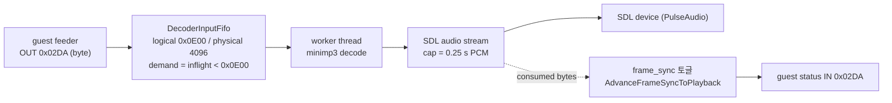

# Task 740: PIU10 MP3 재생의 노이즈와 노트 끊김 — 계측과 원인 후보

## 한국어

### 배경

Linux x64 Release로 pumpitea를 플레이하면 fps는 높지만 두 가지가 보인다는 보고다.

1. 음악에 가끔 노이즈가 낀다.
2. 화살표 노트가 멈췄다가 한꺼번에 올라갈 때가 있다(MP3 재생 위치 또는 타이머 tick 문제로 추정).

pumpitea의 음악은 PIU10 보드의 MP3다. guest는 `AUDIO\*.AUD`를 읽어 포트 `0x02DA`로 한 바이트씩
보내고(Task 471의 feeder), 같은 포트의 status 읽기에서 **bit 0 = demand**(더 보내라), **bit 2 =
frame-sync**(디코더가 프레임 하나를 재생할 때마다 토글)를 본다. 엔진 쪽은 다음과 같다.

* `inflight`는 디코더가 프레임을 **소비**할 때만 줄고, 디코더는 SDL 큐가 0.25초 미만일 때만 돈다.
  그래서 guest 앞에는 MP3 3.5 KB(128 kbps에서 약 0.22초) + PCM 0.25초가 놓여 있다.
* `frame_sync`는 worker 루프가 돌 때 `SDL_GetAudioStreamQueued`로 "재생된 바이트"를 계산해, 그때까지
  경계를 지난 프레임 수만큼 **한 번에** 토글한다.

### 원인 후보

| 후보 | 기전 | 판별 |
|---|---|---|
| A. frame-sync 토글 뭉침 | SDL 장치가 PCM을 덩어리(수십 ms)로 가져가면 한 호출에서 프레임 경계 여러 개를 지나 토글이 2회 이상 겹친다. 240 Hz로 polling하는 guest는 짝수 번 토글을 **변화 없음**으로 본다 → 프레임을 잃고 노트 시계가 뒤처졌다가 어느 순간 따라잡음 | 한 호출에 2개 이상 토글한 횟수 |
| B. 공급 burst | demand가 0.22초 단위로 꺼졌다 켜지면 guest의 바이트 카운터(위치)가 계단식으로 오른다 | 20 ms 간격 `received_bytes` 계단 |
| C. 기아(starvation) | 어떤 이유로 guest가 늦게 공급하면 PCM 큐가 비어 무음 구간 → 클릭/노이즈 | `starvation_events`, 큐 ms 최저값 |
| D. 타이머 tick | 노트 스크롤이 tick으로 가고 tick이 뭉치면 끊김 | census의 tick 전달 |

### 설계 — 계측

계측을 먼저 넣고 측정한 뒤 고친다(Task 729의 교훈).

1. `Piu10Mp3AudioOut`에 카운터를 더한다: `sync_multi_toggle_events`(한 호출에서 2회 이상 토글),
   `sync_toggles`(총 토글 수), `pcm_queued_low_water_ms`.
2. `REPIU_PIU10_MP3_CENSUS_MS=<ms>`: live telemetry 스레드가 그 간격으로
   `[repiu-piu10-mp3-census] elapsed_ms received decoded queued_ms inflight demand sync toggles multi
   starvation ticks_injected`를 찍는다. Task 421의 CD census와 같은 자리, 같은 방식.
3. 최종 보고에 MP3 통계 한 줄(received/dropped/decoded/starvation/toggles/multi/low-water)을 낸다.
   지금은 `stats()`가 있어도 아무 데도 찍히지 않는다.

### 설계 — 수정 (측정 결과에 따라)

* A가 맞으면: 토글은 **한 번에 하나만** 내고, 남은 프레임 경계는 다음 호출로 미룬다(각 호출은 2 ms
  간격). guest가 240 Hz로 읽으면 4 ms 간격이라 최대 1개씩만 놓친다. 원본 하드웨어도 프레임당 한 번
  토글하며, 재생 시각의 오차는 2 ms 이내다.
* C가 맞으면: SDL 큐 상한(0.25초)과 FIFO 논리 용량 사이의 관계를 보고 결정한다.

### 검증 전략

수정 전후로 같은 census를 40초씩 받아 `multi`와 `starvation`이 0이 되는지, 노트가 끊기지 않는지를
사용자가 확인한다.

## English

### Background

With the Linux x64 Release build, pumpitea runs at a high frame rate but (1) the music sometimes
carries noise and (2) the arrows stall and then jump, which the user suspects to be the MP3 position or
the timer ticks.

pumpitea's music is the PIU10 board's MP3. The guest reads `AUDIO\*.AUD`, sends it byte by byte to
port `0x02DA` (Task 471's feeder), and reads the same port's status: **bit 0 = demand** (send more),
**bit 2 = frame-sync** (toggles once per frame the decoder plays). On the engine side (flowchart
above): `inflight` decreases only when the decoder **consumes** a frame, and the decoder runs only
while the SDL queue holds less than 0.25 s, so the guest is 3.5 KB of MP3 (about 0.22 s at 128 kbps)
plus 0.25 s of PCM ahead of the speaker; `frame_sync` is toggled from the worker loop, which computes
the bytes played from `SDL_GetAudioStreamQueued` and toggles **once per frame boundary crossed since
the previous call, all in one go**.

### Candidate causes

A. **Collapsed frame-sync toggles**: when the SDL device pulls PCM in chunks of tens of milliseconds,
one call crosses several frame boundaries and toggles two or more times; a guest polling at 240 Hz
sees an even number of toggles as **no change**, loses frames, and its note clock falls behind until
something catches it up. Measured by calls that toggled more than once. B. **Bursty feeding**: demand
switching off and on in 0.22 s steps makes a byte-counted position climb in steps; measured by 20 ms
samples of `received_bytes`. C. **Starvation**: a late feed empties the PCM queue and the gap clicks;
measured by `starvation_events` and the queue's low-water mark. D. **Timer ticks**: measured by the
census's tick delivery.

### Design — instrumentation first (Task 729's lesson)

1. `Piu10Mp3AudioOut` gains `sync_multi_toggle_events`, `sync_toggles` and
   `pcm_queued_low_water_ms`.
2. `REPIU_PIU10_MP3_CENSUS_MS=<ms>`: the live telemetry thread prints
   `[repiu-piu10-mp3-census] elapsed_ms received decoded queued_ms inflight demand sync toggles multi
   starvation ticks_injected` at that interval, beside Task 421's CD census.
3. The final report prints one MP3 statistics line; `stats()` exists today but nothing prints it.

### Design — the fix, decided by the measurement

* If A: emit **one toggle per call** and carry the remaining boundaries to the next call (calls are 2
  ms apart); a guest polling at 240 Hz (4 ms) then misses at most one per poll. The original hardware
  toggles once per frame too, and the timing error stays within 2 ms.
* If C: revisit the relation between the 0.25 s SDL cap and the FIFO's logical capacity.

### Verification strategy

The same 40-second census before and after: `multi` and `starvation` at zero, and the user confirms
the arrows no longer stall.

---

## 결과 (구현 후) / Result (after implementation)

### 한국어

측정은 후보 A를 **조건부로** 가렸습니다. WSLg의 기본 장치 buffer(768 frame, 17 ms)에서는 다중
토글이 0이고 기아·빈 큐도 없으며 tick도 곡 재생 중에는 끊기지 않았습니다(B·C·D 모두 해당 없음).
그러나 SDL 장치 buffer를 2048 frame(46 ms)으로 강제하면 초당 4~6회, 4096 frame(93 ms)에서는 토글의
40%가 다중 토글로 뭉쳤습니다. 원인은 토글만이 아닙니다. decoder도 장치가 가져간 만큼을 한 번에 다시
채우므로 guest의 demand와 frame 카운터가 같은 계단으로 움직입니다. 그래서 "한 호출에 토글 하나"가
아니라 **장치 계단 사이를 보간하는 재생 시계**를 두고, 토글과 decode 게이트 둘 다 그 시계로 움직이게
했습니다. 첫 구현(시계를 직전 추정값에 다시 고정)은 계단 관측 지연만큼 매번 시간을 잃어 시계가 19%
느렸고(초당 31 토글), 직전 계단의 byte 수에 고정하는 형태로 바꿔 드리프트를 없앴습니다.

노이즈는 WSLg에서 재현되지 않았습니다. 곡 중 PCM 큐 최저는 235 ms이고 빈 큐는 0회입니다. 큐 계측은
"곡 꼬리의 자연 배수"를 세지 않도록 refill 직전의 trough로 옮겼습니다. 사용자 환경에서 노이즈가
남으면 최종 보고의 `pcm-empty`와 `device-buffer-frames`가 그 답을 줍니다.

### English

The measurement separated candidate A **conditionally**. With WSLg's default device buffer (768
frames, 17 ms) there were no multi-toggles, no starvation or empty queue, and no tick gap while a song
played (B, C and D absent). Forcing the SDL device buffer to 2048 frames (46 ms) produced four to six
multi-toggle events a second, and 4096 frames (93 ms) collapsed 40% of the toggles. Toggles are not
the whole of it: the decoder also refilled whatever the device pulled in one go, so the guest's demand
and frame counter moved in the same steps. The fix is therefore not "one toggle per call" but a
**playback clock interpolated between device steps**, driving both the toggles and the decode gate. The
first version re-anchored the clock at its previous estimate and lost the observation delay at every
step, running 19% slow (31 toggles a second); anchoring at the previous pulled count removed the drift.

The noise did not reproduce on WSLg: the PCM queue's mid-song minimum was 235 ms and the queue was
never found empty. The queue counters moved to the trough just before a refill so that a song's tail
drain is not counted. If noise remains on the user's host, the final report's `pcm-empty` and
`device-buffer-frames` answer it.
