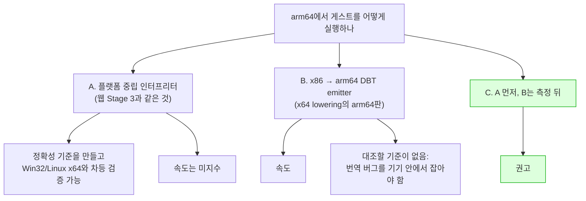
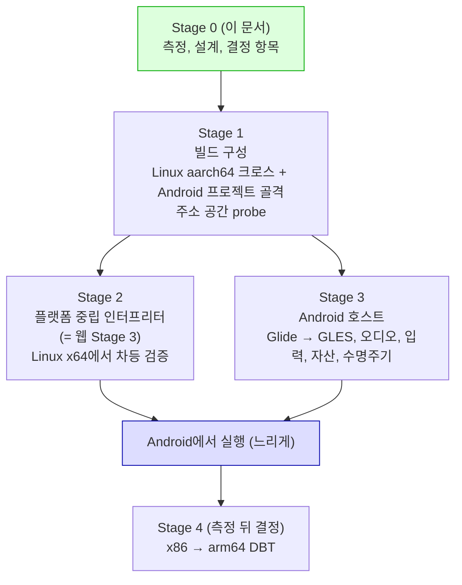
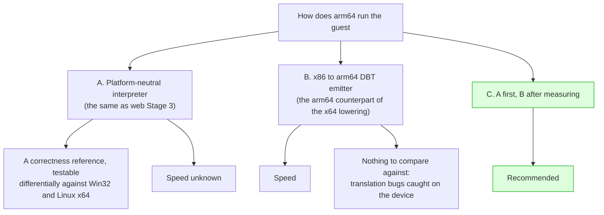

# Android arm64 실행 설계, Stage 0: 준비와 결정 사항

## 한국어

### 배경

목표는 **Android arm64(arm64-v8a) 기기에서 원본 게임이 실행되는 것**입니다. 이 문서는 그 목표
전체의 구조를 정하고, 시작 전에 사용자가 결정해야 하는 항목을 이름 붙이는 것까지를 범위로
합니다. 코드는 바꾸지 않았고, 측정만 했습니다. Task 501(Linux)과 Task 513(웹)이 각각 이식 전에
한 것과 같은 절차입니다.

관련 문서:

* [웹 실행 설계 513](20260828-513-web-wasm-execution.md): x86이 아닌 첫 호스트를 다룬 설계.
  이 문서의 결정 여러 개가 거기서 이어집니다.
* [Linux x64 실행 모델 546](20260831-546-linux-x64-aot-dbt-execution-model.md): 게스트 32비트
  계약과 64비트 호스트 포인터를 분리한 설계. arm64도 64비트 호스트이므로 그 결정을 그대로
  받습니다.
* [게스트 명령 census 514](../work-logs/20260828-514-guest-instruction-census.md): 인터프리터가
  구현해야 하는 명령 형태의 수.
* [Android arm64 이식 frontier](../analysis/android-arm64-port-frontier.md): 이 설계의 측정과
  확인 상태를 유지하는 문서.

### 측정: 지금 서 있는 것

이 세션의 컨테이너(x86-64 Ubuntu 24.04)에 `g++-aarch64-linux-gnu` 13.2를 설치하고, 저장소를
수정하지 않은 채 aarch64-linux-gnu 크로스 configure와 `repiu_exe` 빌드를 시도했습니다. 절차와
toolchain 파일은 frontier 문서의 재현 절에 있습니다.

| 측정 | 결과 |
|---|---:|
| CMake configure (SDL3 3.4.10 headless, spdlog, libchdr, Zydis, imgui, minimp3) | **통과**, 38초 |
| `repiu_exe` 오브젝트 시도 | 183 |
| **컴파일 성공** | **178** |
| 실패 | **5** |
| 코어 소스 수정 | **0줄** |
| 저장소 안 `__aarch64__` 분기 | 1곳 (`build_identity.cpp`, 이름표만) |
| `__ANDROID__` 분기 | 0곳 |

실패한 다섯은 전부 호스트 CPU에 묶인 파일입니다.

| 실패 파일 | 원인 |
|---|---|
| `src/platform/linux/guest_cpu_context.cpp` | AArch64 `mcontext_t`에는 `gregs`가 없고 `regs`가 있음. ucontext에서 x86 레지스터를 꺼내는 코드 |
| `aot_dbt_return_thunk_x64.S`, `aot_dbt_glide_gate_thunk_x64.S`, `guest_stack_recover_x64.S`, `guest_entry_x64.S` | Intel 문법 x86-64 어셈블리. CMake가 `CMAKE_SIZEOF_VOID_P GREATER 4`만 보고 포함시킴 |

**실행 엔진 전체(`execution_trampoline.cpp` 9,061줄 포함)가 aarch64에서 컴파일됩니다.** 웹 빌드가
엔진을 제외했던 것과 다릅니다. Linux x64 이식(Tasks 546~747)이 x86 전용 부분을 전부 `#if`로
가르고 나머지 호스트에는 "지원하지 않음" 가지를 남겼기 때문입니다. 그 가지가 실제로 하는 일은
`IsDirectX86ExecutionSupported()`와 `IsCodeCacheEntrySupported()`를 모두 거짓으로 답해
`RunExecutionThread`가 "minimal original entry execution requires a 32-bit host"로 끝나는 것입니다.
**즉 컴파일은 되지만 게스트는 한 명령도 실행되지 않으며, 그것이 지금의 fail-closed입니다.**

컴파일러가 잡지 못하는 것도 셌습니다.

| 항목 | 값 | 어디 |
|---|---:|---|
| 아키텍처 매크로 분기 | 36 / 13 / 13 / 7 | `execution_trampoline.cpp` / `linux/guest_cpu_context.cpp` / `linux/fault_handler.cpp` / `aot_code_cache.cpp` 등 |
| 게스트 주소를 호스트 포인터로 그대로 쓰는 identity cast | 26 | `src/hle`, `src/runtime`, `src/engine` |
| 데스크톱 OpenGL 고정 기능 호출 | **41** | `glide_opengl_backend.cpp` (`glBegin`/`glEnd` 4쌍, `glTexCoord4f` 8, `glVertex3f` 7, `glDrawBuffer`/`glReadBuffer` 7, `glOrtho` 3, `glAlphaFunc` 2 등) |
| GLSL 버전 | `#version 110` 2개, 런처 `#version 130` 1개 | `glide_opengl_shader.cpp`, `launcher_ui.cpp` |
| bionic에서 확인이 필요한 호출 | `pthread_timedjoin_np`, `process_vm_readv`, `posix_spawn`, `perf_event_open`, `MAP_FIXED_NOREPLACE`, `SIGRTMIN`, `/proc/self/maps` | `host_thread.cpp`, `linux/safe_memory_copy.cpp`, `linux/host_process.cpp`, `linux/fault_handler.cpp`, `linux/virtual_memory.cpp` |

SDL3 쪽 사실은 configure가 받아온 소스에서 읽었습니다. Android 최소 API 21, 동봉된
`android-project` 템플릿은 NDK 28.2, compileSdk 35, `arm64-v8a`, CMake externalNativeBuild입니다.
Android 문서는 16 KB 페이지를 Android 15부터 지원하고, NDK r28부터 16 KB 정렬이 기본이며, Google
Play가 2027-02-01부터 API 35 이상을 대상으로 하는 앱 업데이트에 16 KB 지원을 요구한다고 적고
있습니다([Android 16 KB page sizes](https://developer.android.com/guide/practices/page-sizes)).

### 결정 1: Android arm64는 Linux 이식이 아니라 웹과 같은 부류입니다

Linux 이식(Tasks 501~512)은 같은 실행 모델을 다른 OS에 올린 것이었고, Linux x64(Tasks 546~747)는
게스트 32비트 코드를 **같은 ISA 가족의 64비트 인코딩으로** 다시 써서 실행한 것이었습니다. 후자가
가능했던 이유는 32비트 인코딩의 대부분이 long mode에서 **바이트 그대로**(`kIdenticalBytes`) 성립하고,
갈리는 것만 재인코딩하면 됐기 때문입니다.

arm64에는 그 지름길이 없습니다. **identical bytes가 0%입니다.** 게스트 명령 하나하나의 의미를
읽어 다른 무언가로 바꿔야 하고, 그것이 웹 설계 513이 "결정 2"에서 이름 붙인 오른쪽 열, 즉
**이 프로젝트가 아직 한 번도 하지 않은 일**입니다.

| backend | 서 있는 것 | arm64 |
|---|---|---|
| `legacy` | 트랩 플래그 단일 스텝, 하드웨어 폴트 전달, 게스트 바이트 직접 실행 | **없음** |
| `dynamic` (i386) | RX 코드 캐시에 게스트 바이트 복사 | **없음** |
| `dynamic` (x64) | 게스트 바이트 대부분 복사, 일부 long mode 재인코딩 | **없음**: 복사할 수 있는 바이트가 없음 |

따라서 웹과 마찬가지로 **호스트 CPU가 게스트 명령을 직접 실행하지 않는 backend**가 필요합니다.
후보는 셋입니다.

**권고는 C입니다.** 이유는 웹 설계와 같습니다. 인터프리터는 플랫폼 중립 C++이므로 **Linux x64에서
기존 backend와 나란히 돌려** 같은 게스트 상태에서 레지스터, 플래그, 메모리를 대조할 수 있습니다.
Linux x64는 v0.0.194에서 디스크가 있는 16개 롬셋을 모두 실행하므로 대조 기준으로 충분합니다. 그
기준 없이 arm64 DBT를 바로 쓰면 번역 버그를 Android 기기 안에서 잡아야 하고, 그것은 Linux 이식이
이미 비싸게 배운 함정입니다.

B가 필요한지는 **측정 뒤에** 정합니다. 게스트는 1999년의 DOS 게임이고 현대 arm64 코어는 그 시대
CPU보다 수십 배 빠르므로, 인터프리터로 플레이 가능한 속도가 나올 가능성이 있습니다. 이것은
**추정**이고, Stage 2가 끝나면 숫자로 바뀝니다.

### 결정 2: 인터프리터는 웹 Stage 3과 하나입니다

웹 frontier는 Stage 3(플랫폼 중립 인터프리터)을 다음 단위로 지목한 채 보류 중입니다. Android arm64가
필요로 하는 것이 정확히 그것입니다. **두 벌을 만들지 않습니다.** 하나의 인터프리터를 두 소비자가
씁니다.

| | 웹(wasm32) | Android arm64 |
|---|---|---|
| 포인터 폭 | 4 | **8** (x64와 같음) |
| 파일 I/O | Worker 안 OPFS만 동기 | 일반 POSIX |
| 스레드 | Worker, 정지와 컨텍스트 조회 불가 | pthread |
| 페이지 보호 | 없음 | 있음 (`mprotect`) |
| RX 메모리 | 없음 | 있음 (앱 프로세스의 `execmem`, 확인 필요) |

이 표가 말하는 것은 **arm64가 인터프리터를 처음 실행하는 데 더 쉬운 호스트**라는 사실입니다. 웹
설계의 결정 7(Worker 제약)은 arm64에는 해당하지 않지만, 인터프리터의 실행 루프는 두 쪽 모두에
맞는 모양이어야 합니다. 그 모양을 정하는 것은 Stage 2 설계이고, 이 문서는 "두 소비자를 전제로
설계한다"까지만 정합니다.

웹 frontier가 인터프리터 전에 정해야 한다고 한 둘 중 **x87 표현**은 arm64에도 그대로 해당합니다.
AArch64에는 80비트 부동소수점이 없고, `long double`은 소프트웨어 binary128입니다. Task 514가 80비트
메모리 피연산자 14곳과 제어 워드 접근 14회를 확인했으므로 `double`로 줄이는 것은 값을 잃습니다.
후보는 소프트웨어 80비트(예: Berkeley SoftFloat 3, BSD-3), `double`, binary128 뒤 80비트 반올림입니다.
**이 결정은 사용자에게 올립니다**(아래 결정 목록 3).

### 결정 3: 게스트 주소 = 호스트 주소를 유지하고, 그 전제를 기기에서 먼저 잽니다

Task 551이 x64에서 확정한 것과 같습니다. HLE 계층은 게스트 선형 주소를 호스트 포인터로 **그대로**
씁니다(`guest_memory_access.h`의 API가 `void*`를 받고, identity cast 26곳). 게스트 relocation은 그
주소를 게스트 메모리 안에 써 넣습니다. 그러므로 게스트 arena(PIU 프로파일 134 MB)는 호스트 주소
공간의 **하위 4 GiB, `0x00010000`부터** 놓여야 합니다.

Android 64비트 프로세스에서 이 배치가 성립하는지는 **미확정**입니다. 커널의 `mmap_min_addr`는 보통
`0x8000`이므로 `0x10000`은 그 위이지만, zygote가 미리 매핑한 것과 ART가 차지한 구간은 기기와
버전마다 다릅니다. Stage 1의 첫 산출물은 이것을 재는 probe 앱입니다. 4 KB와 16 KB 페이지 기기
모두에서 잽니다.

성립하지 않으면 대안은 base + offset 주소 변환이고, 그것은 HLE 계층 전체가 포인터를 다루는 방식을
바꾸는 큰 구조 변경입니다. **그래서 먼저 잽니다.**

### 결정 4: 단계

| 단계 | 내용 | 산출물 | 게임 실행 |
|---|---|---|---|
| **0 (이 문서)** | 크로스 컴파일 측정, 설계, 결정 항목 | 이 설계, frontier, kb | 아니오 |
| 1 | CMake 아키텍처 술어, aarch64에서 성립하지 않는 헤더의 **명시적 실패 stub**, `scripts/build_linux_aarch64.sh`, `repiu_core_probe`와 `repiu_instruction_census`를 aarch64에서 실행, Android Gradle 골격(`arm64-v8a`, SDLActivity), 주소 공간 probe | aarch64에서 빌드와 probe 통과, 기기에서 `0x00010000` 배치 답 | 아니오 |
| 2 | 플랫폼 중립 인터프리터 backend. 웹 Stage 3과 같은 코드 | Linux x64에서 차등 검증을 통과하는 정확성 기준 | Linux aarch64에서 느리게 예 |
| 3 | Android 호스트: Glide GLSL backend의 GLES 3.0 이식, SDL Android 오디오, 입력 모델, 자산 가져오기(SAF), 앱 수명주기, logcat | 기기에서 화면과 소리 | 예 |
| 4 | x86 → arm64 DBT emitter | 속도 | 예 |

Stage 3의 GLES 이식은 Stage 2와 독립이며 데스크톱 Linux에서도 검증할 수 있습니다(Mesa의 GLES).
둘은 병행 가능합니다.

**Stage 1의 산출물은 게임을 실행하지 않습니다.** Task 501과 513이 그랬던 것과 같은 이유입니다.
빌드 체계와 코어 이식성을 실제 타깃에서 먼저 증명합니다. Stage 1은 Android 이전에 **Linux aarch64
크로스 빌드**를 먼저 세우는 것을 권고합니다. Android에서는 디버거 연결, 로그, 파일 접근이 모두
비싸고, 인터프리터의 정확성 문제는 Linux에서 잡는 것이 몇 배 싸기 때문입니다. 실행 환경은 실제
aarch64 보드 또는 QEMU user-mode입니다.

### 결정 5: 플랫폼 헤더가 arm64와 Android에서 성립하는가

웹 설계의 표를 arm64와 Android에 대해 다시 채웠습니다.

| 헤더 | Linux aarch64 | Android arm64 | 비고 |
|---|---|---|---|
| `fault_handler.h` | 성립 (signal) | 성립하나 ART가 `libsigchain`으로 핸들러를 가로챌 수 있음 | 인터프리터 경로에는 **불필요**. 인터프리터가 주소를 스스로 검사 |
| `guest_cpu_context.h` | 호스트 컨텍스트로는 **무의미** | 같음 | 구조체 자체는 cpu_emul의 게스트 레지스터 파일이므로 유지. ucontext 변환만 빠짐 |
| `guest_stack_switch.h` | **불가** | **불가** | x86 어셈블리 |
| `virtual_memory.h` | 성립 | 성립. `MAP_FIXED_NOREPLACE`, 16 KB 페이지 확인 필요 | `SystemPageSize()`를 이미 쓰므로 4096 상수는 없어야 함 (Stage 1에서 검사) |
| `host_process.h` | 성립 (`posix_spawn`) | **불가**: 앱은 GUI 자식 프로세스를 다시 띄울 수 없음 | Task 500의 재실행(GPU 드라이버 주소 선점 회피)을 Android에서 다른 방법으로 풀어야 함 |
| `host_time.h` | 성립 (`steady_clock` 폴백) | 같음 | `rdtsc` 귀속 측정은 cycle 단위가 바뀜 |
| `host_thread.h` | 성립 | `pthread_timedjoin_np` 확인 필요 | bionic 헤더 대조 |
| `safe_memory_copy.h` | 성립 (`process_vm_readv`) | 확인 필요 | 인터프리터 경로에서는 범위 검사로 대체 가능 |
| `worker_signal.h`, `host_environment.h`, `host_error_stream.h`, `atomic_ops.h` | 성립 | 성립. 표준 오류는 logcat으로 보내야 보임 | |

### 결정 6: 플랫폼 디렉터리

AGENTS.md는 플랫폼 종속 코드를 `src/platform/{win32,linux,web}/`에 둡니다. 여기에 둘을 더합니다.

* `src/platform/linux/`에 **아키텍처 하위 분기**를 두지 않고, aarch64에서 성립하지 않는 파일은
  CMake가 `CMAKE_SYSTEM_PROCESSOR`로 제외합니다. x86 전용 `.S`와 ucontext 변환이 그것입니다.
* `src/platform/android/`: Android에서만 다른 것(logcat 출력, 자산 경로, `host_process` stub,
  수명주기). 나머지 POSIX 구현은 웹이 그랬듯 `src/platform/linux/`의 것을 그대로 씁니다.
* 인터프리터는 플랫폼 코드가 아니므로 `src/engine/` 아래 전용 디렉터리에 둡니다. 이름은 Stage 2
  설계가 정합니다.

이 규칙은 승인되면 AGENTS.md의 구현 규칙에 반영합니다.

### 사용자가 결정할 항목

아래는 **Stage 1을 시작하기 전에** 답이 필요한 것과, Stage 2 이전까지 답이 필요한 것입니다. 각
항목의 첫 줄이 권고입니다.

| # | 결정 | 권고 | 왜 지금인가 |
|---|---|---|---|
| 1 | **실행 방식**: A 인터프리터 먼저 / B arm64 DBT 바로 / C A 뒤 측정하고 B | **C** | 결정 1. 전체 구조를 정합니다 |
| 2 | **웹 Stage 3 보류 해제**: 인터프리터를 웹과 공유 단위로 다시 열 것인가, Linux x64 축보다 우선인가 | 공유 단위로 열되 우선순위는 사용자가 정함 | 결정 2. TODO의 활성 항목이 바뀝니다 |
| 3 | **x87 표현**: 소프트웨어 80비트 / `double` / binary128 뒤 반올림 | 소프트웨어 80비트 (Berkeley SoftFloat 3, BSD-3) | Stage 2 이전. 나중에 바꾸면 인터프리터 재작성 |
| 4 | **게스트 메모리 모델**: identity 유지(기기에서 먼저 측정) / base + offset | identity 유지, Stage 1 probe로 확정 | 결정 3. 결과에 따라 Stage 2 규모가 달라짐 |
| 5 | **개발 호스트 순서**: Linux aarch64 크로스 빌드 먼저 / Android만 | Linux aarch64 먼저 | Stage 1 범위 |
| 6 | **ABI 범위**: `arm64-v8a`만 / `armeabi-v7a` 포함 | arm64만 | 32비트 ARM은 별도 lowering과 메모리 배치가 필요 |
| 7 | **렌더러**: Glide GLSL backend의 GLES 3.0 이식 / SDL_GPU 재작성 | GLES 3.0 이식 (41곳 고정 기능 제거, GLSL ES 3.00) | Stage 3. Android에는 데스크톱 GL이 없음 |
| 8 | **Android 최소 API와 페이지 크기**: minSdk, NDK 버전, 16 KB 지원 | minSdk 28 이상, NDK r28 이상, 16 KB 기본 | Stage 1 골격의 `build.gradle` |
| 9 | **자산 가져오기**: SAF로 골라 앱 저장소에 복사 / fd로 제자리 읽기 | 복사 (CHD 173~484 MB, 기기당 한 번) | Stage 3. libchdr가 경로를 여는 방식과 mount 추출 경로가 여기 걸림 |
| 10 | **입력 모델**: 터치 오버레이 / 게임패드 / USB 댄스패드(HID) | 셋 중 Stage 3 첫 범위를 하나 고름 | 현재 입력은 SDL 키보드 scancode 바인딩 |
| 11 | **빌드와 CI**: Gradle externalNativeBuild 하나 / 별도 CMake toolchain 스크립트 병행, Linux aarch64 CI 작업 추가 여부 | 둘 병행, CI에 크로스 컴파일 작업 추가 | 현재 CI는 Windows만 |
| 12 | **성능 수용 기준**: 어느 기기 등급에서 몇 fps가 나오면 Stage 4를 생략하는가 | 중급 기기 60 fps를 기준으로 Stage 2 뒤 측정 | Stage 4의 존재 여부 |
| 13 | **헌장 갱신**: `PROJECT_CHARTER.md`의 "Win32/Linux/Web"에 Android를 더할 것인가 | 승인과 함께 갱신 | 큰 방향성 변경은 헌장에 남김 |

### 미확정: 확인하지 않고 넘어가는 것들

| 항목 | 왜 지금 정하지 않는가 |
|---|---|
| 하위 4 GiB 배치가 Android 앱 프로세스에서 성립하는가 | 기기가 없습니다. Stage 1 probe |
| bionic의 `pthread_timedjoin_np`, `process_vm_readv`, `posix_spawn` API 수준 | 이 컨테이너에서 bionic 소스에 닿지 못했습니다. NDK 헤더로 확인 |
| 앱 프로세스의 RX 익명 메모리(`execmem`) 허용 | 인터프리터에는 불필요, Stage 4에만 해당 |
| 인터프리터 속도 | Stage 2 뒤 측정 |
| ART `libsigchain`과 자체 signal 핸들러의 공존 | 인터프리터 경로에서는 폴트 전달이 필요 없어 미룸 |
| CD 오디오와 MP3의 Android 오디오 지연 | Stage 3 |

### 범위 밖

* 게임 로직 재구현. 헌장 그대로입니다.
* DOSBox 계열 코드 통합.
* Stage 1~4의 구현. 각각 별도 설계와 작업 지시로 진행합니다.
* iOS. JIT 금지와 앱 모델이 다르며, 이 설계는 다루지 않습니다.

---

## English

### Background

The goal is **the original game running on Android arm64 (arm64-v8a) devices**. This document fixes
the structure of that whole goal and names the items the user must decide before work starts. No code
was changed; measurements were taken. This is the same procedure Task 501 (Linux) and Task 513 (web)
followed before their ports.

Related documents:

* [Web execution design 513](20260828-513-web-wasm-execution.md): the design for the first non-x86
  host. Several decisions here continue from it.
* [Linux x64 execution model 546](20260831-546-linux-x64-aot-dbt-execution-model.md): the split
  between the 32-bit guest contract and 64-bit host pointers. arm64 is a 64-bit host too and inherits
  it.
* [Guest instruction census 514](../work-logs/20260828-514-guest-instruction-census.md): the number
  of instruction forms an interpreter has to implement.
* [Android arm64 port frontier](../analysis/android-arm64-port-frontier.md): the document that keeps
  this design's measurements and confirmation status.

### Measured: what stands today

In this session's container (x86-64 Ubuntu 24.04) `g++-aarch64-linux-gnu` 13.2 was installed and an
aarch64-linux-gnu cross configure and `repiu_exe` build were attempted without modifying the
repository. The procedure and the toolchain file are in the frontier's reproduction section.

| Measurement | Result |
|---|---:|
| CMake configure (SDL3 3.4.10 headless, spdlog, libchdr, Zydis, imgui, minimp3) | **passes**, 38 s |
| `repiu_exe` objects attempted | 183 |
| **compiled** | **178** |
| failed | **5** |
| core sources modified | **0** |
| `__aarch64__` branches in the repository | 1 (`build_identity.cpp`, a label only) |
| `__ANDROID__` branches | 0 |

All five failures are files tied to the host CPU.

| Failing file | Cause |
|---|---|
| `src/platform/linux/guest_cpu_context.cpp` | AArch64 `mcontext_t` has `regs`, not `gregs`. This is the code that lifts x86 registers out of a ucontext |
| `aot_dbt_return_thunk_x64.S`, `aot_dbt_glide_gate_thunk_x64.S`, `guest_stack_recover_x64.S`, `guest_entry_x64.S` | Intel-syntax x86-64 assembly. CMake includes them on `CMAKE_SIZEOF_VOID_P GREATER 4` alone |

**The whole execution engine, `execution_trampoline.cpp`'s 9,061 lines included, compiles for
aarch64.** That differs from the web build, which excluded the engine. The Linux x64 port (Tasks
546 to 747) fenced every x86-only part behind `#if` and left an "unsupported" branch for every other
host. What that branch actually does is answer false from both `IsDirectX86ExecutionSupported()` and
`IsCodeCacheEntrySupported()`, so `RunExecutionThread` ends with "minimal original entry execution
requires a 32-bit host". **So it compiles, but not one guest instruction runs, and that is today's
fail-closed.**

What the compiler cannot catch was counted as well.

| Item | Value | Where |
|---|---:|---|
| Architecture-macro branches | 36 / 13 / 13 / 7 | `execution_trampoline.cpp` / `linux/guest_cpu_context.cpp` / `linux/fault_handler.cpp` / `aot_code_cache.cpp` and others |
| Identity casts using a guest address as a host pointer | 26 | `src/hle`, `src/runtime`, `src/engine` |
| Desktop OpenGL fixed-function calls | **41** | `glide_opengl_backend.cpp` (4 `glBegin`/`glEnd` pairs, 8 `glTexCoord4f`, 7 `glVertex3f`, 7 `glDrawBuffer`/`glReadBuffer`, 3 `glOrtho`, 2 `glAlphaFunc`, more) |
| GLSL versions | 2 × `#version 110`, launcher `#version 130` | `glide_opengl_shader.cpp`, `launcher_ui.cpp` |
| Calls to verify against bionic | `pthread_timedjoin_np`, `process_vm_readv`, `posix_spawn`, `perf_event_open`, `MAP_FIXED_NOREPLACE`, `SIGRTMIN`, `/proc/self/maps` | `host_thread.cpp`, `linux/safe_memory_copy.cpp`, `linux/host_process.cpp`, `linux/fault_handler.cpp`, `linux/virtual_memory.cpp` |

The SDL3 facts were read from the source the configure fetched. The minimum Android API is 21, and
the bundled `android-project` template uses NDK 28.2, compileSdk 35, `arm64-v8a` and CMake
externalNativeBuild. Android's documentation states that 16 KB pages are supported from Android 15,
that NDK r28 aligns to 16 KB by default, and that Google Play requires 16 KB support from 2027-02-01
for app updates targeting API 35 or higher
([Android 16 KB page sizes](https://developer.android.com/guide/practices/page-sizes)).

### Decision 1: Android arm64 is the web's kind of problem, not the Linux port's

The Linux port (Tasks 501 to 512) put the same execution model on another OS. Linux x64 (Tasks 546
to 747) rewrote the guest's 32-bit code **into 64-bit encodings of the same ISA family**. The latter
was possible because most 32-bit encodings hold **byte for byte** in long mode (`kIdenticalBytes`)
and only the divergent ones needed re-encoding.

arm64 has no such shortcut. **Zero percent of the bytes are identical.** Every guest instruction's
meaning has to be read and turned into something else, which is the right-hand column that web design
513 named in its Decision 2: **the one thing this project has never done.**

| Backend | Stands on | On arm64 |
|---|---|---|
| `legacy` | Trap-flag single-stepping, hardware fault delivery, direct execution of guest bytes | **absent** |
| `dynamic` (i386) | Guest bytes copied into an RX code cache | **absent** |
| `dynamic` (x64) | Most guest bytes copied, some re-encoded for long mode | **absent**: nothing can be copied |

So, as on the web, a **backend in which the host CPU does not execute guest instructions** is needed.
There are three candidates.

**The recommendation is C**, for the same reason the web design gave. The interpreter is
platform-neutral C++, so it can run **alongside the existing backends on Linux x64** and compare
registers, flags and memory from the same guest state. Linux x64 runs all 16 ROM sets with a disc as
of v0.0.194, so it is a sufficient reference. Writing an arm64 DBT without that reference means
catching translation bugs inside an Android device, which is the trap the Linux port already paid for.

Whether B is needed is settled **after measuring**. The guest is a DOS game from 1999 and a modern
arm64 core is tens of times faster than that era's CPUs, so an interpreter may reach playable speed.
That is an **estimate**, and Stage 2 turns it into a number.

### Decision 2: the interpreter is one with web Stage 3

The web frontier is on hold with Stage 3, the platform-neutral interpreter, named as its next unit.
Android arm64 needs exactly that. **Two copies will not be written.** One interpreter, two consumers.

| | Web (wasm32) | Android arm64 |
|---|---|---|
| Pointer width | 4 | **8** (same as x64) |
| File I/O | synchronous only through OPFS inside a Worker | ordinary POSIX |
| Threads | Workers, no suspend and no context query | pthread |
| Page protection | none | present (`mprotect`) |
| RX memory | none | present (`execmem` of an app process, to verify) |

What this table says is that **arm64 is the easier host on which to run the interpreter first**. Web
Decision 7 (the Worker constraint) does not apply to arm64, but the interpreter's execution loop has
to have a shape that suits both. That shape is Stage 2's design; this document only settles "design
for two consumers".

Of the two things the web frontier says must be settled before the interpreter, the **x87
representation** applies to arm64 unchanged. AArch64 has no 80-bit floating point, and `long double`
is software binary128. Task 514 confirmed fourteen 80-bit memory operands and fourteen control-word
accesses, so reducing to `double` loses values. The candidates are software 80-bit (for example
Berkeley SoftFloat 3, BSD-3), `double`, and binary128 followed by rounding to 80 bits. **This
decision goes to the user** (item 3 in the list below).

### Decision 3: keep guest address = host address, and measure that premise on a device first

This is what Task 551 settled for x64. The HLE layer uses guest linear addresses **as** host pointers
(the API in `guest_memory_access.h` takes `void*`, and there are 26 identity casts). Guest relocation
writes those addresses into guest memory. So the guest arena (134 MB for the PIU profile) has to sit
in the **low 4 GiB of the host address space, from `0x00010000`**.

Whether that placement holds in an Android 64-bit process is **unresolved**. The kernel's
`mmap_min_addr` is usually `0x8000`, so `0x10000` is above it, but what the zygote pre-maps and what
ART occupies vary by device and version. Stage 1's first deliverable is a probe app that measures
this, on both 4 KB and 16 KB page devices.

If it does not hold, the alternative is base-plus-offset address translation, which changes how the
whole HLE layer handles pointers, a large structural change. **Which is why it is measured first.**

### Decision 4: stages

| Stage | Content | Deliverable | Game runs |
|---|---|---|---|
| **0 (this document)** | Cross-compile measurement, design, decision items | This design, the frontier, the kb | no |
| 1 | A CMake architecture predicate, **explicitly failing stubs** for the headers that do not hold on aarch64, `scripts/build_linux_aarch64.sh`, `repiu_core_probe` and `repiu_instruction_census` running on aarch64, an Android Gradle skeleton (`arm64-v8a`, SDLActivity), the address-space probe | Build and probes pass on aarch64; the device answers whether `0x00010000` placement holds | no |
| 2 | The platform-neutral interpreter backend, the same code as web Stage 3 | A correctness reference that passes differential testing on Linux x64 | slowly, on Linux aarch64 |
| 3 | The Android host: a GLES 3.0 port of the Glide GLSL backend, SDL Android audio, the input model, asset import (SAF), app lifecycle, logcat | Picture and sound on a device | yes |
| 4 | An x86 to arm64 DBT emitter | Speed | yes |

Stage 3's GLES port is independent of Stage 2 and can be verified on desktop Linux (Mesa's GLES).
The two can run in parallel.

**Stage 1's deliverable does not run the game**, for the same reason Tasks 501 and 513 did not: the
build system and the core's portability are proven on the real target first. Stage 1 recommends
standing up a **Linux aarch64 cross build** before Android. On Android, debugger attachment, logs and
file access are all expensive, and the interpreter's correctness problems are several times cheaper
to catch on Linux. The execution environment is a real aarch64 board or QEMU user mode.

### Decision 5: do the platform headers hold on arm64 and Android

The web design's table, filled in again for arm64 and Android.

| Header | Linux aarch64 | Android arm64 | Note |
|---|---|---|---|
| `fault_handler.h` | holds (signals) | holds, but ART may intercept handlers through `libsigchain` | **unnecessary** on the interpreter path; the interpreter checks addresses itself |
| `guest_cpu_context.h` | **meaningless** as a host context | same | The struct itself stays, as cpu_emul's guest register file. Only the ucontext conversion goes |
| `guest_stack_switch.h` | **impossible** | **impossible** | x86 assembly |
| `virtual_memory.h` | holds | holds; `MAP_FIXED_NOREPLACE` and 16 KB pages to verify | `SystemPageSize()` is already used, so no 4096 constant should remain (checked in Stage 1) |
| `host_process.h` | holds (`posix_spawn`) | **impossible**: an app cannot relaunch a GUI child process | Task 500's relaunch (avoiding the GPU driver's address-space claim) needs another answer on Android |
| `host_time.h` | holds (`steady_clock` fallback) | same | `rdtsc` attribution changes its cycle unit |
| `host_thread.h` | holds | `pthread_timedjoin_np` to verify | check against bionic headers |
| `safe_memory_copy.h` | holds (`process_vm_readv`) | to verify | replaceable by a bounds check on the interpreter path |
| `worker_signal.h`, `host_environment.h`, `host_error_stream.h`, `atomic_ops.h` | hold | hold; stderr must be routed to logcat to be seen | |

### Decision 6: platform directories

AGENTS.md puts platform-specific code under `src/platform/{win32,linux,web}/`. Two things are added.

* No **architecture sub-branch** inside `src/platform/linux/`. Files that do not hold on aarch64 are
  excluded by CMake on `CMAKE_SYSTEM_PROCESSOR`: the x86-only `.S` files and the ucontext conversion.
* `src/platform/android/`: what differs only on Android (logcat output, asset paths, the
  `host_process` stub, lifecycle). The remaining POSIX implementations are used from
  `src/platform/linux/` unchanged, as the web build does.
* The interpreter is not platform code and lives in its own directory under `src/engine/`. Stage 2's
  design names it.

Once approved, this rule is reflected in AGENTS.md's implementation rules.

### Items for the user to decide

Below are the items that need an answer **before Stage 1 starts**, and those needed before Stage 2.
The first line of each is the recommendation.

| # | Decision | Recommendation | Why now |
|---|---|---|---|
| 1 | **Execution approach**: A interpreter first / B arm64 DBT directly / C A, then measure, then B | **C** | Decision 1. It fixes the whole structure |
| 2 | **Lifting the web Stage 3 hold**: reopen the interpreter as a shared unit, and does it outrank the Linux x64 axis | Reopen as a shared unit; the user sets the priority | Decision 2. TODO's active items change |
| 3 | **x87 representation**: software 80-bit / `double` / binary128 then rounding | Software 80-bit (Berkeley SoftFloat 3, BSD-3) | Before Stage 2. Changing it later rewrites the interpreter |
| 4 | **Guest memory model**: keep identity (measure on a device first) / base + offset | Keep identity, settle with the Stage 1 probe | Decision 3. The result changes Stage 2's size |
| 5 | **Development host order**: Linux aarch64 cross build first / Android only | Linux aarch64 first | Stage 1 scope |
| 6 | **ABI scope**: `arm64-v8a` only / include `armeabi-v7a` | arm64 only | 32-bit ARM needs its own lowering and memory placement |
| 7 | **Renderer**: GLES 3.0 port of the Glide GLSL backend / an SDL_GPU rewrite | GLES 3.0 port (remove the 41 fixed-function sites, GLSL ES 3.00) | Stage 3. Android has no desktop GL |
| 8 | **Android minimum API and page size**: minSdk, NDK version, 16 KB support | minSdk 28 or higher, NDK r28 or higher, 16 KB by default | Stage 1 skeleton's `build.gradle` |
| 9 | **Asset import**: pick through SAF and copy into app storage / read in place through an fd | Copy (CHDs are 173 to 484 MB, once per device) | Stage 3. libchdr's path-based open and the mount extraction path hang on this |
| 10 | **Input model**: touch overlay / gamepad / USB dance pad (HID) | Pick one as Stage 3's first scope | Input today is SDL keyboard scancode bindings |
| 11 | **Build and CI**: Gradle externalNativeBuild alone / a separate CMake toolchain script alongside; add a Linux aarch64 CI job | Both, and add a cross-compile job to CI | CI today is Windows only |
| 12 | **Performance acceptance**: which device tier at what fps lets Stage 4 be skipped | 60 fps on a mid-range device, measured after Stage 2 | Whether Stage 4 exists |
| 13 | **Charter update**: add Android to `PROJECT_CHARTER.md`'s "Win32/Linux/Web" | Update together with approval | Large direction changes go in the charter |

### Unresolved: carried across without confirmation

| Item | Why it is not settled now |
|---|---|
| Whether low-4 GiB placement holds in an Android app process | No device. Stage 1 probe |
| API levels of bionic's `pthread_timedjoin_np`, `process_vm_readv`, `posix_spawn` | This container could not reach the bionic source. Check against NDK headers |
| RX anonymous memory (`execmem`) in an app process | Not needed for the interpreter, Stage 4 only |
| Interpreter speed | Measured after Stage 2 |
| Coexistence of ART's `libsigchain` with our own signal handlers | Deferred: the interpreter path needs no fault delivery |
| Android audio latency for CD audio and MP3 | Stage 3 |

### Out of scope

* Reimplementing the game logic. Exactly as the charter says.
* Integrating DOSBox-family code.
* Implementing Stages 1 through 4. Each proceeds under its own design and work order.
* iOS. Its JIT prohibition and app model differ, and this design does not cover it.
