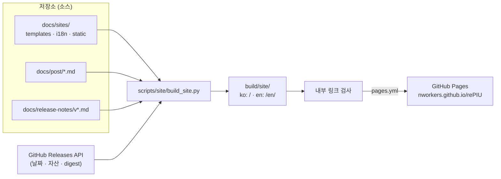
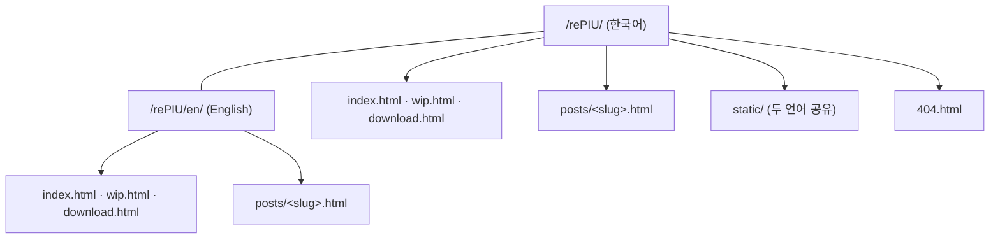
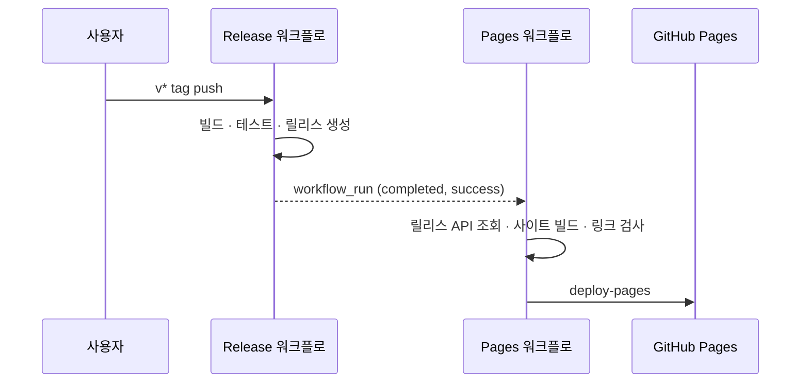

# Task 756: GitHub Pages 프로젝트 사이트

## 한국어

### 배경

rePIU에는 저장소 README 외에 프로젝트를 소개하고 릴리스를 받아 갈 공개 페이지가 없다. 사용자 요구는
다음과 같다.

* 검정 바탕에 8비트 DOS 레트로 스타일, 무난한 디자인.
* 세 가지 내용: 프로젝트 소개, WIP(블로그 글과 릴리스 타임라인만), 다운로드.
* 소스는 `docs/sites/` 아래에 둔다. GitHub Actions를 사용해도 된다.
* 기본 주소(`https://nworkers.github.io/rePIU/`)를 쓴다.
* 한국어와 영어를 모두 지원한다.

확인한 현재 상태:

* 저장소는 PUBLIC이고 Pages는 아직 켜져 있지 않다.
* `docs/`에는 설계·작업 지시·작업 로그 등 750개가 넘는 내부 문서가 있다.
* `docs/post/`의 블로그 글 6편과 `docs/release-notes/`의 릴리스 노트는 모두 **한국어 전문 → `---` →
  영어 전문** 구조다.
* GitHub 릴리스는 `release.yml`이 `GITHUB_TOKEN`으로 만들며, 자산은 `rePIU-v<ver>-win32.zip`과
  `openwatcom-samples-v<ver>.zip`이다. 릴리스 본문은 노트 파일이 있으면 그 파일, 없으면 자동 생성이다.

### 설계



#### 결정 1 — 배포는 Actions, 소스는 `docs/sites/`

Pages의 "브랜치의 `/docs` 폴더에서 배포"를 쓰면 Jekyll이 `docs/` 전체를 공개 페이지로 만든다. 내부 문서가
섞이지 않도록 Pages 소스를 **GitHub Actions**로 두고, 빌드 결과(`build/site/`)만 artifact로 올린다.
`build/`는 이미 `.gitignore`에 있어 결과물이 커밋되지 않는다.

| 경로 | 내용 |
|---|---|
| `docs/sites/templates/` | Jinja2 페이지 틀 (`base`, `index`, `wip`, `download`, `post`, `404`) |
| `docs/sites/i18n/{ko,en}.toml` | 언어별 UI 문자열과 소개 문구 |
| `docs/sites/site.toml` | 언어 중립 설정: 저장소, ROM profile 목록, 플랫폼 상태 키 |
| `docs/sites/static/` | CSS, JS, 폰트, favicon |
| `scripts/site/` | 빌드 스크립트와 고정 버전 `requirements.txt` |
| `.github/workflows/pages.yml` | 빌드와 배포 |

프레임워크(Jekyll, Hugo, Astro)는 쓰지 않는다. 페이지가 셋과 글 페이지뿐이고, 입력이 모두 저장소 안의
Markdown과 릴리스 API라 작은 Python 스크립트로 충분하다. 템플릿은 사용자가 직접 고치기 쉽도록 Jinja2로
둔다.

#### 결정 2 — 언어는 경로로 나눈다



* 한국어가 기본(`/`), 영어는 `/en/` 아래 같은 파일 이름으로 둔다. 모든 페이지에 상대 경로 대응 페이지
  링크(KO/EN 전환)와 `hreflang` alternate를 둔다.
* 첫 방문 시 저장된 선택이 없고 브라우저 언어가 한국어가 아니면 한국어 페이지에서 영어 대응 페이지로
  이동한다. 사용자가 전환 링크를 누르면 그 선택을 `localStorage`에 기억한다(접근 실패는 무시).
* UI 문자열은 `i18n/*.toml`에 둔다. Python 3.11+의 `tomllib`로 읽으므로 추가 의존성이 없다.

#### 결정 3 — 한/영 분리 규칙

글과 릴리스 노트는 **코드 fence 밖의 첫 `---` 줄 중, 다음 비어 있지 않은 줄이 문서 첫 제목과 같은 수준의
제목인 곳**에서 한국어와 영어로 나눈다. `2026-08-06` 글처럼 코드 블록 안에 `# 이전` 같은 줄이 있어도
fence를 추적하므로 오분리가 없다. 분리점이 없으면 같은 본문을 두 언어에 쓴다.

* 글 제목은 각 언어 부분의 첫 H1이고 본문에서는 제거한다.
* 글 목록의 요약은 제목 뒤 첫 문단 중 평문 길이가 60자 이상인 첫 문단이다(`범위:` 링크 줄을 건너뛰기
  위함).
* 날짜는 파일 이름 `yyyy-mm-dd-hhmmss-…`에서, slug는 시각을 뺀 `yyyy-mm-dd-title`이다.

#### 결정 4 — Markdown 렌더링

* `markdown-it-py`(MIT) CommonMark에 table·strikethrough를 켜고, `mdit-py-plugins`(MIT)의 anchors로 제목
  id를 만든다. GitHub 렌더링과 목록 들여쓰기 규칙이 같아 기존 글이 그대로 보인다.
* 상대 링크는 원본 파일 위치 기준으로 풀어 `github.com/nworkers/rePIU/blob/main/…`로 바꾼다. 다른 글을
  가리키는 링크는 사이트의 글 페이지로 바꾼다.
* ` ```mermaid ` 블록은 `<pre class="mermaid">`로 내보내고, 그런 블록이 있는 페이지에서만 jsDelivr의
  고정 버전 Mermaid(MIT)를 불러 VGA 색으로 그린다.
* 표는 가로 스크롤 wrapper로 감싸 모바일에서 페이지가 옆으로 밀리지 않게 한다.

#### 결정 5 — 릴리스 데이터

* 빌드 시 `GET /repos/nworkers/rePIU/releases`를 `GITHUB_TOKEN`으로 읽는다(draft 제외). 브라우저는 API를
  부르지 않으므로 호출 한도와 JS 의존이 없다.
* 본문은 `docs/release-notes/<tag>.md`가 있으면 그 파일을 언어별로 나눠 쓰고, 없으면 API 본문(자동 생성,
  영어)을 두 언어에 쓴다. 파일 첫 제목(`## rePIU v…`)은 버전 표시와 겹치므로 제거한다.
* **WIP 타임라인:** 모든 릴리스를 최신순으로, 날짜·버전·요약 한 문단과 접힌 전체 노트(`<details>`).
* **다운로드:** 최신 릴리스(prerelease 제외)의 자산을 크기와 SHA-256(API `digest`가 있을 때)과 함께 보이고,
  `*-win32.zip`을 주 버튼으로, `openwatcom-samples-*`를 "테스트 보고서"로 표시한다. 이전 릴리스는 표로 둔다.
* `--offline`이면 API 없이 노트 파일만으로 타임라인을 만들고(날짜는 로컬 git tag 날짜, 없으면 비움) 자산은
  비운다. 로컬 미리보기와 네트워크 없는 검증용이다.

`release.yml`은 `GITHUB_TOKEN`으로 릴리스를 만들기 때문에 `on: release` 이벤트는 다른 워크플로를 깨우지
않는다. 그래서 `pages.yml`은 **`workflow_run: [Release]` 완료 + 성공 조건**으로 이어 붙인다.



#### 결정 6 — 디자인

* 검정 배경, VGA 16색 팔레트만 CSS 변수로 쓴다. 본문 `#AAAAAA`, 강조 `#FFFFFF`, 제목 `#55FFFF`, 링크
  `#FFFF55`, 상태 `#55FF55`/`#FF5555`/`#FFFF55`, 경계 `#0000AA`·`#555555`.
* 폰트는 **Galmuri 2.40.3**(SIL OFL 1.1, 한글 포함 픽셀 폰트)을 `static/fonts/`에 직접 둔다. 픽셀
  폰트는 설계 크기의 정수배에서만 선명하므로 본문은 Galmuri14를 15 px로, 제목은 Galmuri11-Bold를 12 px의
  배수(24·36·48 px)로, 코드는 GalmuriMono11을 12 px로 쓴다(합계 약 1.22 MB, `font-display: swap`).
  Galmuri14에는 굵은 글꼴이 없으므로 본문 강조(`<strong>`)는 합성 굵게 대신 흰색으로 표시한다. IBM VGA
  계열 폰트 팩은 CC BY-SA라 쓰지 않는다.
* 장식은 상단 F-키 메뉴, `C:\REPIU>` 프롬프트와 깜빡이는 커서, CSS 이중 테두리 박스로 제한한다. CRT
  스캔라인·글리치 효과는 넣지 않는다. 커서 깜빡임은 `prefers-reduced-motion`에서 멈춘다.
* 360 px 폭에서 가로 스크롤이 없도록 박스는 문자가 아니라 CSS 테두리로 그린다.

#### 결정 7 — 법적 고지

* 모든 페이지 footer와 다운로드 페이지에: 비공식 프로젝트이며 권리자와 무관, ROM·CHD·원본 실행 파일을
  포함하거나 배포하지 않고 합법적으로 보유한 자산이 필요함.
* 원작 로고·브랜드 이미지는 쓰지 않는다. 폰트 라이선스는 `static/fonts/OFL.txt`와
  `THIRD_PARTY_NOTICES.md`에 둔다.

### 워크플로 `pages.yml`

| 트리거 | 동작 |
|---|---|
| `push` main (`docs/sites/**`, `docs/post/**`, `docs/release-notes/**`, `scripts/site/**`, 워크플로 자신) | 빌드 + 배포 |
| `workflow_run` Release completed | 성공일 때만 빌드 + 배포 |
| `pull_request` (같은 경로) | 빌드와 링크 검사만 |
| `workflow_dispatch` | 빌드 + 배포 |

권한은 `contents: read`, `pages: write`, `id-token: write`, 동시성 그룹 `pages`(진행 중 배포는 취소하지
않음). `actions/configure-pages`의 `base_url`을 빌드에 넘겨 canonical·hreflang·404 절대 경로를 만든다.

**사용자 1회 설정:** Settings → Pages → Build and deployment → Source를 **GitHub Actions**로 바꾼다.

### 검증 전략

1. WSL Python 3.12에서 `--offline`과 온라인(API) 빌드를 모두 수행한다.
2. 빌드가 끝나면 스크립트가 모든 페이지의 내부 `href`/`src`가 산출물 안의 파일을 가리키는지 검사하고,
   깨진 링크가 있으면 실패한다.
3. 글 6편과 릴리스 노트 29개의 한/영 분리 결과(제목, 분리 여부)를 빌드 로그로 확인한다.
4. headless Edge로 두 언어의 세 페이지와 글 한 편을 데스크톱·360 px 폭으로 캡처해 레이아웃과 폰트,
   Mermaid 렌더링을 확인한다.
5. 워크플로는 로컬에서 실행할 수 없으므로 YAML 구문만 확인하고, 실제 배포는 main 머지 후 사용자가
   Pages 설정을 바꾼 뒤 확인한다.

## English

### Background

rePIU has no public page introducing the project or offering its releases beyond the repository README.
The request:

* A black background, 8-bit DOS retro style, restrained design.
* Three things: an introduction, WIP (blog posts and a release timeline only), and downloads.
* Source under `docs/sites/`; GitHub Actions may be used.
* The default address (`https://nworkers.github.io/rePIU/`).
* Both Korean and English.

Current state:

* The repository is public and Pages is not enabled yet.
* `docs/` holds more than 750 internal documents: designs, work orders, work logs and more.
* The six posts in `docs/post/` and the notes in `docs/release-notes/` are all **full Korean → `---` → full
  English**.
* `release.yml` creates GitHub releases with `GITHUB_TOKEN`; the assets are `rePIU-v<ver>-win32.zip` and
  `openwatcom-samples-v<ver>.zip`. A release body is the notes file when there is one, otherwise generated.

### Design

See the build-flow diagram in the Korean section: `docs/sites/` templates, posts, release notes and the
Releases API feed `scripts/site/build_site.py`, which writes `build/site/` (Korean at `/`, English at
`/en/`), checks its internal links, and `pages.yml` deploys it.

#### Decision 1 — Deploy with Actions, source in `docs/sites/`

Deploying Pages from a branch's `/docs` folder would make Jekyll publish all of `docs/`. To keep internal
documents out, the Pages source is **GitHub Actions**, and only the build output (`build/site/`) is
uploaded as an artifact. `build/` is already in `.gitignore`, so output is never committed.

| Path | Contents |
|---|---|
| `docs/sites/templates/` | Jinja2 page templates (`base`, `index`, `wip`, `download`, `post`, `404`) |
| `docs/sites/i18n/{ko,en}.toml` | UI strings and introduction copy per language |
| `docs/sites/site.toml` | Language-neutral settings: repository, ROM profile list, platform-status keys |
| `docs/sites/static/` | CSS, JS, fonts, favicon |
| `scripts/site/` | Build scripts and a pinned `requirements.txt` |
| `.github/workflows/pages.yml` | Build and deploy |

No framework (Jekyll, Hugo, Astro). There are three pages plus post pages, and every input is Markdown in
the repository or the Releases API, so a small Python script is enough. Templates are Jinja2 so the user
can edit them directly.

#### Decision 2 — Languages split by path

* Korean is the default (`/`); English lives under `/en/` with the same file names. Every page links to its
  counterpart with a relative path (KO/EN switch) and declares `hreflang` alternates.
* On a first visit with no stored choice and a non-Korean browser language, a Korean page moves to its
  English counterpart. Clicking the switch stores the choice in `localStorage` (failures are ignored).
* UI strings live in `i18n/*.toml`, read with Python 3.11+'s `tomllib`, so no extra dependency.

#### Decision 3 — Korean/English split rule

Posts and release notes are split at **the first `---` line outside code fences whose next non-blank line
is a heading of the same level as the document's first heading**. Fences are tracked, so lines such as
`# 이전` inside a code block in the `2026-08-06` post do not split it. With no split point, both languages
use the same body.

* A post's title is the first H1 of each language part and is removed from the body.
* The excerpt in the post list is the first paragraph after the title whose plain text is at least 60
  characters (to skip the `Range:` link line).
* The date comes from the `yyyy-mm-dd-hhmmss-…` file name; the slug is `yyyy-mm-dd-title` without the time.

#### Decision 4 — Markdown rendering

* `markdown-it-py` (MIT) CommonMark with tables and strikethrough, and `mdit-py-plugins` (MIT) anchors for
  heading ids. It follows GitHub's list-indent rules, so existing posts render as they do on GitHub.
* Relative links are resolved against the source file's location and rewritten to
  `github.com/nworkers/rePIU/blob/main/…`; links to another post go to that post's site page.
* ` ```mermaid ` blocks become `<pre class="mermaid">`, and only pages that have one load a pinned Mermaid
  (MIT) from jsDelivr, drawn in VGA colours.
* Tables are wrapped in a horizontal-scroll container so a phone page never scrolls sideways.

#### Decision 5 — Release data

* At build time, `GET /repos/nworkers/rePIU/releases` with `GITHUB_TOKEN` (drafts excluded). The browser
  never calls the API, so there is no rate limit and no JavaScript dependency.
* The body is `docs/release-notes/<tag>.md` split by language when it exists, otherwise the API body
  (generated, English) for both languages. The file's first heading (`## rePIU v…`) duplicates the version
  label and is removed.
* **WIP timeline:** every release, newest first, with date, version, a one-paragraph summary and the full
  notes folded (`<details>`).
* **Downloads:** the latest release's assets (prereleases excluded) with size and SHA-256 (when the API
  gives a `digest`); `*-win32.zip` is the primary button and `openwatcom-samples-*` is labelled as the test
  report. Earlier releases are listed in a table.
* `--offline` builds the timeline from notes files alone (dates from local git tags, blank when absent) with
  no assets, for local preview and network-free checks.

`release.yml` creates releases with `GITHUB_TOKEN`, and events caused by that token do not start other
workflows, so `on: release` would never fire. `pages.yml` therefore chains on **`workflow_run: [Release]`
completed, only on success** (see the sequence diagram in the Korean section).

#### Decision 6 — Design

* Black background and only the VGA 16-colour palette, as CSS variables: body `#AAAAAA`, emphasis
  `#FFFFFF`, headings `#55FFFF`, links `#FFFF55`, status `#55FF55`/`#FF5555`/`#FFFF55`, borders
  `#0000AA`/`#555555`.
* Font: **Galmuri 2.40.3** (SIL OFL 1.1, a pixel font with Hangul), self-hosted in `static/fonts/`. A
  pixel font is crisp only at whole multiples of its design size, so body text is Galmuri14 at 15 px,
  headings Galmuri11-Bold at multiples of 12 px (24, 36, 48 px), and code GalmuriMono11 at 12 px (about
  1.22 MB in all, `font-display: swap`). Galmuri14 has no bold, so body emphasis (`<strong>`) is shown in
  white instead of synthetic bold. The IBM
  VGA font packs are CC BY-SA and are not used.
* Decoration is limited to an F-key menu, a `C:\REPIU>` prompt with a blinking cursor, and CSS double-border
  boxes. No CRT scanlines or glitch effects. The cursor stops under `prefers-reduced-motion`.
* Boxes are CSS borders rather than characters so a 360 px viewport never scrolls sideways.

#### Decision 7 — Legal notice

* In every footer and on the download page: an unofficial project unaffiliated with the rights holders;
  no ROM, CHD or original executable is included or distributed, and legally owned assets are required.
* No original logos or brand imagery. The font licence ships as `static/fonts/OFL.txt` and is listed in
  `THIRD_PARTY_NOTICES.md`.

### Workflow `pages.yml`

| Trigger | Action |
|---|---|
| `push` to main (`docs/sites/**`, `docs/post/**`, `docs/release-notes/**`, `scripts/site/**`, the workflow itself) | Build + deploy |
| `workflow_run` Release completed | Build + deploy on success only |
| `pull_request` (same paths) | Build and link check only |
| `workflow_dispatch` | Build + deploy |

Permissions are `contents: read`, `pages: write`, `id-token: write`, with concurrency group `pages` (a
deployment in progress is not cancelled). The `base_url` from `actions/configure-pages` is passed to the
build for canonical, hreflang and the 404 page's absolute paths.

**One-time user setting:** Settings → Pages → Build and deployment → Source = **GitHub Actions**.

### Verification strategy

1. Build both `--offline` and online (API) with WSL Python 3.12.
2. After building, the script checks that every internal `href`/`src` on every page points at a file in the
   output, and fails on a broken link.
3. Read the Korean/English split of the six posts and 29 release notes (title, whether split) from the
   build log.
4. Capture both languages' three pages and one post with headless Edge at desktop width and 360 px to check
   layout, fonts and Mermaid.
5. Workflows cannot run locally, so only the YAML syntax is checked; the real deployment is confirmed after
   the merge to main, once the user has changed the Pages setting.
