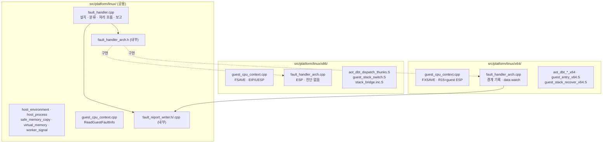

# Task 757: Linux 플랫폼 계층을 공용·x86·x64 디렉터리로 나눈다

## 한국어

### 배경

사용자 요구: `src/platform/linux/`에는 x86(i386)과 x64가 함께 쓰는 코드만 두고, 32비트와 64비트로 갈리는
코드는 `x86/`, `x64/` 하위 디렉터리로 나눈다.

현재 `src/platform/linux/`의 15개 파일은 세 부류다.

| 부류 | 파일 | 선택 방식 |
|---|---|---|
| 공용 | `host_environment.cpp`, `host_process.cpp`, `safe_memory_copy.cpp`, `virtual_memory.cpp`, `worker_signal.cpp` | 항상 빌드. 아키텍처 분기 없음 |
| i386 전용 | `aot_dbt_dispatch_thunks.S`, `guest_stack_switch.S`, `stack_bridge.inc.S`(앞의 것이 include) | CMake `CMAKE_SIZEOF_VOID_P EQUAL 4` |
| x64 전용 | `aot_dbt_dispatch_x64.cpp`, `aot_dbt_return_thunk_x64.S`, `aot_dbt_glide_gate_thunk_x64.S`, `guest_stack_recover_x64.S`, `guest_entry_x64.S` | CMake `CMAKE_SIZEOF_VOID_P GREATER 4` |
| **섞임** | `guest_cpu_context.cpp`(430줄), `fault_handler.cpp`(928줄) | 항상 빌드, 안에서 `__i386__`/`__x86_64__` 분기 |

`src/host/linux/main.cpp`는 런처 진입점으로 아키텍처 분기가 없어 그대로 둔다.

### 설계

#### 결정 1 — 파일 단위 전용 파일은 이름을 바꾸지 않고 옮긴다

i386 전용 셋은 `x86/`, x64 전용 다섯은 `x64/`로 `git mv`한다. `_x64` 접미사는 디렉터리와 겹치지만 **이름은
유지한다.** 작업 로그·분석 문서·커밋 메시지가 수백 곳에서 파일 이름으로 이 파일들을 가리키므로, 이름을
유지하면 기록을 검색할 때 새 위치와 옛 기록이 한 이름으로 이어진다.

`aot_dbt_dispatch_thunks.S`의 `#include "stack_bridge.inc.S"`는 두 파일이 같이 옮겨지므로 그대로 동작한다.
`src/tools/aot_probe/stack_bridge_probe.S`의 상대 include만 `x86/`을 가리키도록 고친다.

#### 결정 2 — 섞인 두 파일은 공용 부분과 아키텍처 부분으로 나눈다

"공용 디렉터리에는 공용 코드만"을 지키려면 파일 안의 `#if` 분기도 나눠야 한다. 동작은 바꾸지 않고 코드만
옮긴다.

**`guest_cpu_context.cpp`**

* 공용: `ReadGuestFaultInfo`. i386과 x64 분기가 글자 그대로 같다(`si_addr`, `REG_ERR` 비트 1·4).
* `x86/guest_cpu_context.cpp`: FSAVE 변환, `LoadGuestCpuContext`, `StoreGuestCpuContext`,
  `ReadHostInstructionPointer`, `StoreHostInstructionPointer`의 i386 분기.
* `x64/guest_cpu_context.cpp`: FXSAVE 태그 변환(Task 707), R15=guest ESP(Task 577), 상위 절반 보존(Task 549)을
  포함한 같은 네 함수의 x64 분기.

**`fault_handler.cpp`**

공용 파일에 남는 것: 시그널 설치·해제, `ClassifySignal`, `RewindPastBreakpoint`, `SignalHandler`의 흐름,
`ReportUnhandledFault`의 공용 필드. 아키텍처별 부분은 내부 헤더 `fault_handler_arch.h`의 함수로 옮기고, 원본에 이미 있던 이름(`HostStackPointer`, `HostDispatchRegisters`, `RecordLastResumedSignal`)은 그대로 쓴다.

| 함수 | x86 | x64 |
|---|---|---|
| `HostStackPointer` | `REG_ESP` | `REG_RSP` |
| `HostDispatchRegisters` | 모두 0 | `R10`, `R14`, `R15` |
| `HandleArchDiagnosticTrap` | `false` | Task 717 data watch(`TRAP_PERF`) 보고 |
| `RecordLastResumedSignal` | 없음 | Task 673 마지막·첫 low 재개 경계 기록 |
| `AppendArchFaultFields` | 없음 | `entry_rsp`…`first_low_esp` 필드 |
| `ArmLinuxDataWatchFromEnvironment`(공개 API) | `false` | Task 717 watchpoint 설치 |

호스트 명령 포인터는 새 함수를 만들지 않고 공개 API `ReadHostInstructionPointer`를 쓴다. 기존 내부
`HostInstructionPointer`와 식이 같고(null이 아닌 context에서 `REG_EIP`/`REG_RIP`), 호출하는 곳은 모두 null이
아닌 context를 넘긴다.

`WriteHex`, `WriteNamedHex`, `WriteNamedHex64`, `WriteByteHex`, `WriteFaultGuestStackDump`는 공용 보고와 x64
data watch가 함께 쓰므로 내부 파일 `fault_report_writer.h/.cpp`로 옮긴다. 모두 async-signal-safe 규칙(할당·락
없음, `write`만)을 그대로 지킨다.

**보고 출력은 바이트 단위로 같아야 한다.** `[repiu-fault] unhandled` 줄의 필드 순서(`rip`, `rsp`, x64 필드,
`r10`, `r14`, `r15`, `eip`, …)는 `AppendArchFaultFields`를 기존 `#if` 블록 자리에서 불러 유지한다. i386에서
`r10=0x0 r14=0x0 r15=0x0`이 찍히던 것도 그대로다.

#### 결정 3 — 선택은 기존 CMake 규칙을 그대로 쓰고, 어긋나면 컴파일에서 멈춘다

CMake는 지금처럼 포인터 크기로 고른다(4 → `x86/`, 8 → `x64/`). 오늘도 64비트 비x86 Linux는 x64 어셈블리를
넣어 실패하므로 지원 범위는 변하지 않는다. 대신 아키텍처 파일은 첫머리에서 `#error`로 자기 아키텍처를
확인한다. 이전에는 맞지 않는 아키텍처에서 `#else` 분기가 조용히 `false`를 돌려줬는데, 디렉터리로 나눈 뒤에는
잘못 고른 빌드가 컴파일에서 바로 드러나는 편이 낫다.

웹 빌드가 `src/platform/linux/`에서 가져다 쓰는 `host_environment.cpp`, `worker_signal.cpp`는 공용에 남으므로
경로가 바뀌지 않는다.

#### 결정 4 — `include/`도 같은 규칙을 따른다 (사용자 요구로 추가)

처음에는 공개 헤더를 범위 밖으로 두었으나, 사용자가 `include/`에도 `src/`와 같은 규칙을 적용하도록 정했다.
`include/repiu/platform/win32/`가 이미 플랫폼 하위 디렉터리를 쓰고 있으므로 같은 모양으로 맞춘다.

| 헤더 | 새 위치 |
|---|---|
| `linux_x64_aot_dispatch.h`, `linux_x64_aot_frame.h`, `linux_x64_guest_entry.h`, `linux_x64_guest_registers.h` | `include/repiu/platform/linux/x64/` |

* Linux 공용 헤더와 i386 전용 헤더는 현재 없다. 플랫폼 중립 헤더(`fault_handler.h`, `guest_cpu_context.h`,
  `guest_stack_switch.h` 등)는 모든 호스트의 계약이므로 `include/repiu/platform/`에 남는다.
* 결정 1과 같은 이유로 **파일 이름과 include guard 이름은 바꾸지 않는다.** guard는 지금도 유일하다.
* 이 헤더들은 엔진 공용 소스(`execution_trampoline.cpp`, `aot_code_cache.cpp`, `aot_dbt_glide_gate_dispatch.cpp`)가
  모든 호스트에서 include하므로, 경로만 바뀌어도 Win32 빌드가 영향을 받는다. 검증에 Win32 전체 빌드를 넣는다.

#### 범위 밖

* `include/repiu/engine/linux_x64_transfer_failure_provenance.h`와
  `src/engine/telemetry/linux_x64_native_write_trace.cpp`. 플랫폼 계층이 아니라 엔진 계층 파일이며, 이 작업의
  규칙은 플랫폼 디렉터리에 대한 것이다.
* 과거 작업 로그·작업 지시·설계 문서의 경로. 시간순 기록이므로 고치지 않는다.

### 문서 갱신

* `AGENTS.md`, `docs/CODING_STYLE.md`: 플랫폼 디렉터리 규칙에 아키텍처 하위 디렉터리 규칙을 더한다(규칙 변경).
* `ARCHITECTURE.md`, `src/platform/web/README.md`, `docs/analysis/linux-port-frontier.md`,
  `docs/analysis/linux-x64-fault-context.md`: 옮긴 파일의 경로.
* 엔진 소스 주석 5곳(`aot_dbt_*_dispatch.cpp`)의 `aot_dbt_dispatch_thunks.S` 경로.

### 검증 전략

1. 변경 전 main에서 Linux i386·x64 Debug를 빌드해 `repiu_core_probe` 출력을 기준으로 남긴다.
2. 변경 후 같은 두 구성을 다시 빌드하고 `repiu_core_probe`를 돌려 결과 줄이 같은지 비교한다(fault handler,
   guest context 변환, x87 태그 probe 포함).
3. x64에서 `aot_probe`의 스택 브리지·x64 계약 probe를, i386에서 `stack_bridge_probe`가 포함된 probe를 돌린다.
4. `#error` 가드가 동작하는지 x86 파일을 x64 컴파일러로 한 번 컴파일해 오류가 나는지 확인한다.
5. Win32 빌드는 Linux 파일을 컴파일하지 않으므로 CMake configure만 확인한다. 결정 4 이후에는 옮긴 헤더를
   엔진 공용 소스가 include하므로 Win32 Debug 전체 빌드로 확인한다.

## English

### Background

Request: keep only code shared by x86 (i386) and x64 in `src/platform/linux/`, and split code that differs
between 32-bit and 64-bit into `x86/` and `x64/` subdirectories.

The 15 files in `src/platform/linux/` fall into these groups:

| Group | Files | Selection |
|---|---|---|
| Shared | `host_environment.cpp`, `host_process.cpp`, `safe_memory_copy.cpp`, `virtual_memory.cpp`, `worker_signal.cpp` | Always built; no architecture branches |
| i386 only | `aot_dbt_dispatch_thunks.S`, `guest_stack_switch.S`, `stack_bridge.inc.S` (included by the first) | CMake `CMAKE_SIZEOF_VOID_P EQUAL 4` |
| x64 only | `aot_dbt_dispatch_x64.cpp`, `aot_dbt_return_thunk_x64.S`, `aot_dbt_glide_gate_thunk_x64.S`, `guest_stack_recover_x64.S`, `guest_entry_x64.S` | CMake `CMAKE_SIZEOF_VOID_P GREATER 4` |
| **Mixed** | `guest_cpu_context.cpp` (430 lines), `fault_handler.cpp` (928 lines) | Always built; `__i386__`/`__x86_64__` branches inside |

`src/host/linux/main.cpp` is the launcher entry point with no architecture branch and stays as it is.

### Design

See the diagram in the Korean section: shared files stay in `src/platform/linux/` with two new internal
files (`fault_handler_arch.h`, `fault_report_writer.h/.cpp`); `x86/` and `x64/` each get a
`guest_cpu_context.cpp`, a `fault_handler_arch.cpp`, and their existing architecture-only files.

#### Decision 1 — Architecture-only files move without renaming

The three i386-only files move to `x86/` and the five x64-only files to `x64/` with `git mv`. The `_x64`
suffix repeats the directory, but **the names stay**: work logs, analysis and commit messages name these
files in hundreds of places, and keeping the names ties the new location to the old records under one name.

`#include "stack_bridge.inc.S"` in `aot_dbt_dispatch_thunks.S` keeps working because both files move
together. Only the relative include in `src/tools/aot_probe/stack_bridge_probe.S` is pointed at `x86/`.

#### Decision 2 — The two mixed files split into shared and per-architecture parts

Keeping "only shared code in the shared directory" means splitting the `#if` branches inside files too.
Code moves; behaviour does not change.

**`guest_cpu_context.cpp`**

* Shared: `ReadGuestFaultInfo`. Its i386 and x64 branches are textually identical (`si_addr`, bits 1 and 4
  of `REG_ERR`).
* `x86/guest_cpu_context.cpp`: the FSAVE conversion and the i386 branches of `LoadGuestCpuContext`,
  `StoreGuestCpuContext`, `ReadHostInstructionPointer` and `StoreHostInstructionPointer`.
* `x64/guest_cpu_context.cpp`: the x64 branches of the same four functions, including the FXSAVE tag
  conversion (Task 707), R15 as guest ESP (Task 577) and upper-half preservation (Task 549).

**`fault_handler.cpp`**

The shared file keeps signal installation and removal, `ClassifySignal`, `RewindPastBreakpoint`, the flow of
`SignalHandler`, and the shared fields of `ReportUnhandledFault`. Per-architecture parts move behind the
internal header `fault_handler_arch.h`, keeping the names the original already had (`HostStackPointer`,
`HostDispatchRegisters`, `RecordLastResumedSignal`):

| Function | x86 | x64 |
|---|---|---|
| `HostStackPointer` | `REG_ESP` | `REG_RSP` |
| `HostDispatchRegisters` | all zero | `R10`, `R14`, `R15` |
| `HandleArchDiagnosticTrap` | `false` | Task 717 data-watch (`TRAP_PERF`) report |
| `RecordLastResumedSignal` | nothing | Task 673 last and first-low resumed boundary |
| `AppendArchFaultFields` | nothing | fields `entry_rsp` through `first_low_esp` |
| `ArmLinuxDataWatchFromEnvironment` (public API) | `false` | Task 717 watchpoint |

The host instruction pointer uses the public `ReadHostInstructionPointer` instead of a new function. It is
the same expression as the old internal `HostInstructionPointer` (`REG_EIP`/`REG_RIP` for a non-null
context), and every caller passes a non-null context.

`WriteHex`, `WriteNamedHex`, `WriteNamedHex64`, `WriteByteHex` and `WriteFaultGuestStackDump` are used by
both the shared report and the x64 data watch, so they move to the internal `fault_report_writer.h/.cpp`. They
keep the async-signal-safe rule (no allocation, no locks, `write` only).

**The report must be byte-identical.** The field order of the `[repiu-fault] unhandled` line (`rip`, `rsp`,
the x64 fields, `r10`, `r14`, `r15`, `eip`, …) is kept by calling `AppendArchFaultFields` where the `#if`
block used to be. The `r10=0x0 r14=0x0 r15=0x0` that i386 printed is printed as before.

#### Decision 3 — Selection keeps the existing CMake rule, and a mismatch stops the compile

CMake keeps choosing by pointer size (4 → `x86/`, 8 → `x64/`). A 64-bit non-x86 Linux already fails today
by pulling in x64 assembly, so the supported range does not change. The architecture files check their own
architecture with `#error` at the top. Before, a mismatched architecture quietly returned `false` from an
`#else` branch; once the directories are separate, a wrong pick is better found by the compiler at once.

`host_environment.cpp` and `worker_signal.cpp`, which the web build takes from `src/platform/linux/`, stay
shared, so their paths do not change.

#### Decision 4 — `include/` follows the same rule (added at the user's request)

Public headers were first left out of scope, but the user decided that `include/` follows the same rule as
`src/`. `include/repiu/platform/win32/` already uses a platform subdirectory, so the shape matches it.

| Headers | New location |
|---|---|
| `linux_x64_aot_dispatch.h`, `linux_x64_aot_frame.h`, `linux_x64_guest_entry.h`, `linux_x64_guest_registers.h` | `include/repiu/platform/linux/x64/` |

* There are no shared-Linux or i386-only headers today. Platform-neutral headers (`fault_handler.h`,
  `guest_cpu_context.h`, `guest_stack_switch.h` and the rest) are contracts for every host and stay in
  `include/repiu/platform/`.
* For the reason in decision 1, **file names and include-guard names do not change.** The guards are unique
  as they are.
* Shared engine sources (`execution_trampoline.cpp`, `aot_code_cache.cpp`, `aot_dbt_glide_gate_dispatch.cpp`)
  include these headers on every host, so a path change alone reaches the Win32 build. A full Win32 build is
  part of verification.

#### Out of scope

* `include/repiu/engine/linux_x64_transfer_failure_provenance.h` and
  `src/engine/telemetry/linux_x64_native_write_trace.cpp`. They are engine-layer files, and this task's rule
  is about the platform directories.
* Paths in past work logs, work orders and designs. They are chronological records and are not edited.

### Document updates

* `AGENTS.md`, `docs/CODING_STYLE.md`: add the architecture-subdirectory rule to the platform-directory rule
  (a rule change).
* `ARCHITECTURE.md`, `src/platform/web/README.md`, `docs/analysis/linux-port-frontier.md`,
  `docs/analysis/linux-x64-fault-context.md`: paths of moved files.
* Five engine source comments (`aot_dbt_*_dispatch.cpp`) naming the `aot_dbt_dispatch_thunks.S` path.

### Verification strategy

1. Before the change, build Linux i386 and x64 Debug from main and keep `repiu_core_probe` output as the
   baseline.
2. After the change, rebuild both and compare the `repiu_core_probe` result lines (including the fault
   handler, guest-context conversion and x87 tag probes).
3. Run the `aot_probe` stack-bridge and x64 contract probes on x64, and the probe that includes
   `stack_bridge_probe` on i386.
4. Confirm the `#error` guard by compiling an x86 file once with the x64 compiler.
5. The Win32 build compiles no Linux file, so only its CMake configure is checked. After decision 4, shared
   engine sources include the moved headers, so a full Win32 Debug build is checked.
