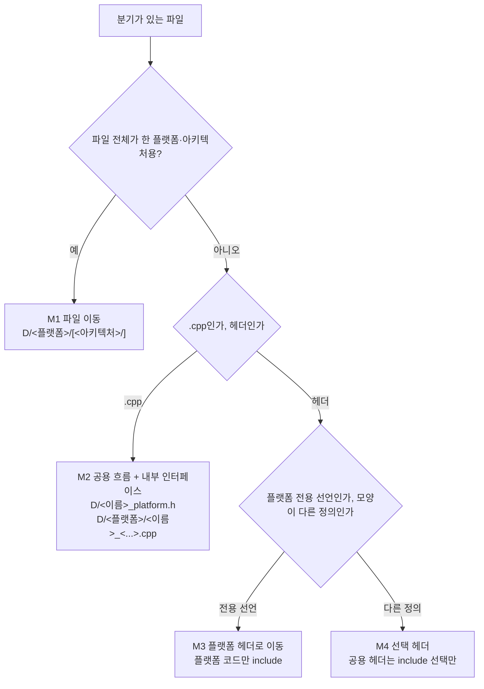

# Task 758: 플랫폼·아키텍처 디렉터리 규칙을 `src`·`include` 전체에 적용한다

> **이 설계의 규칙은 Task 759로 바뀌었다.** 단계 1(플랫폼 계층)은 그대로이고, 단계 2가 엔진 안에 만든
> 디렉터리는 없앴으며, 단계 3·4는 이 규칙으로 하지 않는다.
> [20260929-759](20260929-759-execution-model-and-platform-moves.md)를 볼 것.
>
> **The rule of this design was changed by Task 759.** Phase 1 (the platform layer) stands, the
> directories phase 2 made inside the engine are removed, and phases 3 and 4 are not done under this rule.
> See [20260929-759](20260929-759-execution-model-and-platform-moves.md).

## 한국어

### 배경

Task 757은 `src/platform/linux/`와 `include/repiu/platform/linux/`에 "상위 디렉터리에는 공용 코드만, 플랫폼·
아키텍처 코드는 하위 디렉터리에, 섞인 파일은 나눈다"는 규칙을 적용했다. 사용자는 이 규칙을 모든 디렉터리에
똑같이 적용하도록 정했고, 질문에 대해 다음을 골랐다.

* **범위:** `src/`와 `include/`만. `scripts/`는 CI와 문서가 경로로 참조하므로 그대로 둔다.
* **섞인 파일:** 런타임·엔진·도구(probe 포함)를 가리지 않고 **모두 나눈다.**

조사 결과, 플랫폼 디렉터리 밖에서 플랫폼·아키텍처 전처리 분기(`_WIN32`, `_MSC_VER`, `__linux__`, `__x86_64__`,
`__i386__`, `_M_IX86`, `_M_X64`, `__EMSCRIPTEN__`, `__GNUC__`)를 가진 파일은 **61개**, 분기 안의 코드는 약 **7,700줄**이다.
가장 큰 것은 `src/engine/execution/execution_trampoline.cpp`(7,686줄 중 1,661줄, 최상위 블록 42개)다.

### 규칙

1. 어느 디렉터리 `D`에서든 특정 플랫폼 전용 코드는 `D/<플랫폼>/`, 그 플랫폼의 특정 아키텍처 전용 코드는
   `D/<플랫폼>/<아키텍처>/`에 둔다. `D` 자체에는 모든 호스트가 함께 쓰는 코드만 남는다.
   * 플랫폼: `win32`, `linux`, `web`. 아키텍처: `x86`(i386), `x64`.
   * 공개 헤더도 같다: `include/repiu/<영역>/<플랫폼>/[<아키텍처>/]`.
   * **플랫폼과 무관하게 아키텍처만 따르는 코드**는 `D/<아키텍처>/`에 둔다. 예: 게스트를 호스트 x86에서 직접
     실행하는 모델의 코드는 Win32와 Linux i386이 똑같이 쓰므로 `D/x86/`에 한 번 두고 두 빌드가 함께 쓴다.
     같은 파일을 `win32/`와 `linux/x86/`에 복사하지 않는다.
   * **Win32 호스트는 x86으로만 빌드된다.** 따라서 `win32/` 코드는 x86 코드이고, Win32 코드 안의 `_M_X64`
     분기는 빌드될 수 없는 코드라 옮기지 않고 지운다. 그런 파일은 `_M_IX86`이 아니면 `#error`로 멈춘다.
2. 한 파일에 플랫폼·아키텍처 분기가 섞이면 공용 부분과 플랫폼 부분으로 나눈다.
3. **예외는 하나다 — 헤더의 선택 지점.** 타입 정의나 inline 함수처럼 헤더에서 모양이 달라야 하는 것은 플랫폼
   헤더에 두고, 공용 헤더는 `#if` 한 단계로 **어느 플랫폼 헤더를 include할지만** 고른다. 선택 분기 안에는
   `#include` 외의 코드가 없다. `.cpp`는 CMake가 파일을 고르므로 선택 지점도 두지 않는다.

### 분리 방식

* **M1 파일 이동.** `git mv`로 옮기고 CMake 조건에 맞춰 경로를 고친다.
* **M2 섞인 `.cpp`.** 공용 파일은 흐름을 유지하고, 플랫폼 분기 자리는 내부 헤더(`<이름>_platform.h` 또는
  `<이름>_arch.h`, 공용 파일 옆)의 함수 호출로 바뀐다. 각 플랫폼 파일이 그 함수를 구현한다. 한쪽에만 있는 기능은
  다른 쪽 구현이 "할 일이 없다"를 명시적으로 돌려준다(Task 757 `x86/fault_handler_arch.cpp`와 같은 형태).
  파일 경계를 넘기 위해 공용 파일의 익명 네임스페이스 상태가 필요하면, 그 상태를 내부 헤더의 내부 네임스페이스로
  옮긴다.
* **M3 플랫폼 전용 선언.** 공용 헤더에서 `#if defined(_WIN32)`로 감싸 선언하던 것(예: `EXCEPTION_POINTERS`를 받는
  함수, `HANDLE`을 든 구조체)은 `<영역>/win32/…_win32.h`로 옮기고, 그것을 쓰는 플랫폼 코드만 include한다.
* **M4 선택 헤더.** `GuestCpuContext`(Windows에서는 `CONTEXT` 별칭), 원자 연산, 사이클 카운터, 호출 규약
  매크로처럼 정의 자체가 다른 것.

### 이름과 선택

* 파일 이름은 각 플랫폼 디렉터리의 기존 관례를 따른다. `win32/`는 `_win32` 접미사(`src/platform/win32/`
  관례), `linux/`, `web/`, 아키텍처 디렉터리는 접미사 없음(Task 757 관례).
* **웹은 Linux의 POSIX 구현을 재사용한다.** 웹 빌드는 이미 `src/platform/linux/`의 `host_environment.cpp`,
  `worker_signal.cpp`를 그대로 쓴다(Task 513). 같은 원칙으로, 웹에서 달라질 이유가 없는 POSIX 구현은
  `linux/`에 두고 웹이 가져다 쓴다. 웹에서 실제로 다른 것(예: 사이클 카운터)만 `web/`에 둔다.
* CMake는 `REPIU_PLATFORM`(`win32`/`linux`/`web`)과 `REPIU_ARCH`(`x86`/`x64`/`wasm32`)를 한 번 정하고, 플랫폼
  파일 목록은 그 변수로 고른다.
* 이름에 `linux_x64`가 있어도 **모든 호스트에서 컴파일되고 분기가 없는 파일은 공용**이다
  (`linux_x64_transfer_failure_provenance.h/.cpp` — 공용 `ThreadContext`가 담는 기록 형식). 규칙은 내용과 빌드
  범위를 기준으로 한다.

### 단계

| 단계 | 대상 | 파일 수 |
|---|---|---|
| 1 | 플랫폼 계층과 컴파일러 shim: `src/platform/{host_thread,host_time,host_error_stream,build_identity}.cpp`, `include/repiu/platform/{guest_cpu_context,atomic_ops,thunk_calling_convention,fault_handler}.h`, `include/repiu/runtime/cycle_clock.h` | 9 |
| 2 | 엔진 지원 파일: `x87_context`, `exception_rescue_win32`, `host_crash_report`, `guest_write_trace`, `runtime_memory_policy`, `native_phase_sampler`, `linux_x64_native_write_trace`(M1), `live_telemetry_snapshot`, `guest_position_census`, `glide_opengl_backend`, `linexe_glide_boundary`, `aot_runtime_dispatch.h` | 약 16 |
| 3 | 엔진 핵심: `execution_trampoline.cpp`, `aot_code_cache.cpp`, `aot_runtime_dispatch.cpp`, `aot_dbt_dispatch.cpp`, `aot_dbt_{hle,direct_edge,indirect,return,glide_gate}_dispatch.cpp` | 9 |
| 4 | 호스트와 도구: `host/loader/main.cpp`, `tools/exe_analyzer/main.cpp`, `tools/core_probe/main.cpp`, `tools/glide_render_probe/main.cpp`, `tools/aot_probe/*`(약 22개) | 약 26 |

단계마다 빌드·검증·커밋한다. 헤더의 Win32 전용 선언(M3)은 그것을 쓰는 코드가 옮겨지는 단계에서 함께 옮긴다.
그 전에는 공용 파일에 `#if` 안의 include가 생기기 때문이다.

### 동작 보존

코드는 옮기기만 하고 바꾸지 않는다. 함수 경계를 새로 만들 때 인라인이던 코드가 호출이 되는 것 외의 차이를
만들지 않는다. 엔진 핵심(단계 3)은 예외 처리기 안에서 도는 코드가 많으므로, 새 함수는 할당·락을 추가하지 않고
원래 블록의 지역 변수는 인자와 참조로 넘긴다.

### 검증 전략

기준은 이 작업 전 커밋(`48ca9e3`, probe 수정 포함)에서 모았다.

| 구성 | 기준 |
|---|---|
| Linux i386·x64 Debug | `repiu_core_probe` 출력 |
| Web Release | `node repiu_core_probe.js` 출력 |
| Win32 x86 Debug | `repiu_core_probe`, `repiu_glide_issue_probe`, `repiu_aot_probe`의 이미지 없는 모드 18개와 `dos4gw_hello` 이미지 실행 |

단계마다 네 구성을 다시 빌드하고 `=true`/`=false` 결과 줄(값은 가림)과 종료 코드를 기준과 비교한다. 로직을
옮긴 곳이 probe로 덮이지 않으면(예: 처리되지 않은 fault 보고) Task 757처럼 단독 비교 테스트를 만든다.

**Win32 core probe 선행 수정.** 기준을 모으다 Win32 Debug core probe가 `dos_console_device`에서 abort(exit 3)해
그 뒤 probe가 하나도 돌지 않는 것을 확인했다. `std::filesystem::exists(root / "CON:")`가 Windows에서
`filesystem_error`를 던졌기 때문이다. `error_code` 오버로드로 바꾼 뒤(커밋 `48ca9e3`) 기준을 다시 모았다.

## English

### Background

Task 757 applied the rule "only shared code in the parent directory, platform and architecture code in
subdirectories, split mixed files" to `src/platform/linux/` and `include/repiu/platform/linux/`. The user
decided the rule applies to every directory and chose:

* **Scope:** `src/` and `include/` only. `scripts/` stays, because CI and documents reference its paths.
* **Mixed files:** split **all of them** — runtime, engine and tools, probes included.

Outside the platform directories, **61 files** carry platform or architecture preprocessor branches
(`_WIN32`, `_MSC_VER`, `__linux__`, `__x86_64__`, `__i386__`, `_M_IX86`, `_M_X64`, `__EMSCRIPTEN__`,
`__GNUC__`), about **7,700 lines** of code inside them. The largest is
`src/engine/execution/execution_trampoline.cpp` (1,661 of 7,686 lines, 42 top-level blocks).

### Rule

1. In any directory `D`, code for one platform goes in `D/<platform>/`, and code for one architecture of
   that platform in `D/<platform>/<arch>/`. `D` itself keeps only code every host shares.
   * Platforms: `win32`, `linux`, `web`. Architectures: `x86` (i386), `x64`.
   * Public headers likewise: `include/repiu/<area>/<platform>/[<arch>/]`.
   * **Code that follows an architecture regardless of platform** goes in `D/<arch>/`. For example, code of
     the model that runs the guest directly on a host x86 is the same for Win32 and Linux i386, so it lives
     once in `D/x86/` and both builds use it, rather than being copied into `win32/` and `linux/x86/`.
   * **The Win32 host builds as x86 only.** Code in `win32/` is therefore x86 code, and `_M_X64` branches in
     Win32 code cannot be built; they are removed rather than moved, and such files stop with `#error` when
     `_M_IX86` is not defined.
2. A file that mixes platform or architecture branches is split into a shared part and platform parts.
3. **One exception — selection points in headers.** Where a header must differ in shape — a type
   definition, an inline function — the definitions live in platform headers, and the shared header uses one
   level of `#if` only to **choose which platform header to include**. Nothing but `#include` sits inside the
   selection. `.cpp` files have no selection point, because CMake chooses the file.

### Methods

See the flowchart in the Korean section.

* **M1 Move.** `git mv`, with CMake paths updated under their existing conditions.
* **M2 Mixed `.cpp`.** The shared file keeps the flow; each platform branch becomes a call into an internal
  header (`<name>_platform.h` or `<name>_arch.h`, next to the shared file), implemented by each platform file.
  A feature one side lacks is implemented there as an explicit "nothing to do" (the shape of Task 757's
  `x86/fault_handler_arch.cpp`). Anonymous-namespace state the platform code needs moves into an internal
  namespace in the internal header.
* **M3 Platform-only declarations.** Declarations a shared header fenced with `#if defined(_WIN32)` (a
  function taking `EXCEPTION_POINTERS`, a structure holding a `HANDLE`) move to `<area>/win32/…_win32.h`,
  included only by the platform code that uses them.
* **M4 Selection headers.** Definitions that differ outright: `GuestCpuContext` (an alias of `CONTEXT` on
  Windows), atomic operations, the cycle counter, the calling-convention macro.

### Names and selection

* File names follow each platform directory's existing convention: `_win32` suffix in `win32/` (as in
  `src/platform/win32/`), no suffix in `linux/`, `web/` and the architecture directories (as in Task 757).
* **The web build reuses Linux's POSIX implementations.** It already takes `host_environment.cpp` and
  `worker_signal.cpp` from `src/platform/linux/` (Task 513). Likewise, POSIX code the web has no reason to
  change lives in `linux/` and the web build uses it; only what really differs on the web (the cycle counter,
  for one) goes in `web/`.
* CMake sets `REPIU_PLATFORM` (`win32`/`linux`/`web`) and `REPIU_ARCH` (`x86`/`x64`/`wasm32`) once and picks
  platform files with them.
* A file named `linux_x64` that **compiles on every host with no branch is shared**
  (`linux_x64_transfer_failure_provenance.h/.cpp` — a record format held by the shared `ThreadContext`). The
  rule goes by content and build scope.

### Phases

| Phase | Files | Count |
|---|---|---|
| 1 | Platform layer and compiler shims: `src/platform/{host_thread,host_time,host_error_stream,build_identity}.cpp`, `include/repiu/platform/{guest_cpu_context,atomic_ops,thunk_calling_convention,fault_handler}.h`, `include/repiu/runtime/cycle_clock.h` | 9 |
| 2 | Engine support: `x87_context`, `exception_rescue_win32`, `host_crash_report`, `guest_write_trace`, `runtime_memory_policy`, `native_phase_sampler`, `linux_x64_native_write_trace` (M1), `live_telemetry_snapshot`, `guest_position_census`, `glide_opengl_backend`, `linexe_glide_boundary`, `aot_runtime_dispatch.h` | about 16 |
| 3 | Engine core: `execution_trampoline.cpp`, `aot_code_cache.cpp`, `aot_runtime_dispatch.cpp`, `aot_dbt_dispatch.cpp`, `aot_dbt_{hle,direct_edge,indirect,return,glide_gate}_dispatch.cpp` | 9 |
| 4 | Hosts and tools: `host/loader/main.cpp`, `tools/exe_analyzer/main.cpp`, `tools/core_probe/main.cpp`, `tools/glide_render_probe/main.cpp`, `tools/aot_probe/*` (about 22) | about 26 |

Each phase is built, verified and committed. A header's Win32-only declarations (M3) move in the phase that
moves the code using them; before that, a shared file would gain an include inside `#if`.

### Preserving behaviour

Code moves; it does not change. A new function boundary adds nothing beyond inline code becoming a call.
Much of the engine core (phase 3) runs inside fault handlers, so new functions add no allocation or lock,
and the original block's locals are passed as arguments and references.

### Verification strategy

The baseline was collected at the commit before this work (`48ca9e3`, including the probe fix).

| Configuration | Baseline |
|---|---|
| Linux i386 and x64 Debug | `repiu_core_probe` output |
| Web Release | `node repiu_core_probe.js` output |
| Win32 x86 Debug | `repiu_core_probe`, `repiu_glide_issue_probe`, the 18 image-free `repiu_aot_probe` modes, and a run on the `dos4gw_hello` image |

After each phase all four configurations are rebuilt and their `=true`/`=false` result lines (values
masked) and exit codes compared with the baseline. Where moved logic is not covered by a probe (the
unhandled-fault report, for one), a standalone comparison test is built as in Task 757.

**A prerequisite Win32 core-probe fix.** While collecting the baseline, the Win32 Debug core probe aborted
(exit 3) in `dos_console_device`, and no probe after it ran: `std::filesystem::exists(root / "CON:")` threw
`filesystem_error` on Windows. After switching to the `error_code` overload (commit `48ca9e3`) the baseline
was collected again.
