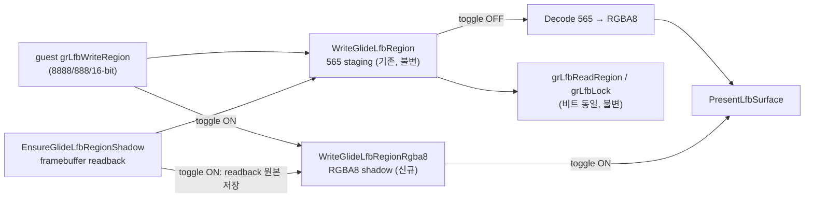

# Task 761: Glide LFB 고정밀 표시 경로와 in-game OSD 토글

## 배경

`grLfbWriteRegion`은 게스트가 넘긴 픽셀을 565 스테이징 서피스에 저장한다.
pumpit8 계열은 이 게이트에 `GR_LFB_SRC_FMT_8888`(32-bit) 소스를 넘기고
(`docs/analysis/glide2x-ovl-and-opengl-hle.md` Task 476), 그 원본은 게임이 libpng로
디코드한 RGBA8 PNG다(`docs/analysis/pumpit8-bga-iccp-crash.md`,
`docs/analysis/res-ptx-resource-loading.md`). 현재 경로는 8/8/8 → 5/6/5 → 8/8/8
왕복이라 표시 단계에서 원본 정밀도를 잃는다. 이 손실은 rePIU의 HLE 안에서만
발생하므로, 원본 코드 수정 없이 제거할 수 있는 유일한 다운컨버트 지점이다.

## 목표

1. `grLfbWriteRegion`의 24/32-bit 소스가 표시까지 원본 정밀도를 유지한다.
2. 게스트 가시 상태는 변하지 않는다: 565 스테이징이 계속 진실이고,
   `grLfbReadRegion`/`grLfbLock`은 지금과 비트 동일한 값을 돌려받는다.
3. 기능은 토글로 제어하고 **기본값은 on**이다(처음에는 off였고 사용자가 on으로 바꿨다).
   CLI(환경 변수)와 in-game OSD 양쪽에서 켜고 끌 수 있다.

## 설계

### 데이터 경로

* **HLE.** `WriteGlideLfbRegionRgba8`를 `glide_lfb_region`에 추가한다. 클리핑과
  stride 규칙은 `WriteGlideLfbRegion`과 같은 `PlanRegion`을 쓴다. 888/8888 소스는
  채널을 그대로 옮기고(alpha는 불투명), 16-bit 소스는 기존 565 pack → decode 왕복과
  같은 값을 쓴다 — 토글 on/off가 16-bit 소스의 표시 결과를 바꾸지 않게 하기
  위해서다.
* **ThreadContext.** RGBA8 shadow(`std::vector<std::uint8_t>`)와 valid 플래그,
  고정밀 present 계수를 추가한다.
* **경계.**
  * seed: 토글 on이면 `ReadbackFramebuffer`의 RGBA8을 encode 전에 shadow에 복사해
    둔다(양자화 이전 원본).
  * write: 565 기록 뒤 토글 on이면 RGBA8 shadow에도 병행 기록한다. shadow가
    invalid면(중간에 켠 경우) 현재 565 스테이징을 decode해 초기화한다 — 그 순간의
    표시 결과는 off와 동일하고, 이후 기록부터 정밀도가 쌓인다.
  * flush: 토글 on이고 shadow valid면 decode를 건너뛰고 shadow를 그대로
    `PresentLfbSurface`에 넘긴다. off면 기존 decode 경로를 쓰고 shadow를
    invalid로 만든다(재활성화 시 재초기화).
* **Backend 토글.** `GlideOpenGlBackend`가 `std::atomic<bool>`을 소유한다. guest
  스레드(경계)가 relaxed load로 읽고, host 스레드(OSD)와 초기화가 쓴다. 초기값은
  `REPIU_GLIDE_LFB_HIGH_PRECISION`을 `runtime::ResolvePromotedToggle`로 읽는다 —
  미지정·빈 값은 ON, `0|off|false`는 OFF, 그 밖의 값(오타)은 OFF(fail-closed)로,
  프로젝트의 기본 on 토글 관례 그대로다. 이것이 CLI 제어다.

### In-game OSD

ARCHITECTURE.md의 런처 절이 예고한 "같은 ImGui 레이어가 인게임 OSD가 된다"의 첫
구현이다. 독립 하위 시스템이므로 전용 파일(`glide_osd`)로 둔다.

* `GlideOsd`: ImGui context 생성/파괴(`Initialize`/`Shutdown`), SDL 이벤트 전달
  (`ProcessEvent`), 프레임 렌더(`Render`)를 캡슐화한다. 백엔드가 소유하고 모든
  호출은 host 스레드에서 온다.
* 열기/닫기: 게임 창이 열릴 때 초기화하고 닫힐 때 파괴한다. dummy mode에서는
  만들지 않는다.
* 표시 토글: `Tab`. `PumpEvents`에서 가로채며 게임 입력(JAMMA/BIOS 키보드)으로
  보내지 않는다. 처음에는 `F1`이었으나 F1은 TEST의 기본 키여서 TEST가 게임에 닿지
  않았고, 사용자가 `Tab`으로 바꿨다. OSD가 보이는 동안 이벤트를 ImGui에 전달한다; 게임 입력 전달은
  유지한다(체크박스는 마우스로 조작).
* 내용: "LFB high precision (32-bit)" 체크박스 하나. 백엔드의 atomic을 직접
  읽고 쓴다.
* 렌더 지점: `BufferSwapOnHostThread`의 `SDL_GL_SwapWindow` 직전. ImGui GL3
  백엔드는 GL 상태를 저장·복원하므로 게임의 고정 파이프라인 상태를 오염시키지
  않는다.

### 유지 비용

토글 off일 때 추가 비용은 write당 relaxed atomic load 1회다. on일 때는 region
write당 RGBA8 변환 한 번이 추가되고 flush의 565 decode가 사라지므로, 640×1 행
1,440회짜리 pumpit8 합성에서 순증가는 작다.

## 검증 전략

1. `repiu_aot_probe`의 `glide_lfb_region_probe`에 `WriteGlideLfbRegionRgba8`
   케이스를 추가한다: 8888 소스의 바이트 보존, 565 소스의 decode 왕복 일치,
   클리핑 동작.
2. Debug 빌드로 전체 probe를 실행한다.
3. 수동: pumpit8을 구동해 BGA 장면 확인, Tab OSD로 토글 왕복.

# Task 761: Glide LFB High-Precision Presentation Path and In-Game OSD Toggle

## Background

`grLfbWriteRegion` stores guest pixels into the 565 staging surface. The pumpit8
generation passes `GR_LFB_SRC_FMT_8888` (32-bit) sources whose origin is RGBA8
PNG decoded by the game itself, so the current 8/8/8 → 5/6/5 → 8/8/8 round trip
loses source precision inside rePIU's HLE — the only down-conversion point
removable without touching original code.

## Goals

1. 24/32-bit `grLfbWriteRegion` sources keep their precision through to
   presentation.
2. Guest-visible state is unchanged: the 565 staging stays authoritative and
   `grLfbReadRegion`/`grLfbLock` return bit-identical values.
3. The feature is toggled, **default on** (it was off at first and the user
   changed it), controllable from the CLI (environment variable) and an
   in-game OSD.

## Design

* **HLE.** Add `WriteGlideLfbRegionRgba8` sharing `PlanRegion` clipping. 888/8888
  sources copy channels directly (opaque alpha); 16-bit sources write the same
  values the 565 pack → decode round trip produces, so the toggle cannot change
  their displayed result.
* **ThreadContext.** An RGBA8 shadow vector, a valid flag, and a high-precision
  present counter.
* **Boundary.** Seed copies the readback RGBA8 into the shadow before encoding
  (toggle on). Write mirrors into the shadow, initializing it from a 565 decode
  when it is invalid (mid-run enable). Flush presents the shadow directly when
  on and valid; otherwise it decodes as today and invalidates the shadow.
* **Backend toggle.** A `std::atomic<bool>` owned by `GlideOpenGlBackend`,
  read relaxed from the guest thread, written by the host thread. Initial value
  comes from `REPIU_GLIDE_LFB_HIGH_PRECISION` via
  `runtime::ResolvePromotedToggle` (unset and empty are ON, `0|off|false` is
  OFF, anything else is a fail-closed OFF), the project's convention for a
  default-on toggle — this is the CLI control.
* **In-game OSD.** The first realization of the launcher section's "the same
  ImGui layer becomes the in-game OSD": a dedicated `GlideOsd` subsystem owning
  the ImGui context, toggled by `Tab` (intercepted before game input; it was
  `F1` first, which is TEST's default key and kept TEST from the game), rendering
  one checkbox bound to the backend atomic, drawn just before
  `SDL_GL_SwapWindow` on the host thread. Not created in dummy mode.

## Verification

Extend `glide_lfb_region_probe` with byte-preservation, decode-parity, and
clipping cases for the new function; run the full Debug probe; manually run
pumpit8 and flip the toggle from the OSD.
