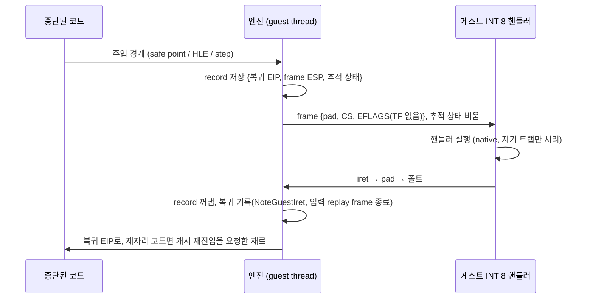

# Task 762: 타이머 핸들러의 복귀를 보는 return pad (direct 모델)

## 한국어

### 1. 증상과 범위

Win32에서 pumpit8이 첫 곡(720)의 파일을 다 읽은 뒤 멈춘다. v0.0.190이 마지막 정상 버전이고
v0.0.191부터 현재(v0.0.196)까지 같은 자리에서 멈춘다. Release와 Debug가 같다.

게임은 `0x0101DB18`에서 다음 루프를 돈다.

```
0x0101DB18  call 0x01012172      ; mov eax,[0x01A552E8] 를 돌려주는 getter
0x0101DB1D  cmp  eax, 1200       ; 240 Hz 기준 5초
0x0101DB22  jb   0x0101DB18
```

`[0x01A552E8]`은 타이머 핸들러가 올리는 tick 카운터다. 멈춘 실행에서 이 값은 185(0xB9)에서
움직이지 않고, 엔진의 dispatch 횟수·single-step 횟수·AOT 진입 횟수가 같은 순간부터 전부
그대로다. tick은 due만 쌓여 backlog 한도(64)에서 버려진다(100초 실행에서 22,771 중 9,573 전달).

### 2. 원인

direct 모델(Win32, Linux i386)은 게스트 코드의 상당 부분을 제자리(in-place)에서 native로
실행한다. tick은 엔진이 제어를 잡는 경계에서만 주입된다: AOT 캐시의 safe point, HLE 트랩
(포트 I/O, `cli`/`sti`, DOS), Glide gate, single-step 추적의 매 step. 제자리에서 트랩 없이 도는
코드에는 주입할 자리가 없다.

v0.0.190까지는 주입 frame에 context의 EFLAGS를 그대로 넣었고, 그 안에는 dispatcher가 세운 추적용
TF가 들어 있었다. 핸들러의 native `iret`이 TF를 되살려 추적이 이어졌고, 위 대기 루프도 그
추적 아래에서 tick을 받았다. Task 736(v0.0.191)이 frame에서 TF를 지웠다. 되살아난 TF가 추적이
꺼진 상태의 코드에 떨어지면 `0x80000004`로 끝났기 때문이다. 그 뒤로는 핸들러가 복귀한 코드가
제자리에서 감독 없이 돌고, 트랩이 없는 루프에 들어가면 다음 tick이 영영 들어가지 않는다.

v0.0.190의 방식은 되돌릴 대상이 아니다. 같은 실험에서 확인한 것:

| frame의 TF | PIC 규칙 | 결과 |
|---|---|---|
| 지움 (현재) | 켬 | 곡 로딩 뒤 멈춤 |
| 지움 | 끔 | 곡 로딩 뒤 멈춤 |
| context 그대로 (v0.0.190) | 끔 | 한 번은 곡 재생(4,650프레임, tick 99.6%), 한 번은 핸들러 중첩으로 스택이 320 KiB 내려감 |
| context 그대로 | 켬 | 핸들러 안에서 추적이 이어져 끝부분 step마다 중첩 주입, 291프레임 |
| 추적 지점 주입에만 TF | 켬 | `0x80000004` 또는 멈춤 |

즉 TF는 "핸들러가 복귀했다"는 신호로 쓰기에는 부정확하다. 핸들러 안에서도 살아나고, 추적
상태와 어긋나면 예외가 새며, 복귀 자체는 여전히 엔진에 보이지 않는다.

뿌리는 하나다. **direct 모델에서 엔진은 타이머 핸들러의 복귀를 보지 못한다.** Linux x64(cache
모델)는 `iret`이 HLE라 복귀를 보고, Task 751의 규칙(중첩 금지, 중단된 코드의 차례, `iret` 뒤
연쇄 한도)이 그 위에서 동작한다. Win32는 복귀를 못 봐서 그 규칙들이 꺼져 있다
(`handler_return_seen=false`).

### 3. 설계

direct 모델에서 주입 frame의 복귀 주소를 엔진이 잡는 자리(**return pad**)로 돌린다.



* **pad.** 커밋하지 않은 예약 페이지 한 장의 주소다. 거기로 복귀하면 실행 폴트가 나고
  `EIP == pad`로 엔진에 온다. 바이트를 두지 않으므로 `int3` 뒤 EIP 보정이 host마다 다른 문제가
  없다. 프로세스에 하나, 처음 쓸 때 예약하고 해제하지 않는다(주소 공간 4 KiB, 커밋 없음).
* **record.** `TimerReturnPad`가 frame ESP 오름차순이 아니라 주입 순서(가장 최근이 마지막)로
  쌓는다. 용량 8. 가득 차면 그 주입은 pad 없이 예전처럼 복귀 주소를 직접 넣는다.
* **복귀 처리** (`DispatchGuestFault`의 맨 앞, 다른 어떤 핸들러보다 먼저).
  1. `ESP - 12`와 frame ESP가 같은 record를 위에서부터 찾는다. 그 위의 record는 복귀하지 않은
     핸들러의 것이므로 함께 버린다. 맞는 것이 없으면 가장 위 record를 쓰고 센다.
  2. `EIP`를 복귀 주소로, 추적 상태(`enable_single_step_trace`, `aot_legacy_fallback`,
     `aot_reentry_pending`)를 저장해 둔 값으로 되돌린다.
  3. Linux x64의 `iret` HLE가 하는 기록을 그대로 한다: `NoteGuestIret`, 그리고
     `JammaReplayFrameEndEnabled()`이면 `EndTimerInterrupt`.
  4. 복귀 주소가 제자리 게스트 코드면 `aot_reentry_pending`과 추적, TF를 세운다. 다음 step에서
     `HandleAotReentry`가 그 주소의 캐시 entry를 찾아 들여보내고, 없는 코드만 추적 아래 남는다. 캐시
     주소면 TF를 지운다. (추적과 TF만 세운 첫 구현은 캐시로 돌아가지 못하고 한 step씩 도는 상태에
     갇혔다: tick은 99.5% 전달됐지만 100초에 1프레임.)
  5. `kAfterHandlerReturn`으로 주입을 시도한다(연쇄 한도는 Task 751의 것).
* **핸들러 실행 중.** 주입할 때 추적 상태를 비운다. 핸들러는 native로 돌고 자기 트랩만
  처리되며, 중단된 코드의 추적 상태가 핸들러 안으로 새지 않는다.
* **버려진 frame.** 게스트가 frame을 `iret` 없이 버리면 record가 남는다. record 자리가 다 찼을
  때에만, 현재 ESP가 frame보다 위에 있는 record를 버린다(`PicTimerBlocksInjection`의 stack 규칙과
  같은 판정). 평소에 하지 않는 것은 자기 스택으로 옮겨 간 핸들러를 사라진 것으로 잘못 보지 않기
  위해서다. 남은 record는 그 아래 frame이 복귀할 때 함께 버려진다.
* **규칙.** 복귀가 보이므로 Task 751의 중첩·차례·연쇄 규칙이 direct 모델에서도 켜진다. 규칙
  자체는 바꾸지 않는다.
* **스위치.** `REPIU_TIMER_RETURN_PAD`, 기본 on(`ResolvePromotedToggle`). `0|off|false`면 이전
  동작이다.
* **cache 모델.** 바뀌지 않는다. `iret`이 이미 HLE다.

게스트가 보는 것: frame의 복귀 EIP가 pad 주소다. 핸들러가 그 값을 읽어 분기하는 경우는 이
프로젝트의 대상 게임에서 확인된 바 없다. 입력 timeline에는 지금처럼 실제 복귀 주소를 넘긴다.

### 4. 검증

1. core probe `timer_return_pad`: 쌓기와 꺼내기, 중첩, 복귀하지 않은 핸들러 위의 record 폐기,
   맞는 frame이 없을 때의 fallback, 용량 초과, 버려진 frame 정리.
2. Win32 Release, 같은 입력 스크립트:
   * pumpit8 100초: 곡 720이 로딩되고 재생되는가, tick 전달률, fps.
   * pumpitea 60초: 51.9 kHz 구간을 지나 240 Hz에 도달하는가, 스택이 내려가지 않는가.
   * pumpit2a 60초: tick 전달률이 이전 수준인가.
   * pumpitpc 60초: CAT702 검사를 통과하는가(`cli` hold).
3. Linux i386(WSL) 한 개 프로필 실행: 폴트 없이 도는가.
4. Linux x64: core probe만(동작 변화 없음).
5. `REPIU_TIMER_RETURN_PAD=0`으로 이전 동작(멈춤)이 그대로 재현되는가.

전 롬셋 조사는 하지 않는다.

### 5. 범위 밖

* pumpipx3의 "unable to find entry point in DLL"(사용자 확인 마지막 정상 v0.0.171). 결과적으로 이
  수정과 함께 사라졌지만(작업 로그) 기전은 설명하지 못했다.
* Win32 예외 진입을 platform 콜백으로 옮기는 일.
* 제자리 코드가 트랩 없이, tick 주입도 없이 루프에 들어가는 경우. tick이 한 번이라도 그 코드에
  주입되면 복귀할 때 감독 아래로 들어오므로, 남는 것은 "마지막 tick 뒤 4 ms 안에 트랩 없이
  무한 루프에 들어가는" 경우뿐이다.

---

## English

### 1. Symptom and scope

On Win32 pumpit8 stops after it has read the files of its first song (720). v0.0.190 is the
last version that works; every version from v0.0.191 to v0.0.196 stops at the same place, in
Release and in Debug.

The game runs the loop at `0x0101DB18` shown above: it calls a getter for `[0x01A552E8]`, the
tick counter the timer handler increments, and waits for 1200 (five seconds at 240 Hz). In a
stopped run the value stays at 185 and the engine's dispatch, single-step and AOT entry counts
all stop at the same moment. Ticks become due and are dropped at the backlog limit (9,573 of
22,771 delivered in a 100-second run).

### 2. Cause

The direct model (Win32, Linux i386) runs much of the guest's code in place, natively. A tick
is injected only at a boundary where the engine has control: a safe point in the AOT cache, an
HLE trap, a Glide gate, a step of the single-step trace. Code running in place without a trap
offers no such place.

Up to v0.0.190 the injected frame carried the context's EFLAGS as they were, including the
trace flag the dispatcher had set. The handler's native `iret` brought TF back, the trace went
on, and the wait loop received its ticks under it. Task 736 (v0.0.191) removed TF from the
frame, because a TF that came back into code whose trace was off ended the run with
`0x80000004`. Since then the code a handler returns to runs in place unsupervised, and once it
enters a loop without a trap no further tick goes in.

v0.0.190's rule is not something to restore; the table above shows it working once and
nesting handlers until the stack had dropped 320 KiB the next time. TF is a poor signal for
"the handler has returned": it comes alive inside handlers, it leaks as an exception when it
disagrees with the trace state, and the return itself stays invisible.

There is one root: **on the direct model the engine does not see a timer handler return.**
Linux x64 sees it, because `iret` is an HLE there, and Task 751's rules (no nesting, the
interrupted code's turn, the bounded chain after a return) work on top of that. On Win32 they
are off (`handler_return_seen=false`).

### 3. Design

On the direct model the injected frame returns to a place the engine catches, the **return
pad**.

* **The pad** is the address of one reserved, uncommitted page. Returning there raises an
  execute fault that reaches the engine with `EIP == pad`. No bytes are placed, so the two
  hosts' different EIP after an `int3` does not matter. One per process, reserved at first use,
  never released (4 KiB of address space, nothing committed).
* **Records.** `TimerReturnPad` keeps them in injection order, newest last, up to eight. When
  full, that injection writes the return address directly, as before.
* **The return** is handled at the very top of `DispatchGuestFault`:
  1. find, from the top, the record whose frame ESP equals `ESP - 12`; records above it belong
     to handlers that never returned and go with it. With no match the top record is used and
     counted;
  2. restore `EIP` and the trace state (`enable_single_step_trace`, `aot_legacy_fallback`,
     `aot_reentry_pending`);
  3. record what Linux x64's `iret` HLE records: `NoteGuestIret`, and `EndTimerInterrupt` when
     `JammaReplayFrameEndEnabled()`;
  4. when the return address is guest code in place, set `aot_reentry_pending`, the trace and
     TF: at the next step `HandleAotReentry` finds the cache entry of that address and enters it,
     and only code without one stays under the trace. When it is a cache address, clear TF. (A
     first implementation that set only the trace and TF never got back into the cache and ran
     step by step: 99.5% of the ticks delivered, one frame in 100 seconds.)
  5. attempt an injection as `kAfterHandlerReturn` (Task 751's chain limit applies).
* **While the handler runs** the trace state is cleared, so the handler runs natively, only
  its own traps are handled, and the interrupted code's trace state does not leak into it.
* **Abandoned frames.** A frame the guest drops without an `iret` leaves its record behind.
  Only when every slot is taken are the records dropped whose frame the stack now stands above,
  the test `PicTimerBlocksInjection` applies to its own frames. It is not done at other times, so
  that a handler which moved to a stack of its own is not taken for one that is gone. A record
  left behind goes when a frame below it returns.
* **Rules.** With the return seen, Task 751's nesting, turn and chain rules switch on for the
  direct model. The rules themselves do not change.
* **Switch.** `REPIU_TIMER_RETURN_PAD`, on by default (`ResolvePromotedToggle`);
  `0|off|false` gives the previous behaviour.
* **The cache model** does not change.

What the guest sees: the return EIP in the frame is the pad's address. No handler in this
project's games is known to read it. The input timeline is still given the real return
address.

### 4. Verification

1. Core probe `timer_return_pad`: push and pop, nesting, dropping the records above a handler
   that returned, the fallback without a match, overflow, pruning of abandoned frames.
2. Win32 Release with the same input script: pumpit8 for 100 seconds (song 720 loads and
   plays, tick delivery, frame rate); pumpitea for 60 (passes the 51.9 kHz stage and reaches
   240 Hz, the stack does not drop); pumpit2a for 60 (tick delivery as before); pumpitpc for 60
   (passes the CAT702 check).
3. One profile on Linux i386 under WSL: runs without a fault.
4. Linux x64: the core probe only.
5. `REPIU_TIMER_RETURN_PAD=0` reproduces the previous behaviour.

No survey of every ROM set.

### 5. Out of scope

* pumpipx3's "unable to find entry point in DLL" (last working version v0.0.171). It went away
  with this change (see the work log), but the mechanism is not explained.
* Moving Win32 exception entry to platform callbacks.
* In-place code that enters a loop without a trap and without ever having taken a tick.
