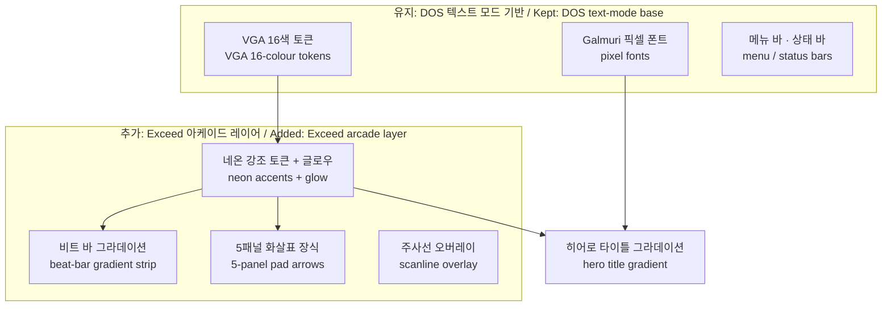

# 764: 프로젝트 사이트에 Pump It Up Exceed 분위기 입히기

## 배경

Task 756의 프로젝트 사이트는 DOS 텍스트 모드 컨셉(검은 화면, VGA 16색, Galmuri 픽셀 폰트,
EDIT.COM 메뉴 바)으로 만들어졌다. 사용자는 이 8비트 레트로 기반 위에 보존 대상 게임의
아케이드 감성, 구체적으로 **Pump It Up Exceed / Exceed 2(2004–2005)** 시기의 분위기를
더하길 원한다.

Exceed 시기의 시각 언어는 다음과 같다.

* 검은 바탕 위의 네온 발광: 마젠타·핑크, 시안·전광 블루, 노랑.
* 그라데이션과 글로우가 들어간 로고 타이포그래피.
* 5패널 펌프 발판(↙ ↖ ● ↗ ↘)과 화살표 노트 모티프.
* 그루브/라이프 미터 같은 수평 그라데이션 바.
* 아케이드 CRT 모니터의 주사선.

## 설계 원칙

DOS 베이스를 교체하지 않고 **그 위에 아케이드 레이어를 더한다**. 원본 PIU도 DOS 위에서
돌던 게임이므로 두 정체성은 충돌하지 않는다.

유지하는 것: 검은 배경, Galmuri 픽셀 폰트와 픽셀 정렬 수치, EDIT.COM 메뉴 바·상태 바,
프롬프트 연출, 이중선 박스 프레임, VGA 16색을 기본 팔레트로 쓰는 원칙.

더하는 것: VGA 팔레트 안에서 고르는 네온 강조색(`#ff55ff`, `#55ffff`, `#ffff55`)과
알파 글로우, 그라데이션 포인트 몇 곳, 발판 화살표 장식, 주사선 오버레이.

## 변경 내역

### 색 토큰 (`static/css/site.css`)

* VGA 16색에서 빠져 있던 `--magenta #aa00aa`, `--light-magenta #ff55ff`를 추가해
  팔레트를 완성한다.
* 네온 역할 토큰을 더한다: `--neon-pink`(= light-magenta), `--neon-cyan`(= light-cyan),
  `--neon-yellow`(= yellow)와 글로우용 반투명 변형. 글로우는 `box-shadow`/`text-shadow`/
  `drop-shadow`의 알파 색으로만 표현하고, 면 색 자체는 VGA 16색을 벗어나지 않는다.

### 사이트 공통

* **비트 바**: 메뉴 바 바로 아래 전 페이지에 4px 수평 그라데이션 스트립
  (마젠타→노랑→시안, 약한 글로우). Exceed의 그루브 미터를 암시한다. `base.html`에
  `.beatbar` 요소 추가.
* **주사선**: `body::after`로 화면 고정 `repeating-linear-gradient` 오버레이를 아주
  약하게(검정 알파 ≤ 0.14) 깐다. 포인터 이벤트 없음. 애니메이션이 아니므로
  `prefers-reduced-motion` 예외는 불필요.
* **선택 영역**: `::selection`을 시안에서 마젠타 배경으로 바꾼다.
* `h3::before`의 `■` 마커를 마젠타 계열로 바꿔 포인트를 준다.

### 히어로 (index, 404)

* **타이틀**: 흰색→시안→블루→마젠타 세로 그라데이션을 `background-clip: text`로 입히고,
  기존 4px 하드 섀도는 `filter: drop-shadow`로 유지한 채 네온 글로우를 겹친다.
  `@supports` 분기로 미지원 브라우저는 기존 흰색+파란 섀도를 유지한다.
* **발판 화살표**: 타이틀 위에 5패널(↙ ↖ ● ↗ ↘) 픽셀 화살표를 인라인 SVG
  (`shape-rendering="crispEdges"`, `aria-hidden`)로 그린다. 대각 화살표는 위 두 개가
  핑크, 아래 두 개가 시안, 중앙 패널은 노랑이며 각각 `drop-shadow` 글로우를 받는다.
  중앙 패널만 느린 글로우 펄스 애니메이션을 갖고, `prefers-reduced-motion`에서 끈다.
  404 페이지에도 같은 장식을 둔다.

### 구성 요소

* **버튼**: 시안 계열 세로 그라데이션 + 네온 글로우. 호버 시 핑크 글로우가 섞인다.
  기존 하드 섀도와 눌림(translate) 동작은 유지한다.
* **박스**: `.box`의 이중선 프레임에 약한 시안 글로우를 더한다. `box--warn`은 노랑
  글로우. `box--plain`은 글로우 없음.
* **배지·타임라인**: `badge--latest`와 타임라인 최신 마커를 마젠타로 바꾸고 글로우를
  준다.
* **파비콘**: 프롬프트 `>`는 시안 유지, 커서 블록만 마젠타로 바꿔 테마를 잇는다.

### 범위 밖

* Mermaid 다이어그램 테마(파랑 계열 유지), i18n 문구, 빌드 스크립트는 바꾸지 않는다.

## 검증

`python scripts/site/build_site.py --offline`으로 빌드가 통과하고(내부 링크 검사 포함),
로컬 서버로 index / wip / download / post / 404 페이지를 열어 렌더링을 확인한다.

---

# 764: A Pump It Up Exceed mood for the project site

## Background

The Task 756 project site is styled as DOS text mode (black screen, VGA 16 colours, Galmuri
pixel fonts, an EDIT.COM menu bar). The user wants the arcade feel of the preserved game
added on top of this 8-bit retro base — specifically the **Pump It Up Exceed / Exceed 2
(2004–2005)** era.

The Exceed-era visual language: neon glow on black (magenta/pink, cyan/electric blue,
yellow), gradient logo typography with glow, the five-panel pump pad (↙ ↖ ● ↗ ↘) and arrow
notes, horizontal gradient groove/life meters, and arcade CRT scanlines.

## Design principle

The DOS base is not replaced; an **arcade layer is added on top of it**. The original PIU
itself ran on DOS, so the two identities do not conflict.

Kept: the black background, the Galmuri pixel fonts and their pixel-aligned metrics, the
EDIT.COM menu/status bars, the prompt framing, the double-line box frames, and VGA 16 as
the base palette. Added: neon accents chosen from within the VGA palette (`#ff55ff`,
`#55ffff`, `#ffff55`) with alpha glows, a few gradient accents, pad-arrow decoration, and a
scanline overlay. (The diagram in the Korean section shows the two layers.)

## Changes

### Colour tokens (`static/css/site.css`)

* Complete the VGA 16 palette with the missing `--magenta #aa00aa` and
  `--light-magenta #ff55ff`.
* Add neon role tokens — `--neon-pink` (= light-magenta), `--neon-cyan` (= light-cyan),
  `--neon-yellow` (= yellow) — plus translucent glow variants. Glow lives only in
  `box-shadow`/`text-shadow`/`drop-shadow` alpha colours; surface colours stay within VGA 16.

### Site-wide

* **Beat bar**: a 4px horizontal gradient strip (magenta→yellow→cyan, soft glow) directly
  under the menu bar on every page, hinting at Exceed's groove meter. A `.beatbar` element
  in `base.html`.
* **Scanlines**: a fixed `repeating-linear-gradient` overlay on `body::after`, very faint
  (black alpha ≤ 0.14), no pointer events. It is static, so no `prefers-reduced-motion`
  branch is needed.
* **Selection**: `::selection` moves from cyan to a magenta background.
* The `■` marker of `h3::before` turns magenta.

### Hero (index, 404)

* **Title**: a white→cyan→blue→magenta vertical gradient via `background-clip: text`; the
  existing 4px hard shadow survives as `filter: drop-shadow`, layered with neon glow. An
  `@supports` branch keeps the old white-with-blue-shadow look where unsupported.
* **Pad arrows**: the five panels (↙ ↖ ● ↗ ↘) drawn above the title as inline pixel SVGs
  (`shape-rendering="crispEdges"`, `aria-hidden`). Upper diagonals pink, lower diagonals
  cyan, centre panel yellow, each with a `drop-shadow` glow. Only the centre panel has a
  slow glow pulse, disabled under `prefers-reduced-motion`. The 404 page gets the same
  decoration.

### Components

* **Buttons**: a cyan vertical gradient plus neon glow; hover mixes in pink glow. The hard
  shadow and the pressed translate behaviour stay.
* **Boxes**: `.box` double frames gain a faint cyan glow; `box--warn` a yellow one;
  `box--plain` none.
* **Badges / timeline**: `badge--latest` and the latest timeline marker turn magenta with
  glow.
* **Favicon**: the `>` prompt stays cyan; the cursor block turns magenta.

### Out of scope

The Mermaid diagram theme (kept blue), the i18n copy, and the build script are unchanged.

## Verification

`python scripts/site/build_site.py --offline` must pass (including the internal link
check), and the index / wip / download / post / 404 pages are inspected on a local server.
