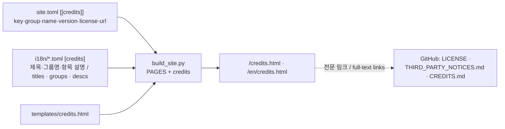

# 765: CREDITS · LICENSE 정비와 사이트 크레딧 페이지

## 배경

프로젝트는 외부 소스를 여럿 사용하지만 표기가 고르지 않다.

* 루트에 `LICENSE` 파일이 없다. AGENTS.md는 BSD 3-Clause를 기준으로 정했고, README는
  "정식 LICENSE 파일이 없으니 재배포 조건을 추정하지 말라"는 자리표시 문구를 담고 있다.
* `THIRD_PARTY_NOTICES.md`는 Zydis·Dear ImGui·libchdr·MAME 알고리즘·minimp3·Galmuri·사이트
  빌드 도구를 다루지만, 실제 의존성인 **SDL3(zlib), spdlog(MIT), GoogleTest(BSD-3)** 가
  빠져 있다.
* 프로젝트 사이트에는 라이선스·크레딧 항목이 없다(푸터의 폰트 한 줄뿐).

## 방향: 널리 쓰이는 관례

| 파일/페이지 | 관례 | 역할 |
|---|---|---|
| `LICENSE` | GitHub licensee가 인식하는 표준 위치·이름 | 프로젝트 자체의 라이선스 전문 (BSD 3-Clause) |
| `THIRD_PARTY_NOTICES.md` | VS Code, .NET 등의 서드파티 고지 관례 | 법적 고지: 구성 요소별 출처·버전·라이선스 전문 링크 |
| `CREDITS.md` | Linux 커널 `CREDITS`, MAME류의 감사 표기 | 감사·출처: 원작과 상위 프로젝트, 글꼴, 도구에 대한 사람 중심 표기 |
| 사이트 `credits.html` | 앱·게임의 "오픈소스 라이선스" 화면, OSS 사이트의 credits/acknowledgements 페이지 | 방문자용 요약 표 + 저장소 전문 링크 |

법적 고지(NOTICES)와 감사(CREDITS)를 분리하는 것이 요점이다. 전자는 라이선스 의무
이행, 후자는 프로젝트가 기대어 선 것들의 소개다. 사이트 페이지는 요약만 보여 주고
전문은 GitHub의 파일로 링크해 중복 관리를 피한다.

## 변경 내역

### 저장소

* `LICENSE`: BSD 3-Clause 전문, `Copyright (c) 2026 Kitae Noh`. 라이선스 전문은 영어
  원문 그대로 두는 것이 관례이므로 한국어 병기 규칙을 적용하지 않는다.
* `THIRD_PARTY_NOTICES.md`: SDL 3.4.10(zlib), spdlog v1.14.1(MIT), GoogleTest
  v1.14.1(BSD-3, 테스트 전용·배포물 미포함) 절을 기존 형식대로 추가한다.
* `CREDITS.md`(신규): 한국어 먼저, 영어 번역. 원작(Pump It Up, Andamiro)에 대한
  비공식·무관 고지와 감사, MAME 참조 코드(windyfairy, smf), 사용하는 오픈소스 목록,
  Galmuri 글꼴, 전문 문서로의 링크.
* `README.md`: 라이선스 절의 자리표시 문구를 `LICENSE` 존재 기준으로 바꾸고
  `CREDITS.md` 링크를 더한다.

### 사이트

* `site.toml`에 `[[credits]]` 목록(언어 중립: key, group, name, version, license, url)을
  둔다. 그룹은 `runtime`(실행 파일에 포함·링크), `dev`(개발·테스트 전용), `site`(사이트와
  문서) 셋이다.
* `i18n/ko.toml`·`en.toml`에 `[nav] credits`와 `[credits]` 절(제목, 리드, 그룹 제목,
  항목별 한 줄 설명, 원작 고지, 전문 링크 문구)을 추가한다. 두 파일의 키 구조는 같다.
* `templates/credits.html`: 프롬프트(`type CREDITS.TXT`) 헤더, 원작 고지 박스, 그룹별
  구성 요소 표(이름 링크·버전·라이선스 배지·설명), 저장소 전문 링크 박스.
* `build_site.py`: `PAGES`에 `credits` 추가, 제목 매핑과 그룹 정렬 컨텍스트 제공.
* `base.html` 메뉴에 F4 크레딧을 넣고 GitHub를 F5로 민다.
* `site.css`: `.credits` 목록(플랫폼 목록과 같은 그리드, 라이선스 배지 열) 스타일.

### 범위 밖

의존성 자체의 버전 변경, 라이선스 전문 사이트 게재(링크로 대체), 실행 파일 내 크레딧
화면.

## 검증

`build_site.py --offline` 빌드와 내부 링크 검사 통과, headless 브라우저로 한국어·영어
크레딧 페이지 렌더링 확인.

---

# 765: CREDITS · LICENSE cleanup and a site credits page

## Background

The project uses several external sources but the attribution is uneven: the root has no
`LICENSE` file (AGENTS.md names BSD 3-Clause as the baseline and the README carries a
placeholder warning); `THIRD_PARTY_NOTICES.md` covers Zydis, Dear ImGui, libchdr, the MAME
algorithms, minimp3, Galmuri and the site build tools but misses the actual dependencies
**SDL3 (zlib), spdlog (MIT) and GoogleTest (BSD-3)**; and the site has no licence/credits
entry beyond the footer's font line.

## Direction: widely used practice

`LICENSE` in the standard GitHub-recognised location holds the project's own licence text;
`THIRD_PARTY_NOTICES.md` (the VS Code / .NET convention) stays the legal third-party
inventory; a new `CREDITS.md` (the Linux-kernel / MAME convention) carries the
people-facing acknowledgements; and a site `credits.html` page — the "open-source
licences" screen convention — shows a visitor-facing summary table linking to the full
texts on GitHub. Separating legal notices from acknowledgements is the point; the site
page only summarises and links so nothing is maintained twice.

## Changes

Repository: `LICENSE` (BSD 3-Clause, `Copyright (c) 2026 Kitae Noh`; licence texts stay in
their original English, so the bilingual rule does not apply), the three missing notice
sections (SDL 3.4.10, spdlog v1.14.1, GoogleTest v1.14.1 — test-only, not shipped), a new
bilingual `CREDITS.md` (unofficial/no-affiliation notice and thanks to the original game,
the MAME references by windyfairy and smf, the open-source list, the Galmuri font, links to
the full documents), and a README licence section updated to reflect the real `LICENSE`.

Site: a language-neutral `[[credits]]` list in `site.toml` (key, group, name, version,
license, url; groups `runtime` / `dev` / `site`), `[nav] credits` plus a `[credits]`
section in both i18n files, a `credits.html` template (prompt header, original-game notice
box, per-group component tables with name link, version, licence badge and description, a
full-text links box), `credits` added to `PAGES` in `build_site.py`, an F4 menu entry
(GitHub moves to F5), and `.credits` list styles. The diagram in the Korean section shows
the data flow.

Out of scope: dependency version changes, hosting full licence texts on the site, an
in-executable credits screen.

## Verification

`build_site.py --offline` passes with the link check, and the Korean and English credits
pages are inspected with a headless browser.
