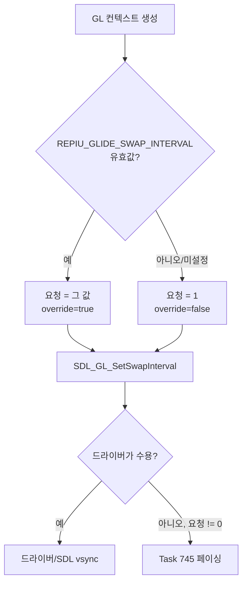
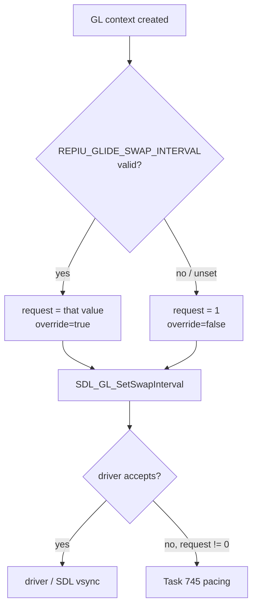

# vsync 기본값 켜기 / Vertical sync on by default

Task 766.

* 선행: [20260731-371](20260731-371-glide-swap-interval-override.md),
  [20260927-745](20260927-745-swap-pacing-when-vsync-refused.md),
  [20260927-746](20260927-746-apply-ini-settings-on-argument-runs.md)

## 한국어

### 1. 문제

Task 371은 swap interval을 측정용으로만 강제하도록 설계했습니다.
`REPIU_GLIDE_SWAP_INTERVAL`이 없으면 엔진은 `SDL_GL_SetSwapInterval`을 부르지 않고
SDL이나 드라이버의 기본값을 그대로 씁니다. 그 기본값이 플랫폼마다 다릅니다.

| 호스트 | 미설정 시 결과 | 이유 |
|---|---|---|
| Win32, WSL(X11/GLX) | vsync 켜짐 | 드라이버 기본값(Mesa `vblank_mode=1` 등) |
| Linux 네이티브 Wayland | **vsync 꺼짐** | SDL Wayland는 EGL interval을 0으로 두고, 앱이 interval을 요청할 때만 frame callback으로 직접 vsync를 맞춤(`SDL_waylandopengles.c`) |

그래서 같은 빌드도 Linux 네이티브 Wayland에서는 프레임 상한 없이 실행됩니다.
런처도 `cfg/repiu.ini`에 `swap_interval`이 없으면 체크박스를 꺼진 상태로 보여 주고 아무
값도 넘기지 않습니다.

### 2. 결정

플레이 실행의 기본값을 **vsync 켜짐(interval 1)** 으로 바꾸고, 환경 변수나 설정으로 끌 수
있게 합니다.

| 입력 | 결과 |
|---|---|
| `REPIU_GLIDE_SWAP_INTERVAL` 유효값(`-1`~`4`) | 그 값 (기존과 같음) |
| `[Video] swap_interval` (`cfg/repiu.ini`) | 런처가 같은 환경 변수로 게시 (기존과 같음, 환경 변수가 우선) |
| 둘 다 없음, 또는 형식이 틀린 값 | **기본값 1** (기존에는 아무것도 하지 않음) |

* 엔진은 항상 컨텍스트 생성 직후 `SDL_GL_SetSwapInterval`을 한 번 부릅니다. 그래서 Task 745의
  거부 대응(드라이버가 거부하면 주사율에 맞춘 페이싱)도 기본값에 그대로 적용됩니다.
* 형식이 틀린 값은 지금처럼 다른 값으로 바꿔 해석하지 않습니다. override로 인정하지 않고
  기본값으로 실행하며, 최종 보고의 `override requested=false`가 그 사실을 보여 줍니다.
* 런처의 "Wait for vertical sync"는 저장된 값이 없으면 체크된 상태로 보입니다. 끄고 저장하면
  `swap_interval = 0`이 기록됩니다.
* 측정 절차는 이미 `REPIU_GLIDE_SWAP_INTERVAL=0`을 명시합니다
  ([execution-frame-rate-measurement](../guides/execution-frame-rate-measurement.md),
  [gameplay-scene-capture](../guides/gameplay-scene-capture.md),
  [glide-setter-elision-testing](../guides/glide-setter-elision-testing.md),
  `scripts/task509_frame_rate_measure.sh`). 이 절차들의 결과는 바뀌지 않습니다.

### 3. 코드 구조

* `glide_swap_interval_policy`: `kDefaultGlideSwapInterval = 1`과
  `ResolveGlideSwapInterval(const char* value, std::int32_t* interval)`을 둡니다. 순수 함수이며
  override 여부를 반환하고, 항상 `interval`을 채웁니다. `TryReadGlideSwapIntervalOverride`는
  이 함수로 대체합니다.
* `glide_opengl_backend.cpp`: 조건 분기 없이 위 결과를 적용합니다.
* `main.cpp` 최종 보고: 페이싱 줄은 override가 아니라 항상 출력합니다(이제 interval은 항상
  요청되므로).
* `launcher_ui.cpp`: 저장된 값이 없을 때 체크박스 표시를 켜짐으로 바꿉니다.

플랫폼 분기는 없습니다. SDL이 플랫폼 차이를 흡수하고, 엔진은 모든 호스트에서 같은 값을 요청합니다.

### 4. 검증

* `aot_probe`의 `glide_swap_interval` probe에 기본값 해석(미설정, 형식 오류 → 1, override=false;
  유효값 → 그 값, override=true)을 추가합니다.
* Linux x64 빌드 후 Wayland에서 환경 변수 없이 실행해 최종 보고가
  `override requested/value/applied/effective: false/1/true/1`인지 확인하고,
  `REPIU_GLIDE_SWAP_INTERVAL=0`이면 `true/0/true/0`인지 확인합니다.

### 5. 위험

| 위험 | 완화 |
|---|---|
| 환경 변수 없이 성능을 재던 스크립트가 60 Hz에 묶임 | 문서화된 측정 절차는 모두 `=0`을 명시. 기본값 변경은 README에 기록 |
| 드라이버가 interval 1을 거부 | Task 745 페이싱이 대신함. 최종 보고에 거부 사유 출력 |

## English

### 1. Problem

Task 371 made the swap interval a measurement-only override. Without
`REPIU_GLIDE_SWAP_INTERVAL` the engine never calls `SDL_GL_SetSwapInterval` and keeps whatever
SDL or the driver chose, and that default differs by platform.

| Host | Result when unset | Why |
|---|---|---|
| Win32, WSL (X11/GLX) | vsync on | driver default (Mesa `vblank_mode=1` and the like) |
| Native Linux Wayland | **vsync off** | SDL's Wayland backend keeps the EGL interval at 0 and paces with frame callbacks only when the app asks for an interval (`SDL_waylandopengles.c`) |

So the same build runs uncapped on native Linux Wayland. The launcher, too, shows its checkbox
off and publishes nothing when `cfg/repiu.ini` holds no `swap_interval`.

### 2. Decision

A play run defaults to **vsync on (interval 1)**; an environment variable or the setting turns it
off.

| Input | Result |
|---|---|
| A valid `REPIU_GLIDE_SWAP_INTERVAL` (`-1` to `4`) | that value (unchanged) |
| `[Video] swap_interval` in `cfg/repiu.ini` | published by the launcher into the same variable (unchanged; the variable wins) |
| Neither, or a malformed value | **default 1** (previously: nothing) |

* The engine always calls `SDL_GL_SetSwapInterval` once right after the context is created, so
  Task 745's refusal handling (pacing at the refresh rate when the driver refuses) covers the
  default as well.
* A malformed value is still never coerced into another value: it does not count as an override,
  the run uses the default, and the final report's `override requested=false` shows it.
* The launcher's "Wait for vertical sync" reads as checked when nothing is stored; turning it off
  and saving writes `swap_interval = 0`.
* The measurement procedures already set `REPIU_GLIDE_SWAP_INTERVAL=0` explicitly
  ([execution-frame-rate-measurement](../guides/execution-frame-rate-measurement.md),
  [gameplay-scene-capture](../guides/gameplay-scene-capture.md),
  [glide-setter-elision-testing](../guides/glide-setter-elision-testing.md),
  `scripts/task509_frame_rate_measure.sh`), so their results do not change.

### 3. Code structure

* `glide_swap_interval_policy`: adds `kDefaultGlideSwapInterval = 1` and
  `ResolveGlideSwapInterval(const char* value, std::int32_t* interval)`, a pure function that
  always fills `interval` and returns whether it was an override. It replaces
  `TryReadGlideSwapIntervalOverride`.
* `glide_opengl_backend.cpp`: applies that result unconditionally.
* Final report in `main.cpp`: the pacing lines print always rather than only for an override,
  since an interval is now always requested.
* `launcher_ui.cpp`: the checkbox reads as on when nothing is stored.

There is no platform branch: SDL absorbs the platform difference and the engine requests the same
value on every host.

### 4. Verification

* Extend the `aot_probe` `glide_swap_interval` probe with the default resolution (unset or
  malformed → 1, override=false; valid → that value, override=true).
* Build Linux x64, run under Wayland without the variable and check the final report reads
  `override requested/value/applied/effective: false/1/true/1`, and `true/0/true/0` with
  `REPIU_GLIDE_SWAP_INTERVAL=0`.

### 5. Risks

| Risk | Mitigation |
|---|---|
| A script that measured speed without the variable becomes capped at 60 Hz | every documented measurement procedure sets `=0`; the default change is recorded in the README |
| The driver refuses interval 1 | Task 745 pacing stands in, and the final report prints the reason |
