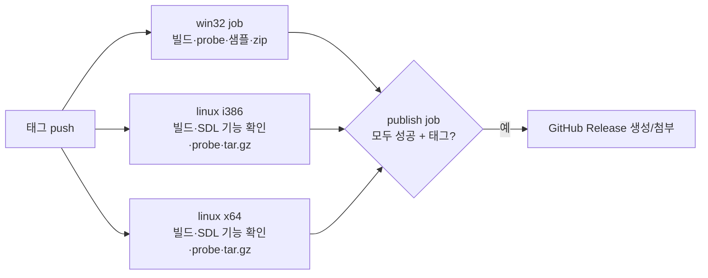
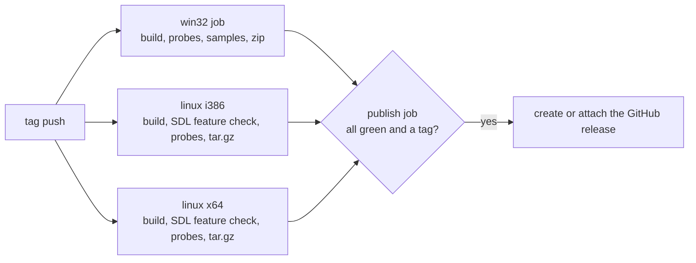

# GitHub 릴리스에 Linux i386·x64 포함 / Linux i386 and x64 in the GitHub release

Task 767.

* 선행: [20260806-434](20260806-434-github-actions-release-ci.md) (릴리스 워크플로),
  [20261003-766](20261003-766-vsync-default-on.md)
* 절차: [docs/guides/release-and-ci.md](../guides/release-and-ci.md)

## 한국어

### 1. 현황

`release.yml`은 `windows-2022` job 하나가 빌드, probe, OpenWatcom 샘플 검사, 패키징,
Release 게시를 모두 맡습니다. Release에는 `rePIU-v<version>-win32.zip`과 샘플 리포트만 붙습니다.
Linux 빌드(`build_linux_i386.sh`, `build_linux_x64.sh`)는 로컬에서만 만들어집니다.

로컬 빌드는 배포용으로 쓸 수 없습니다. Ubuntu 25.10에서 만든 `repiu`는 `GLIBC_2.43`을
요구하고 `libstdc++.so.6`을 동적으로 링크합니다. 빌드한 배포판보다 오래된 배포판에서는 실행되지 않습니다.

### 2. 결정

| 항목 | 결정 | 이유 |
|---|---|---|
| job 구조 | `win32`, `linux`(matrix: `i386`, `x64`), `publish` | 게시를 한 곳에 모아 job끼리 Release를 동시에 만들려는 경쟁을 없앰 |
| Linux 러너 | `ubuntu-22.04` 고정 | glibc 2.35 기준으로 빌드해 그 이후 배포판에서 실행되게 함. 러너 이미지를 고정하는 이유는 Win32와 같음 |
| C++ 런타임 | `libstdc++`, `libgcc`를 정적 링크 (`REPIU_STATIC_RUNTIME`) | 오래된 배포판의 `GLIBCXX` 버전 부족을 피함 |
| 그 밖의 런타임 의존성 | `libGL`, `libc`만 동적 링크. SDL은 정적 링크이며 X11, Wayland, libdecor, PulseAudio, ALSA는 실행 시 `dlopen` | 지금 빌드 구성과 같음 |
| 압축 형식 | `rePIU-v<version>-linux-i386.tar.gz`, `…-linux-x64.tar.gz` | 실행 권한 비트를 보존함 |
| 포함 파일 | `repiu`, `repiu_launcher`, `repiu_chd_cd_probe`, `repiu_glide_issue_probe`, `repiu_core_probe`, `VERSION`, `README.md`, `THIRD_PARTY_NOTICES.md`, `LICENSE`, `CREDITS.md` | Win32 패키지와 대응 |
| 게시 조건 | 세 job이 모두 성공한 태그 실행만 | Win32의 기존 규칙(샘플 리포트 필수)을 유지 |

### 3. 조용한 실패 방지

빌드 스크립트는 32비트 `libpulse`나 `libdecor`가 없어도 경고만 내고 빌드를 계속합니다.
그러면 소리가 나지 않거나 Wayland에서 제목 표시줄이 없는 바이너리가 나옵니다. CI에서는 이것을
실패로 처리합니다. 빌드 후 SDL의 `CMakeCache.txt`에서 다음 기능이 켜졌는지 확인합니다:
X11, Wayland, libdecor, PulseAudio, ALSA.

### 4. 코드와 스크립트

* `CMakeLists.txt`: `option(REPIU_STATIC_RUNTIME ...)`(기본 OFF). 켜면 GCC/Clang 링크에
  `-static-libstdc++ -static-libgcc`를 추가합니다. 로컬 개발 빌드는 바뀌지 않습니다.
* `build_linux_i386.sh`, `build_linux_x64.sh`: `--static-runtime`. i386 스크립트는
  `CMAKE_EXE_LINKER_FLAGS=-m32`를 덮어쓰므로 CMake 옵션으로 전달합니다.
* `scripts/package_release_linux.sh <i386|x64> [build-dir]`: 이미 빌드된 트리를 묶습니다.
  `package_release.ps1`처럼 빌드하지 않습니다.
* `release.yml`: 위 job 구조. 기존 Win32 단계는 그대로 두고, 게시 단계만 `publish` job으로 옮깁니다.

### 5. 검증

* 로컬: x64 Release에 `--static-runtime`을 적용해 빌드하고 패키징합니다. 이어서 `ldd`로 `libstdc++`가
  없는지, `objdump -T`로 요구하는 glibc 버전을 확인합니다.
* i386: 이 머신에는 32비트 툴체인이 없어 CI에서만 검증합니다. 브랜치에서 `workflow_dispatch`로
  수동 실행하면 Release를 만들지 않고 아티팩트만 남깁니다.
* CI 산출물: ubuntu-22.04에서 만든 바이너리의 최고 요구 glibc 버전이 2.35 이하인지 job 안에서 확인합니다.

### 6. 위험과 한계

| 위험 | 대응 |
|---|---|
| 22.04의 32비트 개발 패키지 조합이 설치되지 않음 | 첫 수동 실행에서 확인. 실패하면 목록을 조정 |
| i386 바이너리를 실행하는 쪽에 32비트 런타임 라이브러리(`libgl1:i386`, `libdecor-0-0:i386` 등)가 필요 | 릴리스 안내(가이드)에 명시 |
| CI 통과가 게임 실행을 뜻하지 않음 | 기존과 같음. 게임 실행 검증은 로컬 수작업 |

## English

### 1. Current state

`release.yml` runs one `windows-2022` job that builds, probes, checks the OpenWatcom samples,
packages and publishes. The release carries only `rePIU-v<version>-win32.zip` and the sample
report. The Linux builds (`build_linux_i386.sh`, `build_linux_x64.sh`) exist only locally.

A local build is not distributable: `repiu` built on Ubuntu 25.10 needs `GLIBC_2.43` and links
`libstdc++.so.6` dynamically, so it does not run on a distribution older than the one it was
built on.

### 2. Decision

| Item | Decision | Why |
|---|---|---|
| Jobs | `win32`, `linux` (matrix `i386`, `x64`), `publish` | publishing happens in one place, so jobs never race to create the release |
| Linux runner | `ubuntu-22.04`, pinned | building against glibc 2.35 runs on that distribution and newer ones; pinned for the same reason as Win32 |
| C++ runtime | `libstdc++` and `libgcc` linked statically (`REPIU_STATIC_RUNTIME`) | avoids a missing `GLIBCXX` version on older distributions |
| Other runtime dependencies | only `libGL` and `libc` dynamic; SDL is static and `dlopen`s X11, Wayland, libdecor, PulseAudio and ALSA at run time | as the build already is |
| Archive | `rePIU-v<version>-linux-i386.tar.gz`, `…-linux-x64.tar.gz` | keeps the executable bits |
| Contents | `repiu`, `repiu_launcher`, `repiu_chd_cd_probe`, `repiu_glide_issue_probe`, `repiu_core_probe`, `VERSION`, `README.md`, `THIRD_PARTY_NOTICES.md`, `LICENSE`, `CREDITS.md` | mirrors the Win32 package |
| Publishing | only a tag run where all three jobs succeeded | keeps the Win32 rule (sample report required) |

### 3. Guarding the quiet failures

The build scripts only warn when the 32-bit `libpulse` or `libdecor` is missing, and the
binary then runs silent or without a title bar under Wayland. CI treats that as a failure:
after the build it checks SDL's `CMakeCache.txt` for X11, Wayland, libdecor, PulseAudio and ALSA.

### 4. Code and scripts

* `CMakeLists.txt`: `option(REPIU_STATIC_RUNTIME ...)` (default OFF) adds
  `-static-libstdc++ -static-libgcc` to the GCC/Clang link. Local development builds do not change.
* `build_linux_i386.sh`, `build_linux_x64.sh`: `--static-runtime`. It goes through the CMake
  option because the i386 script sets `CMAKE_EXE_LINKER_FLAGS=-m32` outright.
* `scripts/package_release_linux.sh <i386|x64> [build-dir]` packages an existing tree; like
  `package_release.ps1` it builds nothing.
* `release.yml`: the job structure above. The Win32 steps stay as they are; only publishing
  moves into the `publish` job.

### 5. Verification

* Local: build x64 Release with `--static-runtime`, package it, and use `ldd` to check that
  `libstdc++` is gone and `objdump -T` to see which glibc version it needs.
* i386: this machine has no 32-bit toolchain, so it is verified in CI only. A manual
  `workflow_dispatch` run on the branch creates no release and leaves the artifacts.
* CI output: the job checks that the highest glibc version a binary built on ubuntu-22.04
  needs is 2.35 or lower.

### 6. Risks and limits

| Risk | Response |
|---|---|
| The 32-bit development packages do not install together on 22.04 | found on the first manual run, and the list adjusted |
| Running the i386 binary needs 32-bit runtime libraries (`libgl1:i386`, `libdecor-0-0:i386` and the like) | stated in the release guide |
| A green CI run does not mean the game runs | unchanged; running the game is still verified locally by hand |
