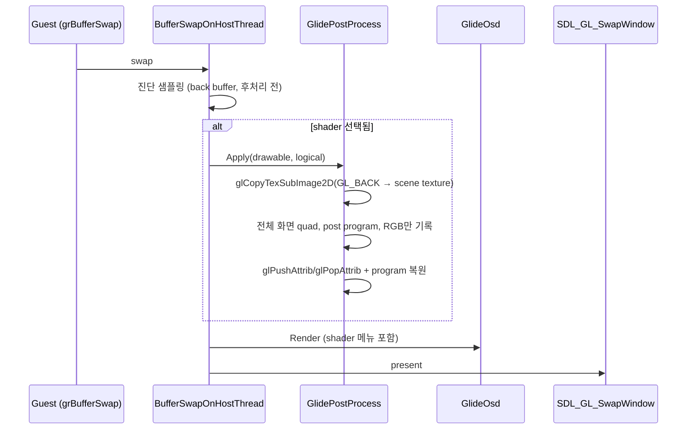
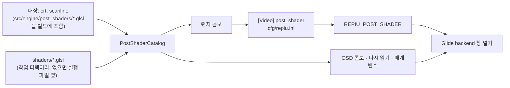

# 화면 후처리 shader / Post-processing shaders

Task 768.

* 선행: [20260929-761](20260929-761-glide-lfb-high-precision-and-osd.md) (in-game OSD),
  [20261003-766](20261003-766-vsync-default-on.md) (`cfg/repiu.ini` → 환경 변수 게시)

## 한국어

### 1. 요구사항

1. 게임이 완성한 화면에 후처리 shader를 적용한다.
2. shader는 별도 파일로 추가할 수 있어야 한다.
3. 메뉴에서 적용할 shader를 고를 수 있어야 한다.
4. 기본으로 번들 제공하는 shader는 `crt`와 `scanline` 두 가지다.

### 2. 원칙과 범위

후처리는 **표시 단계에서만** 일어납니다. 게스트가 볼 수 있는 상태(LFB staging, readback,
`grLfbReadRegion`)는 바뀌지 않으며, 원본 코드와 Glide HLE의 의미도 그대로입니다.
기본값은 `none`이고, 이때는 지금과 GL 호출 하나까지 같습니다.

범위 밖: 다단계 preset(`.glslp`), 이전 프레임 참조(`PrevTexture`), LUT 텍스처, GLES.
이 목록은 7절의 확장 방향에 둡니다.

### 3. 표시 경로

게임은 기본 프레임버퍼의 back buffer에 drawable 해상도로 직접 그리고, 모든 표시는
`BufferSwapOnHostThread`의 `SDL_GL_SwapWindow` 한 곳을 지납니다(`PresentLfbSurface`의
`present_to_front`도 `BufferSwap`을 부릅니다). 후처리는 그 직전, 진단 샘플링 뒤와 OSD
앞에 한 번 끼웁니다.

* **복사:** `glCopyTexSubImage2D`로 back buffer를 drawable 크기 RGBA8 텍스처에 복사합니다.
  GPU 안에서 끝나고 CPU readback은 없습니다. 크기가 바뀌면 텍스처를 다시 할당합니다.
* **그리기:** 같은 back buffer에 전체 화면 quad를 그립니다. color mask는 RGB만 열어
  알파를 보존합니다 — 창 알파가 compositor로 새지 않게 합니다.
* **상태 보존:** Glide 상태는 swap을 넘어 유지되므로 `glPushAttrib(GL_ALL_ATTRIB_BITS)`와
  현재 program 저장으로 앞뒤를 감쌉니다. 컨텍스트는 이미 compatibility이고(고정 기능
  `glBegin`·`glOrtho`를 씀), ImGui 렌더도 같은 방식으로 상태를 보존합니다.
* **실패:** 컴파일·링크가 실패하면 그 shader는 선택되지 않은 것으로 처리하고(`none`),
  이유를 로그와 OSD에 보입니다. 화면이 검게 되는 실패를 만들지 않습니다.

### 4. shader 파일 형식

사용자가 기존 자료를 그대로 쓸 수 있도록 **libretro 단일 pass GLSL(`.glsl`)의 부분집합**을
따릅니다. 한 파일에 vertex와 fragment가 함께 있고, 엔진이 두 번 컴파일하며 각각
`#define VERTEX`, `#define FRAGMENT`와 `#define PARAMETER_UNIFORM`을 넣습니다. 파일 첫
줄이 `#version`이면 그 줄 바로 뒤에 넣습니다.

| 이름 | 종류 | 값 |
|---|---|---|
| `VertexCoord` | attribute vec4 | 화면 사각형 꼭짓점, `0..1` |
| `TexCoord` | attribute vec4 | 텍스처 좌표, `0..1` (아래가 0) |
| `COLOR` | attribute vec4 | `(1,1,1,1)` |
| `MVPMatrix` | uniform mat4 | `0..1` → clip 공간 직교 투영 |
| `Texture` | uniform sampler2D | 장면 텍스처, unit 0, `GL_LINEAR` |
| `InputSize`, `TextureSize` | uniform vec2 | **게임 논리 해상도**(예: 640×480) |
| `OutputSize` | uniform vec2 | drawable 픽셀 크기 |
| `FrameCount` | uniform int | 후처리 적용 프레임 수 |
| `FrameDirection` | uniform int | 항상 1 |
| `#pragma parameter NAME "설명" 기본 최소 최대 [단계]` | uniform float | OSD 슬라이더로 조절 |

`InputSize`와 `TextureSize`를 실제 텍스처 크기가 아니라 **논리 해상도**로 알리는 것은
의도입니다. 게임은 창 배율에 맞춰 drawable 해상도로 그리지만, CRT의 주사선은 원래 출력의
480줄을 따라야 합니다. shader가 `TexCoord * TextureSize`로 계산하는 행 위치가 논리 행에
맞고, 표본은 고해상도 텍스처에서 선형 보간으로 얻습니다.

정점은 immediate mode로 보냅니다(`glVertexAttrib4f`, attribute 0이 정점을 발생). 위치를
`VertexCoord`=0, `TexCoord`=1, `COLOR`=2로 링크 전에 묶어 두고, `gl_MultiTexCoord0`을 쓰는
옛 shader를 위해 `glTexCoord4f`도 같이 줍니다.

### 5. shader 목록과 선택

* **id:** 내장은 `crt`, `scanline`, 사용자 파일은 파일 이름 그대로(`my_crt.glsl`)이고,
  `none`은 후처리 없음입니다. 확장자가 있어 내장과 겹치지 않습니다.
* **디렉터리:** `shaders/`. `cfg/`와 같은 규칙으로 작업 디렉터리를 먼저, 없으면 실행 파일
  디렉터리(`SDL_GetBasePath`)를 봅니다. `.glsl` 파일만, 이름순으로 나열합니다.
* **내장 shader:** 원본은 `src/engine/post_shaders/crt.glsl`, `scanline.glsl`이고 CMake가
  configure 때 생성 헤더로 넣습니다. 그래서 배포물에 파일이 없어도 항상 있습니다. 두 파일은
  이 프로젝트가 새로 작성하며 BSD 3-Clause입니다(GPL인 libretro `crt-geom` 등은 쓰지 않음).
* **우선순위:** `REPIU_POST_SHADER` 환경 변수 → `[Video] post_shader`(런처가 같은 변수로
  게시, 호출자가 정한 변수는 덮어쓰지 않음) → `none`. Task 766과 같은 관례입니다.
  알 수 없는 id는 경고를 남기고 `none`으로 실행합니다(fail-closed).
* **런처:** Options에 "Screen shader" 콤보를 두고 저장하면 `post_shader = <id>`를 씁니다.
* **OSD(Tab):** 같은 목록의 콤보로 실행 중에 바꿉니다. 변경은 그 실행에만 적용되고
  저장하지 않습니다. "Reload" 버튼은 목록을 다시 읽고 현재 shader를 다시 컴파일합니다
  (shader 작성 중 반복용). `#pragma parameter`가 있으면 슬라이더를 보입니다(실행 중에만).

### 6. 코드 구조

| 파일 | 책임 | GL 의존 |
|---|---|---|
| `include/repiu/engine/post_shader_source.h`, `src/engine/post_shader_source.cpp` | `#pragma parameter` 해석, vertex/fragment 소스 조립 | 없음 |
| `include/repiu/engine/post_shader_catalog.h`, `src/engine/post_shader_catalog.cpp` | 내장+디렉터리 목록, id 조회, 텍스트 읽기 | 없음 |
| `src/engine/post_shaders/*.glsl` | 내장 shader 원본 | — |
| `include/repiu/engine/glide_post_process.h`, `src/engine/glide_post_process.cpp` | GL 함수 해석, 컴파일, scene 텍스처, `Apply` | 있음 |
| `glide_opengl_backend.cpp` | 생성·초기 선택·`Apply` 호출·해제 (배선만) | — |
| `glide_osd.cpp` | 콤보, Reload, 슬라이더 | — |
| `launcher_settings.*`, `launcher_ui.cpp`, `host/loader/main.cpp` | ini 키, 게시, 콤보 | — |

플랫폼 분기는 없습니다. SDL3와 OpenGL compatibility 컨텍스트만 쓰므로 Win32, Linux i386,
Linux x64에서 같은 코드입니다.

### 7. 위험과 확장 방향

| 위험 | 완화 |
|---|---|
| swap 뒤 back buffer를 보존하는 드라이버에서, 게스트가 다시 그리지 않은 영역을 LFB seed readback이 읽으면 후처리된 픽셀이 들어갈 수 있음 | 원래도 swap 뒤 back buffer는 정의되지 않은 내용이라 게임이 의존하지 않음. 관측되면 swap 뒤 장면 텍스처를 back buffer로 되돌리는 단계를 추가 |
| 게임이 front buffer에 직접 그리는 경우 후처리를 거치지 않음 | 현재 ROM 세트는 back buffer + swap 경로. 문서화 |
| 프레임당 비용 | 선택 시에만: GPU 복사 1회 + quad 1개. `none`이면 분기 하나 |

확장: `.glslp` 다단계, OSD 매개변수 저장(`[Video] post_shader_param.*`), GLES 변형(Android).

### 8. 검증

1. `repiu_aot_probe`에 `post_shader_probe` 추가: `#pragma parameter` 해석, `#version` 뒤
   삽입 위치, 형식 오류 거부, 내장 두 개 존재·해석, 임시 디렉터리 목록(정렬, `.glsl`만),
   id 조회와 `none`.
2. `launcher_probe`에 `post_shader` 저장·읽기 왕복과 게시 우선순위 추가.
3. `repiu_glide_render_probe --opengl-post-shader`: 실제 GL 컨텍스트에서 흰 화면을 2배율로
   그려 `scanline` 강도 1이 밝은 행과 어두운 행을 번갈아 내는지, `crt`가 그려지고 휜 모서리가
   검은지, 없는 shader가 `none`으로 남는지, blend·viewport·program이 복원되는지 확인.
4. Win32 Debug 빌드와 probe 통과.
5. 수동: `REPIU_POST_SHADER=crt`로 실행해 화면 확인, Tab OSD로 `none`/`scanline`/`crt`
   전환, `shaders/`에 파일을 넣고 Reload. 로그의 `[repiu-post]` 줄 확인.
   절차는 [post-process-shaders 가이드](../guides/post-process-shaders.md)에 둡니다.

## English

### 1. Requirements

1. Apply a post-processing shader to the frame the game finished.
2. Shaders can be added as separate files.
3. The shader to apply is chosen from a menu.
4. Two shaders ship bundled: `crt` and `scanline`.

### 2. Principle and scope

Post-processing happens **at presentation only**. Guest-visible state (LFB staging, readback,
`grLfbReadRegion`) does not change, nor do the original code or the Glide HLE's semantics. The
default is `none`, which issues exactly the GL calls made today.

Out of scope: multi-pass presets (`.glslp`), previous-frame inputs (`PrevTexture`), LUT textures,
GLES. They are listed under the extension direction in section 7.

### 3. Presentation path

The game draws straight into the default framebuffer's back buffer at the drawable resolution,
and every present goes through `SDL_GL_SwapWindow` in `BufferSwapOnHostThread`
(`PresentLfbSurface`'s `present_to_front` also calls `BufferSwap`). The pass is inserted once
there, after the diagnostic sampling and before the OSD (see the sequence diagram above).

* **Copy:** `glCopyTexSubImage2D` copies the back buffer into a drawable-sized RGBA8 texture,
  entirely on the GPU with no CPU readback; the texture is reallocated when the size changes.
* **Draw:** one full-screen quad back into the same back buffer, with only RGB writable so the
  alpha channel is kept and never leaks window translucency to the compositor.
* **State:** Glide state persists across swaps, so the pass is wrapped in
  `glPushAttrib(GL_ALL_ATTRIB_BITS)` plus saving the current program. The context is already a
  compatibility one (it uses fixed-function `glBegin` and `glOrtho`), and ImGui preserves state
  the same way.
* **Failure:** a compile or link failure leaves the shader unselected (`none`) and the reason is
  shown in the log and the OSD. A failure never turns the screen black.

### 4. Shader file format

So that existing material works as-is, the format is **a subset of libretro single-pass GLSL
(`.glsl`)**: vertex and fragment stages in one file, compiled twice with `#define VERTEX` or
`#define FRAGMENT` plus `#define PARAMETER_UNIFORM` inserted (after the first line when that line
is `#version`). The interface is the table in the Korean section: `VertexCoord`, `TexCoord`,
`COLOR` attributes; `MVPMatrix`, `Texture`, `InputSize`, `TextureSize`, `OutputSize`,
`FrameCount`, `FrameDirection` uniforms; and `#pragma parameter` floats exposed as OSD sliders.

`InputSize` and `TextureSize` deliberately report **the game's logical resolution** (for example
640×480), not the texture's real size. The game renders at the drawable resolution to match the
window scale, but CRT scanlines must follow the original output's 480 lines: the row a shader
computes from `TexCoord * TextureSize` lands on a logical row, while samples come from the
high-resolution texture through linear filtering.

Vertices are sent in immediate mode (`glVertexAttrib4f`; attribute 0 provokes the vertex), with
`VertexCoord`=0, `TexCoord`=1 and `COLOR`=2 bound before linking, and `glTexCoord4f` also given
for older shaders that read `gl_MultiTexCoord0`.

### 5. Catalog and selection

* **Ids:** built-ins are `crt` and `scanline`; user files are their file name (`my_crt.glsl`);
  `none` means no pass. The extension keeps the two namespaces apart.
* **Directory:** `shaders/`, resolved like `cfg/`: the working directory first, otherwise the
  executable's directory (`SDL_GetBasePath`). Only `.glsl` files, sorted by name.
* **Built-ins:** the sources are `src/engine/post_shaders/crt.glsl` and `scanline.glsl`, embedded
  by CMake at configure time into a generated header, so they exist even when a package ships no
  files. Both are written fresh for this project under BSD 3-Clause (no GPL libretro shader such
  as `crt-geom` is used).
* **Precedence:** the `REPIU_POST_SHADER` environment variable, then `[Video] post_shader`
  (published by the launcher into that variable, never overwriting one the caller set), then
  `none` — the Task 766 convention. An unknown id logs a warning and runs with `none`
  (fail-closed).
* **Launcher:** a "Screen shader" combo under Options; saving writes `post_shader = <id>`.
* **OSD (Tab):** the same list as a combo that switches during the run, for that run only. A
  "Reload" button rescans the directory and recompiles the current shader for authoring loops.
  `#pragma parameter` entries appear as sliders, also for the run only.

### 6. Code structure

See the table in the Korean section: two GL-free modules (`post_shader_source` for parsing and
assembling sources, `post_shader_catalog` for listing and loading), the embedded `.glsl` sources,
the GL module `glide_post_process`, and wiring only in the backend, OSD, launcher settings, UI and
loader host. There is no platform branch: SDL3 and an OpenGL compatibility context are all it
uses, so Win32, Linux i386 and Linux x64 share the code.

### 7. Risks and extension direction

| Risk | Mitigation |
|---|---|
| On a driver that preserves the back buffer across swaps, an LFB seed readback of a region the guest never redrew could pick up post-processed pixels | The back buffer after a swap is undefined content already, so the game does not rely on it. If observed, add a step restoring the scene texture into the back buffer after the swap |
| A game drawing to the front buffer directly bypasses the pass | Current ROM sets use the back buffer plus swap path. Documented |
| Per-frame cost | Only when selected: one GPU copy and one quad. `none` costs one branch |

Extensions: multi-pass `.glslp`, persisting OSD parameters (`[Video] post_shader_param.*`), a GLES
variant (Android).

### 8. Verification

1. Add `post_shader_probe` to `repiu_aot_probe`: `#pragma parameter` parsing, insertion after
   `#version`, rejection of malformed input, both built-ins present and parsed, a temporary
   directory listing (sorted, `.glsl` only), id lookup and `none`.
2. Extend `launcher_probe` with a `post_shader` save/load round trip and publish precedence.
3. `repiu_glide_render_probe --opengl-post-shader`: in a real GL context, a white frame at 2x must
   come out of `scanline` at full strength with alternating bright and dark rows, `crt` must draw
   with its curved-off corner black, a missing shader must stay `none`, and blend, viewport and
   program must be restored.
4. Win32 Debug build and the probes pass.
5. Manual: run with `REPIU_POST_SHADER=crt`, switch `none`/`scanline`/`crt` from the Tab OSD, drop a
   file into `shaders/` and press Reload, and check the `[repiu-post]` log lines. The procedure is in
   the [post-process shaders guide](../guides/post-process-shaders.md).
