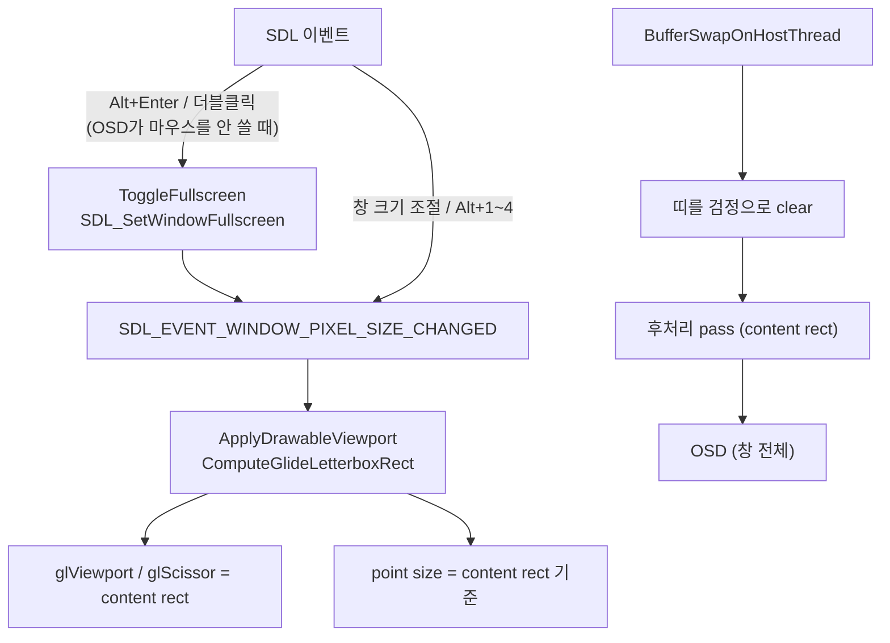

# 전체화면 전환과 화면 비율 유지 / Fullscreen toggle and aspect-preserving scaling

Task 769.

* 선행: [20261004-768](20261004-768-post-process-shaders.md) (후처리 pass),
  [Viewport 비례 Glide point raster](../../ARCHITECTURE.md)

## 한국어

### 1. 요구사항과 현재 상태

1. 게임 창을 더블클릭하거나 `Alt+Enter`를 누르면 전체화면과 창 모드를 오갑니다. 디스플레이
   해상도는 바꾸지 않습니다.
2. 전체화면 확대를 포함해 화면 크기가 바뀌면 원래 비율을 유지합니다.

현재 Glide backend에는 전체화면 전환 코드가 없습니다. 창은 `SDL_WINDOW_RESIZABLE`로 만들어지고,
`ApplyDrawableViewport`가 viewport와 scissor를 drawable 전체로 잡습니다. 그래서 창을 늘리면
그림이 비율 없이 늘어나고, 전체화면(16:9 모니터)이라면 4:3 화면이 가로로 퍼집니다.

### 2. 결정

* **전체화면:** `SDL_SetWindowFullscreen(window, true)`를 fullscreen mode 지정 없이 부릅니다.
  SDL3에서는 이것이 데스크톱 해상도 그대로의 테두리 없는 전체화면이며, 모드 변경이 없습니다.
* **입력:** `Alt+Enter`(`Return`, 키패드 `Enter`)의 key down에서 전환합니다. `Tab`처럼 게임 입력으로
  보내지 않습니다. 왼쪽 버튼 더블클릭(`SDL_EVENT_MOUSE_BUTTON_DOWN`, `clicks == 2`)도 전환합니다.
  단, OSD가 열려 있고 ImGui가 마우스를 쓰는 중(`WantCaptureMouse`)이면 전환하지 않습니다 —
  슬라이더를 두 번 누른 것이 전체화면 전환이 되면 안 됩니다.
* **창 배율(`Alt+1`~`Alt+4`):** 전체화면 중에는 무시합니다(창 크기가 의미 없음).
* **비율 유지 = letterbox:** 게임 화면이 그려질 사각형을 drawable 안에 `min(dw/lw, dh/lh)` 배율로
  가운데 놓습니다. 남는 띠는 검정입니다. 창 크기 자체를 비율에 묶지는 않습니다 — 플랫폼마다
  창 관리자 지원이 달라 전체화면 전환과 충돌할 수 있고, letterbox만으로 모든 경우(창 조절,
  최대화, 전체화면)가 같은 규칙으로 처리됩니다.

### 3. content rect를 써야 하는 곳

| 지점 | 변경 |
|---|---|
| `ApplyDrawableViewport` | viewport·scissor·point size를 content rect로 |
| `BufferSwapOnHostThread` | 띠 영역만 scissor로 검정 clear (띠가 없으면 호출 없음). 게임의 clear 색이나 swap 뒤 정의되지 않은 내용이 띠에 남지 않게 |
| `ReadbackFramebuffer` | content rect만 읽어 논리 크기로 표본화 — **게스트가 읽는 값이 띠에 오염되지 않게** |
| 픽셀 진단(`REPIU_GLIDE_PIXEL_DIAG`, scene 샘플) | content rect 원점에서 읽음 |
| `GlidePostProcess::Apply` | content rect에서 복사하고 content rect에 그림. `OutputSize` = content 크기 |

`ComputeGlideLetterboxRect(logical, drawable)`는 GL이 없는 순수 함수로 두어 probe로 검증합니다.
반올림은 가장 가까운 정수이고, 띠는 양쪽에 반씩(홀수 픽셀은 오른쪽·위쪽 쪽에 1 더) 둡니다.

### 4. 위험

| 위험 | 완화 |
|---|---|
| 게스트 readback이 drawable 전체를 가정 | content rect만 읽도록 같이 바꿈. 비율이 맞는 창(기본)에서는 rect = drawable 전체라 결과 동일 |
| `Alt+Enter`의 `Enter`가 게임 키에 매핑된 경우 | Alt가 눌린 `Enter`만 가로챔. Alt 없는 `Enter`는 그대로 게임으로 |
| 더블클릭의 첫 클릭 | 게임은 마우스를 쓰지 않으므로 영향 없음 |

### 5. 검증

1. `repiu_aot_probe --glide-letterbox`: 같은 비율, 가로로 넓은 화면(1920×1080 → 1440×1080, x=240),
   세로로 긴 화면, 홀수 띠, 0 크기 입력.
2. `repiu_glide_render_probe --opengl-post-shader`가 계속 통과(Apply의 rect 인자).
3. Win32 Debug 빌드.
4. 수동: 게임 창 더블클릭과 `Alt+Enter`로 전환, 전체화면에서 좌우 검정 띠와 4:3 유지, 창을 가로로
   늘렸을 때 비율 유지, OSD 슬라이더 더블클릭이 전환을 일으키지 않음.

## English

### 1. Requirements and current state

1. Double-clicking the game window or pressing `Alt+Enter` switches between fullscreen and windowed
   mode without changing the display resolution.
2. Whenever the screen size changes, fullscreen included, the original aspect ratio is kept.

The Glide backend has no fullscreen code today. The window is created `SDL_WINDOW_RESIZABLE`, and
`ApplyDrawableViewport` sets the viewport and scissor to the whole drawable, so a stretched window
stretches the picture, and fullscreen on a 16:9 monitor would spread the 4:3 picture sideways.

### 2. Decisions

* **Fullscreen:** `SDL_SetWindowFullscreen(window, true)` without setting a fullscreen mode, which in
  SDL3 is borderless fullscreen at the desktop resolution with no mode change.
* **Input:** `Alt+Enter` (`Return` or keypad `Enter`) toggles on key down and, like `Tab`, never reaches
  game input. A left-button double click (`SDL_EVENT_MOUSE_BUTTON_DOWN`, `clicks == 2`) toggles too,
  except while the OSD is open and ImGui wants the mouse (`WantCaptureMouse`), so a double click on a
  slider is not a fullscreen toggle.
* **Window scale (`Alt+1` to `Alt+4`):** ignored while fullscreen, where window size means nothing.
* **Aspect = letterbox:** the picture's rectangle is centred in the drawable at
  `min(dw/lw, dh/lh)`, and the bars are black. The window itself is not constrained to the ratio:
  window-manager support differs per platform and can fight a fullscreen switch, while letterboxing
  alone handles every case (resize, maximise, fullscreen) by one rule.

### 3. Where the content rect applies

`ApplyDrawableViewport` (viewport, scissor and point size), `BufferSwapOnHostThread` (clears only the
bars to black through the scissor, no call when there are none, so neither the game's clear colour nor
undefined post-swap content shows there), `ReadbackFramebuffer` (reads only the content rect and
samples it to the logical size, so **what the guest reads is never polluted by the bars**), the pixel
diagnostics (read from the content rect's origin), and `GlidePostProcess::Apply` (copies from and
draws into the content rect, with `OutputSize` its size). `ComputeGlideLetterboxRect(logical,
drawable)` is a GL-free function probed on its own; it rounds to nearest and splits the bars evenly,
the odd pixel going to the right and top.

### 4. Risks

A guest readback that assumed the whole drawable now reads the content rect, which equals the whole
drawable in a window of the right ratio (the default), so results there are unchanged. Only `Enter`
with Alt held is intercepted, so a game key on plain `Enter` still works. The game uses no mouse, so a
double click's first click affects nothing.

### 5. Verification

1. `repiu_aot_probe --glide-letterbox`: same ratio, wide (1920×1080 → 1440×1080 at x=240), tall, odd
   bars, zero sizes.
2. `repiu_glide_render_probe --opengl-post-shader` still passes with the rect argument.
3. Win32 Debug build.
4. Manual: toggle by double click and `Alt+Enter`, black side bars with 4:3 kept in fullscreen, ratio
   kept when the window is stretched, and a double click on an OSD slider not toggling.
