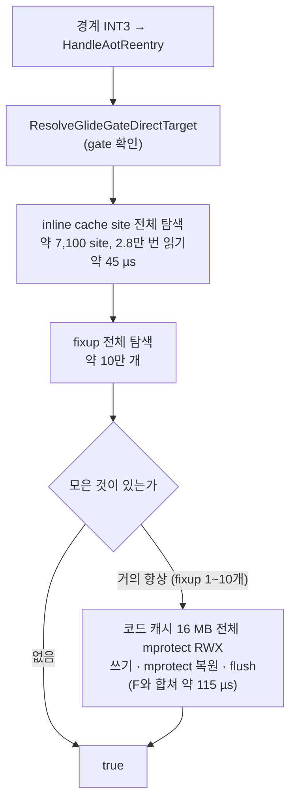
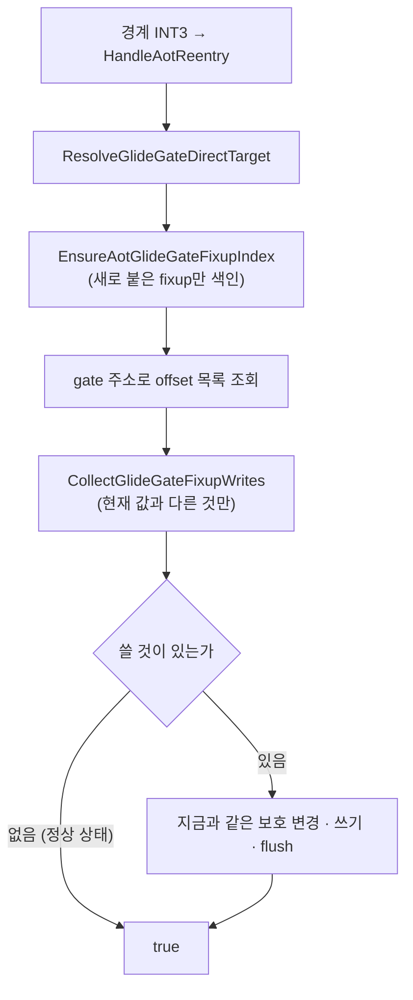
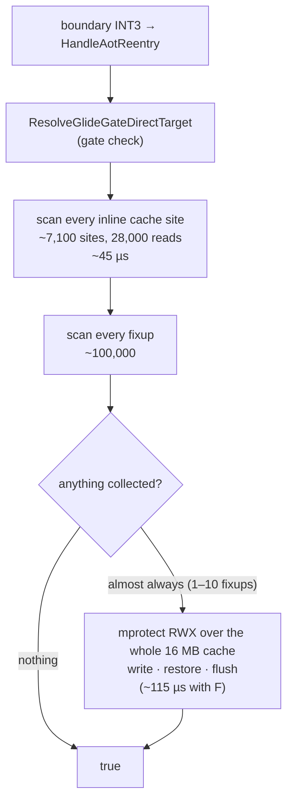
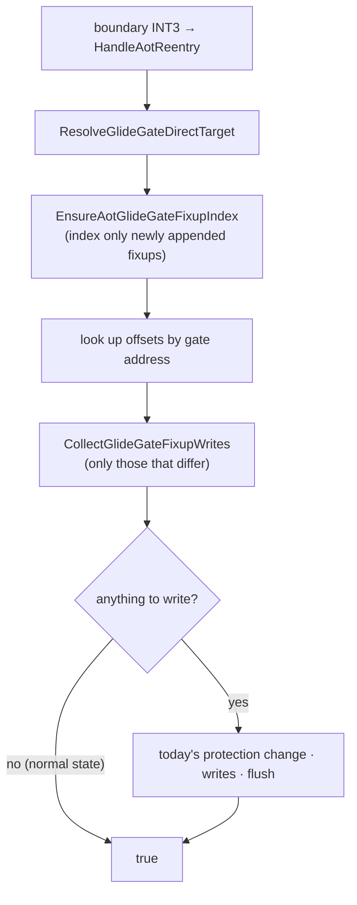

# Task 773 설계: Glide gate 재연결 — 비용을 없애고, Linux i386에서 실제로 잇기

근거: [Task 772 작업 로그 8절](../work-logs/20261005-772-linux-native-verification.md) ·
[linux-port-frontier.md](../analysis/linux-port-frontier.md)의 2026-10-05 절 ·
선행: [Task 479 설계](20260814-479-inline-cache-site-index.md)(같은 모양의 결함을 색인으로 고친 전례),
[Task 519 로그](../work-logs/20260829-519-relink-split.md)(`content=0`)

## 배경

Linux i386에서는 Glide 호출마다 AOT 코드 캐시 경계의 breakpoint를 거쳐
[`ActivateGlideGateDirectTarget`](../../src/engine/aot/aot_dbt_glide_gate_dispatch.cpp)이 불립니다(초당 약 5,500번).
한 번에 약 160 µs가 들고, 정상 실행에서도 게스트 스레드는 CPU 99.4%로 포화되어 그중 약 88%를 이 함수가 씁니다.
여유가 없으므로 외부 부하로 잠깐 밀려도 타이머 tick이 쌓이고, vsync가 켜져 있으면 느린 상태에 갇힙니다(Task 772).

처음 범위는 **같은 결과를 내면서 회당 비용을 없애는 것**이었습니다. 구현 중 probe가 Glide 호출이 왜 매번 경계 breakpoint를
밟는지(Task 517~527의 질문)의 답을 드러내어(사실 4), 그 수정(결정 5)을 같은 작업에 넣었습니다.

## 확인된 사실

### 1. 한 번의 호출이 하는 일

### 2. inline cache site 탐색은 구조적으로 아무것도 찾지 못합니다

* 탐색은 각 entry의 `target_immediate_offset`에 있는 4바이트를 `cache_boundary_address`(캐시 주소, i386에서 0xE8xxxxxx대)와
  비교합니다.
* 그 자리에 값을 쓰는 곳은 [`PatchAotIndirectInlineCache`](../../src/engine/aot_code_cache.cpp) 하나이고, **게스트 목적지 주소**
  (`guest_target`, 0x010xxxxx대)를 씁니다. 캐시 주소는 `jump_displacement_offset`의 rel32로 들어갑니다. 즉 이 자리는 "어느 게스트
  주소로 가는 호출인가"를 비교하는 값이고, 캐시 주소와 같아질 수 없습니다.
* Task 519가 카운터를 갈라 잰 결과도 두 실행 전 구간에서 `content=0`이었습니다.
* 이 탐색은 2026-08-02 Win32 원본(`672e343`)부터 같은 형태입니다. ARCHITECTURE.md가 적은 "indirect inline-cache target 재연결"은
  **한 번도 동작한 적이 없습니다.**

### 3. fixup 목록은 뒤에 덧붙기만 합니다

`placement->fixups`는 처음 배치에서 통째로 대입되고([aot_code_cache.cpp](../../src/engine/aot_code_cache.cpp) `placement->fixups = image.fixups`),
그 뒤에는 동적 append에서 `push_back`만 합니다. 지우거나 순서를 바꾸는 곳은 없습니다. 따라서 "몇 개까지 색인했는가"만으로
낡았는지 판단할 수 있습니다(Task 479의 site 색인과 같은 조건).

### 4. Linux i386에서는 모은 fixup이 한 번도 쓰이지 않았습니다

처음에는 "모은 1~10개가 이미 같은 값을 담고 있다"고 적었지만 **재지 않은 추정이었고 틀렸습니다.** 쓰기 루프는 변위를 64비트로
계산해 `int32` 범위를 벗어나면 건너뜁니다. Linux i386에서 코드 캐시는 `0xE8021000` 근처, gate는 arena(`0x01000000`대)에 있어
거리가 2 GiB를 넘으므로 **모든 slot이 건너뛰어졌습니다.** 보호 변경과 flush만 매번 하고 아무것도 쓰지 않은 것입니다.

그런데 32비트 모드의 `call`/`jmp rel32`는 목적지를 (다음 명령 주소 + rel32) mod 2³²로 계산하므로 어떤 주소든 닿습니다. 범위
검사는 64비트 명령 포인터에서만 필요합니다. Win32는 캐시가 낮은 주소(`0x0E79…`)에 놓여 범위 안이라 첫 호출에서 이어졌고,
이것이 Task 517~527이 남긴 "Windows에서는 왜 같은 INT3을 다시 밟지 않는가"의 답입니다.

## 설계

### 결정 1 — 죽은 inline cache site 탐색을 지웁니다

사실 2에 따라 이 탐색은 결과에 영향을 준 적이 없으므로, 지워도 동작은 바이트 단위로 같습니다. `relink_content_patch_count`
카운터와 그 보고 줄은 형식을 유지하고 항상 0을 보고합니다(보고를 읽는 스크립트와 과거 기록의 비교를 깨지 않기 위해).

"gate로 가는 inline cache entry를 gate로 직접 잇는다"는 원래 의도를 **올바르게** 구현하는 일(entry의 비교값이 `gate_address`인
것의 점프 변위를 바꾸기)은 동작을 바꾸므로 이 작업에 넣지 않습니다. 매번 breakpoint를 밟는 원인 후보이기도 하므로 다음 작업에서
조사와 함께 다룹니다.

### 결정 2 — gate로 가는 fixup 색인, 전용 모듈

`include/repiu/engine/aot_glide_gate_fixup_index.h`, `src/engine/aot_glide_gate_fixup_index.cpp`에 `AotGlideGateFixupIndex`를
두고 `AotCodeCachePlacement`에 멤버로 넣습니다(Task 479의 `AotInlineCacheSiteIndex`와 같은 자리).

* 내용: `indexed_fixup_count`, `minimum_target`(색인할 목적지 하한, gate 코드 시작 주소), 그리고 목적지 게스트 주소 → fixup
  `cache_patch_offset` 목록의 해시 맵. 대상 종류는 지금과 같이 `kDirectCall`, `kDirectJump`, `kBlockFallthrough`뿐입니다.
* `minimum_target` 아래를 가리키는 fixup은 넣지 않습니다. 약 10만 개 중 gate로 가는 것만 남기므로 맵은 작습니다.
* 갱신: 조회 전에 `[indexed_fixup_count, fixups.size())`만 더 색인합니다(append-only). `indexed_fixup_count`가 크기보다 크거나
  `minimum_target`이 바뀌면 통째로 다시 만듭니다.
* 순서: 한 gate의 목록은 fixup 배열 순서를 따릅니다. 지금 탐색이 모으는 순서와 같으므로 쓰는 순서도 같습니다.

### 결정 3 — 이미 맞는 값이면 쓰지 않습니다

각 offset에 대해 쓰려는 rel32(지금과 같은 식: `direct_target - (base + offset + 4)`, 범위 밖이면 건너뜀)를 현재 4바이트와 비교해
**다른 것만** 모읍니다. 모은 것이 없으면 `mprotect`·쓰기·flush 없이 `true`를 돌려줍니다. 하나라도 있으면 지금과 같은 순서
(전체 RWX → 쓰기 → 이전 보호 복원 → flush)로 씁니다.

* 판단은 순수 함수 `CollectGlideGateFixupWrites(cache_bytes, base_address, offsets, direct_target, out)`로 분리해 probe가 임의의
  버퍼로 검사할 수 있게 합니다.
* 캐시에 이미 있는 값과 같은 값을 다시 쓰는 것을 생략할 뿐이므로 실행 결과(캐시 바이트, 반환값, EIP 처리)는 같습니다. 유일한
  차이는 쓰기가 없을 때 `mprotect` 실패로 `false`를 돌려줄 가능성이 사라지는 것입니다(실측에서 실패한 적 없음).
* `relinked`·`fixup` 카운터는 **실제로 쓴 수**를 셉니다. Task 519가 "활성화 횟수에 비례하는 무의미한 수"라고 적은 것을
  "되돌아간 패치를 다시 쓴 수"로 바꾸는 것이며, 보고 문서에 그 뜻의 변화를 적습니다.

### 결정 5 — direct 모델에서는 rel32를 2³²로 감아 씁니다

`CollectGlideGateFixupWrites`에 `wraps_at_32_bits`를 두고, 엔진은 `runtime::execution_model::RunsGuestBytesDirectly()`를
넘깁니다. 참이면 범위 검사 없이 차이의 하위 32비트를 변위로 씁니다. 거짓(cache 모델, 64비트 명령 포인터)이면 지금처럼 2 GiB를
넘는 slot을 건너뜁니다. Win32에서는 변위가 원래 범위 안이므로 쓰는 값이 같습니다. **Linux i386에서는 동작이 바뀝니다:** gate로
가는 slot이 처음으로 실제로 이어져, 이후의 Glide 호출은 breakpoint 없이 gate의 host-stack thunk로 직접 갑니다(Win32가 써 온
경로).

### 결정 4 — 스레드

색인은 지금 탐색과 같은 곳(게스트 스레드의 breakpoint 처리 안)에서만 읽고 고칩니다. fixup 배열을 읽는 시점과 방식은 지금 탐색과
같으므로 동시성 조건은 바뀌지 않습니다.

### 흐름(변경 후)

## 기대 효과

결정 5로 Linux i386의 Glide 호출 대부분이 breakpoint를 거치지 않게 되므로 Activate 호출 자체가 gate·호출 지점당 한 번 수준으로
줄어듭니다. 남은 호출은 해시 조회 하나와 4바이트 비교 몇 번입니다. 결과는 [작업 로그](../work-logs/20261005-773-glide-gate-relink-cost.md)에 있습니다.

## 이 변경이 하지 않는 것

* inline cache entry를 gate로 잇는 원래 의도의 올바른 구현(간접 호출로 gate에 가는 경우. 필요성은 측정 뒤 판단).
* 엔진의 다른 rel32 범위 검사(같은 가정이 다른 곳에도 있는지는 별도 조사).
* Task 750 swap 대기와 tick 주입 정책.
* Win32 예외 진입 구조(AGENTS.md의 예외 조항).

## 위험

* append가 낡은 블록 입구에 `E9 rel32`를 쓸 때 그 5바이트가 gate로 가는 call의 rel32와 겹치면, 지금 코드와 바뀐 코드 모두 그
  자리에 gate 변위를 다시 씁니다. 바뀐 코드도 값이 다를 때 쓰므로 이 동작은 그대로입니다(새 위험은 아니며, 기존 잠재 문제로 기록).

## 검증

1. `repiu_core_probe`에 `glide_gate_fixup_index` 검사를 더합니다(모든 호스트).
   * 하한 아래·대상 밖 종류는 색인하지 않음, 같은 gate의 offset이 배열 순서로 모임.
   * 덧붙인 fixup만 추가로 색인(재구축 없음), 개수가 줄거나 하한이 바뀌면 재구축.
   * `CollectGlideGateFixupWrites`: 이미 같은 값이면 비움, 다른 값만 모음, 감은 변위가 실제로 gate에 닿음, 감지 않을 때는
     2 GiB 밖을 건너뜀.
2. 빌드: Linux x64 Debug, Linux i386 Release(`build/linux_i386_release_g`).
3. 실기(Linux i386, `WAYLAND_DISPLAY=repiu-none`, vsync 기본, 60초): 스레드 CPU, 프레임, `dropped`, 느린 상태 진입 횟수를 Task 772의
   21회(5회 느림)와 비교합니다. `[repiu-live-gdd]`로 `resolved`(호출 수)와 `relinked`(실제 쓴 수)를 봅니다.
4. Linux x64 회귀: pumpit1 20초, 프레임과 종료 경로가 Task 772와 같은지.
5. Win32: 같은 소스를 쓰지만 이 머신에서 빌드할 수 없으므로 사용자 확인 항목으로 남깁니다.

---

# Task 773 Design: The Glide Gate Relink — Removing Its Cost, and Making It Link on Linux i386

Basis: [Task 772 work log, section 8](../work-logs/20261005-772-linux-native-verification.md) · the 2026-10-05 section of
[linux-port-frontier.md](../analysis/linux-port-frontier.md) · Prior work: [Task 479 design](20260814-479-inline-cache-site-index.md)
(the precedent that fixed a defect of the same shape with an index), [Task 519 log](../work-logs/20260829-519-relink-split.md)
(`content=0`)

## Background

On Linux i386 every Glide call reaches
[`ActivateGlideGateDirectTarget`](../../src/engine/aot/aot_dbt_glide_gate_dispatch.cpp) through an AOT code cache boundary
breakpoint (about 5,500 times a second). Each call costs about 160 µs; even in a normal run the guest thread is saturated at
99.4% CPU, about 88% of it in this function. With no headroom, a brief loss of the CPU to outside load lets timer ticks pile
up, and with vsync on the game gets stuck in the slow state (Task 772).

The first scope was to **remove the per-call cost while producing the same result**. During implementation the probe
exposed the answer to why Glide calls hit the boundary breakpoint every time (the question of Tasks 517 to 527; fact 4),
and its fix (decision 5) joined the same task.

## Confirmed facts

### 1. What one call does

### 2. The inline cache site scan can never find anything

* The scan compares the 4 bytes at each entry's `target_immediate_offset` with `cache_boundary_address` (a cache address,
  0xE8xxxxxx on i386).
* The only writer of that field is [`PatchAotIndirectInlineCache`](../../src/engine/aot_code_cache.cpp), and it writes the
  **guest target address** (`guest_target`, 0x010xxxxx). The cache address goes into the rel32 at `jump_displacement_offset`.
  The field is the value that says which guest address a call goes to, and it cannot equal a cache address.
* Task 519 split the counters and measured `content=0` over both runs from start to end.
* The scan has had this shape since the Win32 original of 2026-08-02 (`672e343`). The "indirect inline-cache target relink"
  ARCHITECTURE.md describes **has never worked.**

### 3. The fixup list is only appended to

`placement->fixups` is assigned wholesale at placement ([aot_code_cache.cpp](../../src/engine/aot_code_cache.cpp),
`placement->fixups = image.fixups`) and afterwards only `push_back`ed by dynamic append. Nothing removes or reorders
entries, so "how many have been indexed" is enough to tell whether an index is stale (the same condition as Task 479's
site index).

### 4. On Linux i386 the collected fixups were never written

This section first said the 1 to 10 collected slots "already hold the same value". **That was an unmeasured inference, and
wrong.** The write loop computes the displacement in 64 bits and skips a slot when it falls outside `int32`. On Linux i386
the code cache sits near `0xE8021000` and the gates are in the arena (around `0x01000000`), more than 2 GiB apart, so
**every slot was skipped**: the protection change and the flush ran each time and nothing was written.

But a 32-bit `call`/`jmp rel32` computes its target as (next instruction + rel32) mod 2³², so it reaches any address. The
range check is needed only under a 64-bit instruction pointer. On Win32 the cache sits low (`0x0E79…`), within range, so
the first call linked the slot. This is the answer to "why is the same INT3 not hit again on Windows" left by Tasks 517
to 527.

## Design

### Decision 1 — remove the dead inline cache site scan

By fact 2 the scan has never affected the result, so removing it leaves behaviour identical to the byte. The
`relink_content_patch_count` counter and its report line keep their format and always report 0, so scripts reading the
report and comparisons with past records do not break.

Implementing the original intent **correctly** (rewriting the jump displacement of entries whose compare value is
`gate_address`) changes behaviour and is not part of this task. It is also a candidate cause of the repeated breakpoint, so
the next task takes it up with that investigation.

### Decision 2 — an index of fixups that go to gates, in its own module

`AotGlideGateFixupIndex` lives in `include/repiu/engine/aot_glide_gate_fixup_index.h` and
`src/engine/aot_glide_gate_fixup_index.cpp` and is a member of `AotCodeCachePlacement` (where Task 479's
`AotInlineCacheSiteIndex` sits).

* Contents: `indexed_fixup_count`, `minimum_target` (the lowest target indexed, the start of gate code), and a hash map from
  target guest address to the fixups' `cache_patch_offset` lists. Only the kinds used today are indexed: `kDirectCall`,
  `kDirectJump`, `kBlockFallthrough`.
* Fixups below `minimum_target` are left out. Of about 100,000 only those going to gates remain, so the map is small.
* Update: before a lookup, only `[indexed_fixup_count, fixups.size())` is indexed (append-only). When `indexed_fixup_count`
  exceeds the size or `minimum_target` changes, it is rebuilt.
* Order: a gate's list follows fixup array order, the order the scan collects in today, so writes happen in the same order.

### Decision 3 — do not write a value that is already there

For each offset the rel32 to write (the same formula as today: `direct_target - (base + offset + 4)`, skipped when out of
range) is compared with the current 4 bytes, and **only those that differ** are collected. When none are collected the call
returns `true` without `mprotect`, writes or a flush. When any are, they are written in today's order (whole cache RWX →
writes → restore the previous protection → flush).

* The decision is the pure function `CollectGlideGateFixupWrites(cache_bytes, base_address, offsets, direct_target, out)`,
  so a probe can check it against any buffer.
* Only rewriting a value that is already in the cache is skipped, so the outcome (cache bytes, return value, EIP handling)
  is the same. The one difference is that a call with nothing to write can no longer return `false` because `mprotect`
  failed (never seen in measurement).
* The `relinked` and `fixup` counters count **actual writes**. What Task 519 described as a meaningless number proportional
  to activations becomes "patches that had reverted and were written again"; the report documentation states the change.

### Decision 5 — on the direct model the rel32 wraps at 2³²

`CollectGlideGateFixupWrites` takes `wraps_at_32_bits`, and the engine passes
`runtime::execution_model::RunsGuestBytesDirectly()`. When true, the low 32 bits of the difference are the displacement,
with no range check. When false (the cache model, a 64-bit instruction pointer) slots more than 2 GiB away are skipped as
today. On Win32 the displacement was in range anyway, so the bytes written are the same. **On Linux i386 behaviour
changes:** slots going to gates are linked for the first time, and later Glide calls go straight to the gate's host-stack
thunk without a breakpoint (the path Win32 has been using).

### Decision 4 — threads

The index is read and updated only where the scan runs today (inside breakpoint handling on the guest thread). The fixup
array is read at the same point and in the same way, so the concurrency conditions do not change.

### Flow (after the change)

## Expected effect

With decision 5 most Glide calls on Linux i386 no longer pass through a breakpoint, so Activate itself is called about
once per gate and call site. A remaining call is one hash lookup and a few four-byte comparisons. Results are in the
[work log](../work-logs/20261005-773-glide-gate-relink-cost.md).

## What this change does not do

* Implement the original intent of linking inline cache entries to gates correctly (gates reached by indirect calls;
  whether it is needed is to be judged after measurement).
* The engine's other rel32 range checks (whether the same assumption exists elsewhere is a separate investigation).
* Change Task 750's swap wait or the tick injection policy.
* Touch the Win32 exception entry structure (AGENTS.md's exception clause).

## Risk

* When append writes `E9 rel32` at a stale block's entry and those 5 bytes overlap the rel32 of a call to a gate, both the
  current and the changed code write the gate displacement there again. The changed code writes whenever the value differs,
  so this behaviour is unchanged (not a new risk; recorded as an existing latent problem).

## Verification

1. Add a `glide_gate_fixup_index` check to `repiu_core_probe` (every host).
   * Fixups below the bound or of other kinds are not indexed; a gate's offsets are collected in array order.
   * Appended fixups alone are indexed on the next call (no rebuild); a shrunken count or a changed bound rebuilds.
   * `CollectGlideGateFixupWrites`: empty when the value is already there, only differing ones collected, a wrapped
     displacement really lands on the gate, and without the wrap slots beyond 2 GiB are skipped.
2. Builds: Linux x64 Debug, Linux i386 Release (`build/linux_i386_release_g`).
3. Real hardware (Linux i386, `WAYLAND_DISPLAY=repiu-none`, default vsync, 60 s): thread CPU, frames, `dropped` and how often
   the slow state is entered, against Task 772's 21 runs (5 slow). `[repiu-live-gdd]` shows `resolved` (calls) and
   `relinked` (actual writes).
4. Linux x64 regression: pumpit1 for 20 s; frames and exit path as in Task 772.
5. Win32: same source, but it cannot be built on this machine, so it is left as an item for the user to check.
