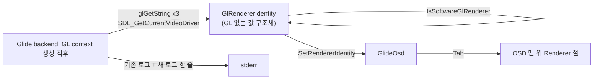

# #5 설계: 인게임 OSD에 OpenGL renderer 표시

Issue: [#5](https://github.com/reexec/rePIU/issues/5)

## 배경

Linux i386 실기 검증(Task 772, 773)에서 3D 가속 여부를 로그(`[repiu-glide] GL renderer: …`)와 `/proc/<pid>/maps`로만 알 수
있었습니다. 게임 화면을 보는 사람이 그 자리에서 알 수 없고, 소프트웨어 렌더러(llvmpipe 등)로 떨어진 실행은 느리기만 하고 이유가
드러나지 않습니다(Task 752: WSL의 Mesa 기본값이 llvmpipe).

## 목표

* `Tab` OSD 맨 위에 renderer, vendor, GL 버전, SDL 비디오 드라이버(`windows`, `x11`, `wayland`)를 표시합니다.
* 소프트웨어 렌더러면 경고 색과 문구("Software rendering: no 3D acceleration")로 구분합니다.
* 모든 호스트(Win32, Linux i386·x64)에서 같은 코드로 동작합니다. OSD와 Glide OpenGL backend는 이미 엔진 공용 코드입니다.

## 구조

* `GlRendererIdentity`(`include/repiu/engine/gl_renderer_identity.h`, `src/engine/gl_renderer_identity.cpp`): renderer, vendor,
  version, video driver 문자열과 `software`, `wsl_d3d12` 플래그. GL·SDL 헤더를 쓰지 않아 probe가 그대로 검사할 수 있습니다.
* `IsSoftwareGlRenderer(renderer)`: 대소문자를 무시한 부분 문자열 판정. 목록은 `llvmpipe`, `softpipe`, `swrast`,
  `software rasterizer`, `gdi generic`(Windows의 드라이버 없는 기본 GL 1.1), `microsoft basic render`(WARP, WSL D3D12 경유 시),
  `swiftshader`. GPU 이름은 매우 다양하므로 소프트웨어 쪽을 나열하는 편이 오판이 적습니다.
* backend는 이미 읽던 `GL_RENDERER` 옆에서 `GL_VENDOR`, `GL_VERSION`, `SDL_GetCurrentVideoDriver()`를 읽어 구조체를 채우고,
  OSD를 초기화한 뒤 넘깁니다. 기존 로그 줄(`GL renderer: …`)은 스크립트가 찾으므로 바꾸지 않고, `GL vendor/version/video
  driver/software: …` 한 줄을 더합니다.
* OSD는 값을 보관만 하고 매 프레임 그립니다. GL 호출을 더하지 않습니다.

## 하지 않는 것

* 렌더러를 바꾸는 기능(드라이버 선택)은 넣지 않습니다. 표시만 합니다.
* OSD 밖(창 제목 등)에는 표시하지 않습니다.

## 검증

1. probe `gl_renderer_identity`(core probe, Win32 AOT probe `--gl-renderer-identity`): 소프트웨어 이름(llvmpipe, softpipe,
   GDI Generic, `D3D12 (Microsoft Basic Render Driver)`, 대문자 변형)은 true, GPU 이름(NVIDIA, Intel Arc, `D3D12 (NVIDIA …)`,
   AMD)·빈 문자열·`unknown`은 false.
2. Win32 Release 빌드, core probe.
3. Win32 실행: 로그의 새 줄, OSD를 열어 화면 캡처로 Renderer 절 확인.
4. Linux x64 Debug(WSL) 빌드와 core probe. 가능하면 WSL에서 llvmpipe 실행으로 경고 표시 확인.

---

# #5 Design: The OpenGL Renderer in the In-Game OSD

Issue: [#5](https://github.com/reexec/rePIU/issues/5)

## Background

During the Linux i386 verification on real hardware (Tasks 772 and 773), whether 3D was accelerated could be told only from
the log (`[repiu-glide] GL renderer: …`) and `/proc/<pid>/maps`. Someone looking at the game cannot tell on the spot, and a
run that fell back to a software renderer (llvmpipe and the like) is just slow with no visible reason (Task 752: WSL's Mesa
defaults to llvmpipe).

## Goals

* Show the renderer, vendor, GL version and SDL video driver (`windows`, `x11`, `wayland`) at the top of the `Tab` OSD.
* Set a software renderer apart with a warning colour and wording ("Software rendering: no 3D acceleration").
* The same code on every host (Win32, Linux i386 and x64). The OSD and the Glide OpenGL backend are already shared engine code.

## Structure

The diagram above: the backend fills a GL-free `GlRendererIdentity` right after creating the GL context, and hands it to
`GlideOsd`, which draws it at the top of the overlay.

* `GlRendererIdentity` (`include/repiu/engine/gl_renderer_identity.h`, `src/engine/gl_renderer_identity.cpp`): the renderer,
  vendor, version and video driver strings, plus `software` and `wsl_d3d12` flags. It uses no GL or SDL header, so a probe
  checks it as is.
* `IsSoftwareGlRenderer(renderer)`: a case-insensitive substring match against `llvmpipe`, `softpipe`, `swrast`,
  `software rasterizer`, `gdi generic` (Windows' driverless GL 1.1), `microsoft basic render` (WARP, through D3D12 on WSL) and
  `swiftshader`. GPU names vary endlessly, so listing the software side misjudges less.
* The backend reads `GL_VENDOR`, `GL_VERSION` and `SDL_GetCurrentVideoDriver()` next to the `GL_RENDERER` it already reads,
  fills the structure, and hands it over once the OSD is initialised. The existing log line (`GL renderer: …`) stays as it
  is, since scripts look for it, and one line `GL vendor/version/video driver/software: …` is added.
* The OSD only keeps the values and draws them each frame; it adds no GL call.

## Not done

* No way to change the renderer (driver selection); display only.
* Nothing outside the OSD (the window title, for instance).

## Verification

1. The `gl_renderer_identity` probe (core probe, and `--gl-renderer-identity` in the Win32 AOT probe): software names
   (llvmpipe, softpipe, GDI Generic, `D3D12 (Microsoft Basic Render Driver)`, an upper-case variant) are true; GPU names
   (NVIDIA, Intel Arc, `D3D12 (NVIDIA …)`, AMD), the empty string and `unknown` are false.
2. Win32 Release build, core probe.
3. A Win32 run: the new log line, and a screen capture of the open OSD showing the Renderer section.
4. Linux x64 Debug (WSL) build and core probe; if possible, a WSL llvmpipe run to see the warning.
