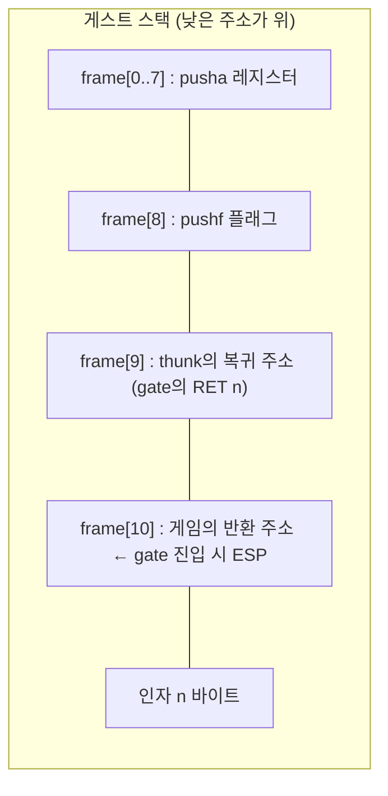
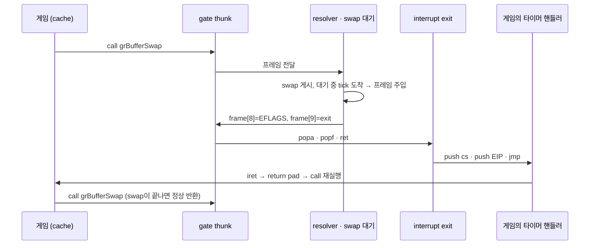
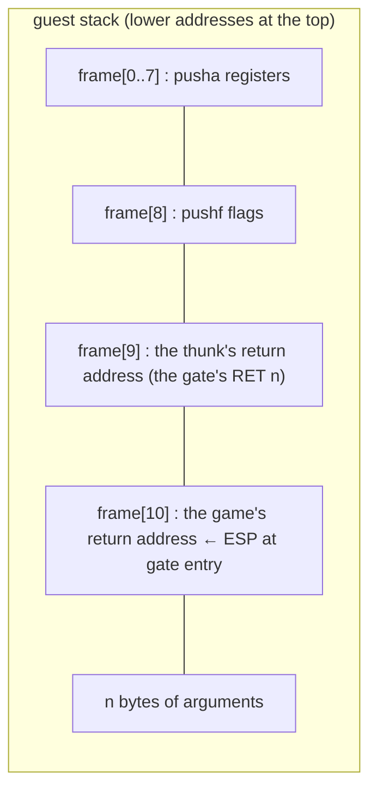

# #6 설계: direct 모델에서도 swap 대기 중 타이머 tick 전달

Issue: [#6](https://github.com/nworkers/rePIU/issues/6) ·
선행: [Task 750 설계](20260928-750-timer-ticks-during-the-swap-wait.md), [Task 762](20260930-762-timer-handler-return-pad.md),
[Task 773 로그의 "느린 상태의 정체"](../work-logs/20261005-773-glide-gate-relink-cost.md)

## 배경

vsync swap이 오래 막히면(창이 숨겨져 컴포지터가 약 1 fps로 늦출 때) direct 모델(Win32, Linux i386)의 게스트 스레드는
`grBufferSwap` gate 안에서 기다리며 타이머 tick을 받지 못합니다. backlog 상한 64를 넘은 tick은 버려지고 게임의 시간이 느려집니다
(창을 12초 최소화하면 4,200개 이상). cache 모델(Linux x64)은 Task 750이 기다리는 동안 밀린 tick을 주입하므로 버리지 않습니다.

Task 750은 direct 모델에서 꺼져 있습니다(`InjectsTicksDuringSwapWait()`가 false). Win32에서 켜 보니 첫 주입 뒤 멈췄고 원인은
조사되지 않았습니다. Linux i386에서 스위치만 켜 같은 멈춤을 재현했습니다(`swaps/injections 1/1`, 직후 예외).

## 원인(확인됨)

direct 모델의 gate는 `CALL thunk; RET n` stub이고, thunk는 플래그와 레지스터를 **게스트 스택에** 저장합니다.



Task 750의 주입은 "gate에 도달한 `call` 직전에 인터럽트가 온 것"으로 만들려고 ESP를 `진입 ESP + 4`(반환 주소를 pop한 값)에 두고
그 아래에 인터럽트 프레임 12바이트(EIP, CS, EFLAGS)를 씁니다. 그 자리가 정확히 `frame[8]`, `frame[9]`, `frame[10]`입니다.
thunk의 끝(`popa; popf; ret`)은 `frame[9]`로 돌아가는데 거기에는 이제 CS 값이 들어 있습니다. 설령 덮어쓰지 않았더라도 thunk에는
"인자를 남긴 채 핸들러로 들어가는" 출구가 없습니다(`RET n`은 인자를 버립니다). cache 모델은 gate에서 나갈 때
항상 resolver가 상태를 통째로 다시 세우므로 이 문제가 없습니다.

## 설계

### 결정 1 — thunk는 그대로 두고, 작은 출구 코드(interrupt exit)를 거칩니다

thunk 어셈블리(Win32 MSVC `__asm`, Linux `.S`)는 바꾸지 않습니다. 주입이 일어난 경우 resolver가 `frame[8..10]`을 다음처럼 다시
채워, thunk의 기존 끝이 출구 코드로 가게 합니다.

| 자리 | 주입 직후 | resolver가 채우는 값 | thunk의 `popf; ret` 뒤 출구 코드가 만드는 값 |
|---|---|---|---|
| `frame[8]` | 인터럽트 프레임 EIP | 핸들러 진입 EFLAGS (`popf`가 읽음) | 인터럽트 프레임 EIP (`push`) |
| `frame[9]` | 인터럽트 프레임 CS(0이 적힘, 아래) | 출구 코드 주소 (`ret`이 읽음) | 실제 CS (`push cs`) |
| `frame[10]` | 인터럽트 프레임 EFLAGS | 그대로 | 그대로 |

출구 코드는 레지스터와 플래그를 건드리지 않는 세 명령입니다. 값은 고정된 두 slot에서 읽습니다.

```
push cs                       ; 0E            → frame[9]
push dword ptr [slot_eip]     ; FF 35 abs32   → frame[8]
jmp  dword ptr [slot_target]  ; FF 25 abs32   → 핸들러
```

구현 중 확인한 두 가지가 이 모양을 정했습니다.

* **프레임의 CS.** 주입 코드는 프레임의 CS를 레지스터 컨텍스트의 `SegCs`에서 가져오는데, thunk 경로에는 실제 컨텍스트가 없어
  0이 적혔습니다(핸들러의 native `iret`가 폴트). `push cs`가 게스트가 실제로 돌고 있는 코드 세그먼트를 넣습니다. 예외 경로의
  주입이 기록하는 값과 같습니다.
* **near 점프.** 핸들러의 selector(pumpit1에서 `0x24`)는 HLE가 준 논리 selector입니다. 예외 경로에서도 실제 CS는 바뀌지
  않습니다(Linux는 세그먼트 레지스터를 되돌려 쓰지 않음). 처음 설계의 far 점프(`FF 2D`)는 그 selector를 실제로 로드하려다
  폴트했습니다.

끝난 상태는 예외 처리기 경로의 주입과 같습니다: ESP는 인터럽트 프레임을 가리키고, 레지스터는 gate 진입 때 그대로이며, 핸들러가
제자리에서 시작합니다. 핸들러의 `iret`는 Task 762의 return pad를 거쳐 `call`로 돌아오고, `call`이 gate에 다시
들어와 swap이 끝났는지 봅니다(Task 750과 같은 흐름).



### 결정 2 — 출구 코드는 엔진이 실행 시점에 만듭니다

`include/repiu/engine/glide_gate_interrupt_exit.h`, `src/engine/glide_gate_interrupt_exit.cpp`:

* `EncodeGlideGateInterruptExit(...)`: 13바이트를 만드는 순수 함수.
* `ArrangeGlideGateInterruptExit(frame8, entry_eflags, exit_address, target, slots)`: 위 표의 재배치를 하는 순수 함수(slot에
  EIP·목적지를 적고 `frame[8]`, `frame[9]`를 채움).
* `GlideGateInterruptExitAddress()`: 처음 쓸 때 실행 가능 페이지 하나를 만들어 코드를 쓰고 주소를 돌려줍니다. 페이지나 slot의
  주소가 32비트에 들어가지 않거나 호스트가 거절하면 0.

어셈블리 파일이 아니라 생성 코드로 두는 이유: Win32와 Linux i386이 같은 바이트를 쓰므로 한 곳에서 만들고 한 probe로 검사할 수
있고, 플랫폼 계층에 엔진의 흐름을 아는 코드를 더하지 않습니다. slot은 프로세스에 하나입니다(게스트 스레드는 하나이고, slot은
resolver가 쓰고 곧바로 출구 코드가 읽습니다).

### 결정 3 — 스위치

`InjectsTicksDuringSwapWait()`를 direct 모델에서도 true로 합니다. `GlideSwapWaitTicksEnabled()`는 direct 모델에서 출구 코드를
만들 수 없으면 false를 돌려줘 이전 동작(동기 swap)으로 남습니다. 끄는 방법은 지금과 같습니다(`REPIU_GLIDE_SWAP_WAIT_TICKS=0`).

### 결정 4 — direct 모델은 대기가 길어진 뒤에만 주입합니다

주입을 대기 시작부터 하면 Linux i386의 pumpit1은 창이 보이는 정상 실행에서 프레임이 약 15% 줄었습니다(20초에 669~719 대
809~817, 교대 5쌍). 원인은 확인하지 못했습니다(예외 수는 비슷함). 그래서 direct 모델에서는 대기가 **50 ms**를 넘긴 뒤에만
주입합니다. 보통의 swap(60 Hz에서 17 ms 이하)에서는 주입이 0회이고 프레임이 이전과 같으며, 숨겨진 창처럼 swap이 오래 막힐
때만 tick을 넣습니다. 50 ms 동안 쌓이는 tick은 12개쯤이라 backlog 상한 64에 닿지 않습니다. cache 모델은 지금처럼 0 ms입니다
(Task 750이 프레임 안의 tick 시각을 맞추는 데 필요). `REPIU_GLIDE_SWAP_WAIT_TICK_HOLD_MS`로 바꿀 수 있습니다.

따라서 direct 모델은 Task 750이 x64에 준 "프레임 안에서 tick이 제때 보이는" 효과는 얻지 못합니다. 이 작업의 목표는 tick이
버려지지 않게 하는 것이고, 그 효과는 프레임 손실의 원인을 찾은 뒤의 일입니다.

### 하지 않는 것

* thunk 어셈블리 변경, cache 모델의 경로 변경.
* 호출부가 `call rel32`가 아닌 게임의 주입(Task 750과 같이 주입 없이 기다림).
* 숨겨진 창에서 프레임이 줄어드는 것 자체(컴포지터의 동작이며 x64도 같음). 고치는 것은 게임 시간이 멈추지 않게 하는 것입니다.

## 위험

* **Win32는 이 머신에서 실행해 볼 수 없습니다.** 원인과 thunk의 프레임 모양이 같으므로 같은 수정이 맞을 것으로 보지만 추정입니다.
  CI가 빌드와 probe는 확인하고, 실제 게임 실행은 사용자 확인이 필요합니다. 문제가 있으면 `REPIU_GLIDE_SWAP_WAIT_TICKS=0`으로
  이전 동작이 됩니다.
* 출구 코드는 thunk와 마찬가지로 DS·SS가 호스트 주소를 가리킨다고 가정합니다(thunk 진입이 이미 같은 가정으로 전역을 읽습니다).

## 검증

1. core probe `glide_gate_interrupt_exit`: 인코딩 13바이트, 재배치 뒤 `popf; ret; push cs; push`를 흉내 내면 스택이 EIP·실제
   CS·EFLAGS의 인터럽트 프레임이 되고 인자가 그대로인지.
2. Linux i386 Release, Linux x64 Debug 빌드와 core probe.
3. 실기 Linux i386: pumpit1 정상 실행(프레임, 폴트 0, `swap wait ticks swaps/injections`), 창 12초 최소화 실험에서 dropped가
   4,200대에서 x64 수준(수십)으로 내려가는지. pumpit8, pumpitea. `REPIU_GLIDE_SWAP_WAIT_TICKS=0` 대조.
4. Linux x64 회귀(pumpit1).

---

# #6 Design: Timer Ticks During the Swap Wait on the Direct Model Too

Issue: [#6](https://github.com/nworkers/rePIU/issues/6) ·
Prior: [Task 750 design](20260928-750-timer-ticks-during-the-swap-wait.md), [Task 762](20260930-762-timer-handler-return-pad.md),
["What the slow state is" in the Task 773 log](../work-logs/20261005-773-glide-gate-relink-cost.md)

## Background

When a vsync swap stays blocked (a hidden window, which the compositor slows to about 1 fps), the guest thread of the direct
model (Win32, Linux i386) waits inside the `grBufferSwap` gate and receives no timer tick. Ticks beyond the backlog cap of 64
are dropped and the game's time slows (more than 4,200 in 12 s minimised). The cache model (Linux x64) drops none, because
Task 750 injects owed ticks while it waits.

Task 750 is off on the direct model (`InjectsTicksDuringSwapWait()` answers false): switched on under Win32 it stopped after
the first injection, and the cause was never investigated. With only the switch turned on, Linux i386 reproduces the same
stop (`swaps/injections 1/1`, then an exception).

## Cause (confirmed)

A direct-model gate is the stub `CALL thunk; RET n`, and the thunk saves the flags and registers **on the guest stack**.



To make the tick "an interrupt that arrived just before the `call` that reached the gate", Task 750's injection sets ESP to
`entry ESP + 4` (the return address popped) and writes the 12-byte interrupt frame (EIP, CS, EFLAGS) below it. That is exactly
`frame[8]`, `frame[9]` and `frame[10]`. The thunk's tail (`popa; popf; ret`) returns to `frame[9]`, which now holds a CS value.
Even without the overwrite, the thunk has no exit that enters a handler while keeping the arguments
(`RET n` discards them). The cache model has no such problem because its resolver rebuilds the whole state on every exit
from a gate.

## Design

### Decision 1 — the thunk stays; a small piece of exit code (the interrupt exit) is passed through

The thunk assembly (MSVC `__asm` on Win32, `.S` on Linux) does not change. When an injection happened, the resolver refills
`frame[8..10]` so that the thunk's existing tail goes to the exit code.

| Slot | Right after the injection | What the resolver stores | What the exit code makes after the thunk's `popf; ret` |
|---|---|---|---|
| `frame[8]` | interrupt frame EIP | the handler's entry EFLAGS (read by `popf`) | interrupt frame EIP (`push`) |
| `frame[9]` | interrupt frame CS (written as 0, see below) | the exit code's address (read by `ret`) | the real CS (`push cs`) |
| `frame[10]` | interrupt frame EFLAGS | unchanged | unchanged |

The exit code is three instructions that touch no register and no flag. Their values come from two fixed slots.

```
push cs                       ; 0E            → frame[9]
push dword ptr [slot_eip]     ; FF 35 abs32   → frame[8]
jmp  dword ptr [slot_target]  ; FF 25 abs32   → the handler
```

Two things found during implementation fixed this shape.

* **The frame's CS.** The injection takes the frame's CS from the register context's `SegCs`, and the thunk path has no
  real context, so 0 was written (the handler's native `iret` faulted). `push cs` stores the code segment the guest really
  runs in, the value an injection on the exception path records.
* **A near jump.** The handler's selector (`0x24` in pumpit1) is a logical one handed out by the HLE; on the exception path
  the real CS does not change either (Linux does not write segment registers back). The first design's far jump (`FF 2D`)
  tried to load that selector and faulted.

The resulting state equals the injection on the exception-handler path: ESP points at the interrupt frame, the registers are
those of the gate entry, and the handler starts in place. The handler's `iret` goes through Task 762's return
pad back to the `call`, which enters the gate again and sees whether the swap is done (Task 750's flow).

```mermaid
sequenceDiagram
    participant G as game (cache)
    participant T as gate thunk
    participant R as resolver · swap wait
    participant X as interrupt exit
    participant H as the game's timer handler
    G->>T: call grBufferSwap
    T->>R: hands the frame over
    R->>R: posts the swap; a tick arrives while waiting → frame injected
    R->>T: frame[8]=EFLAGS, frame[9]=exit
    T->>X: popa · popf · ret
    X->>H: push cs · push EIP · jmp
    H->>G: iret → return pad → the call runs again
    G->>T: call grBufferSwap (returns normally once the swap is done)
```

### Decision 2 — the engine generates the exit code at run time

`include/repiu/engine/glide_gate_interrupt_exit.h`, `src/engine/glide_gate_interrupt_exit.cpp`:

* `EncodeGlideGateInterruptExit(...)`: a pure function producing the 13 bytes.
* `ArrangeGlideGateInterruptExit(frame8, entry_eflags, exit_address, target, slots)`: a pure function doing the
  rearrangement of the table (EIP and the target into the slots; `frame[8]` and `frame[9]` filled).
* `GlideGateInterruptExitAddress()`: on first use makes one executable page, writes the code and returns its address; 0 when
  the page's or the slots' address does not fit in 32 bits or the host refuses.

Generated code rather than assembly files because Win32 and Linux i386 use the same bytes, so one place makes them and one
probe checks them, and no code that knows the engine's flow is added to the platform layer. There is one set of slots per
process (there is one guest thread, and the slots are written by the resolver and read at once by the exit code).

### Decision 3 — the switch

`InjectsTicksDuringSwapWait()` becomes true on the direct model as well. On the direct model `GlideSwapWaitTicksEnabled()`
answers false when the exit code cannot be made, leaving the earlier behaviour (a synchronous swap). It is switched off as
before (`REPIU_GLIDE_SWAP_WAIT_TICKS=0`).

### Decision 4 — the direct model injects only once the wait has grown long

Injecting from the start of the wait cost Linux i386's pumpit1 about 15% of its frames in a normal run with the window
visible (669–719 against 809–817 in 20 s, five alternating pairs). The cause was not found (the exception counts are
alike). So on the direct model nothing is injected until the wait has lasted **50 ms**. An ordinary swap (17 ms or less at
60 Hz) sees no injection and draws the frames it drew before; only a swap that stays blocked, as for a hidden window, gets
its ticks. About 12 ticks pile up in 50 ms, far from the backlog cap of 64. The cache model stays at 0 ms (Task 750 needs
that to put ticks on time within a frame). `REPIU_GLIDE_SWAP_WAIT_TICK_HOLD_MS` overrides it.

The direct model therefore does not get what Task 750 gave x64, ticks seen on time within a frame. This task's aim is
that ticks are not dropped; the other waits on finding the cause of the lost frames.

### Not done

* Changing the thunk assembly or the cache model's path.
* Injection for games whose call site is not `call rel32` (they wait without it, as in Task 750).
* The loss of frames in a hidden window itself (the compositor's doing, the same on x64). What is fixed is that the game's
  time no longer stops.

## Risk

* **Win32 cannot be run on this machine.** The cause and the thunk's frame are the same, so the same fix should hold, but
  that is an inference. CI checks the build and the probe; a real game run needs the user. If it misbehaves,
  `REPIU_GLIDE_SWAP_WAIT_TICKS=0` restores the earlier behaviour.
* Like the thunk, the exit code assumes DS and SS address host memory (the thunk's entry already reads globals on that
  assumption).

## Verification

1. Core probe `glide_gate_interrupt_exit`: the 13 encoded bytes; after the rearrangement, imitating
   `popf; ret; push cs; push` leaves an interrupt frame of EIP, the real CS and EFLAGS with the argument untouched.
2. Linux i386 Release and Linux x64 Debug builds and core probes.
3. Real hardware, Linux i386: a normal pumpit1 run (frames, no faults, `swap wait ticks swaps/injections`); in the 12-second
   minimise experiment, dropped falling from the 4,200s to x64's level (tens). pumpit8 and pumpitea. A control run with
   `REPIU_GLIDE_SWAP_WAIT_TICKS=0`.
4. Linux x64 regression (pumpit1).
