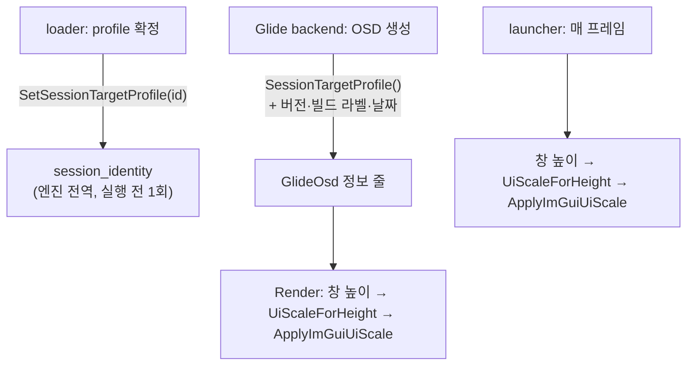

# #15 설계: re2DJ 형태의 OSD와 창 크기에 비례하는 UI 글자

Issue: [#15](https://github.com/reexec/rePIU/issues/15) · 참고: re2DJ `src/ui/osd.cpp`(re2DJ Task 297)

## 배경

지금 OSD(`GlideOsd`)는 좌상단에 내용 크기만큼의 작은 창이고, 글자는 ImGui 기본 13 px로 고정입니다. 게임 창을 2배(1280×960)나
4K 전체화면으로 키우면 그림은 커지는데 OSD 글자는 그대로라 상대적으로 작아집니다. 인자 없이 실행했을 때 뜨는 런처는 960×640
고정 창이라 키울 수조차 없습니다. re2DJ의 OSD는 창 높이에 비례하는 글자, 화면 맨 위 가로 전체 폭, 맨 위 정보 줄로 이 문제가
없습니다.

## 목표

1. OSD와 런처의 글자·여백이 창 높이에 비례합니다.
2. OSD는 화면 맨 위에 가로 전체 폭으로, 높이는 내용에 맞춥니다.
3. OSD 맨 위 첫 줄: `rePIU v{버전} ({빌드 라벨}) - Build {빌드 날짜}`(창 제목과 같은 표기).
4. 둘째 줄: `Target Profile : {프로필 id}`.

그 아래는 지금 항목(#5의 Renderer 절, LFB 토글, shader 메뉴)이 그대로 이어집니다.

## 구조

* **배율 계산**(`include/repiu/engine/imgui_ui_scale.h`): `UiScaleForHeight(height, rule) = max(minimum, height / reference × factor)`.
  ImGui 없는 순수 함수라 probe가 검사합니다.
  * OSD: re2DJ와 같은 규칙(기준 480, 계수 0.75, 최소 0.75). 게임 논리 화면이 480줄이므로 2배 창(960)에서 1.5, 4K 전체화면
    (2160)에서 3.375.
  * 런처: 기준 640(지금 창 높이), 계수 1, 최소 1. 지금 크기에서는 지금과 같고, 키우면 함께 커집니다.
* **적용**(`ApplyImGuiUiScale(base_style, scale)`): 처음 잡아 둔 기본 스타일에서 매번 다시 시작해 `ScaleAllSizes(scale)`와
  `FontScaleMain = scale`을 적용합니다. 기본에서 다시 시작하므로 반복해도 반올림 오차가 쌓이지 않고, 배율이 바뀐 프레임에만
  적용합니다. re2DJ는 글자만 키우지만, 여기서는 여백·체크박스도 함께 키워 비율이 깨지지 않게 합니다.
* **런처 창**: `SDL_WINDOW_RESIZABLE`을 더해 크기 조절·최대화가 되게 합니다. 고정 픽셀 값(표 아래 여백 132, 열 폭 110·260,
  버튼 120)에 배율을 곱합니다.
* **OSD 창**: `SetNextWindowPos(0,0)` 고정, 폭은 크기 제약으로 화면 폭에 고정, `AlwaysAutoResize`로 높이는 내용에 맞춤.
  `NoMove | NoResize | NoTitleBar`. 제목 표시줄 대신 첫 줄이 이름·버전입니다.
* **Target Profile 전달**(`include/repiu/engine/session_identity.h`): 실행 진입 함수의 인자는 이미 매우 많으므로 늘리지 않고,
  loader가 프로필을 확정한 직후 엔진 전역에 한 번 씁니다. 실행 스레드와 Glide 창이 생기기 전이라 경쟁이 없습니다. 값이 없으면
  `unknown`.
* **폰트**(구현 중 사용자 요청으로 추가): re2DJ는 ImGui v1.92.9를 쓰고, 이 버전의 `AddFontDefault`는 글자 크기가 15 px 이상이면
  ProggyForever(ProggyClean을 벡터로 다시 그린 폰트)를 고릅니다. re2DJ OSD는 보통 창에서 19.5 px 이상이라 ProggyForever로
  그려집니다. rePIU는 v1.92.1(ProggyClean만 있음)이었으므로 ImGui를 같은 커밋으로 올리고, OSD와 런처 모두
  `AddFontDefaultVector()`로 ProggyForever를 명시합니다(작은 창에서 비트맵 폰트로 바뀌지 않도록).
* **런처 표 아래 공간**(구현 중 발견): 고정값 132가 실제 옵션·버튼 높이보다 작아 기본 크기에서도 세로 스크롤바가 생겼습니다.
  직전 프레임에 잰 높이를 비우도록 바꿉니다.

## 하지 않는 것

* 실행 파일 이름 줄(re2DJ의 `Executable :`)은 요청 범위 밖이라 넣지 않습니다.

## 검증

1. probe `imgui_ui_scale`(core probe, Win32 AOT probe `--imgui-ui-scale`): OSD 규칙 480→0.75, 960→1.5,
   2160→3.375, 0·음수→최소값; 런처 규칙 640→1.0, 1280→2.0, 320→1.0(최소).
2. Win32 Release 빌드, core probe.
3. Win32 실행: 1배·2배·전체화면에서 OSD 캡처(글자가 창에 비례, 가로 전체 폭, 첫 두 줄).
4. 런처: 기본 크기와 최대화에서 캡처.
5. Linux x64 Debug(WSL) 빌드와 core probe.

---

# #15 Design: An OSD in the re2DJ Layout, and UI Text That Scales with the Window

Issue: [#15](https://github.com/reexec/rePIU/issues/15) · Reference: re2DJ `src/ui/osd.cpp` (re2DJ Task 297)

## Background

The OSD (`GlideOsd`) is a small window at the top left, sized to its content, with ImGui's fixed 13 px text. Enlarging the
game window to 2x (1280×960) or to 4K fullscreen enlarges the picture but not the text, which therefore shrinks relative to
it. The launcher shown without arguments is a fixed 960×640 window that cannot be enlarged at all. re2DJ's OSD, with text
proportional to the window height, the full width at the top and information lines first, does not have the problem.

## Goals

1. OSD and launcher text and spacing scale with the window height.
2. The OSD spans the full width at the top of the screen and is as tall as its content.
3. First OSD line: `rePIU v{version} ({build label}) - Build {build date}` (written as in the window title).
4. Second line: `Target Profile : {profile id}`.

The current controls follow unchanged (#5's Renderer section, the LFB toggle, the shader menu).

## Structure

The diagram above.

* **The scale** (`include/repiu/engine/imgui_ui_scale.h`): `UiScaleForHeight(height, rule) = max(minimum, height /
  reference × factor)`, a pure function without ImGui, checked by a probe.
  * OSD: re2DJ's rule (reference 480, factor 0.75, minimum 0.75). The game's logical screen has 480 lines, so a 2x window
    (960) gives 1.5 and 4K fullscreen (2160) 3.375.
  * Launcher: reference 640 (today's window height), factor 1, minimum 1. Unchanged at today's size; it grows when enlarged.
* **Applying it** (`ApplyImGuiUiScale(base_style, scale)`): starts each time from the base style captured once, then
  `ScaleAllSizes(scale)` and `FontScaleMain = scale`. Starting from the base keeps rounding from accumulating, and it runs
  only on frames where the scale changed. re2DJ scales only the text; here the spacing and check boxes scale too, so the
  proportions hold.
* **Launcher window**: `SDL_WINDOW_RESIZABLE` is added so it can be resized and maximised. The fixed pixel values (the 132
  below the table, the 110 and 260 column widths, the 120 buttons) are multiplied by the scale.
* **OSD window**: `SetNextWindowPos(0,0)` always, the width pinned to the display by a size constraint, the height following
  the content through `AlwaysAutoResize`, with `NoMove | NoResize | NoTitleBar`. The first line takes the title bar's place.
* **Target Profile** (`include/repiu/engine/session_identity.h`): the execution entry already takes very many arguments, so
  rather than adding one, the loader writes the profile once into an engine-wide value right after settling it. That is
  before the execution thread and the Glide window exist, so nothing races. Absent, it reads `unknown`.
* **Font** (added at the user's request during implementation): re2DJ uses ImGui v1.92.9, whose `AddFontDefault` picks
  ProggyForever (ProggyClean redrawn as vectors) once text reaches 15 px. re2DJ's OSD is 19.5 px or more in usual windows,
  so it draws in ProggyForever. rePIU was on v1.92.1 (ProggyClean only), so ImGui moves to the same commit, and both the
  OSD and the launcher name ProggyForever outright with `AddFontDefaultVector()` (so a small window does not switch to
  the bitmap face).
* **Room below the launcher table** (found during implementation): the fixed 132 was less than the options and buttons
  actually take, so even the default size showed a vertical scroll bar. It now leaves the height measured on the previous
  frame.

## Not done

* No executable name line (re2DJ's `Executable :`); it is outside the request.

## Verification

1. The `imgui_ui_scale` probe (core probe, and `--imgui-ui-scale` in the Win32 AOT probe): OSD rule 480→0.75, 960→1.5,
   2160→3.375, 0 and negative → the minimum; launcher rule 640→1.0, 1280→2.0, 320→1.0 (minimum).
2. Win32 Release build, core probe.
3. A Win32 run: OSD captures at 1x, 2x and fullscreen (text proportional to the window, full width, the first two lines).
4. Launcher: captures at the default size and maximised.
5. Linux x64 Debug (WSL) build and core probe.
