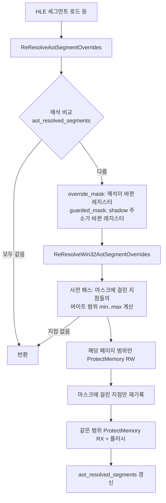

# 설계: 세그먼트 재해석의 선택적 재패치 (issue #18) — 측정으로 기각됨

> **결론(2026-10-06).** 이 설계는 구현·측정 결과 **기각**되었다. 같은 날
> 교대 측정에서 기준선(v0.0.205)의 공백 18.7/15.0/19.6초에 대해, 마스크
> v1(override=해석 변화, guarded=shadow 변화)은 35.1/45.5/45.2초,
> v2(둘 다 해석 변화)는 52.6/60.8초로 오히려 2~3배 악화되었다.
> 캐시 전량 재패치의 prologue 복원이, 게스트 페이지 리타이어가 INT3로
> 닫은 슬롯을 계속 되살리는 부수효과를 갖고 있었고("재패치는 순수
> 최적화"라는 아래 전제가 거짓), 마스크가 그 복원을 끊자 뜨거운 flip
> 슬롯이 영구 INT3 재진입으로 남았다. 상세와 다음 방향은
> `docs/analysis/pumpitea-loading-segment-flip.md`와 작업 로그
> `docs/work-logs/20261006-i018-selective-segment-repatch.md`에 있다.
> 코드는 되돌렸고 `repiu_aot_probe --selector-guard` 플래그만 남겼다.
>
> **Verdict (2026-10-06).** This design was implemented, measured and
> **rejected**: against same-day interleaved baselines of 18.7/15.0/19.6 s,
> masked v1 measured 35.1/45.5/45.2 s and v2 52.6/60.8 s. The whole-cache
> re-patch's prologue restore turned out to be load-bearing — it keeps
> resurrecting slots that guest-page retirement closes with INT3 — so the
> premise below that the re-patch is purely an optimization is false.
> Details and next directions:
> `docs/analysis/pumpitea-loading-segment-flip.md` and the work log.
> The code was reverted; only the `repiu_aot_probe --selector-guard`
> flag remains.

## 배경

pumpitea의 ANDAMIRO 로고 다음 로딩 공백이 v0.0.180의 약 5초에서 약 29초로
늘었다. issue #18의 측정으로 다음이 확인되어 있다.

* 게스트 오프셋 `0xFE378`·`0xFE38A`가 ES를 `0x24`와 `0x2B` 사이에서 번갈아
  바꾸고, guarded segment-load 지점은 로드 값이 현재 selector·shadow와 다르면
  폴백하므로 매 로드가 HLE 세그먼트 로드로 들어간다.
* HLE 세그먼트 로드마다 `ReResolveAotSegmentOverrides`가 ES 해석의 변화를
  보고 캐시 전체를 다시 패치한다. 30초 동안 46,001번, 공백 구간에서 초당
  약 1,800번이다.
* 한 번의 재패치는 (1) 캐시 용량 전체(16 MiB)에 `ProtectMemory` 2회,
  (2) 여섯 세그먼트 레지스터의 모든 override·guarded 지점 재기록,
  (3) 명령 캐시 플러시로 이루어지고 약 0.5 ms가 든다.

## 현재 구조의 사실

구현을 읽어 확인한 사실은 다음과 같다.

* 재패치는 전적으로 최적화다. override 지점은 실행 시마다
  `cmp word [shadow], 접어 둔 selector`로 자신을 검증하고, 어긋나면 INT3
  폴백으로 HLE에 들어간다. guarded load/pop/read 지점의 가드도 같다. 따라서
  재패치를 줄여도 실행의 정확성은 가드가 지킨다. 단, 접어 둔 selector가
  shadow와 **같은데** base가 달라진 경우(DPMI set-base)는 가드가 통과하므로,
  해석이 달라진 레지스터의 지점은 반드시 다시 패치해야 한다.
* `PatchAotSegmentOverrideSites`가 지점에 쓰는 값은 그 지점의
  `segment_register` 해석(selector, base, policy)에만 의존한다. 다른
  레지스터의 해석이 바뀌어도 그 지점의 바이트는 같다.
* `PatchAotGuardedSegmentLoadSites`·`PopSites`·`ReadSites`가 쓰는 값은
  해당 레지스터의 `shadow_address`와 고정된 카운터 주소뿐이다. selector나
  base에는 의존하지 않으므로, shadow 주소가 바뀌지 않는 한 재기록은 같은
  바이트를 다시 쓰는 일이다. shadow 주소는 스레드 컨텍스트 수명 동안
  사실상 한 번 정해진다.
* `ReResolveWin32AotSegmentOverrides`는 `placement->capacity`(16 MiB) 전체에
  `ProtectMemory`를 걸지만, 실제 기록은 지점들이 있는 바이트 범위 안에서만
  일어난다.

## 설계

재패치 경로에 두 개의 세그먼트 마스크를 더해, 바뀐 것만 다시 쓴다.

### 1. 레지스터별 선택 재패치

* `runtime::PatchAotSegmentOverrideSites`와 guarded load/pop/read 패처에
  `segment_mask`(비트 = 세그먼트 인덱스, 기본값 `0x3F`)를 더한다. 마스크에
  없는 레지스터의 지점은 건너뛰고 `processed`에 세지 않는다. 기본값이 전체
  마스크이므로 배치 시 초기 패치와 probe는 그대로다.
* `engine::ReResolveWin32AotSegmentOverrides`에 `override_segment_mask`와
  `guarded_segment_mask`(기본값 `0x3F`)를 더한다. override 지점은
  `override_segment_mask`로, guarded 지점 셋은 `guarded_segment_mask`로
  거른다.
* `ReResolveAotSegmentOverrides`(engine)는 레지스터별로 해석을 비교해
  `override_segment_mask`를 만들고, `shadow_address`만 비교해
  `guarded_segment_mask`를 만든다. 초기화 전이면 둘 다 전체 마스크다.
  ES만 번갈아 바뀌는 지금의 병리에서는 ES override 지점만 다시 쓰고,
  guarded 지점(세 종류 전부)은 shadow 주소가 그대로이므로 건너뛴다.

### 2. 기록 범위만 보호·플러시

* `ReResolveWin32AotSegmentOverrides`는 패치 전에 마스크에 걸린 지점들을
  한 번 훑어 기록될 바이트 범위 `[min, max)`를 구한다. 지점별 기록 끝은
  prologue(최소한 HLE `JMP rel32`의 5바이트)와 각 operand 필드의 끝 중 큰
  값이다.
* `ProtectMemory`와 `FlushInstructionCacheRange`를 캐시 용량 전체가 아니라
  이 범위를 페이지 경계(`platform::SystemPageSize()`)로 넓힌 구간에만 건다.
* 걸린 지점이 없으면 보호·기록·플러시를 모두 생략하고 0을 돌려준다.

### 3. 호출자의 상태 갱신

지금은 반환값이 0이면 `aot_resolved_segments`를 갱신하지 않아, 마스크
도입 후 "바뀐 레지스터에 지점이 하나도 없는" 경우 매 호출이 다시 들어온다.
실패와 무작업을 구분하기 위해 `AotSegmentPatchStats`에
`protect_failure_count`를 더한다. 호출자는 `ProtectMemory` 실패가 아니면
(패치했든 지점이 없었든) 해석 스냅숏을 갱신한다.

## 바꾸지 않는 것

* 가드·폴백·HLE 세그먼트 로드 경로의 의미는 그대로다. 번갈아 바뀌는
  selector 자체(지점별 두 selector 기억, shadow에서 base 읽기)는 issue #18의
  근본 해결 방향 3으로 남긴다. 이 설계의 결과 측정이 5초 수준으로 돌아오지
  않으면 그때 진행한다.
* 배치 시 초기 전체 패치와 probe들의 기존 동작(기본 마스크)은 그대로다.

## 검증

* Win32 Release 빌드 후 `repiu_aot_probe`의 selector guard probe가 기존
  단언(기본 마스크 경로)을 통과해야 한다.
* 재현 절차(issue #18)로 pumpitea를 90초 실행해 `[repiu-frame-rate]`의
  공백 구간을 비교한다. 목표는 v0.0.180 수준(약 5초)으로의 복귀다.
* `REPIU_AOT_SEGMENT_RESOLUTION_TRACE=1`로 재패치 빈도가 그대로임을(원인은
  그대로, 비용만 줄었음을) 확인하고 작업 로그에 남긴다.

---

# Design: selective re-patch on segment re-resolution (issue #18)

## Background

pumpitea's loading gap after the ANDAMIRO logo grew from about 5 s in
v0.0.180 to about 29 s. Issue #18 established:

* Guest offsets `0xFE378` and `0xFE38A` switch ES back and forth between
  `0x24` and `0x2B`; a guarded segment-load site falls back whenever the
  loaded value differs from the current selector and shadow, so every load
  enters the HLE segment load.
* Each HLE segment load runs `ReResolveAotSegmentOverrides`, which sees the
  ES resolution change and re-patches the whole cache: 46,001 times in 30 s,
  about 1,800 a second during the gap.
* One re-patch is (1) two `ProtectMemory` calls over the whole 16 MiB cache
  capacity, (2) a rewrite of every override and guarded site of all six
  segment registers, (3) an instruction-cache flush — about 0.5 ms.

## Facts of the current structure

Read from the implementation:

* The re-patch is purely an optimization. An override site validates itself
  on every execution with `cmp word [shadow], folded-selector` and falls
  back to HLE through INT3 on mismatch; the guarded load/pop/read guards do
  the same. Reducing re-patches therefore cannot break correctness — with
  one exception: when the folded selector still matches the shadow but its
  base changed (DPMI set-base), the guard passes, so sites of a register
  whose resolution changed must still be re-patched.
* The bytes `PatchAotSegmentOverrideSites` writes at a site depend only on
  that site's own `segment_register` resolution (selector, base, policy).
* The guarded load/pop/read patchers write only the register's
  `shadow_address` and fixed counter addresses. They do not depend on the
  selector or base, so unless the shadow address changes — effectively once
  per thread context — re-writing them writes identical bytes.
* `ReResolveWin32AotSegmentOverrides` protects the whole
  `placement->capacity` (16 MiB) although all writes land inside the byte
  range the sites occupy.

## Design

Two segment masks on the re-patch path; rewrite only what changed.
(Mermaid flow above: compare resolutions → build `override_mask` from
changed resolutions and `guarded_mask` from changed shadow addresses →
pre-pass computes the written byte span → protect, patch and flush only
that page range → update the resolution snapshot.)

### 1. Per-register selective re-patch

* `runtime::PatchAotSegmentOverrideSites` and the guarded load/pop/read
  patchers take a `segment_mask` (one bit per segment index, default
  `0x3F`). Sites of unmasked registers are skipped and not counted in
  `processed`. The default keeps placement-time patching and the probes
  unchanged.
* `engine::ReResolveWin32AotSegmentOverrides` takes
  `override_segment_mask` and `guarded_segment_mask` (default `0x3F`),
  filtering override sites by the former and all three guarded site kinds
  by the latter.
* `ReResolveAotSegmentOverrides` (engine) builds `override_segment_mask`
  from per-register resolution comparison and `guarded_segment_mask` from
  `shadow_address` comparison alone; both are full before initialization.
  Under today's pathology (only ES alternating), only ES override sites are
  rewritten and all guarded sites are skipped.

### 2. Protect and flush only the written range

* Before patching, `ReResolveWin32AotSegmentOverrides` makes one pass over
  the masked sites to compute the written byte span `[min, max)`. A site's
  write end is the larger of its prologue (at least the 5-byte HLE
  `JMP rel32`) and each operand field end.
* `ProtectMemory` and `FlushInstructionCacheRange` cover only that span
  widened to page boundaries (`platform::SystemPageSize()`), not the whole
  capacity.
* With no masked sites, protection, patching and flushing are all skipped
  and 0 is returned.

### 3. Caller state update

Today a 0 return skips the `aot_resolved_segments` update; with masks, a
changed register that happens to own no sites would re-enter on every call.
`AotSegmentPatchStats` gains `protect_failure_count` so the caller can tell
failure from no-work: unless `ProtectMemory` failed, the resolution snapshot
is updated whether or not any site was written.

## Out of scope

* The guard/fallback/HLE segment-load semantics are unchanged. The
  alternating selector itself (two remembered selectors per site, or reading
  the base from the shadow) remains issue #18's root-fix direction 3, to be
  taken up only if the measured gap does not return to the ~5 s level.
* Placement-time full patching and the probes keep their behavior through
  the default masks.

## Verification

* After a Win32 Release build, the selector guard probe of
  `repiu_aot_probe` must pass its existing assertions (default-mask path).
* Run pumpitea for 90 s per issue #18's reproduction and compare the
  `[repiu-frame-rate]` gap. The target is a return to the v0.0.180 level
  (about 5 s).
* Confirm with `REPIU_AOT_SEGMENT_RESOLUTION_TRACE=1` that the re-patch
  frequency is unchanged (the cause remains; only the cost shrank) and
  record it in the work log.
