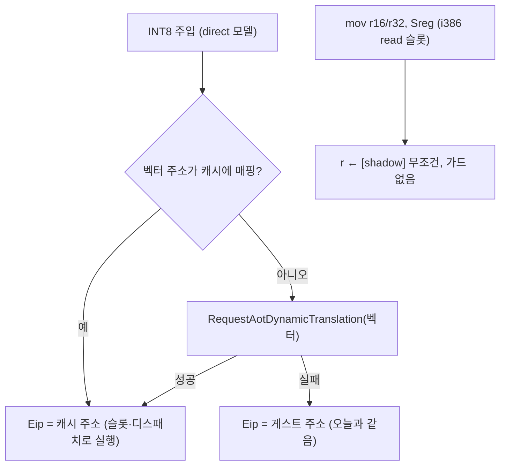

# 설계: INT8 ISR의 캐시 진입과 shadow 무조건 읽기 슬롯 (issue #18, 방향 3 3단계)

선행: `docs/design/20261007-i018-shadow-authoritative-pop-and-memory-load.md`
분석: `docs/analysis/pumpitea-loading-segment-flip.md`

## 근거가 되는 측정 (2단계 빌드, pumpitea)

2단계 뒤 세그먼트 트레이스(30초)와 90초 런의 breakpoint census가 남은
트랩을 셌다.

| 지점 | 횟수 | 경로 | 이유 |
|---|---|---|---|
| `0xFE376` `mov ax, ds` (memcpy) | 33,015/30초 (census 43,355/90초) | guarded **read** 슬롯 INT3 폴백 | 슬롯이 물리 DS(항상 0x002B)와 shadow(0x0024)를 비교 — 물리 레지스터는 게스트 selector를 담지 않으므로 가상 DS가 flat이 아닌 동안 **항상 폴백** |
| `0xFE2F0` `mov ds, cs:[abs]` (ISR 진입 헬퍼) | 6,354/30초 | **캐시 밖 네이티브 폴트** → HLE | `InjectPendingInterrupts`가 `Eip = shadow.offset`(원 게스트 주소)로 ISR에 들어가 ISR 앞부분이 캐시 밖에서 돈다. 2단계의 메모리-소스 슬롯은 이 경로에 없다. census의 INT3 지점 목록에 없는 이유. |
| `0xFCF6D`/`0xFCF6F` (far strcmp) | 1,860/30초 | load 슬롯 폴백(DS←0x0080, 쌍 밖) + 뒤 명령의 HLE 재진입 | DS가 0x0024(ISR)·0x0080(strcmp)·0x002B 세 값을 돌아 수용 쌍 한 칸을 서로 밀어냄 |

exception census(90초): breakpoint 396k, **privileged 0xC0000096 236k**,
AV 46.9k. 네이티브로 도는 ISR 앞부분의 포트 I/O가 privileged 예외의
후보다(캐시 안이라면 `kPortIo` 디스패치 슬롯).

## 설계



### 1. ISR 주입의 캐시 진입

`InjectPendingInterrupts`에서 direct 모델일 때 벡터 주소를
`FindAotCacheAddress`로 조회해 매핑돼 있으면 그 캐시 주소로 진입한다.
매핑이 없으면 `RequestAotDynamicTranslation`(동기, 워커가 번역해 추가)로
한 번 번역을 시도하고 성공하면 그 엔트리로, 실패하면 오늘처럼 게스트
주소로 들어간다. 프레임(복귀 pad, 플래그, CS)은 바꾸지 않는다 —
복귀는 Task 762의 return pad가 그대로 받는다. x64(cache 모델)는 이미
`CanEnterTimerInterruptHandler`가 같은 조회를 하므로 건드리지 않는다.
`REPIU_TIMER_HANDLER_CACHE_ENTRY=0|off|false`로 끈다. 카운터 세 개
(cache/translated/native 진입)를 종료 요약에 더한다.

### 2. i386 guarded read 슬롯: shadow 무조건 로드

HLE의 `mov r, Sreg`는 `ReadGuestSegmentSelector`로 shadow를 돌려주고,
슬롯의 성공 경로도 shadow를 로드한다. 가드는 결과를 바꾸지 않고 트랩만
더하므로 없앤다.

```
0  66 8B 05|reg<<3 <shadow>   mov r16, [shadow]   ; shadow_address_offset = load_shadow_address_offset = 3
7  E9 <rel32>                 jmp fallthrough     ; fixup at 8
```

12바이트. `fallback_offset`은 슬롯 시작(미해결 시 패처가 INT3를 두는
자리)으로 둔다. 패처(두 주소 필드에 같은 값), guard-fault 창(시작~
shadow 주소), 동적 추가 오프셋은 기존 코드로 맞는다. 16-bit 로드이므로
r32 목적지의 상위 16비트를 보존하는 HLE(`WriteRegister16`)와 같다.
long-mode read 슬롯은 그대로다.

### 3. 범위 밖

수용 쌍을 집합으로 늘리는 것(strcmp의 0x0080)은 1·2의 측정 뒤 판단한다.

## 검증

1. `--selector-guard` read 레이아웃 단언 갱신·통과, `--segment-restore`.
2. pumpitea 90초 교대(기준선 = 2단계 빌드 사본): 로고 뒤 공백,
   exception census(privileged·AV), handled segment load, 주입 진입
   카운터.
3. pumpit1·pumpit2a·pumpit3a 스모크. 복귀 pad 카운터와 "guest exception"
   0 확인(ISR 캐시 진입의 회귀 울타리).

---

# Design: INT8 ISR cache entry and the unconditional shadow read slot (issue #18, direction 3 phase 3)

A 30 s segment trace and the 90 s breakpoint census on the phase-2 build
locate what still traps: memcpy's `mov ax, ds` (33k per 30 s) falls back
in the guarded **read** slot because that slot compares the physical DS
(always 0x002B) with the shadow (0x0024) — a compare that must fail
whenever the virtual DS is not flat; the ISR entry helper's `mov ds,
cs:[abs]` (6.4k per 30 s) faults **natively outside the cache** because
`InjectPendingInterrupts` enters the handler at `Eip = shadow.offset`,
the raw guest address, so phase 2's memory-source slot never sees it;
and the far-strcmp pair (1.9k per 30 s) evicts the single accepted
alternate (DS cycles 0x0024/0x0080/0x002B). The 90 s census also counts
236k privileged exceptions, with the ISR's native port I/O a candidate.

Design (flow above): (1) on the direct model the injection looks the
vector up with `FindAotCacheAddress` and enters the cache address when
mapped; otherwise it asks `RequestAotDynamicTranslation` once and enters
the returned entry, falling back to the guest address as today. Frame,
return pad, flags and CS are unchanged; x64 already performs this lookup
in `CanEnterTimerInterruptHandler` and is untouched; opt-out
`REPIU_TIMER_HANDLER_CACHE_ENTRY=0|off|false`; three entry counters join
the shutdown summary. (2) The i386 guarded read slot becomes an
unconditional 16-bit load from the shadow followed by the fallthrough
jump (12 bytes; `shadow_address_offset == load_shadow_address_offset ==
3`, `fallback_offset` at the slot start where an unresolved INT3 goes),
matching the HLE's `WriteRegister16` semantics; the long-mode slot is
unchanged. Growing the accepted pair into a set is decided after
measuring (1) and (2). Verification: updated probe assertions, 90 s
pumpitea interleaved against the phase-2 build (gap, exception census,
handled loads, entry counters), and the three-title smoke with the
return-pad counters and zero guest exceptions as the fence.
