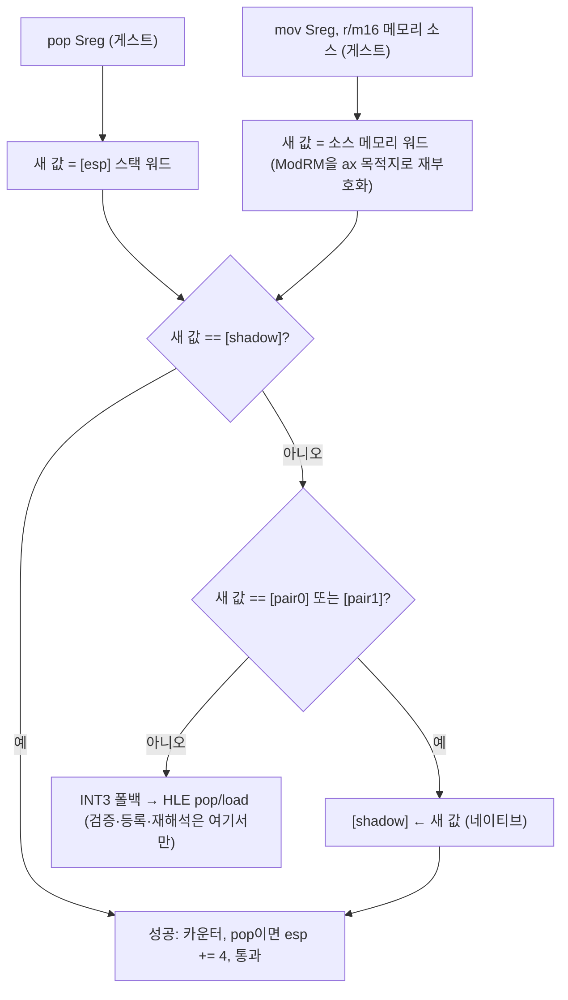

# 설계: shadow 진실원 세그먼트 pop 슬롯과 메모리-소스 로드 슬롯 (issue #18, 방향 3 2단계)

선행 설계: `docs/design/20261006-i018-shadow-authoritative-segment-load.md`
분석: `docs/analysis/pumpitea-loading-segment-flip.md`

## 근거가 되는 측정

1단계(612251c)는 i386 guarded **load** 슬롯(레지스터 소스)만 shadow
진실원으로 바꿨고, 공백은 14.7~15.6초에서 6.8~7.6초로 줄었다. 남은
guarded pop 폴백 48.7k/90초와 "ISR의 메모리-소스 DS 로드"가 다음 후보로
남았다. 이번에 pumpitea 실행 파일(`build/runtime_mounts/pumpitea/PIU/PIU.EXE`)
을 `repiu_aot_probe --dump`로 직접 떠서 지점의 명령을 확정했다.

| 지점 | 명령 | 오늘의 처리 | 비용 |
|---|---|---|---|
| memcpy 복원 `0xFE38A` | `07` **pop es** (분석 문서의 "mov es,[saved]" 추정은 오류) | guarded pop 슬롯: `물리 == 스택 워드`는 통과(둘 다 0x2B), `물리 == shadow`는 shadow가 직전 로드의 0x0024라 실패 → INT3 | memcpy마다 폴백 1 + ES 재해석 1 + 전량 재패치 1 |
| INT8 ISR 진입 헬퍼 `0xFE2F0` | `66 2E 8E 1D disp32` mov ds, cs:[abs] (0x66 접두어 포함) | 슬롯 없음 — 메모리 소스는 분류기가 받지 않아 HLE boundary INT3 | 틱마다 INT3 1 + DS 재해석 1 + 전량 재패치 1 |
| INT8 ISR 말미 `0x2AB80~` | `0F A9` pop gs, `0F A1` pop fs, `07` pop es, `1F` **pop ds**, `61` popad, `CF` iretd | guarded pop 슬롯 4개. pop ds는 shadow(0x0024)≠스택 워드(0x002B)로 매번 INT3 | 틱마다 폴백 1 + DS 재해석 1 + 전량 재패치 1 |
| 런 간 고정 2,520건 `0xFCF6F` | `8E DA` mov ds,dx; `8E C0` mov es,ax (far 문자열 비교 관용구) | 앞 로드가 HLE로 가면 뒤 로드가 비슬롯 경로로 이어짐 | 작음, 이번 범위 밖 |

즉 1단계 뒤에도 memcpy 1회 = pop 폴백 1 + 전량 재패치 1, 틱 1회 =
INT3 2 + 전량 재패치 2가 남아 있다. 1단계와 같은 근거(물리 세그먼트
레지스터는 게스트 selector를 담지 않으므로 물리 비교는 flat 재로드만
통과; 두 selector는 모두 base 0)로 두 슬롯을 같은 모양으로 바꾼다.

## 설계



### 1. i386 guarded pop 슬롯

물리 레지스터 읽기(`mov ax, Sreg`)와 두 비교를 버리고, 스택 워드를
1단계 로드 슬롯과 같은 세 비교에 넣는다. 성공 경로만 `lea esp,[esp+4]`로
스택 워드를 소비한다.

```
 0  9C 50                 pushfd; push eax
 2  66 8B 44 24 08        mov ax, [esp+8]          ; 게스트가 pop할 워드
 7  66 3B 05 <shadow>     cmp ax, [shadow]         ; shadow_address_offset=10
14  74 18                 je success
16  66 3B 05 <pair0>      cmp ax, [pair0]          ; pair0_address_offset=19
23  74 09                 je write
25  66 3B 05 <pair1>      cmp ax, [pair1]          ; pair1_address_offset=28
32  75 17                 jne fallback
34  66 A3 <shadow>        write: mov [shadow], ax  ; shadow_store_offset=36
40  FF 05 <success>       success: inc [counter]   ; success_counter_address_offset=42
46  58 9D 8D 64 24 04     pop eax; popfd; lea esp,[esp+4]
52  E9 <rel32>            jmp fallthrough
57  FF 05 <fallback>      fallback: inc [counter]  ; fallback_counter_address_offset=59
63  58 9D CC              pop eax; popfd; int3     ; fallback_offset=65
```

66바이트. `AotGuardedSegmentPopSite`에 로드 사이트와 같은
`pair0_address_offset`/`pair1_address_offset`/`shadow_store_offset`를
더하고, 패처는 로드 패처와 같은 규칙(필드 0이면 옛 레이아웃, 쌍 주소가
없으면 shadow 주소로 대체)을 따른다. long-mode pop 슬롯은 그대로다.

### 2. 메모리-소스 guarded load 슬롯

분류기(`ReadGuardedSegmentLoadRegisters`)가 `mov Sreg, r/m16`의 메모리
형태를 받는다. 조건:

* 목적지 ES/DS/FS/GS, 32-bit 주소 크기(0x67 없음).
* 접두어는 0x66(연산 폭, 이 명령에 무의미)과 0x2E(CS)만. 소스의
  세그먼트가 CS·DS·SS(암묵 포함)일 때만 받는다. 명시 ES/SS/DS/FS/GS
  override는 분류 순서상 앞의 `kSegmentOverrideMem`이 이미 가져가므로
  여기 오지 않는다. CS 소스는 flat 코드 모델에서 base 0이라 네이티브
  `[abs]` 읽기와 같다(long-mode의 CS 데이터 접근을 복사로 두는 Task
  716의 근거와 동일).
* 레코드는 `gpr_register = kAotSegmentLoadMemorySource`(0x80)로 표시하고
  `bytes`가 원 명령을 담는다. long-mode 이미터는 `gpr_register > 7`을
  거부하므로 x64에서는 오늘처럼 INT3 boundary로 남는다.

i386 이미터는 `66 8B`에 원 ModRM/SIB/disp를 reg=000(ax)으로 재부호화해
붙이고, 나머지는 레지스터 소스 슬롯과 같다. 슬롯 안에서 `pushfd;
push eax`로 esp가 8 내려가므로 **ESP 베이스** 피연산자는 disp에 8을
더해 mod=10(disp32) 형태로 다시 쓴다. EAX 베이스/인덱스는 push가
EAX 값을 바꾸지 않으므로 그대로다. 재부호화는 이미터와 커버리지
검증기가 같은 헬퍼로 한다.

### 3. 바꾸지 않는 것

* HLE 폴백의 의미. 쌍 밖 selector는 오늘처럼 `HandleSegmentPopInstruction`
  /`HandleSegmentLoadInstruction`(접두어 0x66·0x2E, SIB 포함 ModRM 디코드
  지원)으로 간다.
* `pair[reg][1]` 수용·퇴출 규칙, `BuildAotSegmentTable` 역전,
  override·read·push 슬롯, long-mode 슬롯 전부.
* 전량 재패치의 형태. 네이티브 flip 뒤 처음 만나는 HLE 재해석은 shadow가
  마지막 해석표와 다르면 한 번 재패치한다 — 이것은 설계된 자기검증이며
  flip마다가 아니라 "진짜 바뀐 뒤 처음"에만 든다.

## 예상 효과와 위험

* 틱 경로(ISR 진입 로드 + 말미 pop ds)와 memcpy 복원 pop의 INT3·재해석·
  전량 재패치가 사라진다. 남는 것은 DOS 시간 루프·lseek·포트 I/O VEH와
  `0xFCF6F` 그룹(2.5k/90초)이다.
* 위험 1: ISR이 DS=0x0024 상태에서 명시 `ds:` override 지점을 지나면
  override 가드가 실패해 HLE로 가고 재해석이 한 번 일어난다. 올바른
  동작이며, 횟수는 handled segment load·재해석 카운터로 본다.
* 위험 2: 메모리-소스 재부호화 오류. 검증기가 같은 헬퍼로 레이아웃을
  확인하고, probe에 ESP 베이스·CS+0x66 접두어·0x67 거부 사례를 둔다.
* 위험 3: pumpit3a의 간헐 게스트 AV(1단계 미확정 항목)가 타이밍 변화로
  더 자주 드러날 수 있다. 스모크에서 횟수를 기록한다.

## 검증

1. `repiu_aot_probe --selector-guard`: pop 슬롯 레이아웃 단언을 새
   슬롯으로 갱신, 메모리-소스 로드의 분류·재부호화·검증기 통과 사례
   추가. `--segment-restore` 유지.
2. pumpitea 90초, 1단계와 같은 교대 프로토콜(같은 디렉터리의 exe 사본,
   기준선 = 1단계 HEAD 빌드, 교대 ≥2쌍): 공백, handled segment load,
   guarded pop·load 성공/폴백.
3. 회귀 울타리: pumpit1·pumpit2a·pumpit3a 기동 스모크.

---

# Design: shadow-authoritative segment pop and memory-source load slots (issue #18, direction 3 phase 2)

## Grounding measurements

Phase 1 (612251c) converted only the i386 register-source guarded load
slot and halved the gap (14.7–15.6 s → 6.8–7.6 s), leaving 48.7k
guarded-pop fallbacks per 90 s and the ISR's memory-source DS load.
Disassembling pumpitea's executable
(`build/runtime_mounts/pumpitea/PIU/PIU.EXE`, `repiu_aot_probe --dump`)
settles the remaining sites: the memcpy restore at `0xFE38A` is
**`pop es`** (the analysis topic's "mov es,[saved]" was a guess), which
passes the slot's physical-vs-stack compare but fails the shadow compare
against the 0x0024 the preceding load left; the INT8 ISR entry helper
`0xFE2F0` is `66 2E 8E 1D disp32` (`mov ds, cs:[abs]` with an
operand-size prefix), which no slot accepts today and therefore pays an
INT3 plus a whole-cache re-patch per tick; the ISR epilogue at
`0x2AB80` is `pop gs; pop fs; pop es; pop ds; popad; iretd`, whose
`pop ds` fails the shadow compare every tick; and the run-invariant
2,520 group at `0xFCF6F` is the `mov ds,dx; mov es,ax` pair of a
far-string compare, out of scope. So after phase 1 one memcpy still
costs one pop fallback plus one re-patch, and one tick two INT3s plus
two re-patches. The same grounds as phase 1 apply (the physical
segment registers never hold guest selectors; both selectors fold
base 0), so both slots take the same shape.

## Design

The Mermaid flow above: the new value is the stack word (pop) or the
source memory word (memory-source load, ModRM re-encoded to an `ax`
destination); equal to `[shadow]` → pass; equal to `[pair0]`/`[pair1]`
→ native `[shadow] ← new`, pass; otherwise INT3 → the unchanged HLE.

1. **i386 guarded pop slot** (66 bytes, layout above): no physical
   read; `mov ax, [esp+8]` fetches the word the guest pops, the three
   compares follow, the success path alone consumes the word with
   `lea esp,[esp+4]`. `AotGuardedSegmentPopSite` gains the load site's
   `pair0_address_offset`, `pair1_address_offset` and
   `shadow_store_offset`; the patcher applies the load patcher's rule
   (zero fields → old layout, absent pair addresses → the shadow
   address). The long-mode pop slot is unchanged.
2. **Memory-source guarded load slot**: `ReadGuardedSegmentLoadRegisters`
   accepts `mov Sreg, r/m16` memory forms for ES/DS/FS/GS with 32-bit
   addressing, prefixes limited to 0x66 and 0x2E, and a CS/DS/SS
   (implicit included) source segment; explicit overrides never reach
   it because `kSegmentOverrideMem` is classified first, and CS reads
   fold base 0 in the flat code model (Task 716's reasoning). The
   record carries `gpr_register = kAotSegmentLoadMemorySource` (0x80)
   and the original bytes; the long-mode emitter rejects `gpr > 7`, so
   x64 keeps today's INT3 boundary. The i386 emitter appends `66 8B`
   plus the re-encoded ModRM/SIB/disp (reg = 000); an **ESP-based**
   operand gets +8 on its displacement in mod=10 form because the slot
   has pushed EFLAGS and EAX; EAX bases/indices are untouched. The
   emitter and the coverage validator share the encoder.
3. **Unchanged**: HLE fallback semantics (both handlers already decode
   these forms), the pair acceptance/eviction rules, the table
   inversion, the override/read/push and long-mode slots, and the
   whole-cache re-patch — which after a native flip now fires once at
   the next HLE re-resolution that sees a changed shadow, not per flip.

## Expected effect, risks, verification

The tick path's and the memcpy restore's INT3, re-resolution and
re-patch disappear; what remains is the DOS time loops, lseek, port I/O
and the 2.5k `0xFCF6F` group. Risks: an explicit `ds:` override site
executed under DS=0x0024 fails its guard and re-resolves once
(correct, counted); a re-encoding error (validator plus probe cases for
ESP base, CS+0x66 prefixes and 0x67 rejection); pumpit3a's intermittent
guest AV surfacing more often (counted in smoke). Verification:
`--selector-guard` with updated pop assertions and new memory-source
cases, `--segment-restore`; pumpitea 90 s interleaved against the
phase-1 HEAD build (≥2 pairs); pumpit1/pumpit2a/pumpit3a smoke.
