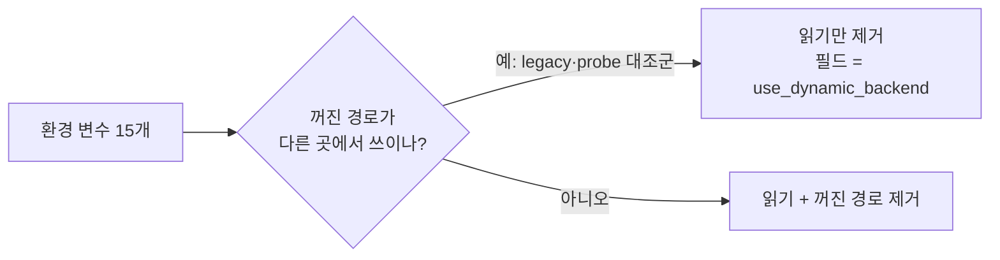

# 설계: 오래 승격된 기능의 끄기 스위치 제거 (issue #20)

근거 조사: `docs/analysis/environment-toggle-inventory.md`의 1번 묶음.

## 원칙

* **기능은 그대로 둔다.** 지우는 것은 환경 변수 읽기와, 그 변수가 꺼졌을 때만 도달하던
  코드 경로다. 기본 상태(변수 없음)의 동작은 바이트 단위로 같아야 한다.
* **빌드 옵션 필드는 남긴다.** `AotCodeCacheBuildOptions::enable_dbt_*` 같은 필드는
  legacy 백엔드(진단용으로 남아 있음)와 probe의 대조군 이미지가 꺼진 값으로 쓴다. 이
  필드들이 지키는 "꺼진 방출 경로"는 환경 변수와 무관하게 살아 있으므로 지우지 않는다.

## 변수별 처리

| 변수 | 처리 |
|---|---|
| `REPIU_AOT_DBT_PORT_IO_DISPATCH`, `_RETURN_MISS_DISPATCH`, `_DIRECT_EDGE_DISPATCH`, `_TIMER_SAFE_POINTS`, `REPIU_AOT_DIRECT_RETURN_TABLE` | loader에서 읽기 제거, 필드는 `use_dynamic_backend`. `_DIRECT_EDGE_DISPATCH`는 꺼면 캐시 밖 직접 간선이 있는 이미지의 생성이 실패하므로 원래도 실질적인 선택지가 아니었다 |
| `REPIU_AOT_INLINE_CACHE_PATCH_INLINE` | 읽기와 함께 worker 왕복 패치 경로를 제거한다: worker의 `kPatchInlineCache` 처리, 요청용 원자 변수 3개, 결과 필드, `aot_inline_cache_worker_patch_count` 카운터와 그 로그·텔레메트리. 다른 worker 연산(번역, 페이지 리타이어)은 그대로 |
| `REPIU_GLIDE_SETTER_ELIDE`, `_TEXTURE`, `_BATCH3`, `_BATCH4` | 판정 함수 4개와 `ResolveGlideSetterElisionEnabled`를 제거하고, boundary는 항상 캐시를 넘기며 네 gate 목록을 모두 무조건 적용한다 |
| `REPIU_GLIDE_DRAW_BATCH` | 판정 함수와 `ResolveGlideDrawBatchEnabled`를 제거하고 boundary는 항상 batch를 넘긴다 |
| `REPIU_GLIDE_HOST_WAIT` | 판정 함수 제거. host 컨텍스트가 없을 때의 `YieldMilliseconds` 분기는 그 경우를 위해 남는다 |
| `REPIU_GLIDE_GATE_PUMP` | 판정 함수와 gate 진입부의 `PumpEvents()` 호출(옛 경로)을 제거한다 |
| `REPIU_PORT_IO_DELAY_LOOP` | 판정 함수와 `ResolvePortIoDelayLoopEnabled`를 제거하고 delay loop 일괄 처리를 항상 시도한다 |
| `REPIU_NATIVE_LINEAR_SPAN_REJECT_CACHE` | 읽기 제거, 활성 조건은 기존 기본값(동적 백엔드이고 하드웨어 디버그 레지스터가 있을 때)으로 고정. **동작 변화 하나:** legacy 백엔드에서 `=1`로 켜던 수단이 사라진다 — legacy는 진단용이고 span 자체도 명시 설정이 있어야 켜지므로 영향은 진단 실행에 한정된다 |

## 문서·스크립트

* README의 토글 설명 줄, ARCHITECTURE의 해당 서술은 "항상 켜짐"으로 고친다.
* `docs/guides/glide-setter-elision-testing.md`, `gameplay-scene-capture.md`,
  `pumpit3-stall-reproduction.md`의 해당 절차는 **종료된 A/B 기록**으로 표시한다 —
  스위치가 없어져 그대로 따라 할 수 없다.
* `scripts/task365_glide_setter_state_elision.ps1`, `scripts/task414_delay_loop_ab.ps1`은
  두 대조군이 같은 구성으로 돌게 되므로 파일 머리에 그 사실을 적는다.

## 검증

1. Win32 Release 빌드, `repiu_aot_probe`의 관련 probe(`--selector-guard` 및 setter
   cache·draw batch·native span probe를 포함하는 전체 체인 중 해당 절).
2. 16개 롬셋 30초 스모크(예외·프레임)가 변경 전과 같아야 한다.
3. pumpitea 90초 1회: 로고 다음 공백이 v0.0.206 범위(1.5~2.7초)에 있어야 한다.

---

# Design: retire the kill switches of long-promoted features (issue #20)

Grounded in group 1 of `docs/analysis/environment-toggle-inventory.md`.

**Principles.** Keep the features; delete only the environment read and the code reachable
solely through the switch's off value. With no variable set, behavior must stay byte-for-byte
the same. **Build-option fields stay**: fields such as
`AotCodeCacheBuildOptions::enable_dbt_*` are used in their off state by the legacy backend
(kept for diagnosis) and by the probes' control images, so the off emission paths they guard
remain live regardless of the environment.

**Per variable.** The five AOT build toggles lose their loader reads and become
`use_dynamic_backend` (switching direct-edge dispatch off already failed image construction
for images with out-of-cache direct edges, so it was never a real option).
`REPIU_AOT_INLINE_CACHE_PATCH_INLINE` takes the worker round-trip patch path with it: the
worker's `kPatchInlineCache` handling, the three request atomics, the result field, and the
`aot_inline_cache_worker_patch_count` counter with its log and telemetry; other worker
operations are untouched. The four Glide setter-elision switches and their resolver go, the
boundary always passes the cache and applies all four gate lists. `REPIU_GLIDE_DRAW_BATCH` and
its resolver go, the boundary always passes the batch. `REPIU_GLIDE_HOST_WAIT` goes; the
`YieldMilliseconds` branch stays for the no-host-context case. `REPIU_GLIDE_GATE_PUMP` goes
with the old `PumpEvents()` call at gate entry. `REPIU_PORT_IO_DELAY_LOOP` and its resolver go,
the batching is always attempted. `REPIU_NATIVE_LINEAR_SPAN_REJECT_CACHE` loses its read and is
fixed at its previous default (dynamic backend with hardware debug registers) — **one behavior
change**: the legacy backend loses its `=1` opt-in, which only affects diagnostic runs since
legacy spans need an explicit setting anyway.

**Docs and scripts.** README and ARCHITECTURE describe these as always on; the procedures in
`glide-setter-elision-testing.md`, `gameplay-scene-capture.md` and
`pumpit3-stall-reproduction.md` are marked as concluded A/B records; `task365_*` and
`task414_*` scripts get a header note that both arms now run the same configuration.

**Verification.** Win32 Release build and the relevant probes; a 16-romset 30 s smoke matching
the pre-change results; one 90 s pumpitea run inside v0.0.206's 1.5–2.7 s gap range.
