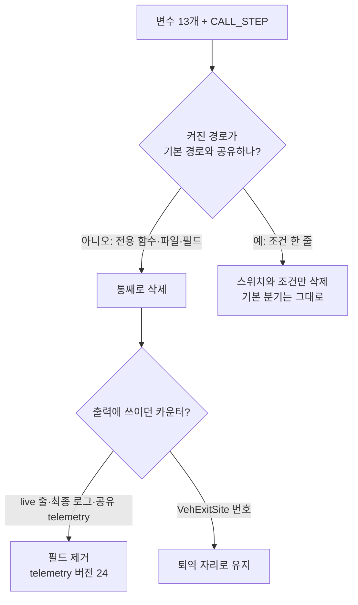

# 설계: 버려진 옵트인 실험의 기능과 스위치 삭제 (issue #22)

근거 조사: `docs/analysis/environment-toggle-inventory.md`의 2번 묶음. 1번 묶음은 #20
(`docs/design/20261007-i020-retire-promoted-kill-switches.md`).

## 원칙

* **변수가 없을 때의 실행과 방출 코드는 그대로 둔다.** 삭제 대상은 모두 기본 꺼짐이므로,
  꺼진 쪽(기본) 분기를 그대로 남기고 켜진 쪽 분기, 스위치, 그 분기만 쓰던 함수·필드·카운터를
  지운다. AOT 이미지의 방출 바이트(세그먼트 오버라이드 슬롯 `je 0x02; popfd; int3`, 간접
  분기 miss 꼬리 `popfd; int3`)는 바뀌지 않는다.
* **진단 출력은 항상 0이던 필드만 지운다.** 지운 카운터를 출력하던 `[repiu-live]` 필드,
  loader의 최종 로그 줄, supervisor 줄, 공유 live telemetry 필드가 대상이다. 공유 메모리
  배치가 바뀌므로 `kLiveTelemetryVersion`을 23에서 24로 올린다.
* **번호가 계약인 값은 유지한다.** `VehExitSite`는 "값은 안정 식별자이며 뒤에만 추가한다"는
  계약이 있고 `last_exit_site=`로 숫자가 출력되므로, 쓰이지 않게 되는 세 값
  (`kCallStepProbe`, `kNativeRegionReturn`, `kNativeRegionSensitive`)은 "퇴역, 설정되지
  않음" 주석과 함께 자리를 지킨다. `ExecutionTimeBucket`은 저장되거나 외부로 번호가
  나가지 않으므로 `kAotReentryNativeSpan`을 지우고 해당 로그 열을 뺀다.
* **함께 죽는 진단도 지운다.** `REPIU_AOT_DBT_CALL_STEP`(Task 285)은 간접 디스패치
  핸들러에서만 무장되므로 그 경로가 없어지면 영원히 무장되지 않는다. 같은 작업에서 지운다.

## 변수별 처리

### AOT-DBT

| 변수 | 처리 |
|---|---|
| `REPIU_AOT_DBT_POST_HLE_TRANSLATE` | `PostHleTranslationEnabled`·`ResolveAotDbtPostHleTranslationEnabled`와 cache miss 분기의 opt-in 조건을 지운다. 번역 단계 자체와 `aot_dbt_hle_translation_*` 카운터, `posthle=` 필드는 Linux x64 long mode의 기본 경로(`non_identical_target`)가 쓰므로 남는다. probe의 정책 진리표(`selector_guard_post_hle_policy`)를 지운다 |
| `REPIU_AOT_DBT_SEGMENT_OVERRIDE_DISPATCH` | 빌드 옵션·이미지·배치 필드 `*segment_override_dispatch*`, `EmitSegmentOverrideSlot`의 hybrid 인자와 동반 HLE 슬롯 방출, 검증의 hybrid 분기, `AotSegmentOverrideSite::dispatch_cache_offset`과 그 패치(`aot_segment_patch.cpp`의 `JMP rel32` 분기)·rebase·trace 필드, loader의 "segment-override dispatch enabled" 줄을 지운다. probe의 hybrid 두 단언을 지우고 꺼진 레이아웃 단언은 남긴다 |
| `REPIU_AOT_DBT_INDIRECT` | 빌드 옵션 3개, 이미지·배치 필드, `AotDbtIndirectDispatchSite`, 슬롯의 host dispatch 꼬리 방출, 배치·추가 번역의 site 해석과 rebase, `aot_dbt_indirect_dispatch.cpp/.h`, miss thunk(Win32 naked 함수, Linux x86 `.S` 인스턴스, direct·cache의 주소 함수), `aot_dbt_indirect_*` 카운터와 loader 로그 블록을 지운다. 반환 경로가 쓰는 `AotDbtDispatchFallbackReason`, `HandleAotIndirectTransfer`, `aot_indirect_dispatch_count`, call/return trace는 남는다. probe `dbt_indirect_dispatch_probe`와 long mode probe의 `ProbeIndirectFallbackStackCleanup`을 지운다 |
| `REPIU_AOT_DBT_CALL_STEP` (함께 죽는 진단) | `aot_dbt_call_step_probe.cpp/.h`, `ThreadContext`·보고 구조체의 call-step 필드, trampoline의 무장·처리 지점, live snapshot 복사, loader 로그 블록, probe `dbt_call_step_probe`를 지운다. `VehExitSite::kCallStepProbe`는 퇴역 자리로 남긴다 |

### native

| 변수 | 처리 |
|---|---|
| `REPIU_NATIVE_REGION` | `RouteANativeRegionEnabled`, `TryEnterNativeRegion`, `LeaveNativeRegion`, `HandleNativeRegionSensitiveDr`, VEH의 region 블록, `ScanNativeRegionWithZydis`, `NativeFastPathState`의 region 필드와 카운터, `kBreakpointNativeRegion`(비트 값이 명시라 안전), `region=` live 필드를 지운다. single-step 처리는 `TryEnterNativeFastPath`만 부른다. 기본 clean-function fast path와 Route A 크기 계측(`routea=`)은 남는다 |
| `REPIU_NATIVE_LINEAR_SPAN_CACHE` | 양성 scan 캐시(조회·저장·세대 조회, 캐시 항목 구조, hit/miss 카운터)와 `span_cache=` 필드, 최종 로그 줄을 지운다. reject cache는 별도 경로라 남는다 |
| `REPIU_NATIVE_LINEAR_SPAN_WRITES` | 메모리 쓰기 횡단(쓰기 대상·보호 페이지 판정, 레지스터 조회, analyzer의 쓰기 허용 경로)과 cross·uncovered 카운터를 지운다. **`write_fault_cancel`은 남긴다**: 기본 span도 `push` 같은 암묵적 스택 쓰기로 감시 페이지에서 fault가 날 수 있어 기본 경로가 이 분기를 쓴다. `span_write=`는 세 값에서 이 값 하나로 줄어든다 |
| `REPIU_NATIVE_LINEAR_SPAN_JUMPS` | 전방 `jmp` 연결과 역방향 정지 카운터, `span_jump=` 필드를 지운다. WRITES·JUMPS가 모두 없어지면 `NativeLinearSpanOptions`와 analyzer의 `options` 인자도 필요 없으므로 지운다 |
| `REPIU_AOT_RETIRED_SPAN_REENTRY` | `TryEnterRetiredTrapNativeSpan`과 정책 함수, `HandleAotReentry`의 호출, `aot_retired_span_*` 카운터(ThreadContext·보고 구조체·공유 telemetry), `retired_span=` 필드, supervisor 줄, 최종 로그 줄, `ExecutionTimeBucket::kAotReentryNativeSpan`을 지운다. probe의 이 블록은 기본 `TryEnterNativeLinearSpan`/`LeaveNativeLinearSpan`을 `ThreadContext` 위에서 끝까지 돌리는 유일한 단언이므로, 지우지 않고 `TryEnterNativeLinearSpan`을 직접 부르도록 바꾼다 |

### 이전 동작 복원 스위치 (조건 한 줄)

| 변수 | 처리 |
|---|---|
| `REPIU_AOT_SEGMENT_WRITE_BLOCKS_RESUME` | 함수와 `segment_write == kYes &&` 절을 지운다 |
| `REPIU_AOT_QUARANTINE_FIRST_WRITE` | 함수와 `||` 조건을 지운다. 기록표가 넘치면 첫 쓰기에 격리하는 분기는 기본 경로로 남는다 |
| `REPIU_AOT_QUARANTINE_ON_GENERATION_FAILURE` | 함수와 `||` 조건을 지운다. 주소 집합(256)이 차면 페이지 격리로 넘어가는 분기는 남는다 |
| `REPIU_AOT_STRICT_SPANNING_ENTRY` | 함수와 `!… &&` 조건을 지운다. `EntrySpansQuarantinedPage`는 남는다 |
| `REPIU_AOT_PATCH_WIDE_PROTECT` | 함수와 `||` 조건을 지운다. 범위가 비었거나 잘못되면 캐시 전체를 쓰는 안전 분기는 남는다 |

## 문서·스크립트

* **스크립트**: 이 실험만을 축으로 하던 Win32 A/B 스크립트는 스위치가 없어지면 같은 구성을
  여러 번 도는 것이 되므로 지운다: `task283`~`task286`(간접 디스패치), `task287`과
  `benchmark_native_linear_span.ps1`(span 캐시·쓰기·점프·retired·post-HLE 축, 지워지는
  출력 필드를 파싱), `task413`(patch wide protect). 과거 작업 로그의 언급은 git 기록으로
  남는다. `task347`은 기본 경로를 재므로 남기고, 지워진 변수를 비우는 줄만 뺀다.
* **ARCHITECTURE**: Task 289 Stage 2 단락, Stage 4 간접 디스패치 절, segment-override
  hybrid 절, span 캐시·쓰기·점프 단락, retired trap native span 절, generation failure와
  spanning entry 단락을 현재 상태(삭제됨)로 고친다.
* **가이드**: `pumpit3-stall-reproduction.md`의 strict spanning entry 재현 절차는
  `REPIU_PORT_IO_DELAY_LOOP`과 같은 방식으로 "Task 417 이전 빌드에서만 재현"으로 표시한다.
* **analysis·TODO**: 목록 문서의 2번 묶음을 "삭제됨(#22)"으로 옮기고, 참조 스크립트
  기록을 실제(`task287`과 벤치마크 스크립트만 span 변수를 씀)로 바로잡는다. TODO의 1번
  묶음 "진행 중" 문구와 2번 묶음 항목을 정리한다.

## 검증

이 환경(Linux)에서는 Win32를 빌드할 수 없다. 그래서 엔진 공용 코드는 Linux 두 실행 모델로
확인하고, Win32 전용 파일(`supervisor_main.cpp`, `aot_dbt_dispatch_thunks_win32.cpp`,
`repiu_aot_probe`의 probe들)은 사용자의 Win32 빌드로 확인한다.

1. Linux x64(cache)·i386(direct) Release로 모든 기본 타깃을 빌드한다.
2. `repiu_core_probe` 전체(특히 `long_mode_emission`)가 변경 전과 같이 통과한다.
3. 코드가 13개 변수와 `REPIU_AOT_DBT_CALL_STEP`을 더 이상 읽지 않는다(`grep`).
4. 롬셋 30초 스모크(`scripts/survey_romsets.sh`)를 변경 전 빌드와 같은 조건으로 두
   아키텍처에서 돌려 예외·fault·프레임이 같은 범위인지 본다.
5. pumpitea 90초: 로고 다음 공백이 변경 전 빌드와 같은 범위에 있어야 한다.

---

# Design: delete the abandoned opt-in experiments and their switches (issue #22)

Grounded in group 2 of `docs/analysis/environment-toggle-inventory.md`; group 1 was #20.

**Principles.** Execution and emitted code with nothing set stay the same: every target is
default-off, so the off (default) branch stays as it is and the on branch, the switch, and the
functions, fields and counters only that branch used are deleted. Emitted AOT bytes (the
segment-override slot's `je 0x02; popfd; int3`, the indirect miss tail's `popfd; int3`) do not
change. Diagnostic output loses only fields that were always zero: the `[repiu-live]` fields,
final loader log lines, the supervisor line and the shared live telemetry fields that printed
deleted counters; the shared layout changes, so `kLiveTelemetryVersion` goes from 23 to 24.
Values whose numbers are a contract stay: `VehExitSite` promises stable, append-only values and
prints them as numbers (`last_exit_site=`), so its three unused values (`kCallStepProbe`,
`kNativeRegionReturn`, `kNativeRegionSensitive`) keep their slots with a "retired, never set"
note. `ExecutionTimeBucket` numbers are neither stored nor exported, so
`kAotReentryNativeSpan` goes with its log column. A diagnostic that dies with its path goes
too: `REPIU_AOT_DBT_CALL_STEP` (Task 285) is armed only by the indirect dispatch handler.

**AOT-DBT.** Post-HLE translate: the policy functions and the opt-in condition in the cache-miss
branch go; the translation step, its counters and `posthle=` stay because Linux x64's long-mode
default path (`non_identical_target`) uses them; the probe's policy truth table goes.
Segment-override dispatch: the option, image and placement fields, the hybrid argument and
companion HLE slot emission, the hybrid validation branch, `dispatch_cache_offset` with its
`JMP rel32` patch, rebase and trace field, and the loader line go; the probe's two hybrid
assertions go, the off-layout assertion stays. Indirect dispatch: the three options, image and
placement fields, `AotDbtIndirectDispatchSite`, the slot's host-dispatch tail, site resolution
and rebasing, `aot_dbt_indirect_dispatch.*`, the miss thunks (Win32 naked, Linux x86 `.S`,
direct and cache address functions), the `aot_dbt_indirect_*` counters and loader block go; the
return path's fallback reasons, `HandleAotIndirectTransfer`, `aot_indirect_dispatch_count` and
the call/return trace stay; `dbt_indirect_dispatch_probe` and the long-mode
`ProbeIndirectFallbackStackCleanup` go. Call step: its files, context and report fields,
trampoline arm and handling points, snapshot copy, loader block and probe go.

**Native.** Region: its entry, leave, Dr handling, VEH block, analyzer scan, state fields and
counters, `kBreakpointNativeRegion` (explicit bit values) and `region=` go; single-step handling
calls `TryEnterNativeFastPath` only; the clean-function fast path and the Route A sizing
counters (`routea=`) stay. Span cache: the positive scan cache, its counters, `span_cache=` and
its final log line go; the reject cache is a separate path and stays. Span writes: write
crossing and its analyzer path and counters go; **`write_fault_cancel` stays** because a default
span can still fault on a watched page through an implicit stack write such as `push`, so
`span_write=` shrinks to that one value. Span jumps: chaining, its counters and `span_jump=` go;
with both gone, `NativeLinearSpanOptions` and the analyzer's `options` argument go. Retired-span
reentry: the wrapper, policy, its call in `HandleAotReentry`, the counters (context, report,
shared telemetry), `retired_span=`, the supervisor and final log lines and
`kAotReentryNativeSpan` go; the probe block is the only end-to-end check of default span
entry/leave on a `ThreadContext`, so it is rewritten to call `TryEnterNativeLinearSpan` directly.

**Rollback switches.** Segment-write blocks resume, quarantine on first write, quarantine on
generation failure, strict spanning entry and patch wide protect each lose their function and
one condition; the default fallbacks (table overflow, address-set capacity, quarantined-page
guard, whole-cache window for an empty range) stay.

**Docs and scripts.** Win32 A/B scripts whose only axis was these experiments go:
`task283`–`task286`, `task287` and `benchmark_native_linear_span.ps1` (which also parse deleted
fields), `task413`; `task347` measures the default path and only loses a line clearing a deleted
variable. ARCHITECTURE's affected sections describe the deletion; the pumpit3 stall guide marks
the strict-spanning reproduction as pre-Task-417 only; the inventory moves group 2 to deleted
(#22) and corrects which scripts referenced what; TODO drops the stale group 1 wording and the
group 2 item.

**Verification.** Win32 cannot be built here, so platform-neutral engine code is checked with
both Linux execution models and the Win32-only files are left to the user's Win32 build.
(1) Linux x64 (cache) and i386 (direct) Release builds of every default target. (2) The whole
`repiu_core_probe`, `long_mode_emission` in particular, passes as before. (3) The code no longer
reads the 13 variables or `REPIU_AOT_DBT_CALL_STEP`. (4) A romset 30 s smoke on both
architectures under the same conditions as the pre-change build, with exceptions, faults and
frames in the same range. (5) A 90 s pumpitea run with the post-logo gap in the pre-change
build's range.
