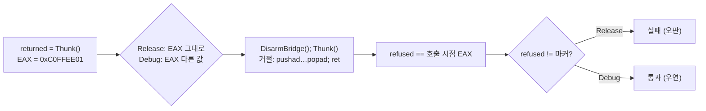
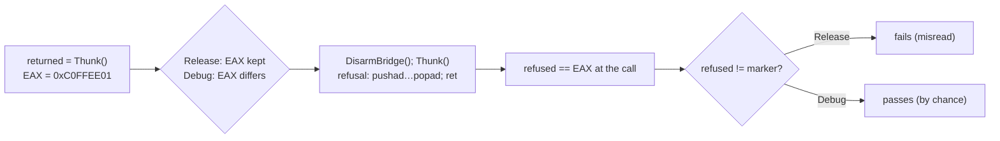

# issue #8 (Task 765): stack bridge probe의 Release 실패 — 거절 검사가 EAX 잔여값에 기대고 있었다

> **경위(2026-10-09, issue #8):** 이 작업은 2026-10-01 Task 765로 끝났지만, 그 커밋(`059a08b`)이 있던
> 브랜치 `docs/763-close-resolved-frontier-items`가 머지되지 않은 채 사라져 수정이 main에 들어가지
> 않았습니다. 같은 실패가 2026-10-05 issue #8로 다시 보고됐고, 2026-10-09 같은 수정을 main 위에 다시
> 적용했습니다. 본문은 Task 765 당시의 기록입니다.


## 한국어

### 배경

Win32 Release로 빌드한 `repiu_core_probe`가 `stack_bridge_contract=false`로 실패했습니다. Task 762가
v0.0.195 Release probe에서도 같은 실패를 확인해 이 작업 이전부터 있던 것으로 기록했고, Debug는 통과합니다.
Linux i386(Release 트리)도 통과합니다. 엔진 자체는 Release에서 정상 동작합니다(762가 Release 바이너리로
pumpit8을 완주).

### 원인

`ProbeBridgeContract`의 두 번째 절반은 context를 비운 뒤 thunk를 다시 불러 "거절 경로는 레지스터를
건드리지 않는다"를 검사합니다. 그 검사는 이렇게 쓰여 있었습니다.

```cpp
const std::uint32_t refused = RepiuStackBridgeProbeThunk();
ok = ok && !g_bridge.resolver_ran && refused != kResolverReturnMarker;
```

거절 경로는 `pushad … popad; ret`이므로 **호출 시점의 EAX를 그대로 돌려줍니다.** 그 EAX가 무엇인지는 probe가
정하지 않았습니다. 직전 문장이 `returned = RepiuStackBridgeProbeThunk()`로 `kResolverReturnMarker`
(`0xC0FFEE01`)를 받아 왔고, Release의 MSVC는 그 값을 EAX에 남긴 채 다음 호출로 들어갑니다. 거절 경로가
레지스터를 정확히 보존했기 때문에 반환값이 마커와 같아졌고, "마커가 다시 나오면 안 된다"는 검사가 **올바른
동작을 실패로** 읽었습니다. Debug는 `returned`를 스택에 두고 EAX를 다른 값으로 쓰기 때문에 우연히 통과했습니다.



### 설계

검사가 정한 값으로 EAX를 채우고 thunk를 부르는 진입점 `RepiuStackBridgeProbeRefusedCall`을 둡니다
(Win32 naked 함수, Linux `.S`). `mov eax, 0x0BADF00D; call Thunk; ret`. 거절 검사는 `refused ==
0x0BADF00D`로 바뀝니다 — "마커가 아니다"보다 강한 검사(레지스터가 정확히 보존됨)이고 컴파일러의 codegen에
기대지 않습니다.

Linux 쪽 `.S`에도 같은 심볼을 둡니다. 두 호스트가 같은 probe 소스를 쓰기 때문입니다.

### 검증 전략

Win32 Release `repiu_core_probe`가 `stack_bridge_all=true`·`core_probe_all=true`가 되어야 하고, Win32 Debug와
Linux i386(WSL)의 core probe가 그대로 통과해야 합니다.

## English

> **History (2026-10-09, issue #8):** this was finished on 2026-10-01 as Task 765, but the branch
> holding its commit (`059a08b`), `docs/763-close-resolved-frontier-items`, disappeared unmerged, so
> the fix never reached main. The same failure was reported again on 2026-10-05 as issue #8, and the
> same fix was reapplied on main on 2026-10-09. The body is the Task 765 record.

### Background

`repiu_core_probe` built as Win32 Release failed with `stack_bridge_contract=false`. Task 762 saw the same
failure in a Release build of v0.0.195's probe and recorded it as predating that task; Debug passes, and
so does Linux i386 (a Release tree). The engine itself is fine in Release (762 ran pumpit8 to completion
on a Release binary).

### Cause

The second half of `ProbeBridgeContract` clears the context and calls the thunk again to check that
"the refusal path leaves the registers alone". The check read:

```cpp
const std::uint32_t refused = RepiuStackBridgeProbeThunk();
ok = ok && !g_bridge.resolver_ran && refused != kResolverReturnMarker;
```

The refusal path is `pushad … popad; ret`, so **it returns whatever EAX held at the call.** The probe never
decided what that was. The statement before had just received `kResolverReturnMarker` (`0xC0FFEE01`) as
`returned`, and MSVC in Release leaves that value in EAX going into the next call. Because the refusal
path preserved the registers exactly, the return value equalled the marker, and the "must not be the
marker again" check read **correct behaviour as a failure**. Debug passed by chance: it keeps `returned`
on the stack and has something else in EAX.



### Design

Add an entry point, `RepiuStackBridgeProbeRefusedCall`, that pins EAX to a value the check chooses and
then calls the thunk (a Win32 naked function, and the Linux `.S`): `mov eax, 0x0BADF00D; call Thunk;
ret`. The refusal check becomes `refused == 0x0BADF00D`: a stronger check than "not the marker" (the
register is preserved exactly) and one that owes nothing to the compiler's code generation.

The Linux `.S` gets the same symbol, since both hosts share the probe source.

### Verification strategy

Win32 Release `repiu_core_probe` must report `stack_bridge_all=true` and `core_probe_all=true`, and the
Win32 Debug and Linux i386 (WSL) core probes must still pass.
