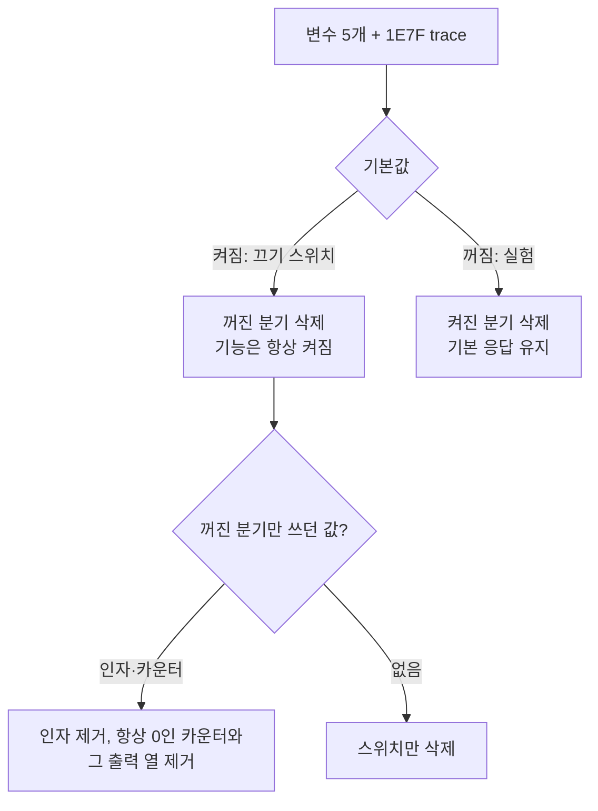

# 설계: 진단 이름 뒤에 숨은 끄기 스위치와 DOS/DPMI 실험 두 개 삭제 (issue #24)

근거 조사: `docs/analysis/environment-toggle-inventory.md`의 2차 조사(3번 묶음). 1번 묶음은
#20, 2번 묶음은 #22(`docs/design/20261008-i022-delete-abandoned-opt-in-experiments.md`).

## 원칙

* **변수가 없을 때의 실행은 그대로 둔다.** 끄기 스위치는 켜진(기본) 분기를 남기고 꺼진
  분기를 지운다. 실험 스위치는 꺼진(기본) 분기를 남기고 켜진 분기를 지운다.
* **꺼진 분기만 쓰던 인자·카운터·출력도 지운다.** 스위치가 사라지면 영원히 0이 되는
  카운터는 #22와 같은 원칙으로 최종 로그와 census 파일에서 뺀다. 공유 live telemetry에는
  해당 필드가 없어 버전은 바뀌지 않는다.
* **같은 블록에서만 쓰이는 진단은 함께 지운다.** `REPIU_DPMI_1E7F_TRACE`는
  `AX=1E7Fh` 블록 안에서만 읽힌다.

## 변수별 처리

| 변수 | 기본 | 처리 |
|---|---|---|
| `REPIU_GLIDE_DRAW_ENTRY_POINTS` | 켜짐 | `draw_entry_points_enabled`와, 꺼졌을 때 그리지 않고 돌아가던 네 블록(`grAADrawLine`, `grAADrawTriangle`, `grDrawPoint`/`grAADrawPoint`, 다각형 네 종)을 지운다. 그 블록들이 기록하던 issue 사유 문자열은 다른 곳에서 쓰지 않는다 |
| `REPIU_TIMER_TICK_BACKLOG` | 켜짐 | `ResolveTimerTickBacklogEnabled`·`TimerTickBacklogEnabled`, `RecordTimerTicksDue`의 bool 정책 분기와 `already_pending`·`backlog_enabled` 인자, `RecordTimerTickInjected`의 `backlog_enabled` 인자를 지운다. backlog 경로는 `coalesced_total`·`coalesced_in_gate_total`을 올리지 않으므로 두 카운터, snapshot의 `backlog_enabled` 필드, CD 오디오 census의 `ticks_coalesced`·`ticks_coalesced_in_gate` 열을 지운다. 최종 로그는 `timer tick delivery due/injected/dropped/deferred/max-backlog/remaining`과 `timer tick in-gate due` 두 줄로 줄어든다. probe는 bool 정책 단언을 지우고 backlog 단언을 남긴다 |
| `REPIU_JAMMA_SNAPSHOT` | 켜짐 | 이 변수 읽기만 지운다. `REPIU_JAMMA_SNAPSHOT_US`(주기, `0` 이하면 끔)는 측정 설정으로 남는다 |
| `REPIU_DOS4GW_MEMORY_PATH_PROBE` | 꺼짐 | `Dos4gwPharlapMemoryPathProbeEnabled`와 `INT 21h AH=30h` 두 처리기(`dos_int21_services.cpp`, `instruction_emulation.cpp`)의 `0x44580000` 덧붙임을 지운다. 기본 응답 `AX=0007h`, `EBX=ECX=0`은 그대로다 |
| `REPIU_DPMI_1E7F_PROBE_SUCCESS`, `REPIU_DPMI_1E7F_TRACE` | 꺼짐 | `INT 31h AX=1E7Fh` 블록 전체를 지운다. 기본 경로는 이미 이 블록을 지나 정의되지 않은 함수 오류 `8001h`·CF=1로 떨어진다 |

### 1E7F를 지워도 되는 근거

Task 605까지는 `AX=1E7Fh`를 사설 서비스로 보고 계약을 찾았지만, Task 606이 원인을 x64
word 스택 lowering 결함에 의한 반환 주소 손상으로 확정했고 수정 뒤 기본 실행에서 1E7F
호출이 사라졌다(`docs/work-logs/20260905-606-x64-word-stack-lowering.md`,
`docs/EXE_DESIGN.ko.md` 첫 절). 게스트가 정상 경로에서 부르지 않는 호출의 가짜 성공
스위치이므로 남길 이유가 없다.

## 문서·스크립트

* `scripts/task366_timer_tick_delivery.ps1` — backlog 스위치 A/B 전용이라 지운다.
* `scripts/task414_delay_loop_ab.ps1` — 바뀐 최종 로그 줄에 맞춰 정규식만 고친다.
* `docs/guides/cd-audio-position-census.md` — 지운 두 열과 Task 431 판정 행을 정리한다.
* `ARCHITECTURE.md` 타이머 tick 절, `docs/analysis/current-execution-frontier.md`의 토글 표
  (#20·#22에서 지운 변수 5개와 이후 승격된 `REPIU_AOT_DBT_SUPERBLOCK` 포함), `docs/analysis/piu-io-port-specification.md`의 JAMMA
  절, README의 `REPIU_DUMP_TEXTURE_BMP`(실제 변수 `REPIU_GLIDE_TEX_DUMP`로 교체),
  환경 변수 목록과 TODO를 갱신한다. `linux-port-frontier.md`의 과거 기록은 당시 사실이므로
  고치지 않는다.

## 검증

* 빌드: Win32 Release, Linux x64(WSL).
* probe: `timer_tick_delivery_probe` 포함 core probe.
* `grep`: 코드가 지운 6개 변수를 더 읽지 않는다.
* 실행: 기본은 probe로 끝낸다. 게임 실행은 사용자 확인 뒤 한 롬셋의 짧은 실행으로 좁혀,
  예외 0·프레임 진행·최종 로그의 새 tick 줄을 본다.

---

# Design: retire the kill switches hidden behind diagnostic names and two DOS/DPMI experiments (issue #24)

Source: the second survey in `docs/analysis/environment-toggle-inventory.md` (group 3). Group 1
was #20, group 2 #22.

**Principles.** Execution with nothing set does not change: a kill switch keeps its on
(default) branch and loses the off branch; an experiment keeps its off (default) branch and loses
the on branch. Arguments, counters and output columns used only by the removed branch go too;
counters that become permanently zero leave the final log and the census file as in #22. The
shared live telemetry carries none of them, so its version stays. A diagnostic read only inside a
deleted block (`REPIU_DPMI_1E7F_TRACE`) goes with it.

**Per variable.** `REPIU_GLIDE_DRAW_ENTRY_POINTS`: delete the flag and the four blocks that
returned without drawing. `REPIU_TIMER_TICK_BACKLOG`: delete the resolver, the boolean policy
branch of `RecordTimerTicksDue` with its `already_pending` and `backlog_enabled` arguments, and
the `backlog_enabled` argument of `RecordTimerTickInjected`; the backlog path never raises
`coalesced_total` or `coalesced_in_gate_total`, so both counters, the snapshot's
`backlog_enabled`, and the CD census columns `ticks_coalesced`/`ticks_coalesced_in_gate` go; the
final log becomes `timer tick delivery due/injected/dropped/deferred/max-backlog/remaining` and
`timer tick in-gate due`; the probe keeps its backlog assertions. `REPIU_JAMMA_SNAPSHOT`: delete
only this read; `REPIU_JAMMA_SNAPSHOT_US` stays as the interval. `REPIU_DOS4GW_MEMORY_PATH_PROBE`:
delete the `0x44580000` addition in both `AH=30h` handlers; the default `AX=0007h` reply stays.
`REPIU_DPMI_1E7F_PROBE_SUCCESS` and `REPIU_DPMI_1E7F_TRACE`: delete the `AX=1E7Fh` block; the
default path already falls through to error `8001h` with CF set.

**Why 1E7F can go.** Task 606 established that the `AX=1E7Fh` call came from a return address
corrupted by the x64 word-stack lowering defect and that the default run no longer makes it once
that was fixed (`docs/EXE_DESIGN.en.md`, first section). The switch fakes success for a call the
guest does not make on a correct path.

**Documents and scripts.** Delete `scripts/task366_timer_tick_delivery.ps1` (an A/B for the
backlog switch only); update the regex in `task414_delay_loop_ab.ps1`; update the CD census
guide, ARCHITECTURE's timer tick section, the frontier's toggle table (including five variables
deleted in #20/#22 and the later-promoted `REPIU_AOT_DBT_SUPERBLOCK`), the JAMMA section of the I/O port specification, README's
`REPIU_DUMP_TEXTURE_BMP` entry (the real variable is `REPIU_GLIDE_TEX_DUMP`), the inventory and
the TODO. Historical records in `linux-port-frontier.md` stay as they were.

**Verification.** Win32 Release and Linux x64 (WSL) builds; core probes including
`timer_tick_delivery_probe`; `grep` that the six variables are no longer read. A game run is
not the default: with the user's go-ahead, one short run of one romset checks no exceptions,
frames advancing and the new tick lines in the final log.
