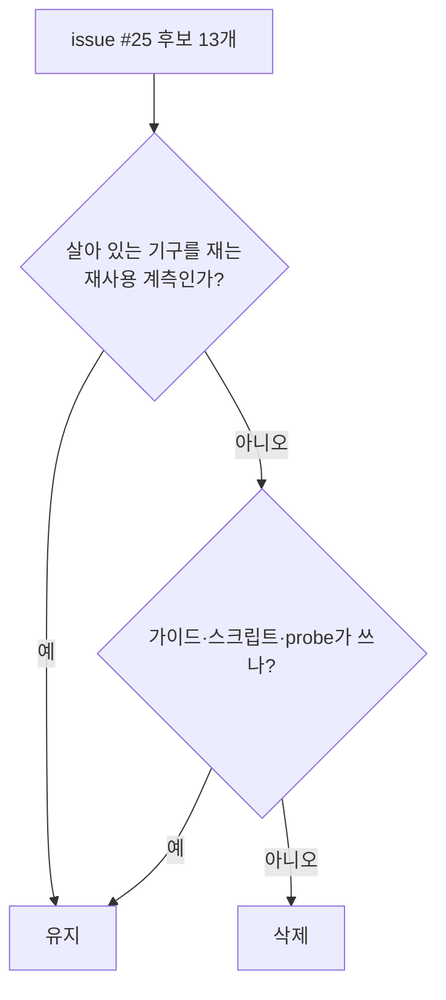

# 설계: 이미 답이 나온 질문을 위한 일회성 진단 삭제 (issue #25)

근거 조사: `docs/analysis/environment-toggle-inventory.md`의 2차 조사 "일회성 진단" 절.
환경 변수 토글 정리의 후속이며 3번 묶음은 #24(v0.0.209).

## 판정 기준

issue에 올린 13개를 코드에서 다시 읽고 다음 기준으로 갈랐다.

* **지운다**: 특정 조사(질문)를 위해 본문에 끼워 넣은 블록이고, 그 질문은 답이 났으며,
  지금의 사용자 절차·스크립트·probe가 쓰지 않는 것.
* **남긴다**: 지금도 살아 있는 기구를 재는 재사용 가능한 계측이거나, 사용자 절차(가이드)·
  스크립트가 쓰는 것.

## 처리

| 변수 | 처리 | 근거 |
|---|---|---|
| `REPIU_GLIDE_CALL_AUDIT` | 삭제 | ordinal별 최초 호출 한 줄. 도달 API 목록 조사(2026-07) 전용. 같은 정보는 최종 로그의 ordinal 카운트에 있다 |
| `REPIU_GLIDE_TEX_CENSUS` | 삭제 | `grTexMemRequired`·`grTexDownloadMipMapLevel` 인자 로그와 형식별 첫 3회. Task 332의 텍스처 크기 질문 전용. 형식·크기 집계는 기본 `GlideTextureCensus`가 한다 |
| `REPIU_GLIDE_DRAW_CENSUS` | 삭제 | 난이도 점(Task 332) 조사용 bbox 표본 |
| `REPIU_GLIDE_TRI_CENSUS` | 삭제 | "배경이 왜 안 보이나"(Task 259) 조사용 combine 히스토그램 |
| `REPIU_GLIDE_FRAME_DUMP` | 삭제 | Task 332의 프레임 단위 draw 로그. 위 draw census 블록과 swap 경로의 호출, 전역 상태 3개 |
| `REPIU_DUMP_LFB_BMP` | 삭제 | 알파를 잃는 24비트 BMP writer(`DumpLfbSurfaceToBmp`). LFB present마다 `getenv`를 불렀다. 텍스처 덤프는 `REPIU_GLIDE_TEX_DUMP`(TGA)가 맡는다 |
| `REPIU_GLIDE_VERTEX_DEPTH_CENSUS` | 삭제 | Task 433의 깊이 필드 판정용. 파일 2개와 loader 출력. 디코더가 쓰는 크기 하한 `kGlideVertexDepthMeaningfulMagnitude`는 `glide_vertex.cpp`로 옮긴다 |
| `REPIU_LOWMEM_TRACE` | 삭제 | v0.0.81 저지대 수정 때의 로그. 같은 정보는 `RecordLowMemoryAccess`가 기록한다. 이미 사라진 NOP 패치를 설명하던 주석도 함께 지운다 |
| `REPIU_AOT_PROBE_GUEST` | 삭제 | 종료 fault 때 한 주소의 동적 캐시 바이트를 덤프. Task 222 전용, 문서 언급은 history뿐. 결과 필드 4개(ThreadContext·ExecutionAttempt)와 loader 출력 |
| `REPIU_AOT_DBT_CALL_TRACE` | **유지** | #22 설계가 "반환 경로가 쓰는 call/return trace는 남는다"고 정했다. trace 순번이 call frame에 저장돼 반환 대조에 쓰이므로 지우면 살아 있는 반환 경로를 고쳐야 한다 |
| `REPIU_AOT_RETIRED_TRAP_PROFILE` | **유지** | retired trap(살아 있는 기구)의 hotset 계측. ARCHITECTURE 절과 전용 probe가 있고, 꺼져 있을 때 비용은 활성 여부 한 번이다. return stage·timer source profile과 같은 부류 |
| `REPIU_GLIDE_SETTER_CENSUS`, `_PHASE` | **유지** | `gameplay-scene-capture.md`·`glide-setter-elision-testing.md`(사용자 절차)와 `task364`·`task365` 스크립트가 쓴다 |

삭제는 모두 변수가 있을 때만 도는 블록이다. 변수 없이 실행했을 때의 동작은 바뀌지 않고,
최종 로그에서는 변수를 켰을 때만 찍히던 줄(vertex depth census, AOT runtime cache probe)만
사라진다. 공유 telemetry에는 해당 필드가 없다.

## 검증

* 빌드: Win32 Release, Linux x64 Release.
* probe: aot_probe 전체 체인(Win32), core probe, Glide probe 2종.
* `grep`: 지운 9개 변수를 코드가 읽지 않는다.
* 게임 실행은 하지 않는다. 지운 코드는 모두 변수가 있을 때만 도는 블록이라 기본 실행
  경로에 닿지 않는다.

---

# Design: delete one-off diagnostics for answered questions (issue #25)

Source: the "one-off diagnostics" part of the second survey in
`docs/analysis/environment-toggle-inventory.md`; a follow-up to the environment toggle cleanup
after group 3 (#24, v0.0.209).

**Criterion.** Re-reading the thirteen candidates in code: **delete** a block inlined for one
investigation whose question is answered and that no current guide, script or probe uses;
**keep** a reusable measurement of a mechanism that is still live, or anything a user procedure or
script uses.

**Deleted (nine).** `REPIU_GLIDE_CALL_AUDIT` (first call per ordinal, for listing reached APIs;
the final log's ordinal counts carry it); `REPIU_GLIDE_TEX_CENSUS` (texture argument logs for
Task 332's size question; the default `GlideTextureCensus` counts formats and sizes);
`REPIU_GLIDE_DRAW_CENSUS` (difficulty-dot bbox samples, Task 332); `REPIU_GLIDE_TRI_CENSUS`
(the Task 259 missing-background histogram); `REPIU_GLIDE_FRAME_DUMP` (Task 332's per-frame draw
log, its swap-path call and three globals); `REPIU_DUMP_LFB_BMP` (a 24-bit writer that dropped
alpha and called `getenv` on every LFB present; `REPIU_GLIDE_TEX_DUMP` handles texture dumps);
`REPIU_GLIDE_VERTEX_DEPTH_CENSUS` (Task 433's depth-field verdict, two files and the loader
output; the magnitude floor the decoder uses moves into `glide_vertex.cpp`); `REPIU_LOWMEM_TRACE`
(the v0.0.81 log, duplicated by `RecordLowMemoryAccess`, with a comment about the long-gone NOP
patch); `REPIU_AOT_PROBE_GUEST` (a terminal-fault dump of one address's dynamic cache bytes for
Task 222, mentioned only in history; four result fields and the loader output).

**Kept (four).** `REPIU_AOT_DBT_CALL_TRACE`: #22's design kept the call/return trace the return
path uses, and its sequence number is stored in call frames for return matching, so removing it
means editing the live return path. `REPIU_AOT_RETIRED_TRAP_PROFILE`: a hotset measurement of a
live mechanism with an ARCHITECTURE section and its own probe, costing one enabled check when
off, like the return stage and timer source profiles. `REPIU_GLIDE_SETTER_CENSUS`/`_PHASE`: used
by the gameplay scene capture and setter elision guides and the `task364`/`task365` scripts.

Every deletion is a block that runs only when its variable is set, so execution with nothing set
is unchanged; the final log loses only lines printed when a variable was set. Shared telemetry
carries none of these fields.

**Verification.** Win32 and Linux x64 Release builds; the Win32 aot_probe chain, core probe and
both Glide probes; `grep` that the nine variables are no longer read. No game run: every deleted
block is reachable only with its variable set.
