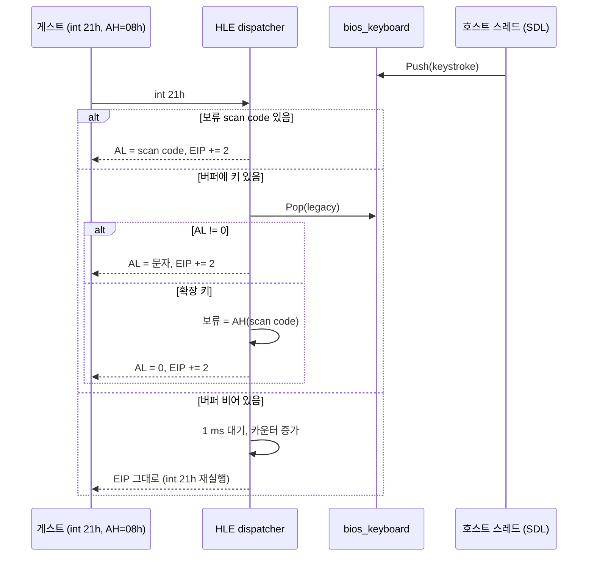
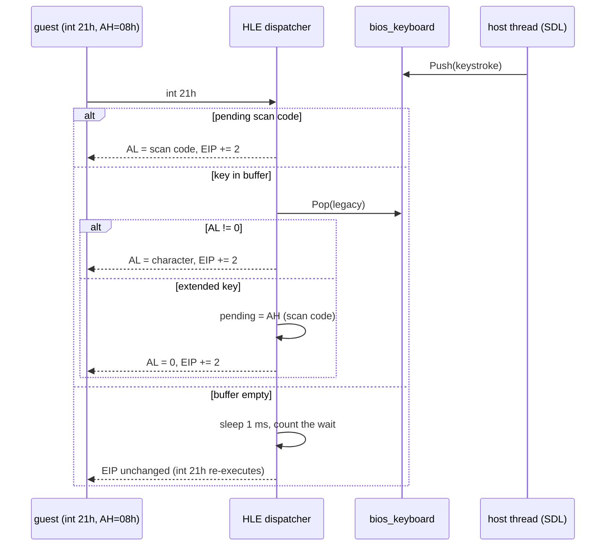

# issue #31 (Task 764): INT 21h AH=07h/08h — 에코 없는 콘솔 문자 입력

> **경위(2026-10-09, issue #31):** 이 작업은 2026-10-01 Task 764(`ef3ffc4`)로 끝났지만, 그 커밋이 있던
> 브랜치 `docs/763-close-resolved-frontier-items`가 머지되지 않은 채 사라져 main에 들어가지 않았습니다.
> 2026-10-09 같은 변경을 main 위에 다시 적용했습니다(같은 브랜치의 Task 765는 #8). 본문은 Task 764
> 당시의 기록입니다.

## 한국어

### 배경

Task 751의 롬셋 전수 조사가 남긴 항목입니다. 세 롬셋(pumpitpc·pumpitp3·pumpipx3)의 fatal 경로가 모두
`mov ah,8; int 21h`(Watcom `getch`)에서 죽었습니다. 게임은 오류 화면을 보여 주고 3초 기다린 뒤 키 하나를
기다리려 하는데, 엔진의 INT 21h dispatcher에 `AH=08h`가 없어 `unsupported DOS INT 21h AH=0x8`로 거절되고
이름 없는 폴트로 실행이 끝났습니다. 지금은 CAT702 검사가 통과하고(751) pumpipx3의 DLL 진입점 fatal도
return pad로 사라져(762) 이 경로에 닿지 않지만, **닿으면 여전히 죽습니다.** 원본 fatal 처리기는 키를 받은
뒤 `exit(-1)`로 정상 종료해야 합니다.

### DOS 의미

RBIL 기준([AH=07h](http://www.ctyme.com/intr/rb-2559.htm), [AH=08h](http://www.ctyme.com/intr/rb-2560.htm)):

| 기능 | 동작 | 반환 |
|---|---|---|
| `AH=07h` | 표준 입력에서 문자 하나를 에코 없이 읽는다. Ctrl-C를 검사하지 않는다. 키가 없으면 기다린다 | `AL` = 문자 |
| `AH=08h` | 같으나 Ctrl-C/Ctrl-Break를 검사한다(INT 23h) | `AL` = 문자 |

확장 키(방향키·기능키)는 첫 호출이 `AL=0`을, 다음 호출이 scan code를 돌려줍니다.

### 설계

엔진에는 이미 BIOS 키보드 버퍼(`ThreadContext::bios_keyboard`)가 있고 호스트 스레드가 SDL 키 이벤트를
그 버퍼에 넣습니다(`HandleSdlBiosKeyboardEvent`). INT 16h `AH=00h`가 그 버퍼를 `Pop`으로 읽습니다. DOS의
콘솔 입력은 BIOS 키보드 위에 서 있으므로 같은 버퍼를 읽습니다.

1. **`HandleDosInterrupt21`에 `case 0x07`·`case 0x08`을 둔다.** 둘은 같은 함수
   `HandleDosConsoleInputWithoutEcho`를 부른다. Ctrl-C 검사(INT 23h)는 두지 않는다 — 게임이 INT 23h
   벡터를 설정하는 것을 본 적이 없고(추정), 있더라도 fatal 화면에서의 Ctrl-C는 종료와 같은 결과다.
2. **빈 버퍼는 "기다림"이다.** 함수는 `true`를 돌려주되 `EIP`를 올리지 않는다. 게스트는 같은 `int 21h`를
   다시 실행하고 dispatcher가 다시 들어온다. 그 사이 게스트 스레드는 1 ms 잔다. 이벤트는 호스트 폴 루프가
   호스트 스레드에서 계속 펌프하므로(Task 335) 게스트가 자는 동안에도 키가 버퍼에 들어온다. 이것은 Glide
   게이트가 present를 기다리는 것과 같은 모양(HLE 안에서의 대기)이다.
3. **확장 키의 두 번째 바이트는 `ThreadContext`에 보류한다.** `dos_console_pending_scan_code`와
   `dos_console_pending_scan_code_valid`. INT 16h의 `Pop`은 legacy 형식(`enhanced=false`)을 쓴다 — DOS의
   콘솔 입력이 그 형식이다.
4. **traced dispatcher에도 위임한다.** `HandleTracedDosInterrupt21`은 자체 allow-list를 가진다(Task 487이
   `AH=3Ch`를 빠뜨렸던 자리). `0x07`·`0x08`을 `0x09`·`0x3C`와 같은 위임 분기에 더한다.
5. **계수.** `dos_console_input_count`(돌려준 문자 수)와 `dos_console_input_wait_count`(빈 버퍼로 돌아간
   횟수)를 `ThreadContext`에 둔다. 최종 보고에는 더하지 않는다 — fatal 경로에서만 쓰이는 서비스다.

원본 코드는 바꾸지 않는다. 서비스는 DOS의 계약대로 동작하고, 게임의 fatal 처리기가 그 뒤 `exit(-1)`을
부른다.

### 실행 모델별 고려

* **direct(Win32, Linux i386):** `int 21h`는 폴트로 dispatcher에 들어온다. EIP를 올리지 않으면 같은 명령이
  다시 폴트한다. 1 ms 대기가 폴트 폭주를 막는다.
* **cache(Linux x64):** `int 21h`는 planner-HLE 지점이다. HLE 뒤 재개는 EIP의 번역으로 돌아가고, EIP가
  같은 지점이면 같은 HLE에 다시 들어온다. 이 작업에서는 Win32로 확인하고 x64는 core probe만 돌린다.

### 검증 전략

1. **probe `dos_console_input`** (core probe와 aot probe 모두): 버퍼에 일반 키를 넣고 `AH=08h`로 `AL`과
   `EIP+2`를 확인, 확장 키(`AL=0`)로 첫 호출 0·둘째 호출 scan code 확인, 빈 버퍼로 `EIP` 불변·`true`
   반환·대기 카운터 확인, `AH=07h` 동일, 그리고 `HandleTracedDosInterrupt21` 경유 확인.
2. **Win32 실행:** pumpipx3를 `REPIU_TIMER_RETURN_PAD=0`으로 돌려 fatal 경로를 일부러 밟고, 입력 스크립트로
   키를 눌러 게임이 `exit(-1)`로 종료하는지 본다. 이전(폴트로 종료)과 비교한다.

## English

> **History (2026-10-09, issue #31):** this was finished on 2026-10-01 as Task 764 (`ef3ffc4`), but the
> branch holding it, `docs/763-close-resolved-frontier-items`, disappeared unmerged. The same change was
> reapplied on main on 2026-10-09 (that branch's Task 765 became #8). The body is the Task 764 record.

### Background

An item left by Task 751's ROM set survey. The fatal path of three ROM sets (pumpitpc, pumpitp3,
pumpipx3) all died at `mov ah,8; int 21h` (Watcom's `getch`). The game shows an error screen, waits
three seconds and then wants one key, but the engine's INT 21h dispatcher had no `AH=08h`, refused it
as `unsupported DOS INT 21h AH=0x8`, and the run ended in a nameless fault. Today the CAT702 check
passes (751) and pumpipx3's DLL entry-point fatal is gone with the return pad (762), so the path is not
reached, but **reaching it still kills the run.** The original fatal handler should take the key and
leave through `exit(-1)`.

### DOS semantics

Per RBIL ([AH=07h](http://www.ctyme.com/intr/rb-2559.htm), [AH=08h](http://www.ctyme.com/intr/rb-2560.htm)):

| Function | Behaviour | Returns |
|---|---|---|
| `AH=07h` | Read one character from standard input without echo. No Ctrl-C check. Waits if no key | `AL` = character |
| `AH=08h` | The same, but checks Ctrl-C / Ctrl-Break (INT 23h) | `AL` = character |

An extended key (arrows, function keys) returns `AL=0` on the first call and the scan code on the next.

### Design

The engine already has the BIOS keyboard buffer (`ThreadContext::bios_keyboard`), and the host thread
feeds SDL key events into it (`HandleSdlBiosKeyboardEvent`). INT 16h `AH=00h` reads that buffer with
`Pop`. DOS console input stands on the BIOS keyboard, so it reads the same buffer.

1. **`HandleDosInterrupt21` gets `case 0x07` and `case 0x08`.** Both call the same function,
   `HandleDosConsoleInputWithoutEcho`. There is no Ctrl-C check (INT 23h): the game has not been seen
   to set an INT 23h vector (inferred), and on a fatal screen Ctrl-C would end the same way anyway.
2. **An empty buffer means "wait".** The function returns `true` without advancing `EIP`. The guest
   re-executes the same `int 21h` and the dispatcher is entered again. In between, the guest thread
   sleeps 1 ms. Events keep being pumped by the host poll loop on the host thread (Task 335), so keys
   reach the buffer while the guest sleeps. This has the same shape as a Glide gate waiting for its
   present: a wait inside the HLE.
3. **The second byte of an extended key is held in `ThreadContext`:** `dos_console_pending_scan_code`
   and `dos_console_pending_scan_code_valid`. `Pop` is used in its legacy form (`enhanced=false`),
   which is the form DOS console input has.
4. **The traced dispatcher delegates too.** `HandleTracedDosInterrupt21` keeps its own allow-list (where
   Task 487 had left out `AH=3Ch`). `0x07` and `0x08` join the delegating branch with `0x09` and
   `0x3C`.
5. **Counters.** `dos_console_input_count` (characters returned) and `dos_console_input_wait_count`
   (returns with an empty buffer) on `ThreadContext`. They are not added to the final report; the
   service is used on the fatal path only.

No original code changes. The service behaves as DOS's contract says, and the game's fatal handler then
calls `exit(-1)`.

### Per execution model

* **direct (Win32, Linux i386):** `int 21h` enters the dispatcher through a fault. With `EIP` not
  advanced the same instruction faults again; the 1 ms sleep keeps that from becoming a fault storm.
* **cache (Linux x64):** `int 21h` is a planner-HLE site. Resumption after the HLE goes back through the
  translation of `EIP`, and with `EIP` at the same site the same HLE is entered again. This task
  verifies on Win32 and runs only the core probe on x64.

### Verification strategy

1. **Probe `dos_console_input`** (in the core probe and the aot probe): push an ordinary key and check
   `AL` and `EIP+2` under `AH=08h`; push an extended key (`AL=0`) and check 0 on the first call and the
   scan code on the second; with an empty buffer check `EIP` unchanged, `true` returned and the wait
   counter; the same under `AH=07h`; and the path through `HandleTracedDosInterrupt21`.
2. **A Win32 run:** run pumpipx3 with `REPIU_TIMER_RETURN_PAD=0` to walk the fatal path on purpose, press
   a key from the input script, and see the game leave through `exit(-1)`. Compare with before (a fault
   ending the run).
