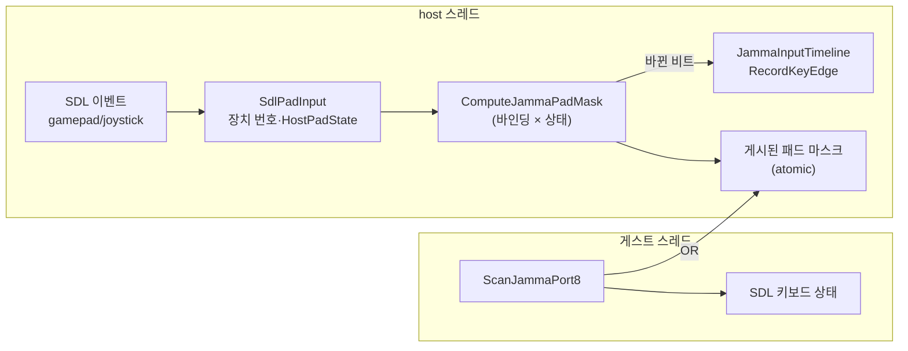

# 설계: 게임과 런처의 게임패드·조이스틱 입력 (issue #34)

관련: 설정 파일 설계 `docs/design/20260820-497-romset-config-files.md`(§17에서 게임패드 바인딩을
향후 확장으로 남김), 입력 타임라인 Tasks 492~495, 포트 I/O 비용 Task 403.

## 현재 상태

게임 입력은 키보드뿐이다. 두 경로가 같은 바인딩 표(`ResolvedJammaBindings`)를 읽는다.

* **이벤트 경로(host 스레드):** `SDL_EVENT_KEY_DOWN/UP` → 입력 하나로 바꿔 `JammaInputTimeline`에
  시각이 붙은 edge로 기록한다. 게스트는 타이머 인터럽트 안에서 그 시각의 상태를 replay한다.
* **폴링 경로(게스트 스레드):** replay 중이 아닐 때 `ScanJammaPort8`가 `SDL_GetKeyboardState` 배열을
  직접 읽는다. 스냅샷(Task 403)도 이 함수를 부른다.

SDL 게임패드·조이스틱 하위 시스템은 어디서도 초기화하지 않는다. 런처는 ImGui의
`NavEnableGamepad`만 켰다.

## 결정(사용자 확인)

1. 표준 게임패드와 조이스틱 번호를 **둘 다** 지원한다.
2. **표준 게임패드만 기본값**을 둔다. Pad1 → 1P, Pad2 → 2P.
3. **런처 포함.**

## 이름 공간

`[Input]` 값의 쉼표로 나뉜 각 항목은 키 이름이거나 아래 패드 이름이다. 둘을 섞어 쓸 수 있다.
비교는 키 이름과 같이 대소문자와 밑줄을 무시한다.

| 형식 | 뜻 | 범위 |
|---|---|---|
| `Pad<N>_<Button>` | SDL 표준 매핑이 있는 게임패드의 버튼 | N = 1..4 |
| `Pad<N>_LeftTrigger`, `Pad<N>_RightTrigger` | 트리거를 절반 이상 당김 | N = 1..4 |
| `Joy<N>_Button<K>` | 조이스틱 버튼 번호(1부터) | N = 1..8, K = 1..32 |
| `Joy<N>_Hat<H><Dir>` | 조이스틱 hat 방향(`Up`, `Down`, `Left`, `Right`) | N = 1..8, H = 1..4 |

`<Button>`: `A`, `B`, `X`, `Y`(SDL의 South·East·West·North — `South` 등도 받는다), `Back`, `Guide`,
`Start`, `LeftStick`, `RightStick`, `LeftShoulder`, `RightShoulder`, `DpadUp`, `DpadDown`, `DpadLeft`,
`DpadRight`, `Misc1`, `Touchpad`. 대각선 hat(`RightUp` 등)은 두 방향 모두 눌린 것으로 본다.

키보드 별칭과 패드 별칭은 입력마다 따로 최대 4개씩 둔다. 입력 하나에 키 4개와 패드 4개를 함께
걸 수 있다.

## 장치 번호

장치를 연결된 순서대로 가장 작은 빈 번호에 배정하고, 분리될 때까지 그 번호를 유지한다. 모든
조이스틱(표준 게임패드 포함)은 `Joy` 번호를 받고, SDL이 표준 게임패드로 인식한 장치는 추가로 `Pad`
번호를 받는다. 분리되면 그 장치의 눌림 상태를 모두 뗀 것으로 처리한다.

## 기본값

| 입력 | 1P | 2P |
|---|---|---|
| 좌상(UpLeft) | `Pad1_LeftShoulder` | `Pad2_LeftShoulder` |
| 우상(UpRight) | `Pad1_RightShoulder` | `Pad2_RightShoulder` |
| 우하(DownRight) | `Pad1_B`, `Pad1_DpadRight` | `Pad2_B`, `Pad2_DpadRight` |
| 좌하(DownLeft) | `Pad1_DpadDown`, `Pad1_DpadLeft` | `Pad2_DpadDown`, `Pad2_DpadLeft` |
| 가운데(Center) | `Pad1_A`, `Pad1_Start` | `Pad2_A`, `Pad2_Start` |
| `COIN1` | `Pad1_Back`, `Pad2_Back` | |
| `SERVICE` | 없음 | |
| `TEST` | 없음 | |
| `CLEAR` | `Pad1_RightStick` | |

발판 배치는 사용자가 정했다(2026-10-09): 위쪽 발판은 어깨 버튼, 아래쪽은 D-pad 아래·왼쪽과
`B`·D-pad 오른쪽, 가운데는 `A`와 `Start`. 처음 설계한 "D-pad를 45° 돌린 배치"를 실제 패드로 써 본 뒤 바꿨다. 코인은 `Back`이고, TEST·SERVICE는 패드로
운영자 메뉴에 실수로 들어가지 않도록 기본값을 두지 않는다(같은 날 사용자 결정). CLEAR는 실수로 누르기 어려운
오른쪽 스틱 클릭에 둔다. 기본값은 기존 키 기본값 뒤에
붙으므로, 설정 파일에서 입력을 직접 적은 경우에는 그 줄이 패드 기본값까지 대신한다(지금 규칙과 같다).

## 구조

* **`repiu/input/host_pad_binding.h`** (SDL 비의존 이름·파서): `HostPadAlias`(종류, 장치 번호, 버튼/축/
  hat 번호, hat 방향), 이름 파싱과 포맷.
* **`repiu/input/host_pad_state.h`** (SDL 비의존 상태): 장치 번호별 게임패드 버튼 비트·트리거 비트,
  조이스틱 버튼 비트·hat 값. `ComputeJammaPadMask(bindings, state)`가 눌린 입력 마스크를 낸다. 순수
  함수라 probe가 장치 없이 검사한다.
* **`JammaInputBinding`**에 `pad_aliases[4]`, `pad_alias_count`를 더한다. 값 파싱은 항목마다
  `Pad`/`Joy`로 시작하고 숫자가 이어지면 패드 이름으로, 아니면 키 이름으로 읽는다.
  `FormatJammaBinding`은 키 다음에 패드 이름을 쓴다.
* **엔진 `SdlPadInput`** (host 스레드): `SDL_InitSubSystem(SDL_INIT_GAMEPAD)`(조이스틱 포함), 장치
  추가·제거 이벤트로 열고 닫기, 버튼·축·hat 이벤트로 상태 갱신. 상태가 바뀌면 마스크를 다시 계산해
  바뀐 비트만 타임라인 edge로 기록하고, 마스크를 atomic으로 게시한다.
* **폴링 경로:** `ScanJammaPort8`의 판정이 게시된 패드 마스크를 먼저 본다(atomic load 한 번,
  키 질의 수는 그대로). `CaptureCurrentJammaPressedMask`도 패드 마스크를 OR한다.
* **키보드와 패드가 겹칠 때:** 한 입력을 키보드와 패드가 함께 누르고 있으면 한쪽을 떼도 release
  edge를 기록하지 않는다. 패드 release는 키보드 상태를, 키보드 release는 패드 마스크를 확인한다.
* **포커스:** SDL 기본값(`SDL_HINT_JOYSTICK_ALLOW_BACKGROUND_EVENTS=0`)대로 배경에서는 패드 이벤트를
  받지 않으므로, 포커스를 잃으면 키보드와 같이 패드 상태도 모두 뗀 것으로 한다.
* **런처:** 비디오와 함께 `SDL_INIT_GAMEPAD`를 켠다. ImGui SDL3 백엔드가 게임패드를 열어 D-pad로
  항목을 옮기고 South(A)로 고른다.
* **설정 파일 생성:** 처음 만드는 파일의 주석 블록에 패드 이름 표를 더하고, 각 입력의 현재 값 줄에
  패드 기본값이 함께 나온다.

## 바꾸지 않는 것

* BIOS 키보드(INT 16h)·OSD·전체 화면 같은 호스트 단축키는 키보드 전용으로 둔다.
* 아날로그 스틱 방향과 조이스틱 축은 이번에 다루지 않는다(발판 장치는 버튼·hat으로 보고한다).
* 게임 안 키 설정 화면은 만들지 않는다.

## 검증

* probe: 이름 파싱(정상·범위 밖·오타), 섞인 값의 포맷 왕복, 기본값, `ComputeJammaPadMask`(버튼·
  트리거·hat 대각선·번호 없는 장치), 장치 번호 배정·해제.
* 기존 probe(설정·입력 타임라인·포트 I/O) 회귀 없음.
* Win32·Linux x64 빌드.
* 실제 장치(표준 게임패드, 발판형 조이스틱)는 사용자 환경에서 확인한다. 장치가 없으면 기존
  동작과 같아야 한다.

---

# Design: gamepad and joystick input for the game and the launcher (issue #34)

Related: the config-file design (497, whose §17 left gamepad bindings for later), the input timeline
(Tasks 492–495), and the port I/O cost work (Task 403).

**Today.** Game input is keyboard only, through two paths reading one binding table: the host
thread turns `SDL_EVENT_KEY_DOWN/UP` into timestamped edges in `JammaInputTimeline`, replayed by the
guest inside the timer interrupt; and when no replay is active, `ScanJammaPort8` on the guest thread
reads `SDL_GetKeyboardState` directly (the Task 403 snapshot calls it too). Nothing initializes SDL's
gamepad or joystick subsystems; the launcher only sets ImGui's `NavEnableGamepad`.

**Decisions (confirmed with the user):** support both standard gamepads and joystick numbers;
defaults for standard gamepads only (Pad1 → P1, Pad2 → P2); include the launcher.

**Names.** Each comma-separated item of an `[Input]` value is a key name or a pad name, freely mixed,
compared ignoring case and underscores: `Pad<N>_<Button>` (N 1..4; `A`, `B`, `X`, `Y` — also
`South`, `East`, `West`, `North` — `Back`, `Guide`, `Start`, `LeftStick`, `RightStick`,
`LeftShoulder`, `RightShoulder`, `DpadUp/Down/Left/Right`, `Misc1`, `Touchpad`),
`Pad<N>_LeftTrigger`/`RightTrigger` (pulled past half), `Joy<N>_Button<K>` (N 1..8, K 1..32) and
`Joy<N>_Hat<H><Up|Down|Left|Right>` (H 1..4; a diagonal hat counts as both directions). Key and pad
aliases are capped separately at four each per input.

**Device numbers.** Devices take the lowest free number in connection order and keep it until
removed. Every joystick, standard gamepads included, gets a `Joy` number; those SDL recognizes as
standard gamepads also get a `Pad` number. A removed device's presses are released.

**Defaults.** The panel layout is the user's (2026-10-09), replacing the first design's D-pad turned
45 degrees after trying a real pad: the upper panels take the shoulder buttons, the lower ones the
D-pad's down with left and `B` with the D-pad's right, and the center takes A and Start, for Pad1 on P1 and
Pad2 on P2; `COIN1` takes either pad's Back, `TEST` and `SERVICE` have no pad default so a pad
cannot open the operator menus by accident (also the user's call), and `CLEAR` takes Pad1's right
stick click, which is hard to press by accident. The pad defaults follow the existing
key defaults, so an input written in a config file replaces both, as the current rule already says.

**Structure.** SDL-independent `HostPadAlias` names and parser (`repiu/input/host_pad_binding.h`) and
state (`repiu/input/host_pad_state.h`), with a pure `ComputeJammaPadMask(bindings, state)` that probes
test without devices. `JammaInputBinding` gains `pad_aliases[4]` and `pad_alias_count`; value parsing
reads an item as a pad name when it starts with `Pad`/`Joy` followed by a digit, and formatting writes
pad names after keys. An engine `SdlPadInput` on the host thread initializes `SDL_INIT_GAMEPAD`
(joysticks included), opens and closes devices on add and remove events, updates state from button,
axis and hat events, and on any change recomputes the mask, records only the changed bits as timeline
edges, and publishes the mask atomically. `ScanJammaPort8` checks the published mask first (one atomic
load; the key query count is unchanged) and `CaptureCurrentJammaPressedMask` ORs it in. An input held
by both a key and a pad gets no release edge until both let go. With SDL's default of no background
joystick events, losing focus releases pad state as it does keys. The launcher initializes
`SDL_INIT_GAMEPAD` with video so ImGui's SDL3 backend can navigate with the D-pad and confirm with
South. A newly generated config file lists the pad names and shows pad defaults in each value line.

**Unchanged.** The BIOS keyboard (INT 16h), the OSD and host shortcuts stay keyboard only; analog
stick directions and joystick axes are out of scope (dance pads report buttons and hats); no in-game
binding screen.

**Verification.** Probes for name parsing (valid, out of range, typos), round-tripping mixed values,
the defaults, `ComputeJammaPadMask` (buttons, triggers, diagonal hats, unnumbered devices) and device
number assignment; no regression in the config, input timeline and port I/O probes; Win32 and Linux
x64 builds. Real devices (a standard gamepad and a dance-pad joystick) are checked on the user's
setup; with no device attached, behavior must match today's.
