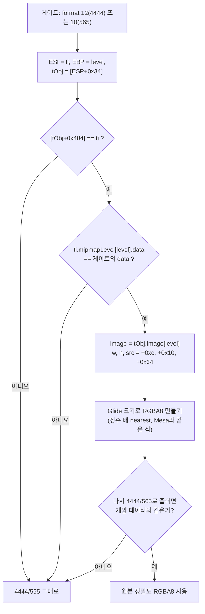

# 설계: 게임 내장 Mesa fx의 4444 절단을 우회하는 원본 정밀도 텍스처 (issue #37)

근거: `docs/analysis/mesa-fx-texture-path.md`.

## 목표와 원칙

* 게임이 `grTexDownloadMipMapLevel`로 넘기는 4444/565 데이터 대신, Mesa가 들고 있는 **원본 8bit
  이미지**로 OpenGL 텍스처를 만든다. 원본보다 나은 화질이므로 **OSD에서 켜고 끄는 옵션**이다.
* **게임 코드는 바꾸지 않는다.** 게이트에서 게스트 레지스터와 메모리를 읽기만 한다(AGENTS.md 원칙 1·2).
* **확신할 때만 바꾼다.** 원본을 찾고, 그 원본을 Mesa와 같은 방식으로 다시 줄였을 때 게임이 넘긴
  데이터와 **바이트 단위로 같을 때만** 원본을 쓴다. 하나라도 어긋나면 지금처럼 4444/565를 쓴다.
  게스트 동작에는 영향이 없다(게스트가 보는 것은 바뀌지 않고, 호스트 GL 텍스처만 바뀐다).

## 원본 찾기

`grTexDownloadMipMapLevel` 게이트 진입 시점(Mesa 업로드 함수 안의 호출, pumpitea `0x0103FE61`):

* 원본 픽셀: 4444는 RGBA 4바이트, 565는 RGB 3바이트(알파 255). 읽기 범위는 모두 게스트 읽기 가능
  검사를 거친다.
* 크기: Mesa는 원본이 Glide 크기보다 작을 때 정수 배로 늘린다(`fxTexBuildImageMap`의 두 번째 경로).
  같은 nearest 규칙(`src = x * srcW / dstW`)으로 Glide 크기에 맞춰 만든다. 규칙이 다르면 검증 V3에서
  걸러진다.
* 롬셋: 19개 롬셋이 같은 Mesa 빌드라 레지스터·스택 오프셋이 같다. 주소는 쓰지 않는다. 검증 세 단계가
  다른 호출 경로나 다른 빌드를 걸러 낸다.

## 백엔드

* `StoreTexture`에 원본 정밀도 RGBA8(있을 때)을 함께 넘긴다. `TextureEntry`는 게임 데이터(4444/565)와
  원본 정밀도 RGBA8을 둘 다 보관한다.
* 업로드할 데이터는 옵션에 따라 고른다. 옵션을 바꾸면 보관한 항목을 모두 다시 올린다(호스트 스레드,
  다음 이벤트 펌프 때).
* 텍스처 census에 `full-precision used/fallback` 집계와 실패 이유(링크·data·검증)를 더해 최종 로그에
  남긴다.

## 옵션

* OSD 체크박스 "텍스처 원본 정밀도"(Task 761의 LFB 고정밀 토글과 같은 자리·방식).
* 환경 변수 `REPIU_GLIDE_TEXTURE_FULL_PRECISION`로 시작값을 정한다. **기본값 켬**(사용자 결정,
  2026-10-09). `0|off|false`로 끈다.
* **런처 설정에도 둔다**(사용자 결정): `[Video] texture_full_precision = 0|1`, 런처가 같은 환경
  변수로 게시한다.

## 바꾸지 않는 것

* 게스트 메모리·코드, 게임이 계산하는 텍스처 메모리 배치(`grTexTextureMemRequired` 등).
* 8bit 형식(P_8, AP_88 등)과 LFB 경로.

## 검증

* probe: 가짜 게스트 메모리에 Mesa 구조(ti, tObj, image)를 꾸며 링크·검증·크기 변환·실패 경로를 확인.
  4444와 565 각각, 정수 배 확대, 링크 불일치, data 불일치, 검증 불일치.
* 실행: pumpitea에서 옵션 켬/끔 최종 로그의 used/fallback 수(대부분 used여야 함), 화면 비교. 다른 롬셋
  하나로 같은 빌드 가정을 확인.

---

# Design: full-precision textures bypassing the embedded Mesa fx 4444 truncation (issue #37)

Source: `docs/analysis/mesa-fx-texture-path.md`.

**Goal and principles.** Build the OpenGL texture from the **original 8-bit image** Mesa still holds
instead of the 4444/565 data the game passes to `grTexDownloadMipMapLevel`, as an **OSD-toggled
option** since it exceeds the original. Game code is never changed: the gate only reads guest
registers and memory. The original is used **only when certain**: it must be found, and re-truncated
the way Mesa does it must equal the game's data byte for byte; otherwise today's 4444/565 is used.
Guest behavior is untouched — only the host GL texture differs.

**Finding the original.** At the gate (inside Mesa's upload function, pumpitea `0x0103FE61`), for
format 12 or 10: `ESI` is `ti`, `EBP` the Mesa level and `[ESP+0x34]` the saved caller `EBP`, taken as
`tObj`. Check `[tObj+0x484] == ti` and `ti.mipmapLevel[level].data` equal to the gate's data pointer,
then read `image = tObj.Image[level]` (width `+0xc`, height `+0x10`, pixels `+0x34`; RGBA for 4444,
RGB for 565 with alpha 255), build RGBA8 at the Glide size with Mesa's integer nearest upscale
(`src = x * srcW / dstW`), and accept it only if re-truncating it reproduces the game's data. All 19
ROM sets share the Mesa build, so the register and stack offsets hold; no addresses are used, and the
three checks reject any other call path or build.

**Backend.** `StoreTexture` takes the full-precision RGBA8 when present; `TextureEntry` keeps both the
game's data and the full-precision RGBA8; the option picks which to upload, and toggling re-uploads
every kept entry on the host thread's next event pump. The texture census gains full-precision
used/fallback counts with the failure reason (link, data, verification) in the final log.

**Option.** An OSD checkbox like Task 761's LFB high-precision toggle; the starting value comes from
`REPIU_GLIDE_TEXTURE_FULL_PRECISION`, **on by default**, and the launcher gets the same setting
(`[Video] texture_full_precision = 0|1`, published as that variable) — both decided by the user on
2026-10-09.

**Unchanged.** Guest memory and code, the game's texture memory layout, 8-bit formats (P_8, AP_88)
and the LFB path.

**Verification.** A probe that fakes the Mesa structures in guest memory to exercise the link, the
checks, the upscale and every fallback for 4444 and 565; runs of pumpitea with the option on and off
comparing used/fallback counts (mostly used) and the screen, plus one other ROM set to confirm the
shared build.
