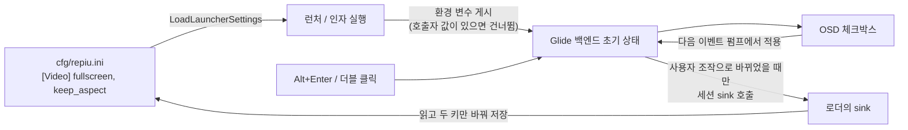

# 설계: OSD의 전체 화면·비율 유지 옵션과 `cfg/repiu.ini` 저장 (issue #45)

관련: Task 761(OSD), Task 769(전체 화면 토글과 letterbox), Task 746(인자 실행도 `cfg/repiu.ini`를 읽음),
issue #37(OSD·런처·환경 변수로 이루어진 옵션의 선례)

## 목표

* 게임 중 OSD에서 **전체 화면**을 켜고 끈다. 지금은 Alt+Enter와 더블 클릭 토글만 있고 저장되지 않는다.
* OSD에 **비율 유지**(Keep aspect ratio, 기본 켬)를 둔다. 켜면 지금처럼 4:3 그림 둘레를 검은 띠로
  두고, 끄면 비율을 무시하고 창(전체 화면이면 화면) 전체를 채운다.
* 두 값을 전역 설정 `cfg/repiu.ini`의 `[Video]`에 저장하고 다음 실행이 그 값으로 시작한다.

## 결정 (사용자, 2026-10-10)

| 질문 | 결정 |
|---|---|
| Alt+Enter·더블 클릭도 저장하는가 | 저장한다. 어느 입구로 바꿔도 마지막 상태가 저장된다 |
| 비율 유지를 끄면 창 모드에도 적용하는가 | 적용한다. 규칙은 "끄면 그림이 창 전체를 채운다" 하나다 |
| 런처 Options에도 두 체크박스를 두는가 | 둔다 |

## 설정 값

| 키(`[Video]`) | 환경 변수 | 기본 | 뜻 |
|---|---|---|---|
| `fullscreen = 0/1` | `REPIU_GLIDE_FULLSCREEN` | 0(창) | 1이면 데스크톱 해상도의 테두리 없는 전체 화면으로 시작 |
| `keep_aspect = 0/1` | `REPIU_GLIDE_KEEP_ASPECT` | 1(유지) | 0이면 그림을 drawable 전체로 늘림 |

환경 변수의 해석은 기존 규칙을 따른다. `fullscreen`은 opt-in(`ResolveOptInToggle`), `keep_aspect`는
기본 켬(`ResolvePromotedToggle`)이다. 기존 설정과 같이 **호출자가 정한 환경 변수가 파일 값보다
우선**한다. 그래서 측정 스크립트(`scripts/survey_romsets.sh`)는 `REPIU_GLIDE_FULLSCREEN=0`을
기본으로 두어, 사용자가 전체 화면을 저장해 두어도 측정은 창으로 돈다.

## 흐름

### 엔진

* **그림 사각형**: `ComputeGlideLetterboxRect` 옆에 `ComputeGlidePictureRect(..., keep_aspect)`를 둔다.
  `keep_aspect`가 거짓이면 drawable 전체, 참이면 지금의 letterbox 사각형이다. viewport, scissor, 띠
  지우기, LFB, 후처리, readback이 모두 `content_rect_` 하나를 쓰므로 바꿀 곳은 `ApplyDrawableViewport`
  한 곳이다. 늘린 그림에서 띠 지우기는 이미 "사각형이 drawable 전체면 건너뜀"으로 처리된다.
* **상태**: 백엔드가 `keep_aspect_`와 전체 화면 요청을 갖는다. 초기값은 환경 변수에서 읽고, 창을 만든
  뒤 전체 화면이 요청되었으면 `SDL_SetWindowFullscreen`으로 들어간다. 창 크기(배율)를 먼저 정한 뒤
  들어가므로 창 모드로 돌아오면 배율 창이 된다.
* **OSD**: "Fullscreen"과 "Keep aspect ratio" 체크박스를 더한다. OSD는 백엔드의 호스트 스레드에서
  present 도중 그려지므로, 바뀐 값은 요청으로만 남기고 다음 이벤트 펌프 시작에서 적용한다(#37의
  `ApplyTextureFullPrecision`과 같은 자리). 전체 화면 체크박스는 실제 창 상태를 보여 준다.
* **저장 통지**: 엔진은 런처 타입을 모른다. `repiu/engine/session_display_preferences.h`에 세션 sink
  (`std::function<void(bool fullscreen, bool keep_aspect)>`)를 두고, 백엔드는 **사용자 조작**(OSD,
  Alt+Enter, 더블 클릭)으로 값이 실제로 바뀌었을 때만 부른다. 창을 닫을 때 SDL이 전체 화면을 푸는
  것이나 시작 시 저장값을 적용하는 것은 저장하지 않는다. sink가 없으면(probe, 도구) 아무것도 쓰지
  않는다.

### 로더

* 게임 실행 전에 sink를 등록한다. sink는 `cfg/repiu.ini`를 다시 읽고 `fullscreen`·`keep_aspect`만
  바꿔 저장한다. 다른 키는 읽은 값 그대로 다시 쓰인다. 쓰기에 실패하면 경고만 남긴다.
* 런처를 거친 실행에서는 런처 부모 프로세스가 게임이 끝난 뒤 루프 처음에서 파일을 다시 읽으므로,
  게임 중 바꾼 값이 런처 화면과 다음 실행에 그대로 이어진다. 부모가 덮어쓰는 일은 없다: 부모는 런처
  화면에서 값이 바뀌었을 때, 게임을 띄우기 전에만 저장한다.

### 런처

* Options에 "Fullscreen"과 "Keep aspect ratio" 체크박스를 더한다. 저장·게시·우선순위는 #37의
  `texture_full_precision`과 같다.

### 런처 창 (추가 요청, 2026-10-10)

* 런처 창도 같은 두 값을 따른다. 시작할 때 `fullscreen`이 켜져 있으면 전체 화면으로 열고, Options의
  체크박스나 Alt+Enter로 바꾸면 그 자리에서 창에 적용한다. 바뀐 값은 런처의 다른 설정처럼 런처를
  나갈 때(게임 시작 포함) 저장된다.
* 비율 유지가 켜져 있으면 런처 화면을 기본 창(960×640, 3:2) 비율의 가장 큰 영역에 가운데로 그리고
  나머지는 검은 띠로 둔다. 끄면 지금처럼 창(또는 화면) 전체를 채운다. 게임과 같이 창 모드에도
  적용한다. 글자와 간격의 배율은 그 영역의 높이를 따른다.
* 런처 표에서는 더블 클릭이 롬셋 시작이므로 전체 화면 토글은 Alt+Enter만 둔다. Alt+Enter는 ImGui로
  넘기지 않는다(Enter가 선택한 롬셋을 시작하지 않도록).
* Options에서 두 체크박스를 체크박스 중 맨 위에 둔다. OSD에서는 이미 맨 위다.

## 바꾸지 않는 것

* 전체 화면 방식(데스크톱 해상도의 테두리 없는 창, 디스플레이 모드는 바꾸지 않음).
* 비율 유지가 켜져 있을 때의 사각형 계산(Task 769)과 Alt+Enter·더블 클릭 입력 처리.
* 기존 OSD 항목(LFB, 텍스처, 셰이더)은 지금처럼 세션 안에서만 바뀐다.

## 검증

* probe: letterbox probe에 늘림 사각형, 런처 probe에 두 키의 왕복·잘못된 값 경고·게시·환경 변수
  우선. letterbox probe를 core probe에도 넣어 Linux에서 돈다.
* 빌드: Linux x64·i386 Release. Win32는 이 환경에서 빌드할 수 없어 작업 로그에 남긴다.
* 실행(사용자 화면): OSD에서 두 옵션을 바꿔 화면과 `cfg/repiu.ini`를 확인하고, 다시 실행해 저장한
  상태로 시작하는지 본다. Alt+Enter로 바꾼 값도 저장되는지 본다.

---

# Design: OSD fullscreen and keep-aspect options stored in `cfg/repiu.ini` (issue #45)

Related: Task 761 (the OSD), Task 769 (the fullscreen toggle and letterbox), Task 746 (argument runs read
`cfg/repiu.ini` too), issue #37 (the precedent for an option carried by the OSD, the launcher and an
environment variable).

**Goal.** Turn fullscreen on and off from the in-game OSD (today only Alt+Enter and a double click
toggle it, and nothing is stored); add "Keep aspect ratio" to the OSD, on by default, where on keeps
today's 4:3 picture with black bars and off ignores the ratio and fills the window (the screen when
fullscreen); store both under `[Video]` in the global `cfg/repiu.ini` so the next run starts with them.

**Decisions (the user, 2026-10-10).** Alt+Enter and a double click are stored too: whichever way it
changes, the last state is kept. Keep aspect off applies in windowed mode as well, so the rule is one:
off, the picture fills the window. The launcher's Options get both checkboxes.

**Settings.** `[Video] fullscreen = 0/1` with `REPIU_GLIDE_FULLSCREEN`, off by default (start as a
borderless desktop-resolution fullscreen window when 1), read as an opt-in toggle; `[Video] keep_aspect
= 0/1` with `REPIU_GLIDE_KEEP_ASPECT`, on by default (stretch to the whole drawable when 0), read as a
promoted toggle. As with the existing settings, a variable the caller set wins over the file, so the
measurement script `scripts/survey_romsets.sh` defaults `REPIU_GLIDE_FULLSCREEN=0` and keeps measuring
in a window even when the user has stored fullscreen.

**Flow.** The file is read by the launcher or the argument run and published as environment
variables (skipped where the caller set one), which give the Glide backend its initial state; the OSD
checkboxes and Alt+Enter/double click change it, applied at the next event pump; when a user action
actually changed a value the backend calls a session sink, and the loader's sink re-reads the file,
changes only the two keys and writes it back (diagram above).

**Engine.** `ComputeGlidePictureRect(..., keep_aspect)` sits next to `ComputeGlideLetterboxRect`: the
whole drawable when false, today's letterbox rectangle when true. Viewport, scissor, bar clearing,
LFB, post-processing and readback all use the one `content_rect_`, so `ApplyDrawableViewport` is the
only place that changes; bar clearing already skips a rectangle that covers the drawable. The backend
holds `keep_aspect_` and the fullscreen request, initialised from the environment; after creating the
window at its scaled size it enters fullscreen if asked, so leaving fullscreen returns to the scaled
window. The OSD gains "Fullscreen" and "Keep aspect ratio"; it draws on the host thread in the middle
of a present, so a change is left as a request and applied at the start of the next event pump, where
#37's `ApplyTextureFullPrecision` runs; the fullscreen box shows the window's actual state. The engine
knows no launcher types: `repiu/engine/session_display_preferences.h` holds a session sink
(`std::function<void(bool fullscreen, bool keep_aspect)>`), called only when a user action (OSD,
Alt+Enter, double click) actually changed a value — not when SDL leaves fullscreen as the window
closes, nor when the stored value is applied at start. Without a sink (probes, tools) nothing is
written.

**Loader.** Registers the sink before the game runs; the sink re-reads `cfg/repiu.ini`, changes only
`fullscreen` and `keep_aspect`, and writes it back with every other key as read, warning if the write
fails. In a launcher session the parent re-reads the file at the top of its loop after the game ends,
so an in-game change carries into the launcher screen and the next run; the parent never overwrites
it, since it saves only when its own screen changed a value, before starting the game.

**Launcher.** "Fullscreen" and "Keep aspect ratio" under Options, stored, published and overridden
exactly like #37's `texture_full_precision`.

**Launcher window (added request, 2026-10-10).** The launcher window follows the same two values:
it opens fullscreen when `fullscreen` is on, and a change from its Options checkbox or Alt+Enter applies
to the window at once; like the launcher's other settings, the change is stored when the launcher is
left (starting a game included). With keep aspect on, the launcher is drawn in the largest area of its
default window's ratio (960×640, 3:2), centred, with black bars around it; off, it fills the window or
screen as today. As in the game this applies in windowed mode too, and the text and spacing scale
follows that area's height. A double click in the launcher's table starts a ROM set, so only Alt+Enter
toggles fullscreen there, and Alt+Enter is kept from ImGui so its Enter does not start the selected ROM
set. The two checkboxes sit first among the Options checkboxes; in the OSD they already do.

**Unchanged.** The fullscreen method (a borderless desktop-resolution window; the display mode never
changes), the keep-aspect rectangle (Task 769) and the Alt+Enter/double-click input handling, and the
existing OSD items (LFB, textures, shader), which still change for the session only.

**Verification.** Probes: a stretch rectangle in the letterbox probe, now also in the core probe so it
runs on Linux; the two keys' round trip, malformed-value warnings, publishing and environment
precedence in the launcher probe. Builds: Linux x64 and i386 Release; Win32 cannot be built here, which
the work log records. Run on the user's screen: change both options in the OSD and check the picture
and `cfg/repiu.ini`, run again and see it start in the stored state, and check that Alt+Enter is stored
too.
