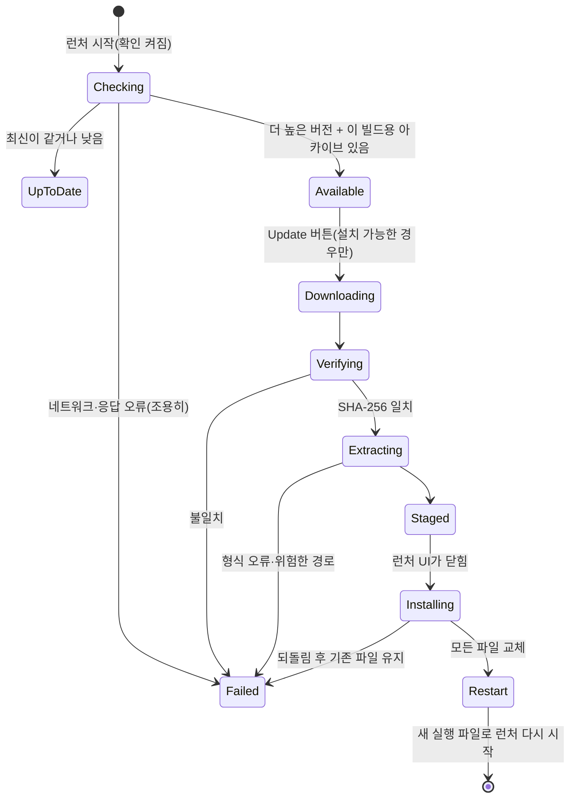

# 설계: 런처의 업데이트 확인과 제자리 설치 (issue #48)

관련: Task 500·503d-17(런처가 게임을 자식 프로세스로 실행), Task 767(Linux 릴리스 아카이브),
issue #45(런처 설정과 `cfg/repiu.ini`), `docs/guides/release-and-ci.md`(릴리스 아티팩트)

## 목표

스팀덱처럼 릴리스를 손으로 받아 푸는 일이 번거로운 환경에서, 런처가 새 버전을 알리고 버튼 하나로
설치한 뒤 다시 시작한다.

## 결정 (사용자, 2026-10-10)

| 질문 | 결정 |
|---|---|
| 새 버전이 있을 때 | 런처에 알리고, 사용자가 버튼으로 설치 |
| 범위 | Linux와 Win32 함께 |

## 확인한 사실

* `reexec/rePIU`는 공개 저장소라 `GET https://api.github.com/repos/reexec/rePIU/releases/latest`를 토큰
  없이 부를 수 있다(시간당 60회). 응답의 `assets[]`마다 `name`, `size`, `browser_download_url`,
  `digest`(`sha256:<hex>`)가 있다(v0.0.213에서 확인).
* 아티팩트: `rePIU-v<ver>-win32.zip`(파일이 zip 루트에 있음), `rePIU-v<ver>-linux-x64.tar.gz`,
  `rePIU-v<ver>-linux-i386.tar.gz`(둘 다 최상위 폴더 `rePIU-v<ver>-linux-<arch>/` 아래). 모든 아카이브에
  `VERSION`이 실행 파일 옆에 들어 있다.
* `roms/`, `cfg/`, `nvram/`은 실행한 현재 디렉터리 기준이고 아카이브에 없다. 아카이브의 파일만 바꾸면
  사용자 데이터는 남는다.
* miniz(libchdr에 포함)의 메모리 ZIP 읽기와 inflate(`tinfl`)가 이미 링크되어 있다. 압축 API는 꺼져 있다.
* 빌드 라벨: `BuildPlatformName()`은 `Win`/`Linux`, `BuildArchitectureName()`은 `x86`/`x64`(Linux
  i386도 `x86`).

## 흐름

1. **확인**: 런처 세션이 시작될 때 한 번, 백그라운드 스레드에서 최신 릴리스를 받는다. 런처 화면은
   기다리지 않는다. 오프라인·오류는 로그 한 줄만 남기고 화면에는 아무것도 띄우지 않는다.
2. **비교**: 태그(`v0.0.215`)와 빌드 버전(`REPIU_VERSION`)을 `major.minor.patch`로 비교한다. 더 높고, 이
   빌드에 맞는 아카이브(Win → `win32.zip`, Linux/x64 → `linux-x64`, Linux/x86 → `linux-i386`)가 있고,
   `digest`가 SHA-256이면 Available이다.
3. **알림**: 런처 맨 위에 "rePIU v0.0.215 is available" 줄을 띄운다. 설치 가능하면 "Update" 버튼(키보드·
   게임패드로도 닿음), 아니면 릴리스 페이지 주소만 보인다. 진행 중에는 받은 바이트로 진행 막대를 그린다.
4. **받기·검증·풀기**(백그라운드): 설치 폴더 안의 `.repiu-update/`에 받는다(같은 파일 시스템이라 교체가
   rename 하나다). SHA-256이 `digest`와 같을 때만 연다. tar.gz는 gzip 헤더를 건너 `tinfl`로 풀고 tar
   (ustar, GNU 긴 이름)를 읽으며 최상위 폴더 하나를 벗긴다. zip은 miniz로 읽는다. 절대 경로, `..`,
   링크, 장치 파일은 거부한다. 실행 비트는 tar의 mode를 따른다.
5. **설치**: 준비되면 런처 UI가 닫히고 로더가 교체한다. 파일마다 기존 파일을 `<이름>.repiu-old`로 옮긴 뒤
   새 파일을 그 자리로 옮긴다. 하나라도 실패하면 이미 옮긴 것을 모두 되돌리고 기존 상태로 런처를 계속
   연다. 실행 중인 실행 파일도 Linux는 rename으로, Win32는 "이름 바꾸기는 되지만 덮어쓰기는 안 됨"
   규칙대로 옮겨 둔 뒤 새 파일을 넣으므로 같은 방법으로 된다. `.repiu-old`는 다음 시작 때 지운다.
6. **다시 시작**: Linux는 `execv`로 같은 프로세스를 새 실행 파일로 바꾼다. **같은 PID를 유지해야
   Steam 게임 모드가 게임이 끝났다고 여기지 않는다.** Win32는 exec가 없으므로 새 실행 파일을 자식으로
   실행하고 끝날 때까지 기다린 뒤 그 종료 코드로 끝난다(기존 `RunChildProcessAndWait`).

## 설치할 수 있는 곳

개발자의 빌드 트리를 릴리스 바이너리로 덮어쓰면 안 된다. **실행 파일 옆의 `VERSION` 파일 내용이 빌드
버전과 같을 때만** 설치 버튼을 보인다. 릴리스 아카이브는 늘 이 조건을 만족하고, 빌드 트리에는 실행 파일
옆에 `VERSION`이 없다. 설치 폴더에 쓸 수 없으면 받기 전에 알린다.

## 끄기와 시험

| 설정 | 뜻 |
|---|---|
| `cfg/repiu.ini` `[Launcher] check_updates = 0` | 확인하지 않음(기본 1) |
| `REPIU_UPDATE_CHECK=0` | 그 실행에서 확인하지 않음(파일보다 우선) |
| `REPIU_UPDATE_CURRENT_VERSION=<버전>` | 시험용: 비교와 설치 조건에 빌드 버전 대신 이 값을 쓴다 |

인자 실행(`repiu pumpitea`), probe, 측정 스크립트는 런처를 거치지 않으므로 확인하지 않는다.

## 구조

플랫폼 공용 업데이트 계층(`include/repiu/update/`, `src/update/`, 네임스페이스 `repiu::update`)과 플랫폼
계층을 나눈다. 플랫폼 계층은 업데이트 타입을 모른다.

| 구성 | 위치 | 책임 |
|---|---|---|
| `SemanticVersion` | `update/semantic_version` | `v`가 붙거나 안 붙은 `major.minor.patch` 파싱·비교 |
| `ReleaseInfo` | `update/release_info` | 최신 릴리스 JSON에서 태그와 asset 목록을 읽는 작은 JSON 파서, 이 빌드용 asset 고르기 |
| `Sha256` | `update/sha256` | 받은 파일 검증 |
| `ReleaseArchive` | `update/release_archive` | tar.gz·zip을 스테이징 폴더에 풀기, 경로 검사 |
| `UpdateInstall` | `update/update_install` | 설치 조건, 교체와 되돌림, `.repiu-old` 정리 |
| `LauncherUpdater` | `update/launcher_updater` | 백그라운드 스레드 상태 기계, UI용 스냅샷 |
| HTTPS 받기 | `platform/https_download.h`; `linux/https_download.cpp`(시스템 `curl`을 `posix_spawnp`), `win32/https_download_win32.cpp`(WinHTTP), `web` 스텁 | URL을 파일로 받기 |
| 실행 파일 경로·다시 시작 | `platform/host_process.h`에 `HostExecutablePath`, `ReplaceProcessImage`(Linux `execv`; Win32·web은 실패를 돌려줌) | |

Linux는 TLS 라이브러리를 링크하지 않는다. 릴리스 빌드의 glibc 2.35 조건과 정적 런타임을 그대로 두기
위해서이며, SteamOS와 일반 데스크톱에는 `curl`이 있다. 없으면 확인이 실패하고 로그에 그렇게 남는다.
`curl`에는 셸 없이 인자 배열로 `--proto =https --proto-redir =https`를 넘겨 https만 따른다.

## 바꾸지 않는 것

* 게임 실행 경로, 인자 실행, 릴리스 아카이브 구성, CI.
* `roms/`, `cfg/`, `nvram/`과 아카이브에 없는 파일.

## 검증

* probe `launcher_update`(core probe): 버전 비교, 저장한 릴리스 JSON 파싱과 asset 선택(세 빌드),
  SHA-256 시험 벡터, 손으로 만든 tar.gz(stored deflate 블록)·zip 풀기, 위험한 경로 거부, 교체와 되돌림,
  설치 조건, `.repiu-old` 정리.
* 빌드: Linux x64·i386 Release, Win32는 CI.
* 실제: 릴리스 아카이브를 푼 시험 폴더에서 `REPIU_UPDATE_CURRENT_VERSION`으로 옛 버전인 척하고 런처를
  열어 알림 → Update → 교체 → 다시 시작 → 새 `VERSION`을 확인한다. 빌드 트리에서는 버튼이 없는지 본다.
  Win32 실제 교체는 이 환경에서 할 수 없어 사용자 확인으로 남긴다.

---

# Design: launcher update check and in-place install (issue #48)

Related: Tasks 500 and 503d-17 (the launcher runs the game as a child process), Task 767 (Linux release
archives), issue #45 (launcher settings and `cfg/repiu.ini`), `docs/guides/release-and-ci.md` (release
artifacts).

**Goal.** Where downloading and unpacking a release by hand is tedious, as on the Steam Deck, the launcher
announces a new version and installs it with one button, then restarts.

**Decisions (the user, 2026-10-10).** Announce in the launcher and install when the user presses a button;
Linux and Win32 together.

**Facts.** `reexec/rePIU` is public, so `GET https://api.github.com/repos/reexec/rePIU/releases/latest`
needs no token (60 calls an hour); each of its `assets[]` has `name`, `size`, `browser_download_url` and a
`digest` of `sha256:<hex>` (checked on v0.0.213). The artifacts are `rePIU-v<ver>-win32.zip` (files at the
zip root) and `rePIU-v<ver>-linux-x64.tar.gz` / `-linux-i386.tar.gz` (under one top folder
`rePIU-v<ver>-linux-<arch>/`), every one with `VERSION` next to the executables. `roms/`, `cfg/` and
`nvram/` are relative to the working directory and not in the archives, so replacing only the archive's
files keeps the user's data. miniz (inside libchdr) already links its in-memory ZIP reader and inflate
(`tinfl`); its compression API is off. `BuildPlatformName()` is `Win`/`Linux` and
`BuildArchitectureName()` is `x86`/`x64` (Linux i386 reports `x86`).

**Flow** (state diagram above). (1) Check once per launcher session, on a background thread; the screen
never waits, and an offline or failed check only logs a line. (2) Compare the tag (`v0.0.215`) with the
build version (`REPIU_VERSION`) as `major.minor.patch`; a higher version with an archive for this build
(Win → `win32.zip`, Linux/x64 → `linux-x64`, Linux/x86 → `linux-i386`) and a SHA-256 `digest` is
Available. (3) The launcher shows "rePIU v0.0.215 is available" at the top, with an "Update" button
reachable by keyboard and gamepad when installable, or the releases page address otherwise; a progress bar
follows the bytes received. (4) In the background, download into `.repiu-update/` inside the install folder
(same file system, so each replacement is one rename), open it only when its SHA-256 equals `digest`,
inflate tar.gz with `tinfl` after skipping the gzip header and read the tar (ustar, GNU long names) with its
single top folder stripped, or read the zip with miniz; reject absolute paths, `..`, links and device files;
take the executable bit from the tar mode. (5) When staged, the launcher UI closes and the loader replaces
the files: each existing file moves to `<name>.repiu-old` and the new one moves into its place; any failure
moves everything back and the launcher carries on with the old files. The running executable is handled
the same way, by rename on Linux and on Win32 under its "rename yes, overwrite no" rule; `.repiu-old` files
are removed at the next start. (6) Restart: Linux `execv`s the new executable in the same process — **the
same PID keeps Steam's game mode from deciding the game ended** — and Win32, which has no exec, runs it as a
child, waits, and exits with its code (the existing `RunChildProcessAndWait`).

**Where it may install.** A developer's build tree must never be overwritten with release binaries: the
install button appears **only when a `VERSION` file next to the executable equals the build's version**,
which every release archive satisfies and no build tree does. An unwritable install folder is reported
before downloading.

**Switches and testing.** `[Launcher] check_updates = 0` in `cfg/repiu.ini` (default 1) turns the check
off; `REPIU_UPDATE_CHECK=0` does for one run and wins over the file; `REPIU_UPDATE_CURRENT_VERSION=<ver>` is
for testing and replaces the build version in the comparison and the install condition. Argument runs,
probes and measurement scripts bypass the launcher and never check.

**Structure.** A platform-neutral update layer (`include/repiu/update/`, `src/update/`, namespace
`repiu::update`) and a platform layer that knows none of its types (table above): `SemanticVersion`,
`ReleaseInfo` (a small JSON parser for the latest-release response and the asset choice), `Sha256`,
`ReleaseArchive` (unpack tar.gz/zip to staging with path checks), `UpdateInstall` (install condition,
replace and roll back, `.repiu-old` cleanup), `LauncherUpdater` (the background state machine and a
snapshot for the UI); `platform/https_download.h` with the system `curl` through `posix_spawnp` on Linux,
WinHTTP on Win32 and a web stub; `HostExecutablePath` and `ReplaceProcessImage` in
`platform/host_process.h` (Linux `execv`; Win32 and web report failure). Linux links no TLS library, keeping
the release build's glibc 2.35 floor and static runtime; SteamOS and desktop distributions ship `curl`, and
without it the check fails with a log line. `curl` gets an argument array, no shell, with
`--proto =https --proto-redir =https`.

**Unchanged.** The game run path, argument runs, the release archives' contents and CI; `roms/`, `cfg/`,
`nvram/` and any file not in the archive.

**Verification.** A `launcher_update` core probe: version comparison, a saved release JSON parsed with the
asset chosen for three builds, SHA-256 test vectors, hand-built tar.gz (stored deflate blocks) and zip
unpacked, unsafe paths rejected, replacement and rollback, the install condition and `.repiu-old` cleanup.
Builds: Linux x64 and i386 Release, Win32 in CI. Real run: in a test folder unpacked from a release archive,
pretend an older version with `REPIU_UPDATE_CURRENT_VERSION`, open the launcher, see the notice, press
Update, see the files replaced and the launcher restart with the new `VERSION`; in a build tree, see no
button. A real Win32 replacement cannot run here and is left to the user.
